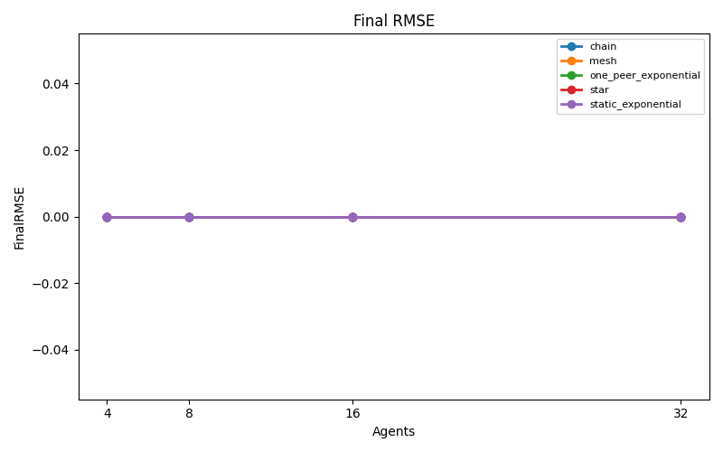
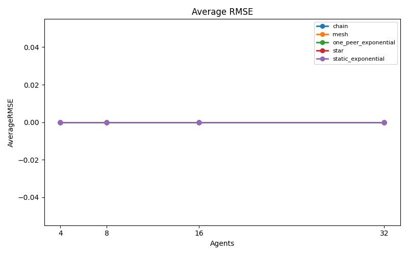
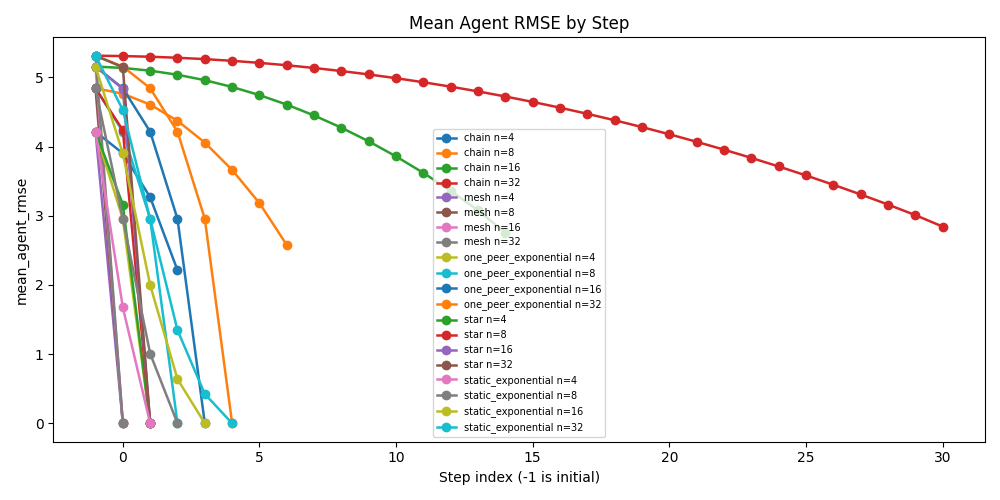
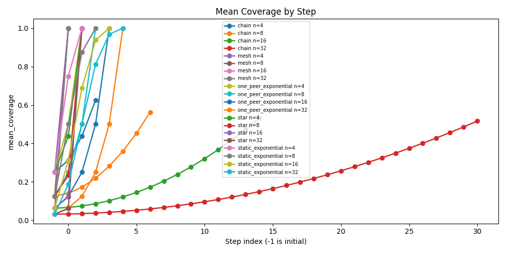

# CF Protocol Topology Experiment

## Configuration

- Array size: `5000`
- Value range: `[1, 1000]`
- Seeds: `[1, 2, 3, 4, 5]`
- Agent counts: `[4, 8, 16, 32]`
- Topologies: `['chain', 'mesh', 'one_peer_exponential', 'star', 'static_exponential']`

## Aggregate Results

| Topology | Agents | Runs | MeanFinalRMSE | StdFinalRMSE | MeanAverageRMSE | ExactMatchRate | MeanVoteRMSE | MeanFinalNormalizedL1Error | MeanTotalSteps | MeanTotalMessages | MeanVoteTopRatio | MeanVoteAverageDisagreementRMSE |
| --- | --- | --- | --- | --- | --- | --- | --- | --- | --- | --- | --- | --- |
| chain | 4 | 5 | 0.000000 | 0.000000 | 0.000000 | 1.000000 | 0.000000 | 0.000000 | 3.000000 | 3.000000 | 1.000000 | 0.000000 |
| chain | 8 | 5 | 0.000000 | 0.000000 | 0.000000 | 1.000000 | 0.000000 | 0.000000 | 7.000000 | 7.000000 | 1.000000 | 0.000000 |
| chain | 16 | 5 | 0.000000 | 0.000000 | 0.000000 | 1.000000 | 0.000000 | 0.000000 | 15.000000 | 15.000000 | 1.000000 | 0.000000 |
| chain | 32 | 5 | 0.000000 | 0.000000 | 0.000000 | 1.000000 | 0.000000 | 0.000000 | 31.000000 | 31.000000 | 1.000000 | 0.000000 |
| mesh | 4 | 5 | 0.000000 | 0.000000 | 0.000000 | 1.000000 | 0.000000 | 0.000000 | 1.000000 | 12.000000 | 1.000000 | 0.000000 |
| mesh | 8 | 5 | 0.000000 | 0.000000 | 0.000000 | 1.000000 | 0.000000 | 0.000000 | 1.000000 | 56.000000 | 1.000000 | 0.000000 |
| mesh | 16 | 5 | 0.000000 | 0.000000 | 0.000000 | 1.000000 | 0.000000 | 0.000000 | 1.000000 | 240.000000 | 1.000000 | 0.000000 |
| mesh | 32 | 5 | 0.000000 | 0.000000 | 0.000000 | 1.000000 | 0.000000 | 0.000000 | 1.000000 | 992.000000 | 1.000000 | 0.000000 |
| one_peer_exponential | 4 | 5 | 0.000000 | 0.000000 | 0.000000 | 1.000000 | 0.000000 | 0.000000 | 2.000000 | 8.000000 | 1.000000 | 0.000000 |
| one_peer_exponential | 8 | 5 | 0.000000 | 0.000000 | 0.000000 | 1.000000 | 0.000000 | 0.000000 | 3.000000 | 24.000000 | 1.000000 | 0.000000 |
| one_peer_exponential | 16 | 5 | 0.000000 | 0.000000 | 0.000000 | 1.000000 | 0.000000 | 0.000000 | 4.000000 | 64.000000 | 1.000000 | 0.000000 |
| one_peer_exponential | 32 | 5 | 0.000000 | 0.000000 | 0.000000 | 1.000000 | 0.000000 | 0.000000 | 5.000000 | 160.000000 | 1.000000 | 0.000000 |
| star | 4 | 5 | 0.000000 | 0.000000 | 0.000000 | 1.000000 | 0.000000 | 0.000000 | 2.000000 | 6.000000 | 1.000000 | 0.000000 |
| star | 8 | 5 | 0.000000 | 0.000000 | 0.000000 | 1.000000 | 0.000000 | 0.000000 | 2.000000 | 14.000000 | 1.000000 | 0.000000 |
| star | 16 | 5 | 0.000000 | 0.000000 | 0.000000 | 1.000000 | 0.000000 | 0.000000 | 2.000000 | 30.000000 | 1.000000 | 0.000000 |
| star | 32 | 5 | 0.000000 | 0.000000 | 0.000000 | 1.000000 | 0.000000 | 0.000000 | 2.000000 | 62.000000 | 1.000000 | 0.000000 |
| static_exponential | 4 | 5 | 0.000000 | 0.000000 | 0.000000 | 1.000000 | 0.000000 | 0.000000 | 2.000000 | 16.000000 | 1.000000 | 0.000000 |
| static_exponential | 8 | 5 | 0.000000 | 0.000000 | 0.000000 | 1.000000 | 0.000000 | 0.000000 | 3.000000 | 72.000000 | 1.000000 | 0.000000 |
| static_exponential | 16 | 5 | 0.000000 | 0.000000 | 0.000000 | 1.000000 | 0.000000 | 0.000000 | 4.000000 | 256.000000 | 1.000000 | 0.000000 |
| static_exponential | 32 | 5 | 0.000000 | 0.000000 | 0.000000 | 1.000000 | 0.000000 | 0.000000 | 5.000000 | 800.000000 | 1.000000 | 0.000000 |

## Run Results

| Topology | Agents | Seed | TotalSteps | TotalMessages | FinalRMSE | VoteRMSE | AverageRMSE | FinalNormalizedL1Error | FinalExactMatch | VoteTopRatio | Task | ArraySize | ValueMin | ValueMax | MergeMode | AggregationMethod | SelectedPrimary | VoteNormalizedL1Error | AverageNormalizedL1Error | AverageIncludedAgents | VoteAverageDisagreementRMSE |
| --- | --- | --- | --- | --- | --- | --- | --- | --- | --- | --- | --- | --- | --- | --- | --- | --- | --- | --- | --- | --- | --- |
| chain | 4 | 1 | 3 | 3 | 0.000000 | 0.000000 | 0.000000 | 0.000000 | True | 1.000000 | count_frequency_protocol | 5000 | 1 | 1000 | deterministic | vote | vote | 0.000000 | 0.000000 | 1 | 0.000000 |
| chain | 8 | 1 | 7 | 7 | 0.000000 | 0.000000 | 0.000000 | 0.000000 | True | 1.000000 | count_frequency_protocol | 5000 | 1 | 1000 | deterministic | vote | vote | 0.000000 | 0.000000 | 1 | 0.000000 |
| chain | 16 | 1 | 15 | 15 | 0.000000 | 0.000000 | 0.000000 | 0.000000 | True | 1.000000 | count_frequency_protocol | 5000 | 1 | 1000 | deterministic | vote | vote | 0.000000 | 0.000000 | 1 | 0.000000 |
| chain | 32 | 1 | 31 | 31 | 0.000000 | 0.000000 | 0.000000 | 0.000000 | True | 1.000000 | count_frequency_protocol | 5000 | 1 | 1000 | deterministic | vote | vote | 0.000000 | 0.000000 | 1 | 0.000000 |
| star | 4 | 1 | 2 | 6 | 0.000000 | 0.000000 | 0.000000 | 0.000000 | True | 1.000000 | count_frequency_protocol | 5000 | 1 | 1000 | deterministic | vote | vote | 0.000000 | 0.000000 | 4 | 0.000000 |
| star | 8 | 1 | 2 | 14 | 0.000000 | 0.000000 | 0.000000 | 0.000000 | True | 1.000000 | count_frequency_protocol | 5000 | 1 | 1000 | deterministic | vote | vote | 0.000000 | 0.000000 | 8 | 0.000000 |
| star | 16 | 1 | 2 | 30 | 0.000000 | 0.000000 | 0.000000 | 0.000000 | True | 1.000000 | count_frequency_protocol | 5000 | 1 | 1000 | deterministic | vote | vote | 0.000000 | 0.000000 | 16 | 0.000000 |
| star | 32 | 1 | 2 | 62 | 0.000000 | 0.000000 | 0.000000 | 0.000000 | True | 1.000000 | count_frequency_protocol | 5000 | 1 | 1000 | deterministic | vote | vote | 0.000000 | 0.000000 | 32 | 0.000000 |
| mesh | 4 | 1 | 1 | 12 | 0.000000 | 0.000000 | 0.000000 | 0.000000 | True | 1.000000 | count_frequency_protocol | 5000 | 1 | 1000 | deterministic | vote | vote | 0.000000 | 0.000000 | 4 | 0.000000 |
| mesh | 8 | 1 | 1 | 56 | 0.000000 | 0.000000 | 0.000000 | 0.000000 | True | 1.000000 | count_frequency_protocol | 5000 | 1 | 1000 | deterministic | vote | vote | 0.000000 | 0.000000 | 8 | 0.000000 |
| mesh | 16 | 1 | 1 | 240 | 0.000000 | 0.000000 | 0.000000 | 0.000000 | True | 1.000000 | count_frequency_protocol | 5000 | 1 | 1000 | deterministic | vote | vote | 0.000000 | 0.000000 | 16 | 0.000000 |
| mesh | 32 | 1 | 1 | 992 | 0.000000 | 0.000000 | 0.000000 | 0.000000 | True | 1.000000 | count_frequency_protocol | 5000 | 1 | 1000 | deterministic | vote | vote | 0.000000 | 0.000000 | 32 | 0.000000 |
| static_exponential | 4 | 1 | 2 | 16 | 0.000000 | 0.000000 | 0.000000 | 0.000000 | True | 1.000000 | count_frequency_protocol | 5000 | 1 | 1000 | deterministic | vote | vote | 0.000000 | 0.000000 | 4 | 0.000000 |
| static_exponential | 8 | 1 | 3 | 72 | 0.000000 | 0.000000 | 0.000000 | 0.000000 | True | 1.000000 | count_frequency_protocol | 5000 | 1 | 1000 | deterministic | vote | vote | 0.000000 | 0.000000 | 8 | 0.000000 |
| static_exponential | 16 | 1 | 4 | 256 | 0.000000 | 0.000000 | 0.000000 | 0.000000 | True | 1.000000 | count_frequency_protocol | 5000 | 1 | 1000 | deterministic | vote | vote | 0.000000 | 0.000000 | 16 | 0.000000 |
| static_exponential | 32 | 1 | 5 | 800 | 0.000000 | 0.000000 | 0.000000 | 0.000000 | True | 1.000000 | count_frequency_protocol | 5000 | 1 | 1000 | deterministic | vote | vote | 0.000000 | 0.000000 | 32 | 0.000000 |
| one_peer_exponential | 4 | 1 | 2 | 8 | 0.000000 | 0.000000 | 0.000000 | 0.000000 | True | 1.000000 | count_frequency_protocol | 5000 | 1 | 1000 | deterministic | vote | vote | 0.000000 | 0.000000 | 4 | 0.000000 |
| one_peer_exponential | 8 | 1 | 3 | 24 | 0.000000 | 0.000000 | 0.000000 | 0.000000 | True | 1.000000 | count_frequency_protocol | 5000 | 1 | 1000 | deterministic | vote | vote | 0.000000 | 0.000000 | 8 | 0.000000 |
| one_peer_exponential | 16 | 1 | 4 | 64 | 0.000000 | 0.000000 | 0.000000 | 0.000000 | True | 1.000000 | count_frequency_protocol | 5000 | 1 | 1000 | deterministic | vote | vote | 0.000000 | 0.000000 | 16 | 0.000000 |
| one_peer_exponential | 32 | 1 | 5 | 160 | 0.000000 | 0.000000 | 0.000000 | 0.000000 | True | 1.000000 | count_frequency_protocol | 5000 | 1 | 1000 | deterministic | vote | vote | 0.000000 | 0.000000 | 32 | 0.000000 |
| chain | 4 | 2 | 3 | 3 | 0.000000 | 0.000000 | 0.000000 | 0.000000 | True | 1.000000 | count_frequency_protocol | 5000 | 1 | 1000 | deterministic | vote | vote | 0.000000 | 0.000000 | 1 | 0.000000 |
| chain | 8 | 2 | 7 | 7 | 0.000000 | 0.000000 | 0.000000 | 0.000000 | True | 1.000000 | count_frequency_protocol | 5000 | 1 | 1000 | deterministic | vote | vote | 0.000000 | 0.000000 | 1 | 0.000000 |
| chain | 16 | 2 | 15 | 15 | 0.000000 | 0.000000 | 0.000000 | 0.000000 | True | 1.000000 | count_frequency_protocol | 5000 | 1 | 1000 | deterministic | vote | vote | 0.000000 | 0.000000 | 1 | 0.000000 |
| chain | 32 | 2 | 31 | 31 | 0.000000 | 0.000000 | 0.000000 | 0.000000 | True | 1.000000 | count_frequency_protocol | 5000 | 1 | 1000 | deterministic | vote | vote | 0.000000 | 0.000000 | 1 | 0.000000 |
| star | 4 | 2 | 2 | 6 | 0.000000 | 0.000000 | 0.000000 | 0.000000 | True | 1.000000 | count_frequency_protocol | 5000 | 1 | 1000 | deterministic | vote | vote | 0.000000 | 0.000000 | 4 | 0.000000 |
| star | 8 | 2 | 2 | 14 | 0.000000 | 0.000000 | 0.000000 | 0.000000 | True | 1.000000 | count_frequency_protocol | 5000 | 1 | 1000 | deterministic | vote | vote | 0.000000 | 0.000000 | 8 | 0.000000 |
| star | 16 | 2 | 2 | 30 | 0.000000 | 0.000000 | 0.000000 | 0.000000 | True | 1.000000 | count_frequency_protocol | 5000 | 1 | 1000 | deterministic | vote | vote | 0.000000 | 0.000000 | 16 | 0.000000 |
| star | 32 | 2 | 2 | 62 | 0.000000 | 0.000000 | 0.000000 | 0.000000 | True | 1.000000 | count_frequency_protocol | 5000 | 1 | 1000 | deterministic | vote | vote | 0.000000 | 0.000000 | 32 | 0.000000 |
| mesh | 4 | 2 | 1 | 12 | 0.000000 | 0.000000 | 0.000000 | 0.000000 | True | 1.000000 | count_frequency_protocol | 5000 | 1 | 1000 | deterministic | vote | vote | 0.000000 | 0.000000 | 4 | 0.000000 |
| mesh | 8 | 2 | 1 | 56 | 0.000000 | 0.000000 | 0.000000 | 0.000000 | True | 1.000000 | count_frequency_protocol | 5000 | 1 | 1000 | deterministic | vote | vote | 0.000000 | 0.000000 | 8 | 0.000000 |
| mesh | 16 | 2 | 1 | 240 | 0.000000 | 0.000000 | 0.000000 | 0.000000 | True | 1.000000 | count_frequency_protocol | 5000 | 1 | 1000 | deterministic | vote | vote | 0.000000 | 0.000000 | 16 | 0.000000 |
| mesh | 32 | 2 | 1 | 992 | 0.000000 | 0.000000 | 0.000000 | 0.000000 | True | 1.000000 | count_frequency_protocol | 5000 | 1 | 1000 | deterministic | vote | vote | 0.000000 | 0.000000 | 32 | 0.000000 |
| static_exponential | 4 | 2 | 2 | 16 | 0.000000 | 0.000000 | 0.000000 | 0.000000 | True | 1.000000 | count_frequency_protocol | 5000 | 1 | 1000 | deterministic | vote | vote | 0.000000 | 0.000000 | 4 | 0.000000 |
| static_exponential | 8 | 2 | 3 | 72 | 0.000000 | 0.000000 | 0.000000 | 0.000000 | True | 1.000000 | count_frequency_protocol | 5000 | 1 | 1000 | deterministic | vote | vote | 0.000000 | 0.000000 | 8 | 0.000000 |
| static_exponential | 16 | 2 | 4 | 256 | 0.000000 | 0.000000 | 0.000000 | 0.000000 | True | 1.000000 | count_frequency_protocol | 5000 | 1 | 1000 | deterministic | vote | vote | 0.000000 | 0.000000 | 16 | 0.000000 |
| static_exponential | 32 | 2 | 5 | 800 | 0.000000 | 0.000000 | 0.000000 | 0.000000 | True | 1.000000 | count_frequency_protocol | 5000 | 1 | 1000 | deterministic | vote | vote | 0.000000 | 0.000000 | 32 | 0.000000 |
| one_peer_exponential | 4 | 2 | 2 | 8 | 0.000000 | 0.000000 | 0.000000 | 0.000000 | True | 1.000000 | count_frequency_protocol | 5000 | 1 | 1000 | deterministic | vote | vote | 0.000000 | 0.000000 | 4 | 0.000000 |
| one_peer_exponential | 8 | 2 | 3 | 24 | 0.000000 | 0.000000 | 0.000000 | 0.000000 | True | 1.000000 | count_frequency_protocol | 5000 | 1 | 1000 | deterministic | vote | vote | 0.000000 | 0.000000 | 8 | 0.000000 |
| one_peer_exponential | 16 | 2 | 4 | 64 | 0.000000 | 0.000000 | 0.000000 | 0.000000 | True | 1.000000 | count_frequency_protocol | 5000 | 1 | 1000 | deterministic | vote | vote | 0.000000 | 0.000000 | 16 | 0.000000 |
| one_peer_exponential | 32 | 2 | 5 | 160 | 0.000000 | 0.000000 | 0.000000 | 0.000000 | True | 1.000000 | count_frequency_protocol | 5000 | 1 | 1000 | deterministic | vote | vote | 0.000000 | 0.000000 | 32 | 0.000000 |
| chain | 4 | 3 | 3 | 3 | 0.000000 | 0.000000 | 0.000000 | 0.000000 | True | 1.000000 | count_frequency_protocol | 5000 | 1 | 1000 | deterministic | vote | vote | 0.000000 | 0.000000 | 1 | 0.000000 |
| chain | 8 | 3 | 7 | 7 | 0.000000 | 0.000000 | 0.000000 | 0.000000 | True | 1.000000 | count_frequency_protocol | 5000 | 1 | 1000 | deterministic | vote | vote | 0.000000 | 0.000000 | 1 | 0.000000 |
| chain | 16 | 3 | 15 | 15 | 0.000000 | 0.000000 | 0.000000 | 0.000000 | True | 1.000000 | count_frequency_protocol | 5000 | 1 | 1000 | deterministic | vote | vote | 0.000000 | 0.000000 | 1 | 0.000000 |
| chain | 32 | 3 | 31 | 31 | 0.000000 | 0.000000 | 0.000000 | 0.000000 | True | 1.000000 | count_frequency_protocol | 5000 | 1 | 1000 | deterministic | vote | vote | 0.000000 | 0.000000 | 1 | 0.000000 |
| star | 4 | 3 | 2 | 6 | 0.000000 | 0.000000 | 0.000000 | 0.000000 | True | 1.000000 | count_frequency_protocol | 5000 | 1 | 1000 | deterministic | vote | vote | 0.000000 | 0.000000 | 4 | 0.000000 |
| star | 8 | 3 | 2 | 14 | 0.000000 | 0.000000 | 0.000000 | 0.000000 | True | 1.000000 | count_frequency_protocol | 5000 | 1 | 1000 | deterministic | vote | vote | 0.000000 | 0.000000 | 8 | 0.000000 |
| star | 16 | 3 | 2 | 30 | 0.000000 | 0.000000 | 0.000000 | 0.000000 | True | 1.000000 | count_frequency_protocol | 5000 | 1 | 1000 | deterministic | vote | vote | 0.000000 | 0.000000 | 16 | 0.000000 |
| star | 32 | 3 | 2 | 62 | 0.000000 | 0.000000 | 0.000000 | 0.000000 | True | 1.000000 | count_frequency_protocol | 5000 | 1 | 1000 | deterministic | vote | vote | 0.000000 | 0.000000 | 32 | 0.000000 |
| mesh | 4 | 3 | 1 | 12 | 0.000000 | 0.000000 | 0.000000 | 0.000000 | True | 1.000000 | count_frequency_protocol | 5000 | 1 | 1000 | deterministic | vote | vote | 0.000000 | 0.000000 | 4 | 0.000000 |
| mesh | 8 | 3 | 1 | 56 | 0.000000 | 0.000000 | 0.000000 | 0.000000 | True | 1.000000 | count_frequency_protocol | 5000 | 1 | 1000 | deterministic | vote | vote | 0.000000 | 0.000000 | 8 | 0.000000 |
| mesh | 16 | 3 | 1 | 240 | 0.000000 | 0.000000 | 0.000000 | 0.000000 | True | 1.000000 | count_frequency_protocol | 5000 | 1 | 1000 | deterministic | vote | vote | 0.000000 | 0.000000 | 16 | 0.000000 |
| mesh | 32 | 3 | 1 | 992 | 0.000000 | 0.000000 | 0.000000 | 0.000000 | True | 1.000000 | count_frequency_protocol | 5000 | 1 | 1000 | deterministic | vote | vote | 0.000000 | 0.000000 | 32 | 0.000000 |
| static_exponential | 4 | 3 | 2 | 16 | 0.000000 | 0.000000 | 0.000000 | 0.000000 | True | 1.000000 | count_frequency_protocol | 5000 | 1 | 1000 | deterministic | vote | vote | 0.000000 | 0.000000 | 4 | 0.000000 |
| static_exponential | 8 | 3 | 3 | 72 | 0.000000 | 0.000000 | 0.000000 | 0.000000 | True | 1.000000 | count_frequency_protocol | 5000 | 1 | 1000 | deterministic | vote | vote | 0.000000 | 0.000000 | 8 | 0.000000 |
| static_exponential | 16 | 3 | 4 | 256 | 0.000000 | 0.000000 | 0.000000 | 0.000000 | True | 1.000000 | count_frequency_protocol | 5000 | 1 | 1000 | deterministic | vote | vote | 0.000000 | 0.000000 | 16 | 0.000000 |
| static_exponential | 32 | 3 | 5 | 800 | 0.000000 | 0.000000 | 0.000000 | 0.000000 | True | 1.000000 | count_frequency_protocol | 5000 | 1 | 1000 | deterministic | vote | vote | 0.000000 | 0.000000 | 32 | 0.000000 |
| one_peer_exponential | 4 | 3 | 2 | 8 | 0.000000 | 0.000000 | 0.000000 | 0.000000 | True | 1.000000 | count_frequency_protocol | 5000 | 1 | 1000 | deterministic | vote | vote | 0.000000 | 0.000000 | 4 | 0.000000 |
| one_peer_exponential | 8 | 3 | 3 | 24 | 0.000000 | 0.000000 | 0.000000 | 0.000000 | True | 1.000000 | count_frequency_protocol | 5000 | 1 | 1000 | deterministic | vote | vote | 0.000000 | 0.000000 | 8 | 0.000000 |
| one_peer_exponential | 16 | 3 | 4 | 64 | 0.000000 | 0.000000 | 0.000000 | 0.000000 | True | 1.000000 | count_frequency_protocol | 5000 | 1 | 1000 | deterministic | vote | vote | 0.000000 | 0.000000 | 16 | 0.000000 |
| one_peer_exponential | 32 | 3 | 5 | 160 | 0.000000 | 0.000000 | 0.000000 | 0.000000 | True | 1.000000 | count_frequency_protocol | 5000 | 1 | 1000 | deterministic | vote | vote | 0.000000 | 0.000000 | 32 | 0.000000 |
| chain | 4 | 4 | 3 | 3 | 0.000000 | 0.000000 | 0.000000 | 0.000000 | True | 1.000000 | count_frequency_protocol | 5000 | 1 | 1000 | deterministic | vote | vote | 0.000000 | 0.000000 | 1 | 0.000000 |
| chain | 8 | 4 | 7 | 7 | 0.000000 | 0.000000 | 0.000000 | 0.000000 | True | 1.000000 | count_frequency_protocol | 5000 | 1 | 1000 | deterministic | vote | vote | 0.000000 | 0.000000 | 1 | 0.000000 |
| chain | 16 | 4 | 15 | 15 | 0.000000 | 0.000000 | 0.000000 | 0.000000 | True | 1.000000 | count_frequency_protocol | 5000 | 1 | 1000 | deterministic | vote | vote | 0.000000 | 0.000000 | 1 | 0.000000 |
| chain | 32 | 4 | 31 | 31 | 0.000000 | 0.000000 | 0.000000 | 0.000000 | True | 1.000000 | count_frequency_protocol | 5000 | 1 | 1000 | deterministic | vote | vote | 0.000000 | 0.000000 | 1 | 0.000000 |
| star | 4 | 4 | 2 | 6 | 0.000000 | 0.000000 | 0.000000 | 0.000000 | True | 1.000000 | count_frequency_protocol | 5000 | 1 | 1000 | deterministic | vote | vote | 0.000000 | 0.000000 | 4 | 0.000000 |
| star | 8 | 4 | 2 | 14 | 0.000000 | 0.000000 | 0.000000 | 0.000000 | True | 1.000000 | count_frequency_protocol | 5000 | 1 | 1000 | deterministic | vote | vote | 0.000000 | 0.000000 | 8 | 0.000000 |
| star | 16 | 4 | 2 | 30 | 0.000000 | 0.000000 | 0.000000 | 0.000000 | True | 1.000000 | count_frequency_protocol | 5000 | 1 | 1000 | deterministic | vote | vote | 0.000000 | 0.000000 | 16 | 0.000000 |
| star | 32 | 4 | 2 | 62 | 0.000000 | 0.000000 | 0.000000 | 0.000000 | True | 1.000000 | count_frequency_protocol | 5000 | 1 | 1000 | deterministic | vote | vote | 0.000000 | 0.000000 | 32 | 0.000000 |
| mesh | 4 | 4 | 1 | 12 | 0.000000 | 0.000000 | 0.000000 | 0.000000 | True | 1.000000 | count_frequency_protocol | 5000 | 1 | 1000 | deterministic | vote | vote | 0.000000 | 0.000000 | 4 | 0.000000 |
| mesh | 8 | 4 | 1 | 56 | 0.000000 | 0.000000 | 0.000000 | 0.000000 | True | 1.000000 | count_frequency_protocol | 5000 | 1 | 1000 | deterministic | vote | vote | 0.000000 | 0.000000 | 8 | 0.000000 |
| mesh | 16 | 4 | 1 | 240 | 0.000000 | 0.000000 | 0.000000 | 0.000000 | True | 1.000000 | count_frequency_protocol | 5000 | 1 | 1000 | deterministic | vote | vote | 0.000000 | 0.000000 | 16 | 0.000000 |
| mesh | 32 | 4 | 1 | 992 | 0.000000 | 0.000000 | 0.000000 | 0.000000 | True | 1.000000 | count_frequency_protocol | 5000 | 1 | 1000 | deterministic | vote | vote | 0.000000 | 0.000000 | 32 | 0.000000 |
| static_exponential | 4 | 4 | 2 | 16 | 0.000000 | 0.000000 | 0.000000 | 0.000000 | True | 1.000000 | count_frequency_protocol | 5000 | 1 | 1000 | deterministic | vote | vote | 0.000000 | 0.000000 | 4 | 0.000000 |
| static_exponential | 8 | 4 | 3 | 72 | 0.000000 | 0.000000 | 0.000000 | 0.000000 | True | 1.000000 | count_frequency_protocol | 5000 | 1 | 1000 | deterministic | vote | vote | 0.000000 | 0.000000 | 8 | 0.000000 |
| static_exponential | 16 | 4 | 4 | 256 | 0.000000 | 0.000000 | 0.000000 | 0.000000 | True | 1.000000 | count_frequency_protocol | 5000 | 1 | 1000 | deterministic | vote | vote | 0.000000 | 0.000000 | 16 | 0.000000 |
| static_exponential | 32 | 4 | 5 | 800 | 0.000000 | 0.000000 | 0.000000 | 0.000000 | True | 1.000000 | count_frequency_protocol | 5000 | 1 | 1000 | deterministic | vote | vote | 0.000000 | 0.000000 | 32 | 0.000000 |
| one_peer_exponential | 4 | 4 | 2 | 8 | 0.000000 | 0.000000 | 0.000000 | 0.000000 | True | 1.000000 | count_frequency_protocol | 5000 | 1 | 1000 | deterministic | vote | vote | 0.000000 | 0.000000 | 4 | 0.000000 |
| one_peer_exponential | 8 | 4 | 3 | 24 | 0.000000 | 0.000000 | 0.000000 | 0.000000 | True | 1.000000 | count_frequency_protocol | 5000 | 1 | 1000 | deterministic | vote | vote | 0.000000 | 0.000000 | 8 | 0.000000 |
| one_peer_exponential | 16 | 4 | 4 | 64 | 0.000000 | 0.000000 | 0.000000 | 0.000000 | True | 1.000000 | count_frequency_protocol | 5000 | 1 | 1000 | deterministic | vote | vote | 0.000000 | 0.000000 | 16 | 0.000000 |
| one_peer_exponential | 32 | 4 | 5 | 160 | 0.000000 | 0.000000 | 0.000000 | 0.000000 | True | 1.000000 | count_frequency_protocol | 5000 | 1 | 1000 | deterministic | vote | vote | 0.000000 | 0.000000 | 32 | 0.000000 |
| chain | 4 | 5 | 3 | 3 | 0.000000 | 0.000000 | 0.000000 | 0.000000 | True | 1.000000 | count_frequency_protocol | 5000 | 1 | 1000 | deterministic | vote | vote | 0.000000 | 0.000000 | 1 | 0.000000 |
| chain | 8 | 5 | 7 | 7 | 0.000000 | 0.000000 | 0.000000 | 0.000000 | True | 1.000000 | count_frequency_protocol | 5000 | 1 | 1000 | deterministic | vote | vote | 0.000000 | 0.000000 | 1 | 0.000000 |
| chain | 16 | 5 | 15 | 15 | 0.000000 | 0.000000 | 0.000000 | 0.000000 | True | 1.000000 | count_frequency_protocol | 5000 | 1 | 1000 | deterministic | vote | vote | 0.000000 | 0.000000 | 1 | 0.000000 |
| chain | 32 | 5 | 31 | 31 | 0.000000 | 0.000000 | 0.000000 | 0.000000 | True | 1.000000 | count_frequency_protocol | 5000 | 1 | 1000 | deterministic | vote | vote | 0.000000 | 0.000000 | 1 | 0.000000 |
| star | 4 | 5 | 2 | 6 | 0.000000 | 0.000000 | 0.000000 | 0.000000 | True | 1.000000 | count_frequency_protocol | 5000 | 1 | 1000 | deterministic | vote | vote | 0.000000 | 0.000000 | 4 | 0.000000 |
| star | 8 | 5 | 2 | 14 | 0.000000 | 0.000000 | 0.000000 | 0.000000 | True | 1.000000 | count_frequency_protocol | 5000 | 1 | 1000 | deterministic | vote | vote | 0.000000 | 0.000000 | 8 | 0.000000 |
| star | 16 | 5 | 2 | 30 | 0.000000 | 0.000000 | 0.000000 | 0.000000 | True | 1.000000 | count_frequency_protocol | 5000 | 1 | 1000 | deterministic | vote | vote | 0.000000 | 0.000000 | 16 | 0.000000 |
| star | 32 | 5 | 2 | 62 | 0.000000 | 0.000000 | 0.000000 | 0.000000 | True | 1.000000 | count_frequency_protocol | 5000 | 1 | 1000 | deterministic | vote | vote | 0.000000 | 0.000000 | 32 | 0.000000 |
| mesh | 4 | 5 | 1 | 12 | 0.000000 | 0.000000 | 0.000000 | 0.000000 | True | 1.000000 | count_frequency_protocol | 5000 | 1 | 1000 | deterministic | vote | vote | 0.000000 | 0.000000 | 4 | 0.000000 |
| mesh | 8 | 5 | 1 | 56 | 0.000000 | 0.000000 | 0.000000 | 0.000000 | True | 1.000000 | count_frequency_protocol | 5000 | 1 | 1000 | deterministic | vote | vote | 0.000000 | 0.000000 | 8 | 0.000000 |
| mesh | 16 | 5 | 1 | 240 | 0.000000 | 0.000000 | 0.000000 | 0.000000 | True | 1.000000 | count_frequency_protocol | 5000 | 1 | 1000 | deterministic | vote | vote | 0.000000 | 0.000000 | 16 | 0.000000 |
| mesh | 32 | 5 | 1 | 992 | 0.000000 | 0.000000 | 0.000000 | 0.000000 | True | 1.000000 | count_frequency_protocol | 5000 | 1 | 1000 | deterministic | vote | vote | 0.000000 | 0.000000 | 32 | 0.000000 |
| static_exponential | 4 | 5 | 2 | 16 | 0.000000 | 0.000000 | 0.000000 | 0.000000 | True | 1.000000 | count_frequency_protocol | 5000 | 1 | 1000 | deterministic | vote | vote | 0.000000 | 0.000000 | 4 | 0.000000 |
| static_exponential | 8 | 5 | 3 | 72 | 0.000000 | 0.000000 | 0.000000 | 0.000000 | True | 1.000000 | count_frequency_protocol | 5000 | 1 | 1000 | deterministic | vote | vote | 0.000000 | 0.000000 | 8 | 0.000000 |
| static_exponential | 16 | 5 | 4 | 256 | 0.000000 | 0.000000 | 0.000000 | 0.000000 | True | 1.000000 | count_frequency_protocol | 5000 | 1 | 1000 | deterministic | vote | vote | 0.000000 | 0.000000 | 16 | 0.000000 |
| static_exponential | 32 | 5 | 5 | 800 | 0.000000 | 0.000000 | 0.000000 | 0.000000 | True | 1.000000 | count_frequency_protocol | 5000 | 1 | 1000 | deterministic | vote | vote | 0.000000 | 0.000000 | 32 | 0.000000 |
| one_peer_exponential | 4 | 5 | 2 | 8 | 0.000000 | 0.000000 | 0.000000 | 0.000000 | True | 1.000000 | count_frequency_protocol | 5000 | 1 | 1000 | deterministic | vote | vote | 0.000000 | 0.000000 | 4 | 0.000000 |
| one_peer_exponential | 8 | 5 | 3 | 24 | 0.000000 | 0.000000 | 0.000000 | 0.000000 | True | 1.000000 | count_frequency_protocol | 5000 | 1 | 1000 | deterministic | vote | vote | 0.000000 | 0.000000 | 8 | 0.000000 |
| one_peer_exponential | 16 | 5 | 4 | 64 | 0.000000 | 0.000000 | 0.000000 | 0.000000 | True | 1.000000 | count_frequency_protocol | 5000 | 1 | 1000 | deterministic | vote | vote | 0.000000 | 0.000000 | 16 | 0.000000 |
| one_peer_exponential | 32 | 5 | 5 | 160 | 0.000000 | 0.000000 | 0.000000 | 0.000000 | True | 1.000000 | count_frequency_protocol | 5000 | 1 | 1000 | deterministic | vote | vote | 0.000000 | 0.000000 | 32 | 0.000000 |

This experiment uses the existing AgentState, BeliefState, and OutboxMessage data path. The protocol runner changes only which agents send and receive on each communication step.

## Visualizations

