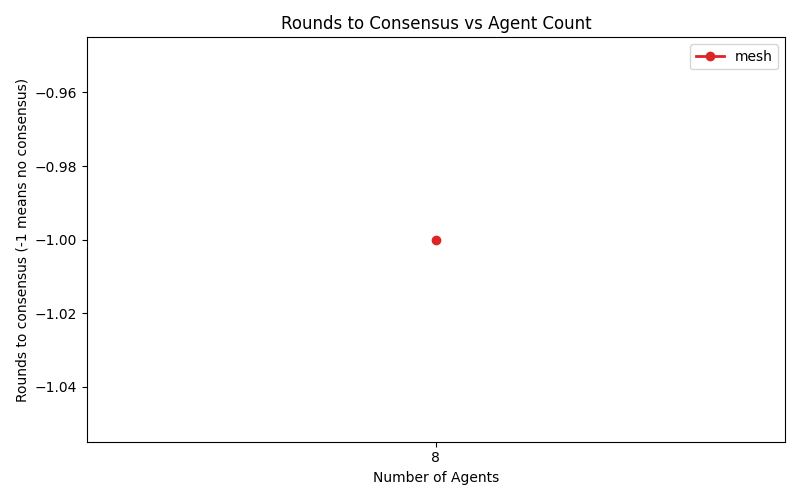
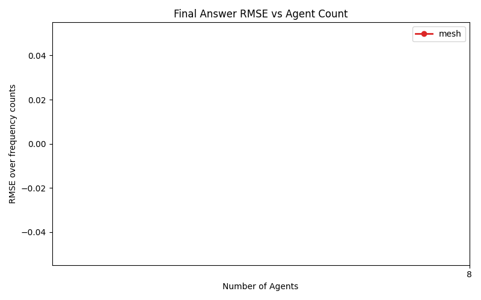
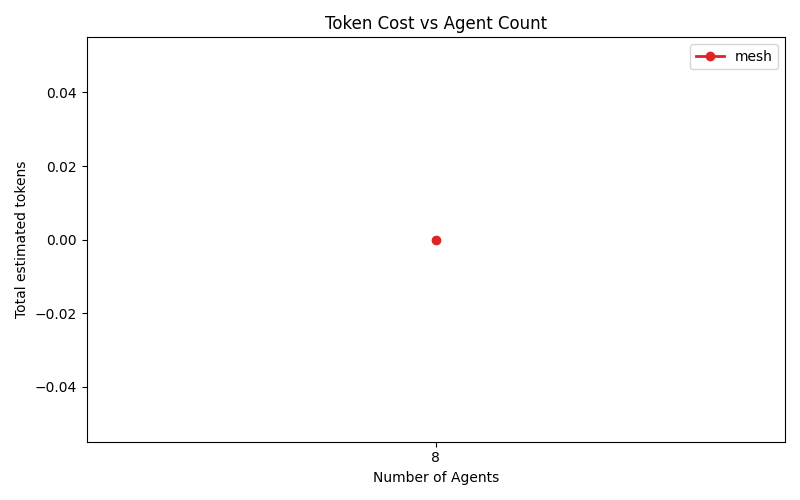

# CF Topology Sweep Report

## Configuration

- Model: `gemma4:e4b`
- Provider: `ollama`
- Array size: `5000`
- Value range: `[0, 9]`
- Max rounds: `1`
- Seed: `42`

## Results

| Topology | Agents | RoundsToConsensus | RMSE | NormalizedRMSE | ExactMatch | ConsensusReached | RunCompleted | FallbackUsed | TotalModelCalls | TotalTokenCost | Status |
| --- | --- | --- | --- | --- | --- | --- | --- | --- | --- | --- | --- |
| mesh | 8 | -1 | None | None | False | False | False | False | 0 | 0 | failed |

Rows with `RunCompleted=False` are API/runtime failures. They did not reach final reducer, so they are not valid model answers.

## Visualizations

## Failures

- `mesh` / `8` agents: Ollama HTTP 502: 
