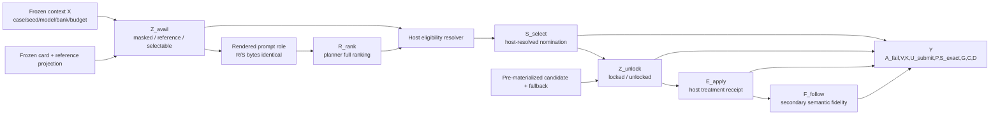

# ASUEL-Bank 方法设计档案

> **ASUEL — Availability–Selection–Unlock–Execution Causal Ledger SkillBank**
> **规范中文名：可见性—选择—解锁—执行的嵌套随机鼓励 SkillBank**

| 项目 | 内容 |
|---|---|
| Method ID | `asuel_nested_encouragement_profile_v0` |
| 文档性质 | 研究设计档案与兼容 profile；不是实现代码、论文结论或实验结果 |
| 方法状态 | **未实现、未验证、可证伪** |
| 来源对话 | `6a564e04-4db4-83ea-b09e-a031980328b3`（QueenBee SkillBank 设计） |
| QueenBee 审核基线 | commit `8725c59c9f6cbc2bb3b17ea2b041b07bc3f7e61a` |
| 归档日期 | 2026-07-14 |
| 目标读者 | 实现 Agent、实验 Agent、统计 Agent、方法比较 Agent、安全与代码审计 Agent |
| 相关设计 | [PIF-Bank](./2026-07-14-pif-bank-method-design.md)、[FACTS-Bank](./2026-07-14-facts-skillbank-method-design.md)、[TRIAD-SkillBank](./2026-07-14-triad-skillbank-method-design.md)、[TRACER-SkillBank](./2026-07-14-tracer-skillbank-method-design.md)、[TRACE-MAP](./2026-07-14-trace-map-skillbank-method-design.md) |

本文把来源对话中的最终 `ASUEL-Bank` 整理为一份可由 Agent 直接理解、比较、实现和证伪的方法档案。本文给出详细合同、对象边界、估计对象、伪代码、迁移地图和预注册实验，但不铺开完整生产代码或完整 Pydantic schema。

最重要的规范化结论是：

> **ASUEL 不是第六套平行的 SkillBank substrate。它是一个 TRACER-compatible 的嵌套随机鼓励审计 profile：在 outcome 前先随机化 focal `RetrievalCardRevision` 的角色，再对已被 nomination 的 sealed payload 随机化 `locked / unlocked`；由此分别估计 reference-context ITT、selectability-policy ITT 与 unlock reduced-form ITT，只有在预注册 IV 假设可以辩护且未被诊断反驳时，才进一步报告 nominated compliers 的 execution LATE。**

因此，ASUEL 真正新增的不是日志、pair factorial、QD archive、surface binding 或一般的 matched probe。这些能力应分别复用 PIF/FACTS、TRIAD、TRACER 与 TRACE-MAP。ASUEL 的不可约增量只有两个随机化点及其分层估计对象：

1. **pre-nomination role assignment**：`masked_control / reference_only / selectable`；
2. **post-nomination payload encouragement**：`locked / unlocked`。

如果这两点不能在 equal-all-in 条件下提高 held-out attribution、减少错误 Bank 更新或改善冻结 TEST Bank，ASUEL 应退化为普通 TRACER/TRACE-MAP instrumentation，而不应继续作为独立方法维护。

---

## 1. 阅读约定与 Decision Card

### 1.1 证据标签

- **`CURRENT_CODE_FACT`**：固定 commit 中可直接复核的代码行为。
- **`SOURCE_PROPOSAL`**：来源对话提出的 ASUEL 机制、阈值或性能预测。
- **`NORMALIZED_PROPOSAL`**：本文经代码核验和方法审查后收敛出的规范版本。
- **`AUDIT_INFERENCE`**：由当前代码与方法结构支持的风险推断，仍需实验验证。
- **`OPEN_PARAMETER`**：方法合同已经确定，但正式预注册前仍需填入的数值。

来源对话包含大量论文、博客与 prior-art 审计结论。本文没有重新执行完整在线文献审查，因此外部工作比较只用于定位，不构成新的独立 novelty 证明。

### 1.2 一句话核心思想

> **把 Skill 从“检索到/使用了”的单一状态拆成 card role、planner nomination、payload unlock 和 host activation 四个事件，在两个 outcome 前随机化点上形成可审计 assignment；先报告 policy-level ITT，再在严格 IV 边界内估计局部 execution effect，让不同证据只更新它真正识别的决策层。**

### 1.3 ASUEL 要回答的四个问题

| 问题 | 对应设计 | 合法结论 |
|---|---|---|
| 一张安全 card 仅出现在上下文里会怎样？ | `reference_only` vs `masked_control` | reference-context ITT |
| 在相同 card 内容下，允许 planner 选择它会怎样？ | `selectable` vs `reference_only` | frozen unlock policy 下的 selectability-policy ITT |
| 已被 nomination 后，允许 payload 进入执行路径会怎样？ | randomized `unlocked` vs `locked` | unlock reduced-form ITT |
| 解锁真正改变了 host-observed activation 时，执行本身可能怎样？ | unlock 作为 instrument | nominated compliers 的 LATE；仅在 IV 合同成立时 |

### 1.4 三种单位必须分开

| 单位 | 含义 | 不能替代什么 |
|---|---|---|
| Assignment 单位 | 一个 outcome 前冻结的 focal card、context、fallback、预算与随机 assignment block | 不能把事后 observed use 当随机 assignment |
| Credit 单位 | 明确定义 target population、treatment version 和 comparator 的 ITT/LATE view | 不能给 Skill 一个无条件全局分数 |
| Deployment 单位 | 一份冻结的完整 Bank snapshot | 局部正 effect 不能绕过 whole-Bank gate |

### 1.5 最小不可约身份

只有同时满足下列约束，才应标记为 `asuel_nested_encouragement_profile_v0`：

1. Skill 的 executable payload revision 与 planner 可见 card revision 分离；
2. card projection 在 nomination 前不泄露 payload；
3. 每个 availability audit 只有一个 outcome 前指定的 focal card；
4. `reference_only` 与 `selectable` 看到逐字节相同的 reference projection；
5. 二者只有 planner-invisible host eligibility 不同；planner先给同一visible slate完整排序，host再filter；
6. primary control 使用冻结的 `masked_control` treatment version；
7. true-empty/absent 只能作为另行预派诊断，不能事后切换；
8. availability assignment 在 nomination 前随机、密封并记录真实概率；
9. availability ITT 使用所有被 assignment 的单位，不按 nomination 或 activation 过滤；
10. selectable arm 使用一份 outcome 前冻结的下游 unlock policy；
11. nomination 完成后才进行 unlock assignment；
12. candidate、fallback、`preseal_static_validation` result、non-target manifest 与预算在 unlock assignment 前 assignment-blind 地冻结，之后不得额外repair；
13. `locked` 不重新询问 planner，而直接走预登记 fallback；
14. `E_apply` 由 carrier-specific host contract 观察，不依赖 LLM 自报；
15. unlock reduced form 是 primary，LATE 是可拒绝报告的 secondary；
16. IV 假设不能由统计诊断“证明”；诊断失败必须把 LATE 标为 `unidentified`；
17. reference-context evidence 与 executable opportunity/direct evidence分账；
18. pair interaction 只在完整 2×2 assignment 支持下估计；
19. 一份 authoritative raw ledger 派生所有 views，不能重复计算 ESS；
20. ASUEL evidence 只在 TRAIN 更新检索、mutation 或 archive；
21. 完整 Bank 仍经过独立 held-out dense gate；
22. TEST 对全部 scientific state 只读；
23. answer、ground truth、expected output、private prompt 与 TEST feedback 永不进入 Bank；
24. 所有比较使用相同 ex-ante 六维预算和冻结的停止/重分配规则。

### 1.6 何时不要使用 ASUEL

| 情况 | 应采用什么 | 原因 |
|---|---|---|
| 只需比较一个完整 candidate 与注册 baseline | PIF/FACTS matched contrast | 没有必要拆 card role 与 unlock |
| 核心问题是 retrieved-unused executable 是否被 composer 错过 | TRACER same-slot SWAP | reference-only 不能估 opportunity value |
| 核心问题是 treatment 是否真的绑定到可逆 execution surface | TRACE-MAP profile | 这是 surface integrity，而不是 ASUEL estimand |
| focal 在目标 decision surface 只能做 reference、不能执行 | 只做 `masked/reference` audit | 完整 ASUEL unlock 不合法 |
| 无法构造逐字节相同的 R/S reference projection | 两臂 policy RCT 或 observational logging | `S-R` treatment fidelity 不成立 |
| unlock 后几乎总是精确 activation，且不存在 noncompliance | 普通 randomized assignment effect | LATE 层不增加信息 |
| unlock 会额外触发 validation、repair、重新生成或不对称预算 | 不运行该profile / replicate invalid | 这不是合法treatment path |
| unlock 的合法candidate↔fallback路径仍不可避免地改变latency或runtime exception | 只报告 reduced form | IV exclusion 不可辩护 |
| 样本不足以保持 arm positivity 或足够 nomination coverage | 当前 QueenBee + honest logging | 不应拿弱支持估计冒充信用 |
| 线上生产或冻结 TEST | frozen deterministic selector | ASUEL random withholding 只属于审计 split |

### 1.7 Agent 快速阅读路径

- **只需决定是否采用**：[Decision Card](#1-阅读约定与-decision-card) → [最强对照](#34-最强比较对照) → [Estimand表](#8-estimand-表与禁止解释) → [Attribution primary](#217-attribution-primary) → [否证条件](#23-否证停止降级与最强反对意见)。
- **实现 Agent**：[Identity与状态](#5-identityrole-projection-与状态模型) → [Carrier合同](#10-carrier-specific-reference-与-activation-合同) → [Canonical objects](#12-canonical-objects-与一份-authoritative-ledger) → [生命周期](#15-完整生命周期与高层算法) → [实现地图](#19-文件级实现地图feature-flags-与迁移)。
- **统计/实验 Agent**：[因果时间线](#4-因果时间线与-outcome-before-sealing) → [Availability](#6-pre-nomination-三角色-availability-实验) → [Unlock](#7-post-nomination-unlock-随机鼓励) → [IV/LATE](#9-ivlate-合同诊断与降级) → [预注册实验](#21-预注册实验归因有效性与-bank-有效性必须分开)。
- **方法比较 Agent**：[当前基线](#2-当前-queenbee-基线已有能力与精确缺口) → [五份档案关系](#3-与现有五份方法档案的关系) → [新颖性边界](#22-方法比较与新颖性边界)。
- **安全审计 Agent**：[ArtifactNamespace](#55-artifactnamespace) → [泄漏合同](#16-split泄漏冻结与-test-合同) → [最强反对意见](#23-否证停止降级与最强反对意见)。

### 1.8 本方法不是什么

- 不是第六种 `PlannerMode`；
- 不是把 payload 改名成 card；
- 不是把 `selected=true` 当 causal treatment；
- 不是把 `used_insight_ids` 当 host activation；
- 不是把 reference-only 的效果当 retrieved-unused opportunity；
- 不是把 unlock ITT 自动除以 first stage 后称为普遍 causal effect；
- 不是完整 Shapley value；
- 不是单次 pair-drop；
- 不是新的 QD/MAP-Elites 方法；
- 不是跨 Graph、PhaseProgram 与 Python 自动转译 Skill；
- 不是让 local estimate 直接部署 payload；
- 不是让 TEST 结果回流到 Bank。

---

## 2. 当前 QueenBee 基线：已有能力与精确缺口

### 2.1 当前请求模式与 payload 已经是 typed 的

**`CURRENT_CODE_FACT`**：固定 commit 的请求侧 `PlannerMode` 只有五种：

```text
topology_select
operator_compose
graph_generate
program_generate
python_generate
```

代码证据：[schemas.py L21–27](https://github.com/RobinTian-7/Mutiagent/blob/8725c59c9f6cbc2bb3b17ea2b041b07bc3f7e61a/exp-graph/src/exp_graph/mas/schemas.py#L21-L27)。

`SkillCard.mode_payload` 支持五类 discriminated payload：

| Payload | payload-local mode | 可执行真源 |
|---|---|---|
| `NamedTopologySkillPayload` | `topology_select` | named topology、`protocol_spec`、`structure_code` |
| `PaperTransportSkillPayload` | `paper_protocol` | `p2p / broadcast / sfs` native transport |
| `GraphSkillPayload` | `graph_generate` | `protocol_spec`、可选 topology program |
| `PhaseProgramSkillPayload` | `program_generate` | 原始 DSL、compiled spec、compiler version、digest |
| `PythonSkillPayload` | `python_generate` | 完整 source、digest、execution/worker contract、lineage |

代码证据：[schemas.py L408–536](https://github.com/RobinTian-7/Mutiagent/blob/8725c59c9f6cbc2bb3b17ea2b041b07bc3f7e61a/exp-graph/src/exp_graph/mas/schemas.py#L408-L536)。

`paper_protocol` 是 payload/native-executor 特例，不是 `PlannerRequest` 的第六个 mode。ASUEL 的 role legality 必须按实际 decision surface 判断，不能把 payload-local 字段误当请求 namespace。

### 2.2 当前 `SkillCard` 很丰富，但不是 ASUEL 的 revision model

**`CURRENT_CODE_FACT`**：`SkillCard` 已保存：

- typed `mode_payload`；
- legacy/index `organization_policy`；
- 独立 `reasoning_policy`；
- tradeoff 与 expected dynamics；
- insights、risk、failure modes；
- evidence 与 evidence refs；
- fallback、counterexamples、hypotheses；
- confidence、revision history、validation plan；
- provenance 与 information goal。

代码证据：[schemas.py L539–590](https://github.com/RobinTian-7/Mutiagent/blob/8725c59c9f6cbc2bb3b17ea2b041b07bc3f7e61a/exp-graph/src/exp_graph/mas/schemas.py#L539-L590)。

这意味着以下都不是 ASUEL 的新贡献：

- 保存 executable Graph/Phase/Python；
- 将 topology 与 reasoning policy 分开；
- 保存 failure、counterexample 与 confidence；
- 保存 Python parent/mutation provenance。

真正缺少的是：

- immutable `PayloadRevision`；
- immutable `RetrievalCardRevision`；
- exact rendered `ReferenceProjectionRevision`；
- pre-nomination availability assignment；
- nomination event；
- post-nomination unlock assignment；
- host activation receipt；
- assignment probability 与 derived estimand ledger。

当前 `MASPlan.skill_id` 只能记录整张 Skill 的关联 ID，没有 ASUEL 事件阶梯。[schemas.py L758–780](https://github.com/RobinTian-7/Mutiagent/blob/8725c59c9f6cbc2bb3b17ea2b041b07bc3f7e61a/exp-graph/src/exp_graph/mas/schemas.py#L758-L780)

### 2.3 当前 retrieval 有过滤，但不是绝对 fail-closed silo

**`CURRENT_CODE_FACT`**：正常 `SkillBank.retrieve()` 会检查 selectable、task family、objective、information goal、provenance、generated planner mode、Python worker contract、topology allowlist、agent range 与 array size，再排序、去重。[skill_bank.py L79–125](https://github.com/RobinTian-7/Mutiagent/blob/8725c59c9f6cbc2bb3b17ea2b041b07bc3f7e61a/exp-graph/src/exp_graph/mas/skill_bank.py#L79-L125)

但存在四个重要边界：

1. `_matches_planner_mode()` 对 `topology_select` 与 `operator_compose` 的处理较宽，并非所有请求都按 mode 绝对隔离。[skill_bank.py L343–404](https://github.com/RobinTian-7/Mutiagent/blob/8725c59c9f6cbc2bb3b17ea2b041b07bc3f7e61a/exp-graph/src/exp_graph/mas/skill_bank.py#L343-L404)
2. `TopologySelectPlanner` 检索为空时会退回全库 selectable cards，绕过前述请求过滤。[planner.py L68–87](https://github.com/RobinTian-7/Mutiagent/blob/8725c59c9f6cbc2bb3b17ea2b041b07bc3f7e61a/exp-graph/src/exp_graph/mas/planner.py#L68-L87)
3. `retrieve_generation_context()` 在显式开启时返回完整 `SkillCard`，并按设计忽略 planner-mode 与 provenance compatibility；它不是 metadata-only facade。[skill_bank.py L157–193](https://github.com/RobinTian-7/Mutiagent/blob/8725c59c9f6cbc2bb3b17ea2b041b07bc3f7e61a/exp-graph/src/exp_graph/mas/skill_bank.py#L157-L193)
4. 当前 `operator_compose` 是先选一张 Skill，再编译该卡的 operator list；不是多 SkillCard composition。[planner.py L172–207](https://github.com/RobinTian-7/Mutiagent/blob/8725c59c9f6cbc2bb3b17ea2b041b07bc3f7e61a/exp-graph/src/exp_graph/mas/planner.py#L172-L207)

**`NORMALIZED_PROPOSAL`**：ASUEL 必须新增独立、fail-closed、safe-metadata-only 的 decision facade。它不能直接复用 broad fallback 或完整 generation-context dump。

### 2.4 当前 equivalence/compaction 会在 ASUEL identity 之前丢失差异

**`CURRENT_CODE_FACT`**：

- `_skill_equivalence_key()` 只有 `information_goal + topology_hash`；不含 reasoning policy、mode、worker contract、card revision 或 payload revision。[skill_bank.py L676–686](https://github.com/RobinTian-7/Mutiagent/blob/8725c59c9f6cbc2bb3b17ea2b041b07bc3f7e61a/exp-graph/src/exp_graph/mas/skill_bank.py#L676-L686)
- compaction condition bucket 只有 task family、objective、agent bucket 与 array bucket；goal/mode/contract/provenance 未进入容量桶。[skill_bank.py L877–890](https://github.com/RobinTian-7/Mutiagent/blob/8725c59c9f6cbc2bb3b17ea2b041b07bc3f7e61a/exp-graph/src/exp_graph/mas/skill_bank.py#L877-L890)
- 检索和 compaction 会按 topology equivalence 去重、合并证据并归档其余 cards。[skill_bank.py L553–660](https://github.com/RobinTian-7/Mutiagent/blob/8725c59c9f6cbc2bb3b17ea2b041b07bc3f7e61a/exp-graph/src/exp_graph/mas/skill_bank.py#L553-L660)
- Graph 生成路径会在实际 probe 前执行 topology-equivalence 去重；代码注释明确说明该等价关系忽略 instructions。[graph_generation.py L1618–1658](https://github.com/RobinTian-7/Mutiagent/blob/8725c59c9f6cbc2bb3b17ea2b041b07bc3f7e61a/exp-graph/src/exp_graph/mas/graph_generation.py#L1618-L1658)；[graph_generation.py L1661–1673](https://github.com/RobinTian-7/Mutiagent/blob/8725c59c9f6cbc2bb3b17ea2b041b07bc3f7e61a/exp-graph/src/exp_graph/mas/graph_generation.py#L1661-L1673)

**`AUDIT_INFERENCE`**：因此，同结构、不同 instruction 的候选可能在获得独立执行证据之前被 collapse。这个结论来自调用顺序与等价定义的组合，不是代码中的显式效果声明。

ASUEL 因而必须在任何 role assignment 之前冻结 payload revision、card revision 与 reference projection revision；不能先做 topology-only collapse，再声称估计 card/payload effect。

### 2.5 当前 branch 与 attribution 的真实语义

**`CURRENT_CODE_FACT`**：

- `_reuse_bank_and_mode()` 固定一个正面 parent，paper transport 走 native special case。[evolve.py L2208–2242](https://github.com/RobinTian-7/Mutiagent/blob/8725c59c9f6cbc2bb3b17ea2b041b07bc3f7e61a/masbench/src/masbench/evolve.py#L2208-L2242)
- `mutate` 是 Python-only branch；非 Python innovation 只有 reuse 与 innovation。配置名为 `fresh/mutate/mutate_and_fresh`，实际行标签是 `reuse/mutate/innovation`。[evolve.py L2261–2308](https://github.com/RobinTian-7/Mutiagent/blob/8725c59c9f6cbc2bb3b17ea2b041b07bc3f7e61a/masbench/src/masbench/evolve.py#L2261-L2308)
- 没有同 contract 且带 editable block 的 Python parent 时，mutation 是 `skipped_with_reason`，不是算法失败。[evolve.py L2410–2428](https://github.com/RobinTian-7/Mutiagent/blob/8725c59c9f6cbc2bb3b17ea2b041b07bc3f7e61a/masbench/src/masbench/evolve.py#L2410-L2428)
- `_innovation_context_bank()` 会移除 replay payload，但仍保留 evidence、insight、reasoning 等；它是 replay-disabled sanitized context，不是 ASUEL 的随机 card-role treatment。[evolve.py L2081–2110](https://github.com/RobinTian-7/Mutiagent/blob/8725c59c9f6cbc2bb3b17ea2b041b07bc3f7e61a/masbench/src/masbench/evolve.py#L2081-L2110)
- Python 每个 mutation patch 只替换一个 block，但 repair loop 可累计多个 patch；不能声称最终 parent→child 永远只有一个 changed block。[python_mutation.py L150–205](https://github.com/RobinTian-7/Mutiagent/blob/8725c59c9f6cbc2bb3b17ea2b041b07bc3f7e61a/exp-graph/src/exp_graph/mas/python_mutation.py#L150-L205)；[python_code_generation.py L1249–1318](https://github.com/RobinTian-7/Mutiagent/blob/8725c59c9f6cbc2bb3b17ea2b041b07bc3f7e61a/exp-graph/src/exp_graph/mas/python_code_generation.py#L1249-L1318)。

当前 `_paired_insight_associations()` 明确声明它 deliberately not causal，并把解释写为 `paired_association_not_causal`。[evolve.py L3790–3862](https://github.com/RobinTian-7/Mutiagent/blob/8725c59c9f6cbc2bb3b17ea2b041b07bc3f7e61a/masbench/src/masbench/evolve.py#L3790-L3862)

此外：

- innovation 会把所有 exposed insight IDs 计入关联；
- mutate 的 `used_insight_ids` 来自模型 patch 声明，宿主只验证 ID 在 exposed allowlist；
- 它们都不是 host-observed semantic adoption。

代码证据：[python_mutation.py L67–81](https://github.com/RobinTian-7/Mutiagent/blob/8725c59c9f6cbc2bb3b17ea2b041b07bc3f7e61a/exp-graph/src/exp_graph/mas/python_mutation.py#L67-L81)、[python_mutation.py L150–166](https://github.com/RobinTian-7/Mutiagent/blob/8725c59c9f6cbc2bb3b17ea2b041b07bc3f7e61a/exp-graph/src/exp_graph/mas/python_mutation.py#L150-L166)。

### 2.6 Failure、dense gate 与 TEST 的当前边界

**`CURRENT_CODE_FACT`**：QueenBee 已区分 `success / algorithm / infrastructure / harness`，未知异常默认 harness。[failures.py L34–142](https://github.com/RobinTian-7/Mutiagent/blob/8725c59c9f6cbc2bb3b17ea2b041b07bc3f7e61a/masbench/src/masbench/failures.py#L34-L142) `zero_scored_metrics()` 会把 algorithm failure 的质量计零，同时保留 messages、calls、tokens 与 C/D 等已经发生成本。[failures.py L168–189](https://github.com/RobinTian-7/Mutiagent/blob/8725c59c9f6cbc2bb3b17ea2b041b07bc3f7e61a/masbench/src/masbench/failures.py#L168-L189)

`FailureRecord` 是 answer-free 运行/结构失败证据，但没有 ASUEL assignment/card revision/activation 字段。[failures.py L192–225](https://github.com/RobinTian-7/Mutiagent/blob/8725c59c9f6cbc2bb3b17ea2b041b07bc3f7e61a/masbench/src/masbench/failures.py#L192-L225)

`strict_dense_v2`：

- 按 `(case_id, seed)` 配对；
- 检查 algorithm failure；
- 检查 mean V、min K、mean U、P tolerance；
- 使用 paired stage bootstrap；
- 以 S/stage 改善或同质量低 C/D 接受。

代码证据：[gates.py L78–197](https://github.com/RobinTian-7/Mutiagent/blob/8725c59c9f6cbc2bb3b17ea2b041b07bc3f7e61a/masbench/src/masbench/gates.py#L78-L197)。这是 whole-Bank deployment ratchet，不是 Skill-level effect estimator。

显式 TRAIN/VAL/TEST 列表会检查 case 不相交，正式脚本在 TEST 前保存 final Bank/motif snapshot。[verify_beats_baselines.py L643–667](https://github.com/RobinTian-7/Mutiagent/blob/8725c59c9f6cbc2bb3b17ea2b041b07bc3f7e61a/masbench/scripts/verify_beats_baselines.py#L643-L667)、[verify_beats_baselines.py L1039–1070](https://github.com/RobinTian-7/Mutiagent/blob/8725c59c9f6cbc2bb3b17ea2b041b07bc3f7e61a/masbench/scripts/verify_beats_baselines.py#L1039-L1070) 单 case 默认配置仍可让 TRAIN/TEST 复用同一 case。[curve.py L77–86](https://github.com/RobinTian-7/Mutiagent/blob/8725c59c9f6cbc2bb3b17ea2b041b07bc3f7e61a/masbench/src/masbench/curve.py#L77-L86)；[verify_beats_baselines.py L137–164](https://github.com/RobinTian-7/Mutiagent/blob/8725c59c9f6cbc2bb3b17ea2b041b07bc3f7e61a/masbench/scripts/verify_beats_baselines.py#L137-L164)

**`AUDIT_INFERENCE`**：固定提交没有一个覆盖 Bank、ledger、estimate sidecar、selector 与 archive 全部 scientific state 的统一 TEST write barrier 和 pre/post hash-equality contract；ASUEL 因而把它列为新增边界。

### 2.7 精确差距矩阵

| 维度 | 当前 QueenBee | ASUEL 所需增量 |
|---|---|---|
| Payload | typed executable payload | immutable payload revision + sealed reveal |
| Planner context | 完整或 sanitized SkillCard context | allowlisted immutable card/reference projection |
| Retrieval | deterministic filter/rank + broad fallback 例外 | fail-closed focal role assignment |
| Selection | whole Skill selected in plan | pre-unlock `NominationEvent` |
| Activation | source/root lineage 或模型声明 insight IDs | carrier-specific binary host receipt |
| Attribution | branch-paired association | pre-nomination role RCT + post-nomination unlock RCT |
| Unused Skill | exposed 未使用通常无 effect estimate | reference-context ITT；不冒充 opportunity |
| Opportunity | 当前无通用 same-slot probe | 复用 TRACER SWAP，非 ASUEL reference arm |
| Pair | 无通用 typed 2×2 | 可选完整 unlock-assignment factorial |
| Identity | topology-heavy equivalence | payload/card/projection/assignment identity 分离 |
| Gate | whole-Bank dense ratchet | 保留；ASUEL 不能绕过 |
| TEST | workflow snapshot-before-test | 全 scientific-state freeze + write barrier |

---

## 3. 与现有五份方法档案的关系

### 3.1 ASUEL 应复用 substrate，而不是再造一套真相

| 设计 | 应复用的能力 | ASUEL 不能重复声称的贡献 |
|---|---|---|
| PIF-Bank | immutable revision、registered comparator、matched contrast、whole-Bank gate | 因子化、直接 replacement credit |
| FACTS-Bank | carrier-native boundary、round-trip、single-anchor conservative profile | deterministic factorization、single-factor mutation |
| TRIAD-SkillBank | typed portfolio、complete 2×2、raw ledger、六维预算、可选 QD | pair interaction、QD、多样性本身 |
| TRACER-SkillBank | two-stage retrieval→selection log、opportunity probe、adoption/following 区分 | exposure logging、unused opportunity、probe debt |
| TRACE-MAP | `SurfaceBindingRevision`、application proof、treatment fidelity | execution-surface trace 与 coalition identity |

ASUEL 只新增：

```text
ReferenceProjection role assignment before nomination
                    +
Hidden payload unlock assignment after nomination
                    +
reference / selectability / unlock / optional LATE views
```

### 3.2 与 PIF/FACTS 的关系

如果：

- focal 已被固定选择；
- `locked` 是注册 baseline；
- `unlocked` 精确执行 candidate；
- activation 几乎完全遵从 assignment；
- 不关心 card visibility/selection policy；

则 ASUEL unlock 层退化为普通 PIF/FACTS direct contrast。继续维护 IV/LATE 或 card-role machinery没有价值。

反过来，PIF/FACTS 回答不了：

- card 只出现在 context 中是否有害；
- 允许 planner 选择它是否改变 policy outcome；
- planner nomination 与 runtime activation为何不一致。

### 3.3 与 TRIAD/TRACER/TRACE-MAP 的关系

TRIAD 已覆盖：

- randomized portfolio support；
- removal、opportunity 与 pair views；
- bounded audit/QD。

TRACER 已覆盖：

- eligible→retrieved→selected→activated→followed 事件阶梯；
- retrieval/selection probability 分账；
- same-slot SWAP 与 opportunity regret。

TRACE-MAP 已覆盖：

- surface binding；
- round-trip；
- treatment/application proof。

ASUEL 的差异是把两个事件变成 outcome 前随机 assignment：

1. 一张 byte-identical reference projection 是否只是 reference、还是 selectable；
2. nomination 后 sealed payload 是否 unlocked。

这使 TRACER 中 observational mediator 可以成为 randomized encouragement 的下游 receipt，但不会自动把所有 mediator effect 变成已识别 causal effect。

### 3.4 最强比较对照

ASUEL 的强对照不能只是“logged association only”。正式实验必须使用：

> **同一 TRACER/TRACE-MAP-compatible substrate，保留 immutable identity、safe card/payload split、randomized selector support、matched direct/opportunity probes、baseline exact-runtime activation receipt、archive policy与相同预算；只移除三角色 availability assignment 和 nomination 后 hidden-payload unlock。Core F/B 都关闭 pair factorial、QD 与 enhanced canonical round-trip surface audit。**

该对照记为：

```text
STRONG_SHARED_MINUS_ASUEL
```

如果 full ASUEL 只胜过普通日志、却不胜过这个最强对照，则它没有独立 profile 价值。

正式比较必须冻结同一个 `shared_substrate_revision_id`，并在B/F中记录完全相同的 optional-module flags。若评估 pair 或 enhanced surface integrity，必须使用对称增量：`F+pair` 对 `B+pair`、`F+enhanced_integrity` 对 `B+enhanced_integrity`；不能让control独占一个模块再把差异归给ASUEL。

### 3.5 统一对象映射

| 本文对象 | TRACER/TRACE-MAP/PIF 对应物 | ASUEL 增量 |
|---|---|---|
| `PayloadRevision` | executable Variant / ArtifactRevision | nomination 前 sealed |
| `RetrievalCardRevision` | metadata/exposure view | 独立 immutable identity |
| `ReferenceProjectionRevision` | prompt/reference surface | R/S byte-identical rendering |
| `AvailabilityAssignmentPlan` | retrieval/selector support log | 三角色 randomized assignment |
| `PlannerRankingEvent` | ranked/selected event | eligibility-blind complete ranking |
| `NominationEvent` | selected event | host-resolved selection；作为 unlock assignment 的 pre-treatment eligibility |
| `UnlockAssignmentPlan` | probe assignment | nomination 后 randomized encouragement |
| `ActivationEvent` | adoption/application proof | IV treatment receipt |
| `RawAuditObservation` | raw probe/event ledger | availability + unlock joint truth |
| `EffectEstimateView` | derived credit view | ref/selectability/unlock/LATE 分账 |

---

## 4. 因果时间线与 outcome-before sealing

### 4.1 变量命名合同

QueenBee 已使用 `U` 表示 valid submission、`S` 表示 exact success。本文禁止用裸 `U/S` 同时表示 ASUEL 事件。

| 名称 | 含义 |
|---|---|
| `Z_avail` | availability arm assignment |
| `A_role` | role assignment 的历史简称；正文优先用 `Z_avail` |
| `R_rank` | planner 对全部可见 projections 输出的冻结完整排序；planner 不看 role eligibility |
| `S_select` | host resolver 按 `R_rank` 与已冻结 eligibility 选择 focal 的事件 |
| `Z_unlock` | payload unlock assignment |
| `E_apply` | host-observed exact treatment receipt/activation |
| `F_follow` | 模型是否按机制语义执行；只作 secondary fidelity mediator |
| `U_submit` | QueenBee valid submission rate |
| `S_exact` | QueenBee exact success |
| `G` | `stage_score` |
| `A_fail` | algorithm failure indicator/rate |

### 4.2 Outcome 向量

ASUEL 不用一个 scalar 覆盖 QueenBee 的 dense gate：

\[
Y = (A_{fail}, V, K, U_{submit}, P, S_{exact}, G, C, D)
\]

其中：

- `A_fail` 越低越好；
- `V/K/U_submit/P/S_exact/G` 越高越好；
- `C/D` 越低越好；
- `C/D` 不能补偿 hard quality regression。

### 4.3 事件 DAG



规范 profile 使用 **rank-then-filter**：planner 在 R/S 两臂看到逐字节相同的 projections，并对全部可见 cards 输出完整排序；它看不到 host eligibility bit。Host 随后以冻结规则选择排序中首个 eligible card。`S_select` 是这个 resolver 的结果，而不是 planner 在两个不同候选集合上重新作答。在 confirmatory matched block 中，R/S 必须复用同一个 sealed `R_rank`；否则该 block 只能降级为 eligibility-visible total-policy diagnostic。

`S_select` 是 `Z_avail` 的 post-treatment mediator，但发生在 `Z_unlock` 之前。因此：

- availability ITT 不能按 `S_select` 过滤；
- unlock RCT 可以把 `S_select=1` 作为预随机 eligibility；
- `E_apply` 是 unlock 的 post-treatment mediator；
- `F_follow` 更靠后，不能被当作随机 treatment。

### 4.4 必须密封的时间线

```text
T0  freeze namespace, bank snapshot, case/seed and model/runtime profile
T1  freeze focal PayloadRevision, RetrievalCardRevision, ReferenceProjectionRevision
T2  freeze fallback, non-target manifest, preseal_static_validation results and worst-case budget
T3  freeze background slate, slot, rendering, assignment law and pi_unlock
T4  sample and persist Z_avail
T5  render masked/reference/selectable role
T6  planner emits sealed full R_rank; host resolver emits NominationEvent S_select
T7  if eligible, sample and persist Z_unlock
T8  host binds/loads candidate or fallback without re-querying planner or repairing either arm
T9  execute runtime while collecting application/runtime receipts
T10 finalize E_apply/F_follow from receipts and record Y/failure/budget
T11 append immutable RawAuditObservation
T12 derive estimates only at preregistered checkpoint
```

任何 outcome、judge signal、ground truth 或 TEST result 出现在 T0–T10 的 assignment/selector 决策里，都会使该 replicate invalid。

### 4.5 Assignment-blind materialization

推荐的严格 profile 在 `Z_avail` 前完成 `preseal_static_validation`：

- candidate artifact materialization；
- fallback artifact materialization；
- schema/compile/AST/dry-run/sandbox 等 carrier-specific static validation；
- namespace/interface compatibility；
- non-target manifest freeze；
- worst-case budget reservation。

最低要求是在 `Z_unlock` 前、且不知道 unlock assignment 时完成。Seal 后禁止任一 arm 获得额外 repair、重新生成或 validation call。Unlock 后只允许 `postunlock_application_runtime_check`：把已密封 artifact 绑定、加载到声明 hook，并记录 exact runtime receipt。该 check 可以失败并形成 `E_apply=0` 的 noncompliance，但不能改变 artifact。这样可以防止：

- unlocked arm 获得额外 repair；
- locked arm 使用不同 budget；
- validation/repair policy 由 assignment 后策略决定；
- host 因看到 outcome 趋势而换 fallback。

Payload 对 trusted host 可用，但在 nomination 前对 planner context 必须 sealed。

---

## 5. Identity、role projection 与状态模型

### 5.1 Identity、eligibility、effect context 必须分层

一个 ASUEL record 至少有三种不同 key：

```text
revision_identity
    这到底是哪一版 card/payload/projection？

eligibility_namespace
    它能否在当前 decision surface 合法出现、被选择或执行？

effect_context
    这份局部 effect 适用于什么 task/model/budget/Bank/background？
```

不能把三者压成一个 `skill_id`。

建议 canonical hard namespace 只包含真正决定安全、接口或离散可执行兼容性的字段：

```text
task_family
planner_mode
decision_surface
information_goal
worker_contract
payload_format
provenance_class
runtime contract version
scaffold/compiler version
n_agents / size bucket
```

Effect context 还应包含非安全兼容但会改变局部效果分布的字段：

```text
Bank snapshot
background slate/coalition
fallback revision
budget envelope
availability and unlock law revisions
case/task bucket
planner model / executor model / provider profile
temperature and sampling policy
```

若某个 model profile 实际改变 wire format 或 execution contract，则相应 contract version进入 hard namespace；模型名称本身仍进入 effect context。全文的 `ArtifactNamespace` 与 eligibility filter必须复用这一个 canonical key，不能另造缺字段的近似版本。

### 5.2 `PayloadRevision`

`PayloadRevision` 是 immutable executable identity，不是 mutable `SkillCard` 的别名。

概念字段：

```text
payload_revision_id
source_skill_id
payload_format
namespace_digest
content_digest
reasoning_policy_digest
runtime_contract_digest
compiler/scaffold version
lineage
validation_record_ids
```

执行身份建议定义为：

\[
H(payload\_content, reasoning\_policy, worker\_contract,
  information\_goal, runtime\_contract, compiler/scaffold)
\]

相同 topology、不同 reasoning policy 必须有不同 payload revision；相同 source、不同 worker contract 也必须不同。

### 5.3 `RetrievalCardRevision`

`RetrievalCardRevision` 是 planner 在 nomination 前可见的 safe metadata，不是 payload 摘要的任意文本副本。

建议 allowlist：

```text
card_revision_id
source payload revision ID 的不可逆引用
planner mode / goal / worker contract
host-derived structural signature
reasoning-policy signature class
safe capability tags
safe failure tags
quality/evidence band
cost band
bounded mechanism summary
selectability role（由 assignment wrapper 注入）
serializer/version
```

严禁包含：

```text
source_code
full protocol_spec
full phase_program
raw task/private prompt
worker shard
answer / expected output / ground truth
TEST result or score
raw trace
judge rationale containing answer
provider secret
```

`mechanism_summary` 应优先由 host canonicalizer 生成；若由 LLM 生成，必须经过 answer-free allowlist 和 immutable revision freeze。

### 5.4 `ReferenceProjectionRevision`

Role randomization真正操作的是 card 在 planner prompt 中的**渲染投影**。

概念字段：

```text
reference_projection_revision_id
card_revision_id
sanitizer_version
serializer_version
rendered_segment_hash
slot_id / position
token_count
layout_template_hash
```

R 与 S 两臂必须满足：

```text
rendered_segment_hash(R) == rendered_segment_hash(S)
slot_id(R)                == slot_id(S)
token_count(R)            == token_count(S)
```

唯一允许的差异是 planner 不可见、由 host resolver 使用的 eligibility bit。Planner 必须先对同一 visible slate 产出完整 `R_rank`，host 才按 role 过滤；confirmatory R/S block复用同一 sealed ranking。若 planner 在 S arm 看见 eligibility manifest、payload preview、score、source feature 或额外说明，则 treatment version已改变，只能另报 eligibility-visible total-policy diagnostic，不能并入规范的 rank-then-filter selectability ITT。

### 5.5 `ArtifactNamespace`

```text
ArtifactNamespace = (
    task_family,
    planner_mode,
    decision_surface,
    information_goal,
    worker_contract,
    payload_format,
    provenance_class,
    runtime_contract,
    compiler_or_scaffold_version,
    n_agents_or_size_bucket,
)
```

Hard eligibility 发生在 role assignment 之前。随机 exploration 不得让：

- sink card 进入 all_agents executable set；
- Graph payload 进入 Python runtime；
- `message_only_v1` payload 进入 `message_only_v2`；
- legacy contaminated card 进入 clean experiment；
- reference-only paper transport 被静态 Graph planner 当作可 replay graph；
- TEST-derived revision 出现在任何 TRAIN selector 中。

### 5.6 Role 是局部关系，不是 card 的永久属性

同一 card 在不同 surface 上可能是：

| Surface | 合法角色 |
|---|---|
| GraphGen prompt | reference-only |
| static Graph replay | 不可执行或 hard-rejected |
| native hot-start transport executor | selectable + executable |
| Python worker contract 不匹配 | hard-incompatible |

因此，`reference_only=true` 不应永久写死在 payload 本体。应记录：

```text
(card_revision, request_namespace, decision_surface) -> role eligibility
```

### 5.7 Mutable registry 与 immutable revision 分离

Immutable：

- payload/card/projection revisions；
- assignment plans；
- planner ranking events；
- nomination events；
- activation receipts；
- raw observations；
- Bank snapshots。

Mutable sidecar：

- evidence status；
- estimate pointers；
- exploration debt；
- policy eligibility；
- archive state；
- revival schedule。

不应在收集新 evidence 时原地修改已被 assignment 的 card 文本，否则同一 `card_revision_id` 会对应多个 treatment versions。

### 5.8 状态必须分轴

```text
revision validity:
    proposed / validated / invalid / obsolete

evidence state:
    unmeasured / estimating / supported / harmful / unidentified

policy state:
    probation / explore / active / archived / quarantine

surface-role policy:
    reference_only / selectable / hard_incompatible
    keyed by (card_revision, request_namespace, decision_surface)

deployment state:
    shadow / candidate_bank / deployed / rejected
```

例如：

- 一个 payload 可 `validated + estimating + probation + shadow`；
- 一个 reference projection 可 `validated + harmful + archived`，而其 payload 仍 `supported + active`；
- 一个 unlock LATE 可 `unidentified`，但对应 reduced form 仍 `supported`。

`quarantine` 只保留给 integrity/safety/protocol concern，例如 leakage、schema/contract 不一致、sandbox异常或 provenance可疑。一个“合法但尚无足够效果证据”的 revision 应进入 `probation` 或 `explore`，不能仅因未测量就被称为 quarantine。`reference_only` 是 surface-scoped role，不是全局 lifecycle state。

---

## 6. Pre-nomination 三角色 Availability 实验

### 6.1 一个 audit unit 只能有一个 focal card

ASUEL v0 每个 availability unit 只随机一个 focal `RetrievalCardRevision`。其余 background cards、顺序、token envelope 与 selector policy 固定。

原因：

- 多个 card 同时改变会引入 interference；
- `reference_only` 的 context effect 很容易被位置和 prompt 长度混杂；
- 一个 focal 让 assignment probability、estimand 和 failure audit 可复核；
- pair/multi-card interaction应进入独立设计，而不是藏在 availability arm 中。

Focal 选择本身也必须在 outcome 前完成并记录概率。不能先看某 case 失败，再挑一个最像罪魁祸首的 card 做“随机审计”。

### 6.2 Primary 三臂 treatment

本文规范的 primary treatment 是：

```text
Z_avail = MASKED_CONTROL
    同 slot、同 token envelope 的冻结 neutral projection；不可选、不可执行

Z_avail = REFERENCE_ONLY
    focal projection 可见；不可选、不可 unlock、不可执行

Z_avail = SELECTABLE
    与 REFERENCE_ONLY 逐字节相同的 focal projection；可被 selector nominate
```

使用 masked control 而不是空槽，是为了控制 slot、position shift、token length、separator/layout，以及 planner 对候选数量的机械反应。

### 6.3 True-absent 是预派 diagnostic，不是可切换 comparator

可以另行预注册 `Z_layout=TRUE_ABSENT`，用于估计 masked slot 本身的 layout/token overhead。必须在 outcome 前指定哪些单位进入该诊断；不能看到 `tau_ref` 异常后才临时把 control 从 masked 换成 empty。

若 `Y(masked) != Y(true_absent)`，应分别报告：

- mask/layout effect；
- reference semantic/context effect；
- selectability policy effect。

### 6.4 Treatment fidelity

#### `MASKED_CONTROL`

- focal 不出现在 candidate identity、hidden feature、cache hint 或 fallback hint 中；
- neutral projection 与 focal 不共享机制语义；
- slot/length/layout 按 preregistration 匹配；
- 不可 nominate/unlock/execute。

#### `REFERENCE_ONLY`

- 插入冻结 `ReferenceProjectionRevision`；
- host resolver 中 `selectable=false`，但该 bit 对 planner 隐藏；
- payload locator 对 planner 不可见；
- 可以出现在 planner 的完整 raw ranking，但不进入 host-resolved executable feasible set；
- 不得被 fallback 偷偷执行。

#### `SELECTABLE`

- 渲染内容与 R arm 逐字节相同；
- 只在 host resolver 中增加 selector eligibility，planner-visible bytes 与 raw-ranking protocol不变；
- nomination 前 payload sealed；
- 若未 nomination，不能事后 unlock；
- 若 nomination，进入同一冻结 `pi_unlock`。

### 6.5 Assignment law

Pilot 推荐均匀三臂：

\[
P(Z_{avail}=M)=P(Z_{avail}=R)=P(Z_{avail}=S)=1/3
\]

每条 assignment 保存真实 probability、joint support 与 law revision。

后续可以 adaptive，但必须满足：

- propensity floor；
- outcome 前冻结 law revision；
- 所有合法 arm 保持 positivity；
- adaptation 只能在 checkpoint 更新；
- estimator 使用真实 probability；
- 不因当前 case 的 outcome 改 assignment。

这里的 adaptive 只适用于 exploratory TRAIN scheduling。Formal `ATTRIB_VAL` 冻结常数 `q_confirm=P(Z_unlock=1)=0.5`，并在所有F/B共同blocks中一致。若探索分析允许 `q_i=q(history_i,X_i)`，则每个unit必须使用自己的pre-assignment `q_i`构造policy mean并用真实propensity估计；禁止把异质`q_i`偷换成单一pooled `q`。

### 6.6 三个 policy ITT

令 selectable arm 的下游 unlock law为冻结的 `pi_unlock`，则：

\[
\tau^{ref}=E[Y\mid Z_{avail}=R]-E[Y\mid Z_{avail}=M]
\]

\[
\tau^{selectability}_{\pi}=E[Y\mid Z_{avail}=S;\pi_{unlock}]-E[Y\mid Z_{avail}=R]
\]

\[
\tau^{total}_{\pi}=E[Y\mid Z_{avail}=S;\pi_{unlock}]-E[Y\mid Z_{avail}=M]
\]

且：

\[
\tau^{total}_{\pi}=\tau^{ref}+\tau^{selectability}_{\pi}
\]

三者都必须使用所有 availability-assigned units。禁止：

```text
只在 selected=true 的 S units 上算 selectability ITT
只保留 executed=true 的 S units
删除 S 未 nomination 的单位
删除 R/M 中 outcome 较差的单位
```

### 6.7 `tau_ref` 的正确解释

`tau_ref` 回答：

> 在固定 presentation protocol 下，把 neutral mask 替换为不可选择、不可执行的 focal reference projection，完整 policy outcome 如何变化？

它可包含 useful contextual hint、distraction、misleading label、semantic attention displacement 与 prompt interaction。Masked primary已经控制 slot、token 与 layout 的机械 overhead；机械 layout effect只能由预派 `masked vs true-absent` diagnostic识别。

它**不回答**：

- focal payload 执行是否有益；
- composer 是否错过 focal；
- same-slot 替换现有 Skill 后是否会更好；
- focal 的 direct executable credit。

因此：

```text
tau_ref > 0 只能提高 reference projection 的优先级
tau_ref < 0 只能触发 card/projection/position 的抑制或 mutation
```

不能把它写进 executable opportunity posterior。

### 6.8 `tau_selectability` 的正确解释

`tau_selectability_pi` 回答：

> 在相同 card 内容已经存在的条件下，把它从不可选择改为可选择，并沿冻结的 nomination/unlock policy 继续运行，完整 policy outcome 如何变化？

它包含 nomination probability、对其他候选的 displacement、downstream unlock mixture、fallback policy与payload noncompliance。因此它是 policy ITT，不是 pure payload effect。

### 6.9 `Y(S; pi_unlock)` 的定义

在低成本 TRAIN one-arm design 中，每个 S unit 只实现一个随机 unlock arm；大量随机单位共同估计政策均值。

在 confirmatory matched block 中：

- 若 focal 未被 nomination，使用 S arm 的共同 downstream continuation；
- 若 focal 被 nomination，从同一 sealed `NominationEvent` fork locked/unlocked；
- formal confirmatory 令冻结常数 `q=q_confirm=P(Z_unlock=1)`，构造：

\[
Y(S;\pi_{unlock})=qY(S,1)+(1-q)Y(S,0)
\]

这样 `S-R` 才与冻结 unlock policy 下的 selectability estimand一致。不能拿一次 realized unlock outcome 冒充 per-unit selectability contrast。

### 6.10 Worked example：card 好坏与 payload 好坏可以相反

假设同一 focal 有：

```text
tau_ref(stage)    = -0.03
tau_selectability(stage) = +0.01
tau_unlock_RF     = +0.08
```

合理解释是：card作为不可执行 reference 会干扰 planner；允许选择后整体只略有改善；一旦被 nomination 并解锁，payload 相对 fallback 明显有益。

正确动作：修改或缩短 RetrievalCard、收紧 reference exposure、保留 executable payload并改善 nomination，而不是淘汰 payload。

---

## 7. Post-nomination Unlock 随机鼓励

### 7.1 Eligibility 与 target population

Unlock assignment 只在：

```text
Z_avail == SELECTABLE
S_select == 1
candidate/fallback pair validated
budget atomically reserved
```

之后发生。Target population 是在冻结 selectable policy 下会 nomination focal 的单位，不是所有 eligible cards、retrieved cases 或任务。

### 7.2 为什么 payload 必须在 nomination 前 sealed

Planner 在 nomination 前只看 card/reference projection。否则 selection 会被完整 source/graph/program 影响，`S-R` 不再只改变 eligibility，planner可能提前复制 payload 内容，locked也无法保证 treatment没泄漏。

“Hidden”的准确含义是：对 planner context 隐藏；trusted host可以在 assignment-blind 阶段读取、materialize、validate 并密封 artifact。

### 7.3 `Z_unlock`

```text
Z_unlock = 0 / LOCKED
    不加载 focal payload 到 runtime；执行预登记 fallback

Z_unlock = 1 / UNLOCKED
    允许 host 将已验证 focal payload接入预登记 execution hook
```

Pilot 推荐 `P(Z_unlock=1 | S_select=1)=0.5`。真实 q、law revision、random commitment与assignment timestamp必须持久化。

### 7.4 Fallback registry

Fallback 不能在看到 assignment/outcome 后临时选择。

| Candidate 类型 | 推荐 fallback | 估计对象 |
|---|---|---|
| mutation child | exact parent revision | mutation delta |
| fresh complete artifact | same-cell incumbent revision | fresh candidate相对当前可部署方案 |
| reasoning overlay | same artifact without overlay | overlay assignment effect |
| bounded bundle | preregistered atomic/single baseline | bundle assignment effect |
| alternate card metadata | 不适用 payload unlock | 只做 availability audit |

Fallback 必须同 namespace、同 output interface、同 goal/contract、具有可比较 budget、在 assignment 前验证并有 immutable revision ID。找不到合法 fallback 时，只能估 availability policy effect。

### 7.5 Locked 不得重新询问 planner

错误：

```text
planner nominates focal -> unlock=0 -> ask planner to choose again
```

正确：

```text
planner nominates focal -> unlock=0 -> host executes registered fallback
```

### 7.6 Unlock reduced-form ITT

在 `Z_avail=S, S_select=1` 的 target population 中：

\[
\tau^{unlock}_{RF}=E[Y\mid Z_{unlock}=1]-E[Y\mid Z_{unlock}=0]
\]

这是 unlock 层的 primary estimand。它包含 exact candidate-vs-fallback application、绑定/加载、runtime receipt、fallback policy、latency 与 runtime exception path等 unlock assignment的全部合法路径。它**不包含** assignment 后额外 validation、repair或重新生成：这些是 protocol/exclusion violation，而不是 treatment 的正常组成。

只要 assignment随机且treatment versions稳定，reduced form可报告；它不要求 activation完全遵从。

### 7.7 `E_apply`：host-observed treatment receipt

`E_apply=1` 必须满足 carrier-specific、versioned、binary contract：

- exact payload revision被绑定到声明 hook；
- runtime digest/manifest证明它进入执行路径；
- 不是 planner/LLM 自报；
- 不是 source 被展示过；
- 不是模型似乎遵循机制。

`preseal_static_validated/loaded/partially_applied/hook_fired/F_follow` 另列 mediator，不混入 `E_apply`。`validated` 指 seal 前事实；unlock 后不得重新 repair/validate并改变 payload。

### 7.8 First stage

\[
\pi_E=E[E_{apply}\mid Z_{unlock}=1]-E[E_{apply}\mid Z_{unlock}=0]
\]

在 one-sided locking contract 下，应有 `P(E_apply=1 | Z_unlock=0)=0`。若 locked arm仍能激活 focal，是 protocol violation，不是普通 noncompliance。

### 7.9 Execution LATE

仅在 IV 合同可辩护时：

\[
\tau^{exec}_{LATE}=\frac{\tau^{unlock}_{RF}}{\pi_E}
\]

准确解释是：

> 对在冻结 selectable policy 下被 nomination、且会因 unlock 从未激活变为激活的 compliers，exact payload activation 相对注册 fallback 的局部平均效果。

它不是所有 eligible Skill 的效果、所有任务上的 universal effect、semantic following effect、retrieved-unused opportunity value或跨模型全局信用。

### 7.10 当 first stage 接近 1

若 `Z_unlock=1 => E_apply=1` 且 `Z_unlock=0 => E_apply=0`，则 `tau_exec_LATE ≈ tau_unlock_RF`。这时 IV 除法没有额外信息，实现可以只保留 randomized assignment effect。

---

## 8. Estimand 表与禁止解释

### 8.1 一览表

| Estimate | Assignment/对照 | Population | 可更新什么 | 禁止解释 |
|---|---|---|---|---|
| `tau_ref` | R − masked | 所有 availability-assigned units | reference selector、card text/position | unused opportunity、payload direct credit |
| `tau_selectability_pi` | S − R | 所有 availability-assigned units | eligibility/trigger/selector policy | pure execution effect |
| `tau_total_pi` | S − masked | 所有 availability-assigned units | 该 card selectability 的总体 policy value | direct payload effect |
| `tau_unlock_RF` | unlocked − locked | S arm 中 pre-unlock nominated population | candidate↔fallback/unlock policy与application plumbing | payload-specific efficacy或complier execution effect若 IV 不成立 |
| `pi_E` | activation first stage | 同上 | activation plumbing、identifiability | task quality effect |
| `tau_exec_LATE` | RF / first stage | nominated compliers | context-specific payload efficacy evidence；仍需 whole-Bank gate | universal causal effect |
| `tau_pair_Z` | 11−10−01+00 | jointly nominated population | assignment-level pair policy | execution synergy |
| TRACER opportunity | real same-slot swap | feasible retrieved-unused candidate | composer/retrieval regret | reference-context effect |

### 8.2 同一 Skill 可以同时有相反证据

合法状态包括：

```text
reference harmful + execution beneficial
reference beneficial + execution harmful
selectability harmful + execution beneficial
selectability positive + first stage weak
unlock RF positive + LATE unidentified
single effects positive + assignment interaction negative
```

这些不是矛盾，而是说明不同决策层的作用不同。

### 8.3 Evidence 更新矩阵

| 证据模式 | 最先检查 | 推荐动作 |
|---|---|---|
| `tau_ref < 0`, unlock RF positive | card/position/context | mutate card；RF本身不授予payload efficacy |
| `tau_ref≈0`, selectability negative, unlock RF positive | trigger/nomination/displacement | 收紧 eligibility 或 selector；不据此改payload |
| unlock RF negative | candidate↔fallback/unlock policy/application plumbing | 检查 comparator、加载/hook与fallback；不得仅凭RF quarantine或改payload |
| first stage weak | application plumbing | 不更新效能，修 activation path |
| RF positive、LATE unidentified | IV exclusion/first stage | 保留 assignment benefit，不声称 execution credit |
| selectability positive、selection rate低 | ranking/card | 提升合法 exposure，继续 direct audit |
| reference positive、payload无合法执行 | reference selector | 只作为 reference 维护 |
| identified LATE positive/negative | nominated-complier payload effect | 进入context-specific payload evidence；部署/淘汰仍需whole-Bank gate |
| registered direct matched contrast positive/negative | exact candidate vs fallback | 可作payload-specific evidence；仍需surface fidelity与whole-Bank gate |
| pair assignment antagonism | composition policy | block pair，不惩罚单体 direct evidence |

### 8.4 不得从 post-treatment survivor 反推 effect

以下估计一律禁止：

```text
mean(Y | selected=1) - mean(Y | selected=0)
mean(Y | activated=1) - mean(Y | activated=0)
mean(Y | followed=1) - mean(Y | followed=0)
```

除非另有合法随机 instrument/identification design。Selection、activation、following 都可能受任务难度、planner能力、payload validity与background影响。

---

## 9. IV/LATE 合同、诊断与降级

### 9.1 Random assignment

Unlock assignment 必须：

- 在 nomination 后、outcome 前；
- 使用持久化 law revision；
- 与 candidate/fallback materialization decision 独立；
- 记录真实 q；
- 保持 positivity；
- 不被 provider retry 或 scheduler 悄悄重抽。

### 9.2 Exclusion restriction

要把 unlock 作为 activation instrument，需要辩护：`Z_unlock` 对 outcome 的影响只通过 `E_apply`。

先区分两类问题。

**Protocol-invalid（不能进入RF）**：

- unlocked arm 多一次 validation/repair call；
- planner知道 assignment；
- fallback artifact没有预物化；
- unlock失败触发不同 worker budget。

**Treatment version稳定、RF仍合法，但IV exclusion可能不可辩护**：

- unlock control signal在 `E_apply=0` 时仍增加latency/token；
- unlock flag改变非测量性的exception/control path；
- no-op hook仍影响worker；
- `E_apply` 定义过窄，遗漏candidate activation的实际组成。

诊断只能发现矛盾，不能证明 exclusion。建议：

- E=0 子集 direct-effect placebo；
- equal budget/latency instrumentation；
- locked/unlocked non-target manifest equality；
- validation path hash；
- placebo payload；
- random label/card；
- hook-no-op treatment。

Protocol-invalid replicate整体丢弃scientific view。只有protocol valid而exclusion不可辩护时：

```text
keep tau_unlock_RF
keep first stage
set tau_exec_LATE = unidentified
```

### 9.3 Monotonicity 与 one-sided noncompliance

推荐通过 host lock 保证 `Z_unlock=0` 不能激活 focal payload。`Z_unlock=1` 仍可能因绑定、加载、hook 或 runtime receipt失败而 `E_apply=0`，这构成 one-sided noncompliance。若失败来自 unlock 后新增 validation/repair，则整条 replicate 为 protocol-invalid。

若存在 defier-style path，例如 unlock反而阻止本会运行的同 revision payload，则 monotonicity不可辩护，LATE禁止报告。

### 9.4 Consistency

每个 assignment值必须对应稳定 treatment version：

- 同一 candidate revision；
- 同一 fallback revision；
- 同一 non-target manifest；
- 同一 budget；
- 同一 runtime contract；
- 同一 validation policy。

若 `unlocked=1` 有时表示 full payload、有时表示 repair后的另一 source，consistency失败。

### 9.5 Bounded interference

一个 focal 的 role 或 unlock可能改变其他 Skill 的selection/activation。Availability ITT本来允许这种 policy-level interference，但LATE需要更窄的 bounded-interference说明。

ASUEL v0 的缓解：

- 一个 focal；
- fixed background；
- 最多一个主动 payload；
- non-target manifest freeze；
- pair effect进入独立 factorial；
- 不把跨-agent semantic propagation当 host activation。

### 9.6 Weak instrument

正式协议必须冻结 first-stage floor `pi_min`、distinct-case/ESS floor、weak-IV interval method与interval informativeness rule。

来源对话建议 `pi_min=0.15`，本文把它视为 pilot value，不是方法身份。

推荐报告：

- reduced form CI；
- first stage CI；
- Anderson–Rubin 或 Fieller interval；
- conventional Wald estimate 仅作辅助；
- weak-instrument flag；
- identified support coverage。

若 weak-IV interval无界或不 informative，必须标 `execution_LATE.status=unidentified`。

### 9.7 模型与 context 依赖

LATE 至少按以下 key 隔离：

```text
planner model
executor/worker model
worker contract
payload/runtime version
task/context bucket
information goal
background/fallback class
```

强模型与 GPT-4o-mini 上的 compliers 不是同一 population。跨模型 estimate只能作为低权重 prior，不能自动激活 Skill。

### 9.8 IV 假设状态

建议状态：

```text
not_assessed
design_supported
diagnostic_warning
contradicted
unidentified
```

不要使用 `assumptions_passed=true` 这种暗示数据证明假设的表述。

---

## 10. Carrier-specific reference 与 activation 合同

### 10.1 共通原则

每种 carrier 必须分别定义：

1. 可安全显示的 reference projection；
2. selectable eligibility；
3. payload seal；
4. fallback；
5. exact `E_apply=1` 证明；
6. partial/failed activation；
7. runtime/fidelity evidence；
8. forbidden cross-carrier paths。

### 10.2 Graph

Reference projection 可以包含 host-derived topology motif class、round/message/fan-in bucket、gather/disseminate/audit标签、bounded reasoning summary与aggregate cost/evidence band。

不能包含 full edge program、raw answer/private prompt或完整 protocol dump，除非该实验明确把它定义为 card treatment。

`E_apply=1` 至少要求：

```text
executed ProtocolGraphSpec digest == focal payload revision digest
and runtime plan points to the sealed focal revision
```

同 topology、不同 reasoning policy必须使用不同 execution identity。

### 10.3 PhaseProgram

Reference projection 可显示 phase-kind sequence class、gather/broadcast/pairwise pattern、stop/submit pattern与compiled cost band。

`E_apply=1` 要求：

```text
source PhaseProgram digest matches
compiled ProtocolGraphSpec digest matches
compiler version matches
runtime executed the compiled artifact
```

只有 source match、compiled artifact不 match时，应记录 `materialization_mismatch`，不能记 exact activation。

### 10.4 Python

Reference projection 可以显示 worker contract、scaffold version、editable block classes、routing/submission pattern、static cost band与aggregate validity/failure tags。

不能在 nomination 前显示 full source或block body，除非 source本身是预注册 card treatment。

`E_apply=1` 至少要求：

```text
executed_source_sha256 == PayloadRevision.content_digest
worker_contract matches
runtime/subprocess receipt matches
```

当前每次 mutation patch只改一个 block，但 repair loop可能累计多个 patch。因此 ASUEL可以证明完整 final source被执行，不能自动证明只有某一个 block产生作用。若需要 singleton surface fidelity，应复用 TRACE-MAP/PIF round-trip binding。

### 10.5 Reasoning overlay

Reasoning overlay必须有：

- 短机制 card；
- 精确 instruction/policy payload revision；
- graph step、phase instruction、Python worker/routing/submit等明确 hook；
- host证明 exact revision被绑定到声明 hook的 activation receipt。

`E_apply=1` 只表示 overlay进入runtime hook，不表示模型遵循。语义 following另记 `F_follow`，通常是post-treatment mediator。

### 10.6 Named topology

Named topology有合法 S/unlock 的前提是：target surface可执行、protocol spec frozen、fallback是同 surface合法 topology、runtime digest可观察。Topology name字符串本身不是 execution proof。

### 10.7 Paper transport

`p2p/broadcast/sfs` 在 static GraphGen prompt中可能只能做 reference；在 native hot-start executor中可以真实执行。

```text
GraphGen static surface: M/R 合法，S/unlock 可能非法
Native transport surface: M/R/S + unlock 可能合法
```

完整三臂只能在同一 surface 同时存在合法 reference projection与合法 executable payload时运行。

### 10.8 Hard-incompatible 不是负 evidence

如果 card 因 mode/goal/contract不兼容而不能进入 S arm：

- 记录 `hard_incompatible`；
- 不分配负 credit；
- 不把它塞进 R arm，除非 reference path有独立合法合同；
- 不用 random exploration绕过 namespace。

---

## 11. Typed composition 与可选 Pair Factorial

### 11.1 Composition 不是 ASUEL 的独立贡献

ASUEL 可以审计 singleton payload，也可以审计合法 bundle；但 typed composition、surface binding 和 materialization 应复用 PIF/TRIAD/TRACER/TRACE-MAP substrate。

ASUEL v0 推荐限制：

```text
1 executable root/artifact
+ at most 1 reasoning overlay or disjoint patch
+ host-owned fallback/guard
```

硬约束：

```text
same planner_mode
same information_goal
same worker_contract
compatible payload format
all requires satisfied
no conflicting bind point
no double submission owner
no sink/all_agents bridge
complete materialization and validation
```

### 11.2 Pair factorial 的 eligibility

只有同时满足以下条件才可以进入 pair audit：

1. 两个 members 在同一 decision surface 合法；
2. 两个 members 在 unlock assignment 之前都已被 nomination；
3. `00/10/01/11` 四个组合均能完整 materialize；
4. 每格 fallback/non-target manifest 已冻结；
5. 四格都有正 joint probability；
6. 四格使用同一 background 与 ex-ante budget policy；
7. arm assignment 在 outcome 前密封；
8. 没有看到 singles 结果后才决定运行 `11`。

### 11.3 Assignment-level interaction

对 jointly nominated population：

\[
\tau^{pair}_{Z}
=E[Y\mid Z_i=1,Z_j=1]
-E[Y\mid Z_i=1,Z_j=0]
-E[Y\mid Z_i=0,Z_j=1]
+E[Y\mid Z_i=0,Z_j=0]
\]

应分别对 `A_fail/V/K/U_submit/P/S_exact/G/C/D` 报告，而不是只给一个 reward。

### 11.4 它不是 execution synergy

`tau_pair_Z` 只识别 unlock-assignment interaction。若两个 payload存在不完全 activation，则：

- `Z_i/Z_j` 是两个 instruments；
- `E_apply_i/E_apply_j` 是两个 endogenous receipts；
- execution interaction需要多内生 treatment IV assumptions；
- ordinary 2×2 difference不能自动解释为 activated-payload synergy。

ASUEL v0 明确：

```text
execution_pair_LATE = unidentified
```

除非另行预注册并审计一套更强的 factorial-IV design。

### 11.5 两种成本模型必须分开

#### Population one-arm factorial

每个自然 unit只随机到 `00/10/01/11` 一格：

- 单 unit没有额外 counterfactual execution；
- 需要大量重复 randomized units；
- 估计的是 population interaction；
- 不能产生 per-case四格contrast。

#### Same-case complete factorial

同一 case/seed block运行四格：

- 相对一个普通 execution增加三个 execution；
- 可形成 block-level interaction；
- arm order需随机或平衡；
- 全四格预算必须在 block 开始前原子预留。

不能一边按 complete block解释，一边只计算 one-arm成本。

### 11.6 Dependency bundle

如果 j 不能在没有 i 时执行，`01` 不合法。此时：

- 不能计算标准 2×2 interaction；
- 不能伪造 Shapley value；
- 将 `{i,j}` 作为 atomic bundle treatment；
- 比较 bundle 与一个注册 fallback；
- 标记 `individual_interaction_unidentified=true`。

### 11.7 Materialized bundle 仍是完整 payload

临时组合通过验证后，最终 runtime仍执行一种完整现有 carrier：

```text
GraphSkillPayload
PhaseProgramSkillPayload
PythonSkillPayload
NamedTopologySkillPayload
native PaperTransportSkillPayload
```

组合 provenance 至少保存 member revisions、order、bind points、member digests、compiled result digest与interaction evidence IDs。

### 11.8 Pair evidence 如何更新

| 结果 | 合法动作 |
|---|---|
| singles正、assignment interaction正 | 保留 pair hypothesis；materialize后仍需 whole-Bank gate |
| singles正、interaction负 | block pair，不惩罚 singles direct views |
| singles弱、interaction正 | 保留 atomic bundle；不虚构 individual credit |
| 只有11 invalid | 记录 composition/interaction failure |
| 四格全失败 | 优先判 task/model/shared runtime floor |
| 任一格 infrastructure failure | 按 block protocol处理，不选择性保留好格 |

---

## 12. Canonical objects 与一份 authoritative ledger

### 12.1 核心对象表

| 对象 | 是否 immutable | 作用 |
|---|---:|---|
| `ArtifactNamespace` | 是 | hard eligibility identity |
| `PayloadRevision` | 是 | executable treatment identity |
| `RetrievalCardRevision` | 是 | planner-visible metadata identity |
| `ReferenceProjectionRevision` | 是 | exact prompt rendering identity |
| `FallbackRelationRevision` | 是 | candidate→fallback comparator |
| `AvailabilityAssignmentPlan` | 是 | pre-nomination role law与realized arm |
| `PlannerRankingEvent` | 是 | planner对相同visible projections的完整排序 |
| `NominationEvent` | 是 | host-resolved pre-unlock selection snapshot |
| `UnlockAssignmentPlan` | 是 | post-nomination encouragement law与arm |
| `ConfirmatoryBlockPlan` | 是 | complete M/R/S-decision与条件S0/S1 outcome-cell合同、顺序与原子预算 |
| `ConfirmatoryCellExecution` | 是 | block内一个cell的event/observation linkage |
| `ActivationEvent` | 是 | host treatment receipt/fidelity |
| `RawAuditObservation` | 是 | assignment、events、outcome、budget事实 |
| `EffectEstimateView` | 派生、版本化 | ref/selectability/RF/first-stage/LATE视图 |
| `PairFactorialPlan` | 是 | four-cell joint assignment contract |
| `BankRegistryEntry` | 否 | exploration/active/archive policy state |
| `BankSnapshot` | 是 | deployment/evaluation unit |

### 12.2 `AvailabilityAssignmentPlan`

概念合同：

```text
availability_plan_id
experiment/profile revision
audit unit ID
focal card/payload/projection revision IDs
eligible focal-set hash + focal scheduling probability p_focal
masked projection revision
background slate snapshot + slot
namespace + case hash + seed
planner/executor/runtime profiles
bank snapshot
pi_unlock revision
joint budget reservation
arm probabilities
realized Z_avail
commitment/randomization proof
sealed_at
```

该对象通过 `sample_and_seal_availability_plan(...)` 一次性抽样、持久化并返回；返回后 immutable，且必须发生在任何 rendering/ranking 之前。禁止先 seal 空 plan、再原地写入 realized arm。

### 12.3 `PlannerRankingEvent` 与 `NominationEvent`

```text
ranking_event_id
availability_block_id
associated_availability_plan_ids
visible projection hashes + exact prompt hash
complete ordered revision IDs R_rank
planner call/trace digest + planner seed/profile
emitted_at

nomination_event_id
availability_plan_id
ranking_event_id
host eligibility-set hash
resolver policy revision
host-resolved selected revision IDs
S_select for focal
bounded reason codes
emitted_at
```

Planner看不到eligibility set。Host resolver只消费冻结的 `R_rank` 与role-specific eligibility。One-arm TRAIN event通常只关联一个plan；confirmatory R/S assignments各有独立realized plan，但共同挂在同一 `availability_block_id`，并引用同一个 `ranking_event_id`。Ranking event因而不被任意归属给R或S单臂。Reason code仅用于审计，不能当 efficacy credit。

### 12.4 `UnlockAssignmentPlan`

```text
unlock_plan_id
nomination_event_id
candidate/fallback revision IDs
candidate/fallback validation records
non-target manifest hash
budget reservation ID
q_unlock
realized Z_unlock
law revision
sealed_at
```

若 focal未 nomination，不创建伪 unlock assignment；记录 `unlock_ineligible_not_nominated`。

`UnlockAssignmentPlan`同样通过 `sample_and_seal_unlock_plan(...)` 在host-resolved nomination后、任何candidate/fallback加载前原子抽样并密封。禁止先seal再mutate realized assignment。

TRAIN one-arm path使用上述sample-one-arm plans；confirmatory complete block不能靠重复调用该API事后拼装。

### 12.5 `ConfirmatoryBlockPlan` 与 `ConfirmatoryCellExecution`

`ATTRIB_PANEL_MANIFEST`中的每个complete block必须在任何cell outcome前原子密封：

```text
confirmatory_block_id / panel_id / block revision
case / seed / namespace / model-runtime profile
focal, masked, card, payload, fallback, background and slot revisions
planned availability roles = [M, R, S_DECISION]
outcome cells = [M, R, S_CONTINUATION] if focal not nominated
conditional outcome cells = [M, R, S_LOCKED, S_UNLOCKED] if focal nominated
shared R/S ranking specification + planner seed
shared S nomination fork requirement
cell execution-order randomization law, probability and commitment
q_confirm and analysis weights
one atomic six-dimensional block budget reservation
complete/incomplete block rule
sealed_at
```

每个实际cell写一个child：

```text
cell_execution_id
confirmatory_block_id
cell_id = M / R / S_CONTINUATION / S_LOCKED / S_UNLOCKED
cell_order_index
availability_plan_id
ranking_event_id optional
nomination_event_id optional
unlock assignment/cell ID optional
activation_event_id optional
raw observation_id
protocol validity + completion state
```

R/S-decision必须共享同一个 `PlannerRankingEvent`；若focal未被host resolver选中，S只产生一个`S_CONTINUATION` outcome；若被选中，则不再产生独立S outcome，而是由共享同一个host-resolved S `NominationEvent`的S_LOCKED/S_UNLOCKED两个outcomes构造`Y(S;pi_unlock)`。Complete-block parent预派所有条件cells及其分支规则，随机/平衡的是execution order，不是看到前一格outcome后再决定是否运行下一格。所有outcome cells共同消费一个原子预算；任何incomplete处理按parent规则对B/F对称执行。

### 12.6 `ActivationEvent`

```text
activation_event_id
unlock_plan_id
carrier
activation_contract_version
expected payload digest
observed runtime digest
E_apply
materialized / loaded / hook_fired
partial/failure code
F_follow optional
application proof IDs
```

`E_apply` 的定义在同一 contract version内必须稳定。

只有创建了 `UnlockAssignmentPlan` 的单位才创建 `ActivationEvent`。Masked、reference与selectable-but-not-nominated单位记录 `activation_event_id=None`、`E_apply=NA`，不能把结构性不适用编码成0并污染first-stage denominator。

### 12.7 `RawAuditObservation`

```text
observation_id
split
case_hash / seed / block_id
confirmatory_block_id optional / cell_execution_id optional / cell_id optional
availability_plan_id
ranking_event_id
nomination_event_id optional
unlock_plan_id optional
activation_event_id optional
pair_plan/cell optional
V/K/U_submit/P/S_exact/G/C/D/A_fail
failure class/stage/signature
reserved budget vector
actual budget vector
protocol validity flags
artifact/trace references without answer content
```

Raw ledger是 append-only、`extra=forbid`、不可被 estimator回写。

### 12.8 `EffectEstimateView`

```text
estimate_view_id
estimand_type
target revision(s)
target population/query
context key
raw observation IDs / block IDs
assignment law revisions
estimator revision
point estimate + CI
case count / block count / ESS
coverage / positivity
first stage / IV status if relevant
hard-regression summary
status
```

不同 views可以引用同一 raw records，但必须共享一份 evidence unit accounting。

### 12.9 一份 evidence，不重复 ESS

同一 complete block可以派生：

- `tau_ref`；
- `tau_selectability`；
- `tau_total`；
- unlock RF；
- first stage；
- cost/failure endpoint views。

但它仍是同一 case-level block。禁止把每个 view当独立样本后叠加 confidence。

### 12.10 Ledger 与 `SkillCard` 的关系

建议 `SkillCard` 只增加 sidecar pointers，而非嵌入全部 raw records：

```text
payload_revision_id
active_card_revision_id
registry_entry_id
latest estimate view IDs
archive state
```

这样可以避免：

- card merge改变历史 treatment；
- raw ledger无限复制；
- derived estimate被当原始 evidence；
- TEST snapshot遗漏 sidecar state。

### 12.11 禁止持久化内容

Bank、ledger、mutation context都禁止：

```text
answer / final_answer
ground_truth
expected_output / expected_answer
TEST result/score/feedback
raw task/private/local prompt
agent private shard
raw worker response
judge rationale containing answer
provider credentials
```

Evaluator可以将 ground truth转换为数值指标，但内容不能离开 evaluator边界。

---

## 13. Estimator 与统计合同

### 13.1 Pilot：stratified difference in means

均匀随机 pilot可在预注册 strata内直接使用 difference in means：

```text
strata = mode × goal × contract × model × task bucket × bank revision
```

Availability使用全部 assignment units；unlock只使用 nomination后才随机化的 eligible units。

### 13.2 Adaptive assignment：IPW/AIPW

若后续非均匀 assignment，必须保存真实 propensity。Availability contrast可用设计型 IPW/AIPW，例如：

\[
\widehat{\tau}_{a,b}
=\frac{1}{N}\sum_n
\left[
\frac{1[Z_n=a](Y_n-\hat m_a(X_n))}{p_a(X_n)}
-\frac{1[Z_n=b](Y_n-\hat m_b(X_n))}{p_b(X_n)}
+\hat m_a(X_n)-\hat m_b(X_n)
\right]
\]

`X` 只能包含 pre-assignment variables，例如 task bucket、mode、goal、contract、model profile、Bank revision。不能包含 selection、activation、trace、answer或outcome-derived feature。

### 13.3 记录 propensity 不等于识别

Propensity 能修正已知随机 assignment law，但不能修复：

- post-treatment filtering；
- payload在nomination前泄漏；
- treatment version不稳定；
- hard-incompatible support；
- unmeasured planner reroute；
- exclusion/monotonicity failure；
- outcome后挑focal。

### 13.4 Case 是主要统计独立单位

建议：

- case为cluster；
- seed嵌套在case；
- complete blocks在case内配对；
- CI使用case-clustered bootstrap或randomization inference；
- 多个agent/per-agent metrics不当作独立n；
- 同一raw block多个views不重复n。

### 13.5 Checkpoint 更新

Estimator只在预注册 checkpoint更新，例如每新增固定数量的distinct cases。禁止：

- 每个样本后偷看并改assignment law；
- 看到CI刚过0就提前promote；
- 在多个threshold中挑最有利者；
- outcome后改变clipping/strata。

### 13.6 Coverage 与 missingness

Nested unlock样本量近似：

\[
N_{unlock}\approx N_{S}\times P(S_{select}=1\mid Z_{avail}=S)
\]

必须报告：

- S arm count；
- nomination rate；
- unlock-assigned count；
- activation rate；
- distinct cases；
- first stage；
- identified support fraction。

低 nomination不是“零 execution effect”，而是 unlock estimand覆盖不足。不能outcome后替换掉未 nomination units。

### 13.7 Multiple endpoints

主部署gate保留完整向量。Local estimator可以把 `G` 作为主要排序endpoint，但必须并行保存：

```text
Delta A_fail
Delta V
Delta K
Delta U_submit
Delta P
Delta S_exact
Delta C
Delta D
```

任何 hard regression都不能被G或成本平均掉。

### 13.8 Estimate status

建议：

```text
unsupported
estimating
supported_positive
supported_negative
uncertain
weak_instrument
iv_contradicted
unidentified
obsolete_context
```

### 13.9 Confirmatory attribution不能用单臂outcome伪造effect label

一个随机unit只观察一个arm，不能产生其unit-level counterfactual effect或三分类label。因此正式归因验证必须二选一：

1. 使用预派的complete matched blocks形成observable block contrasts；或
2. 使用合法设计型proper score评价response/effect predictor，而非把单次outcome离散成effect class。

本文正式实验选择第一种，见第21节。

### 13.10 Historical evidence

旧 evidence只能标：

```text
observational_only
```

不能事后补造：

- availability assignment；
- unlock propensity；
- exact treatment version；
- LATE；
- pair factorial cell。

它可以作为prior或focal scheduling hint，但不能进入randomized primary estimate。

---

## 14. Failure、protocol validity 与证据更新

### 14.1 四层结果必须分开

```text
scientific protocol validity
assignment/treatment delivery
runtime failure class
task quality outcome
```

一个run可同时：

- protocol valid；
- payload未activation；
- fallback成功；
- task exact success。

不能因此给payload正信用。

### 14.2 Protocol-invalid replicate

以下使 replicate无效，而不是算法失败：

- assignment未在outcome前持久化；
- R/S projection不一致；
- payload在nomination前泄漏；
- locked arm激活focal；
- assignment后换fallback；
- budget未预留或arm规则不同；
- TEST/expected output/private prompt泄漏；
- random law/probability缺失；
- harness error；
- duplicate `(case,seed,arm)`覆盖原record。

Protocol-invalid data不能写入scientific effect view。

### 14.3 Algorithm failure

若protocol valid且candidate/fallback真实执行后发生algorithm failure：

- 保留已发生成本；
- 质量指标按QueenBee语义计零；
- 写入对应assignment cell；
- 可形成强负reduced-form evidence；
- 不能删除失败arm以“清洗”estimate。

### 14.4 Infrastructure failure

Infrastructure failure不代表Skill无效。Complete block若一格出现临时provider failure，应按预注册规则：

- 对称重试整个block；或
- 整个block标incomplete并排除scientific estimate；
- 保留budget/operational ledger；
- 不只重跑差的那一格。

### 14.5 Harness error

Harness error表示测量系统不可信：

- 立即停止该batch；
- 禁止把它转成algorithm zero；
- 修复后使用新harness revision；
- 旧新revision不得无条件pool。

### 14.6 Nested结果矩阵

| S_select | Z_unlock | E_apply | Outcome | 解释 |
|---:|---:|---:|---|---|
| 0 | — | NA | 任意 | availability policy outcome；无unlock assignment/activation evidence |
| 1 | 0 | 0 | fallback成功/失败 | locked comparator outcome |
| 1 | 1 | 1 | candidate成功/失败 | valid unlocked treatment receipt |
| 1 | 1 | 0 | fallback或failure | noncompliance/activation failure；保留RF |
| 1 | 0 | 1 | 任意 | protocol violation |

### 14.7 Failure attribution

#### Payload artifact failure

```text
unlocked -> E_apply=1 -> algorithm failure
locked   -> fallback succeeds
```

更新unlock reduced-form负面证据；若IV合法，也影响execution view。

#### Activation plumbing failure

```text
unlocked -> E_apply=0 -> binding/loading/hook/runtime-receipt failure
locked   -> fallback succeeds
```

主要更新first stage与application plumbing failure，不直接把task-solving quality归给payload。若发现unlock后额外validation/repair，则该replicate protocol-invalid，而不是普通noncompliance。

#### Reference/card failure

```text
R worse than masked
payload unlock positive elsewhere
```

只更新card/projection，不惩罚payload。

#### Selector displacement failure

```text
R≈masked
S worse than R
unlock positive when nominated
```

收紧trigger/eligibility/selector，而不是修改executable。

#### Pair antagonism

```text
10 succeeds
01 succeeds
11 fails
```

更新pair edge；不惩罚两张single payload。

### 14.8 FailureRecord sidecar

现有`FailureRecord`可增加answer-free引用：

```text
observation_id
availability_plan_id
card/payload revision IDs
Z_avail
nomination_event_id
Z_unlock
E_apply
fallback revision
pair cell
protocol validity
```

不应复制raw answer、source payload或private prompt。

---

## 15. 完整生命周期与高层算法

### 15.1 生命周期总览

```mermaid
stateDiagram-v2
    [*] --> Proposed
    Proposed --> Validated: carrier validation passes
    Proposed --> Invalid: validation fails
    Validated --> Probation: immutable revisions + safe contracts registered
    Proposed --> Quarantine: integrity/safety/protocol concern
    Quarantine --> Probation: concern repaired under new revision
    Probation --> Explore: audit-eligible and budgeted
    Explore --> Assigned: availability plan sealed
    Assigned --> Nominated: selectable and selected
    Assigned --> Observed: masked/reference/not-selected
    Nominated --> Encouraged: unlock plan sealed
    Encouraged --> Observed: runtime + outcome
    Observed --> Estimated: checkpoint update
    Estimated --> ShadowAccepted: local evidence supports
    Estimated --> Probation: harmful but protocol-valid; mutate/retest
    Estimated --> Quarantine: integrity/safety/protocol concern
    ShadowAccepted --> Active: whole-Bank gate passes
    ShadowAccepted --> Archived: whole-Bank gate rejects
    Active --> Archived: dominated/stale/obsolete
    Archived --> Explore: preregistered revival
```



### 15.2 Create

候选继续由现有路径产生：

- GraphGen；
- PhaseProgramGen；
- PythonGen fresh；
- Python mutation；
- named topology/hot-start seed；
- caller-supplied、已验证且具有合法 provenance 的 `initial_skills` / `SkillCard`（主要承接 prior-round Bank）。

ASUEL不承担“生成更聪明workflow”的职责。

### 15.3 Register

Host完成：

1. payload validation；
2. immutable `PayloadRevision`；
3. safe `RetrievalCardRevision`；
4. exact `ReferenceProjectionRevision`；
5. role legality；
6. fallback relation；
7. activation contract；
8. initial probation registry；只有 integrity/safety/protocol concern 才进入 quarantine。

任何无法构造safe projection或legal fallback的candidate不能进入 unlock experiment；若只是缺 comparator，则保留 availability-only probation 路径；若涉及 leakage、contract 或 integrity 风险，则 quarantine。

### 15.4 Retrieve / Schedule

先fail-closed hard filter，再选择：

- 一个focal card；
- 固定background slate；
- availability profile；
- 是否需要unlock；
- 预算reservation。

Focal scheduling可以参考uncertainty/demand/cost，但必须保存其source probability，不能outcome后挑选。

### 15.5 Assign / Nominate / Unlock

```text
freeze all revisions and laws
sample Z_avail
render role
planner emits sealed full PlannerRankingEvent
host resolver emits NominationEvent from ranking + hidden eligibility
if selectable and nominated:
    sample Z_unlock
    execute candidate or fallback
else:
    continue frozen non-focal policy
```

### 15.6 Execute / Observe

Host运行现有carrier runtime，记录：

- exact activation receipt；
- partial/fidelity events；
- dense outcome；
- failure class；
- actual six-dimensional cost；
- artifact/trace references。

### 15.7 Attribute

Checkpoint estimator从raw ledger派生：

- reference ITT；
- selectability/total ITT；
- unlock RF；
- first stage；
- 可选LATE；
- 可选pair assignment interaction。

Estimate永远有target population与context key。

### 15.8 Mutate

Mutation target由estimate层决定：

```text
reference harm -> card/projection
selectability harm with positive unlock -> trigger/eligibility/selector
unlock RF harm -> candidate/fallback/unlock policy or application plumbing
identified LATE or direct matched harm -> payload-specific surface
weak first stage -> activation plumbing
pair antagonism -> composition hook/rule
cost harm with quality non-regression -> cost-bearing surface
```

每次mutation默认只改变一个控制面；child获得新revision，不覆盖parent。

### 15.9 Local screen 与 whole-Bank gate

Local evidence只把candidate变成 `shadow_accepted`。随后构造：

```text
B_incumbent
B_candidate = incumbent + revision/selector/archive update
```

Evolution期间，完整Bank只在独立 `BANK_DEV` units上运行现有dense ratchet并更新development incumbent。候选与分析配置冻结后，`FINAL_VAL`对每个实验arm只执行一次finalist选择；不得把FINAL_VAL循环反馈给mutation、selector或archive。任何local estimate都不能绕过：

- algorithm failure；
- V/K/U_submit/P/S_exact/G；
- C/D；
- case/seed配对；
- exact rollback。

### 15.10 Archive / Revival

Archive保留：

- revision hashes；
- lineage；
- estimate views；
- role-specific harm；
- fallback relation；
- revival condition。

不要因card有害物理删除有益payload，也不要因LATE unidentified删除有效reduced-form evidence。

### 15.11 高层伪代码

下面函数名都是**提议接口**，不是当前仓库已有函数：

```python
def run_asuel_train_unit(request, case, seed, bank, scheduler, rng):
    namespace = build_hard_namespace(request)
    eligible = fail_closed_filter(bank, namespace)

    focal, background, focal_probability = scheduler.choose_focal(
        eligible=eligible,
        case=case,
        seed=seed,
    )

    revisions = freeze_revisions(
        focal=focal,
        background=background,
        include_payload=True,
        include_card=True,
        include_reference_projection=True,
        include_fallback=True,
    )

    artifacts = materialize_and_preseal_static_validate(
        candidate=revisions.payload,
        fallback=revisions.fallback,
        non_target_manifest=background,
    )

    budget = reserve_worst_case_budget(
        experiment_arm="asuel",
        artifacts=artifacts,
    )

    availability_plan = sample_and_seal_availability_plan(
        revisions=revisions,
        artifacts=artifacts,
        background=background,
        eligible_focal_set_hash=stable_hash(eligible),
        focal_probability=focal_probability,
        unlock_law=FROZEN_UNLOCK_LAW,
        budget=budget,
        rng=rng,
    )

    z_avail = availability_plan.realized_z_avail
    planner_view = render_role(z_avail, revisions, background)

    ranking = planner_rank_all_visible_metadata(planner_view)
    seal_planner_ranking(ranking)
    nomination = host_resolve_first_eligible(
        ranking=ranking,
        eligibility=availability_plan.host_eligibility,
        resolver_policy=FROZEN_RESOLVER_POLICY,
    )
    seal_nomination(nomination)

    unlock_plan = None
    if z_avail == "selectable" and nomination.includes(focal):
        unlock_plan = sample_and_seal_unlock_plan(
            nomination=nomination,
            candidate=artifacts.candidate,
            fallback=artifacts.fallback,
            budget=budget,
            rng=rng,
        )
        z_unlock = unlock_plan.realized_z_unlock
        artifact = (
            artifacts.candidate if z_unlock else artifacts.fallback
        )
    else:
        artifact = frozen_non_focal_continuation(nomination, background)

    outcome = execute_existing_runtime(
        artifact=artifact,
        case=case,
        seed=seed,
    )

    activation = None
    if unlock_plan is not None:
        activation = host_observe_postunlock_application(
            expected_payload=revisions.payload,
            runtime_receipts=outcome.runtime_receipts,
            forbid_repair_or_revalidation=True,
        )

    raw = build_answer_free_observation(
        availability_plan=availability_plan,
        ranking_event=ranking,
        nomination=nomination,
        unlock_plan=unlock_plan,
        activation=activation,
        outcome=outcome,
        actual_budget=measure_budget(outcome),
    )
    append_immutable_ledger(raw)

    if estimator_checkpoint_reached():
        views = derive_effect_views_from_raw_ledger()
        update_train_only_policy_sidecars(views)
```

### 15.12 `reuse / mutate / fresh` 的 ASUEL comparator

| 现有 branch | Candidate | Locked fallback |
|---|---|---|
| reuse challenger | compatible existing payload | deployed incumbent/same-cell baseline |
| mutate | validated mutation child | exact parent revision |
| innovation/fresh | validated fresh artifact | same-cell incumbent/clean scaffold |

“Fresh”不是完全看不到历史的事实；当前代码可向innovation提供sanitized parent lessons。ASUEL比较的是最终immutable candidate与fallback，不猜测模型是否“使用了”某条insight。

---

## 16. Split、泄漏、冻结与 TEST 合同

### 16.1 建议 split

| Split | 作用 | 可否更新 Bank |
|---|---|---:|
| `TRAIN_UPDATE` | 随机audit、effect学习、retrieval/mutation/archive更新 | 是 |
| `ATTRIB_DEV` | estimator/diagnostic开发 | 否；只调代码，不调final claim |
| `GATE_DEV` | local candidate screen | 否 |
| `BANK_DEV` | development whole-Bank ratchet | 只更新development incumbent |
| `FINAL_VAL` | 每个实验arm选一个finalist | 否；选完即freeze |
| `ATTRIB_VAL` | sealed confirmatory attribution blocks | 否 |
| `TEST` | frozen deterministic Bank效果 | 否 |

所有adaptive/development splits `{TRAIN_UPDATE, ATTRIB_DEV, GATE_DEV, BANK_DEV}` 必须与confirmatory splits `{FINAL_VAL, ATTRIB_VAL, TEST}` case-disjoint；三个confirmatory splits彼此也必须case-disjoint。Seed也应分离并按case cluster报告。任何会更新development incumbent的BANK_DEV都属于adaptive side，不能复用FINAL_VAL或TEST cases。

### 16.2 `ATTRIB_VAL + TEST` 必须共同密封

流程：

```text
FINAL_VAL chooses one finalist per arm
freeze all finalist scientific state
seal ATTRIB_VAL blocks and TEST plan
run ATTRIB_VAL without unsealing results
run TEST without unsealing results
verify pre/post hashes and write barriers
jointly unseal ATTRIB_VAL and TEST
run frozen analysis
```

不能先看ATTRIB_VAL再决定是否运行TEST，也不能先看TEST再修改attribution analysis。

### 16.3 TEST 行为

TEST：

- Bank read-only；
- deterministic/frozen selector；
- 不做masked/reference/selectable随机化；
- 不做unlock withholding；
- 不写raw learning ledger；
- 不更新estimate；
- 不mutation；
- 不promote/archive/revive；
- 只输出final evaluation artifact。

### 16.4 Scientific-state hash

至少冻结并在TEST前后比较：

```text
code commit
Bank snapshot
payload revision catalog
card/projection revision catalog
fallback registry
assignment laws
estimator/predictor/calibrator revisions
archive/selector policy
failure taxonomy
split manifest
budget/stopping/reallocation policy
model/runtime configuration
analysis code hash
```

任何unexpected write使replicate invalid。

### 16.5 Data-scope write barrier

```python
def append_learning_record(record):
    if record.split in {"ATTRIB_VAL", "TEST"}:
        raise ScientificStateWriteError(record.split)
    append_raw_record(record)
```

`ATTRIB_VAL`可写入独立sealed evaluation store，但不能写入训练Bank或在线estimate。

### 16.6 Leakage allowlist

可持久化：

```text
case hash
seed
public task/context bucket
revision/assignment/block IDs
V/K/U_submit/P/S_exact/G/C/D/A_fail
answer-free failure class/stage/signature
budget use
aggregate per-agent coverage/submission/partial metrics
```

禁止持久化语义见12.10。

### 16.7 Leakage 发生后的处理

发现任何 answer/ground truth/expected output/TEST/private prompt泄漏：

1. 立即停止；
2. 废弃受影响Bank及其后代；
3. 废弃受影响raw/derived evidence；
4. 修复serializer/write barrier；
5. 使用新experiment revision重跑；
6. 不通过“删除字段后继续用score”洗白污染。

---

## 17. 六维预算、成本模型与 power

### 17.1 Budget vector

所有路径使用：

\[
B=(E,M,T,R,\$,W)
\]

| 维度 | 含义 |
|---|---|
| `E` | execution units |
| `M` | model calls |
| `T` | input/output tokens |
| `R` | repair/retry calls |
| `$` | provider cost |
| `W` | wall-clock time |

只比较token或只比较main calls都不够。

### 17.2 原子预留

Block开始前预留worst-case budget。以下全部计真实消耗：

- masked/reference/selectable arms；
- 未 nomination units；
- locked fallback；
- validation；
- failed artifacts；
- repair/retry；
- infrastructure retry；
- prompt metadata tokens；
- pair factorial额外arms。

预算不足时不能只取消不利arm。

### 17.3 One-arm TRAIN 不是“免费反事实”

Population one-arm randomized design每个natural unit只执行一个arm，因此assignment本身可能不增加同unit execution。但仍有：

- 更多总units需求；
- suboptimal/random arm opportunity cost；
- card rendering与validation cost；
- 被locked candidate的探索代价；
- 更长wall time和analysis complexity。

不能只因“每unit一臂”声称零成本。

### 17.4 Confirmatory complete block成本

Availability三臂block至少需要：

```text
masked
reference
selectable continuation
```

若selectable nominates focal，为构造 `Y(S;pi_unlock)` 和unlock RF，需从同一nomination fork locked/unlocked。此时完整block可能有四个execution outcomes。

Pair complete factorial需要四格，相对一个execution增加三个。

### 17.5 Equal-all-in

每个实验arm必须拥有：

- 相同ex-ante六维caps；
- 相同stopping policy；
- 相同unused-budget reallocation rule；
- 相同candidate generation allowance；
- 相同model/runtime；
- 相同case/seed blocks。

若strong control不使用ASUEL audit预算，必须按预登记规则把预算重分配给它的matched probes/candidate evaluation，而不是让ASUEL天然获得更多算力。

### 17.6 来源阈值不是方法身份

来源对话给过：

```text
active Bank = 96
max per cell = 2
exploration reserve = 10%
pair audit <= 1/8
overhead <= 15%
```

这些是pilot候选值，不是ASUEL最小定义。正式值必须由power/cost pilot决定。

### 17.7 Nested power

Unlock样本受nomination rate乘法缩减：

\[
N_{unlock}\approx N\cdot P(Z_{avail}=S)\cdot P(S_{select}=1\mid S)
\]

LATE还受first stage影响。正式power analysis必须基于：

- availability arm allocation；
- nomination rate；
- first stage；
- case ICC；
- outcome variance；
- SESOI；
- attrition/infrastructure rate；
- multiple modes/contracts。

### 17.8 超预算降级顺序

推荐：

1. 关闭pair factorial；
2. 关闭true-absent layout diagnostic；
3. 降低低价值focal frequency；
4. 保留availability与unlock reduced form；
5. 放弃LATE而不是降低first-stage质量门；
6. 若仍无power，退化为honest logging。

不能通过提高worker reasoning budget补偿ASUEL机制。

---

## 18. Retrieval、mutation、archive 与 anti-monopoly

### 18.1 TRAIN scheduler 与 deployment selector 分开

TRAIN scheduler需要探索、positivity与focal coverage；frozen deployment selector只追求通过gate的质量/成本。

禁止把TRAIN随机withholding带入TEST/production。

### 18.2 四类证据，四个受限决策面

```text
Reference selector
    使用 tau_ref，决定card是否作为不可执行context出现

Selectability policy
    使用 tau_selectability，决定eligibility、trigger与host resolver policy

Unlock/fallback policy
    使用 tau_unlock_RF，决定candidate↔fallback assignment与application plumbing探索

Payload-efficacy view
    只使用identified LATE，或registered direct matched contrast + surface fidelity
    决定payload-specific hypothesis；部署、淘汰仍由whole-Bank gate决定
```

同一Skill在四个决策面中可以有相反状态。禁止把RF、selectability ITT或reference ITT混入payload efficacy LCB。

### 18.3 Fail-closed retrieval顺序

1. hard namespace；
2. provenance/safety；
3. role legality；
4. payload/card/projection revision validity；
5. fallback/activation contract；
6. context-specific evidence；
7. exploration/positivity debt；
8. budget；
9. outcome前focal/background freeze。

Broad fallback不得越过1–5。

### 18.4 训练focal priority

概念分数：

\[
Priority_i=
\frac{Demand_i\cdot Uncertainty_i\cdot DecisionValue_i}
{1+ExpectedCost_i}
+UnderExposure_i
-ProtocolRisk_i
\]

它只决定审计优先级，不是效能估计。

### 18.5 Mutation路由

| Evidence | Mutation target |
|---|---|
| reference negative | card text、safe tags、position、length |
| selectability negative、unlock RF positive | trigger、eligibility、ranking、host resolver policy |
| unlock RF negative | candidate↔fallback policy、loader/hook或fallback interface；不自动改payload |
| first stage low | validator/materializer/application hook |
| LATE unidentified | IV design；不要盲改payload |
| identified LATE/direct matched negative | exact payload surface；改后产生新revision并重新gate |
| pair negative | composition compatibility/hook |
| cost positive、quality平 | cost-bearing surface |
| insufficient evidence | 不mutation；继续bounded exploration |

每次mutation只改一个layer，产生新immutable revision。

### 18.6 Behavior cells是可选curation层

ASUEL不依赖LLM判断“这两个Skill语义不同”。若启用QD/cells，只使用host-derived observable descriptors。

可能的cell key：

```text
planner_mode
information_goal
worker_contract
payload format
structural bucket
reasoning-policy signature
cost bucket
executor profile
```

Graph descriptors：round/message/fan-in、gather/disseminate、sink、depth、audit edge。

Phase descriptors：phase-kind sequence、send mode、stop/submit pattern、compiled cost。

Python descriptors：contract/scaffold、editable blocks、routing/submission pattern、static/runtime cost。

### 18.7 Capacity 与roles

Pilot可用：

```text
global active capacity B
max active per cell k
exploration reserve r
```

每cell可保留：

- 一个exploit champion；
- 一个under-exposed challenger。

数值在正式预注册前冻结；QD无equal-all-in增益时应关闭。

### 18.8 Anti-monopoly指标

\[
HHI=\sum_i p_i^2,\qquad N_{eff}=1/HHI
\]

同时报告：

- top-1/top-5 usage share；
- normalized entropy；
- exposure→nomination conversion；
- nomination→activation conversion；
- reference-only share；
- cell coverage；
- stale fraction；
- identified effect coverage。

这些是Bank health指标，不是ASUEL causal endpoint。

### 18.9 淘汰顺序

优先归档：

1. invalid/obsolete revisions；
2. exact duplicates；
3. supported harmful reference revisions；
4. supported harmful executable revisions；
5. same-cell dominated variants；
6. stale且无unique role/interaction value；
7. over-capacity challenger。

在最低exposure前，不因早期负样本永久淘汰。

### 18.10 Revival

Archive可因下列条件进入shadow exploration：

- 新model/contract；
- 新task bucket；
- 旧antagonist消失；
- reference card已重写；
- new fallback使unlock可识别；
- cell需求变化。

旧effect只作context-specific prior；新namespace必须重新验证。

### 18.11 跨任务与跨模型

共享payload content hash不等于共享credit。迁移规则：

```text
content may transfer as shadow candidate
card may be regenerated for new context
effect estimate remains namespaced
new target requires local randomized audit
whole-Bank gate remains target-specific
```

---

## 19. 文件级实现地图、feature flags 与迁移

### 19.1 设计原则

ASUEL应以sidecar与wrapper落地，不应一次性重写现有`SkillCard`、runner和gate。

原则：

- 现有payload仍是runtime真源；
- 新增immutable revision/assignment ledger；
- planner前增加metadata-only facade；
- nomination后增加host-owned unlock wrapper；
- carrier runtime只增加activation receipt；
- 现有strict gate保持最终权威；
- feature flag关闭时行为与固定提交兼容。

### 19.2 建议新增模块

以下是**提议模块**，当前仓库不存在：

```text
exp-graph/src/exp_graph/mas/asuel_assignments.py
    role/unlock laws, sealing, immutable assignment records
exp-graph/src/exp_graph/mas/asuel_cards.py
    safe card/projection revisions and serializers
exp-graph/src/exp_graph/mas/asuel_activation.py
    carrier-specific host activation contracts
exp-graph/src/exp_graph/mas/asuel_estimation.py
    ITT, first stage, optional weak-IV views
exp-graph/src/exp_graph/mas/asuel_registry.py
    mutable evidence/policy/archive sidecars
masbench/src/masbench/asuel_audit.py
    split-aware scheduler, blocks and budget reservation
```

若已有PIF/TRACER/TRACE-MAP实现，应扩展其shared modules，而不是创建重复的revision/ledger/materializer。

### 19.3 现有文件修改地图

| 文件 | 提议增量 | 不应改变的边界 |
|---|---|---|
| `exp_graph/mas/schemas.py` | sidecar IDs、assignment/event/estimate概念shape | 现有mode_payload与reasoning_policy仍是兼容真源 |
| `exp_graph/mas/skill_bank.py` | fail-closed metadata facade、revision-aware retrieval、role legality | 不让ASUEL随机化绕过mode/goal/contract |
| `exp_graph/mas/planner.py` | metadata-only full-ranking wrapper、sealed `PlannerRankingEvent`、host resolver与`NominationEvent` | planner不得看role eligibility；flag关闭时原逻辑不变 |
| `exp_graph/mas/ingest.py` | ingest answer-free raw observation与sidecar pointers | 不把derived estimate伪装成raw evidence |
| `exp_graph/mas/graph_generation.py` | Graph projection serializer与activation proof | 不用topology name替代runtime digest |
| `exp_graph/mas/phase_program_generation.py` | source/compiled identity与activation proof | 保持restricted DSL/compiler边界 |
| `exp_graph/mas/python_code_generation.py` | sealed source revision、candidate/fallback pre-materialization、runtime receipt | 保持AST/taint/dry-run/sandbox |
| `exp_graph/mas/python_mutation.py` | evidence-layer-targeted mutation | 保持parent hash与bounded patch |
| `exp_graph/mas/python_worker_bootstrap.py` | host-owned source/hook activation marker | worker不能自报activation |
| `masbench/evolve.py` | role/unlock scheduler、budget reservation、checkpoint update | 保留真实reuse/mutate/innovation语义 |
| `masbench/engine.py` | planner前payload seal、nomination后host unlock | 不改变worker任务prompt/adapter/scorer |
| `masbench/failures.py` | assignment/activation sidecar IDs | 保持algorithm/infrastructure/harness分类 |
| `masbench/gates.py` | Bank health/integrity guard入口 | 不用ASUEL scalar替代strict_dense_v2 |
| `masbench/final_submissions.py` | 仅关联run/block IDs | 保持host-owned final barrier |
| `masbench/scripts/verify_beats_baselines.py` | explicit split、scientific-state freeze、joint seal与ASUEL arms | TEST只读、paired comparison不变 |

### 19.4 Feature flags

建议：

```text
asuel_enabled = false
asuel_revision_sidecars = false
asuel_metadata_facade = false
asuel_availability_audit = false
asuel_reference_feedback = false
asuel_unlock_audit = false
asuel_unlock_feedback = false
asuel_late_view = false
asuel_pair_factorial = false
asuel_behavior_cells = false
asuel_test_write_barrier = true for ASUEL experiments
```

所有ASUEL-specific behavior默认关闭。不能把未验证profile设为普通生产默认值。

### 19.5 Phase 0 — Shadow revision audit

只做：

- 从现有SkillCard生成immutable payload/card/projection revisions；
- 检查round-trip/hash；
- 记录当前runtime selected root；
- 不改变prompt、retrieval或execution。

成功标准：flag关闭时输出逐字节兼容；每个legacy executable能重建相同digest或明确标`atomic_locked`。

### 19.6 Phase 1 — Metadata facade

增加safe metadata-only planner view，但暂不随机：

- payload在nomination前不进入context；
- card projection有exact hash；
- role legality fail-closed；
- 与当前full-card path做离线行为差异报告。

如果metadata-only facade本身大幅降低质量，应先解决representation问题，不进入因果随机化。

### 19.7 Phase 2 — Availability audit-only

只在`TRAIN_UPDATE` pilot：

- 一个focal；
- masked/reference/selectable assignment；
- 均匀law；
- 记录ITT；
- 不反馈retrieval/archive。

先验证treatment fidelity、balance与cost。

### 19.8 Phase 3 — Unlock reduced form

对有合法fallback且nomination后可fork的carrier启用：

- assignment-blind materialization；
- locked/unlocked；
- hostactivation；
- RF/first stage；
- 暂不启用LATE自动动作。

推荐先从Python完整source或PhaseProgram完整program做MVP，因为digest最明确。

### 19.9 Phase 4 — Train-only feedback

只有availability/unlock diagnostics通过后，允许：

- reference effect更新reference selector；
- selectability effect更新eligibility、trigger与host resolver policy；
- unlock RF更新candidate↔fallback/unlock policy与application plumbing exploration；
- 只有identified LATE或registered direct matched contrast可更新payload-specific efficacy view；
- negative evidence路由mutation。

仍不启用pair/QD。

### 19.10 Phase 5 — Optional LATE / pair / QD

- LATE只在IV合同可辩护的support启用；
- pair只在power与四格合法性满足时启用；
- QD只在equal-all-in ablation证明有价值时启用。

它们不是ASUEL core的上线前置条件。

### 19.11 Legacy migration

旧SkillCard迁移：

```text
legacy card
  -> immutable PayloadRevision if executable validates
  -> canonical RetrievalCardRevision via safe serializer
  -> ReferenceProjectionRevision
  -> observational evidence pointer only
  -> policy_state=probation/explore
```

旧outcomes不能补造assignment。Legacy card若无法安全拆分，则保持whole-card atomic executable、card/payload identity仍分开、且不生成虚假surface-level credit。

### 19.12 回滚

任何phase失败：

- 精确恢复incumbent Bank snapshot；
- 保留protocol-valid scientific ledger；
- 关闭对应feedback flag；
- 不得因为需要mutation parent而偷偷部署rejected payload；
- 用新revision修复，不覆盖历史assignment。

---

## 20. 测试设计

### 20.1 Offline-first

仓库要求fake-LLM路径保持离线、确定、诚实。ASUEL测试必须先用synthetic/fake fixtures验证assignment与estimator，不能让fake LLM伪造科学成功。

### 20.2 Revision与projection tests

- payload content变化必换revision ID；
- card文本变化必换card revision；
- serializer变化必换projection revision；
- R/S rendered bytes一致；
- masked slot长度/位置符合profile；
- forbidden fields被拒绝；
- 同topology不同reasoning不合并；
- worker contract进入namespace/hash。

### 20.3 Hard isolation tests

- sink payload不能进入all_agents executable arm；
- Graph不能进入Python；
- Python contract不匹配必须hard-reject；
- paper transport在static surface不能误unlock；
- broad fallback不能越过ASUEL facade；
- generation context不能返回full payload给nomination planner。

### 20.4 Assignment tests

- assignment在nomination/outcome前持久化；
- 固定seed/law产生确定assignment；
- 真实propensity保存；
- retry不重抽；
- focal选择概率保存；
- adaptive law只在checkpoint换revision；
- positivity floor不被破坏；
- true-absent diagnostic不能outcome后开启。
- R/S planner-visible bytes相同、共享sealed `PlannerRankingEvent`，host eligibility不进入planner input；
- `ConfirmatoryBlockPlan`在首个cell前预派完整M/R/S与条件S0/S1、cell order和原子预算；
- S_LOCKED/S_UNLOCKED共享同一S `NominationEvent`，不能重复planner；
- 每个raw row都有唯一`confirmatory_block_id + cell_id`，incomplete规则整block对称。

### 20.5 Unlock tests

- candidate/fallback在unlock前assignment-blind materialize；
- locked不重新调用planner；
- locked无法activation focal；
- unlocked binding/loading/hook failure记录noncompliance；unlock后额外validation/repair记录protocol violation；
- fallback exact revision执行；
- budget规则两臂相同；
- nomination未发生时无unlock record；
- nomination未发生时`ActivationEvent=None`且`E_apply=NA`，不能编码为first-stage零样本；
- payload nomination前不可见。

### 20.6 Activation tests

Graph：compiled/runtime digest一致才`E_apply=1`。

Phase：source+compiled+compiler+runtime全匹配。

Python：executed source SHA、contract与subprocess receipt匹配。

Reasoning overlay：exact hook binding，不以model自报代替。

Partial/hook/following字段不得自动把`E_apply`设1。

### 20.7 Synthetic causal tests

构造：

1. reference-only context有害、payload有益；
2. reference无效、selectability displacement有害；
3. unlock有益且完全compliance；
4. unlock有益但weak first stage；
5. exclusion violated；
6. locked-arm protocol leakage；
7. pair assignment synergy；
8. singles好但11失败；
9. all-zero exact success但dense metrics不同；
10. infrastructure failure。

断言：

- ITT符号恢复；
- availability不按nomination过滤；
- weak IV返回unidentified；
- exclusion warning不删除RF；
- reference evidence不写opportunity；
- pair不会冒充execution synergy；
- all-zero时不随机强化Skill。

### 20.8 Estimator tests

- uniform difference in means；
- known nonuniform IPW/AIPW；
- propensity clipping/profile；
- case-cluster bootstrap；
- same raw records不重复ESS；
- missing nomination coverage；
- AR/Fieller weak-IV behavior；
- checkpoint immutability；
- multiple endpoints与hard guards。
- 跨stratum `H/w_h`冻结、空stratum共同失败且不重归一化。

### 20.9 Failure tests

- algorithm failure计零并保留成本；
- infrastructure failure按整block处理；
- harness error中止；
- protocol-invalid不进scientific estimate；
- locked activation标violation；
- unlocked未activation更新first stage；
- pair仅11失败更新antagonism。

### 20.10 Split/leakage tests

- `{TRAIN_UPDATE, ATTRIB_DEV, GATE_DEV, BANK_DEV}` 与 `{FINAL_VAL, ATTRIB_VAL, TEST}` case-disjoint，且后三者彼此case-disjoint；
- TEST write barrier；
- ATTRIB_VAL独立sealed store；
- scientific-state pre/post hash；
- answer/GT/expected/private prompt字段拒绝；
- TEST结果不能出现在mutation/retrieval/archive；
- single-case默认复用路径在formal ASUEL config中被拒绝。

### 20.11 Integration tests

最少覆盖：

- Graph masked/R/S + nomination + unlock；
- PhaseProgram source/compiled activation；
- Python parent-vs-child locked/unlocked；
- reference-only paper transport；
- sink和all_agents分开；
- 两个Python worker contracts分开；
- whole-Bank rejection精确rollback；
- flag关闭时现有fake smoke不变。

### 20.12 Property/invariant tests

```text
R projection bytes == S projection bytes
Z_unlock=0 => E_apply=0
TEST => no scientific-state writes
one observation ID => one ESS contribution
hard-incompatible => no efficacy credit
LATE identified => RF/first-stage/support/IV metadata all present
pair interaction => four joint cells have positive support
```

---

## 21. 预注册实验：归因有效性与 Bank 有效性必须分开

### 21.1 研究问题

| ID | 问题 |
|---|---|
| RQ1 | 两点随机化能否比最强shared-substrate control更准确预测held-out card-role与unlock effects？ |
| RQ2 | 这种更准确的credit是否能改善冻结Bank的TEST质量/失败/成本？ |
| RQ3 | ASUEL能否正确区分“card有害、payload有益”等层级冲突？ |
| RQ4 | GPT-4o-mini预算下，nomination rate、first stage与case coverage是否足以支持估计？ |
| RQ5 | pair/QD等可选组件是否提供超过ASUEL core的equal-all-in增益？ |

RQ1通过不等于RQ2通过；RQ2通过但RQ1失败也不能证明收益来自ASUEL的因果信用。

### 21.2 实验 arms

| Arm | 内容 | 目的 |
|---|---|---|
| A | 固定提交Current QueenBee | 外部工程基线 |
| B | `STRONG_SHARED_MINUS_ASUEL`；pair/QD/enhanced-integrity均关闭 | 最强独立增量对照 |
| C | B + `Z_avail / S_select / E_apply` observational logging | 证明随机assignment相对日志的增量；避免与`S_exact`混淆 |
| D | B + availability三臂audit-only，无feedback | 检验context/selectability可识别性与仪器成本 |
| E | B + availability + unlock audit-only，无feedback | 分离测量收益与policy feedback收益 |
| F | Full ASUEL core：availability + unlock + train-only feedback | 主方法 |
| G | F + pair assignment factorial；另配 `B+pair` 对称control | 可选interaction增量 |
| H | F + bounded behavior cells/QD | 可选curation增量 |
| I | F + enhanced canonical round-trip surface integrity；另配 `B+enhanced_integrity` | fidelity增量；非ASUEL novelty |

Primary独立比较是 **F vs B**。A、C、D、E用于解释机制；G/H/I不能替代core comparison。

### 21.3 Equal-all-in 配置

所有arms共享：

- 同一个 `shared_substrate_revision_id`；
- candidate corpus/generation机会；
- immutable revisions与safe serializer；
- model/runtime/temperature；
- task/case/seed manifest；
- split；
- 六维ex-ante caps；
- stopping/reallocation policy；
- failure taxonomy；
- whole-Bank gate；
- analysis code。

B与F都保留TRACER/TRACE-MAP-compatible selector support、matched probes与baseline exact-runtime activation receipt，并且在core comparison中同时关闭pair/QD/enhanced canonical round-trip。F没有额外未计费执行权。G/I的结论只能来自各自对称control，不能回写F-vs-B core claim。

### 21.4 MVP-0：无LLM synthetic identifiability

在fake runtime中构造已知potential-outcome机制：

- reference distraction；
- selectability displacement；
- beneficial unlock；
- weak first stage；
- exclusion violation；
- pair assignment interaction；
- all-zero exact reward；
- infrastructure/harness failure。

MVP-0只验证：

- schema/timeline；
- randomization balance；
- ITT恢复；
- RF/first-stage/LATE降级；
- failure/ESS；
- leakage/write barrier。

它不能证明真实Agent性能。

### 21.5 MVP-1：单carrier GPT-4o-mini pilot

推荐优先：

```text
python_generate
```

原因：完整source SHA、worker contract与subprocess receipt最容易定义exact activation；mutation child也有自然parent fallback。

来源对话给出的候选pilot规模：

```text
60 dev cases
3 seeds
initial Bank cap 24
initial q_unlock 0.5
initial availability law uniform
```

这些只是power/cost pilot值。Pilot目标：

- R/S projection fidelity；
- nomination coverage；
- first stage；
- provider/cost variance；
- metadata facade对质量的独立影响；
- 完整block可运行性。

Pilot不能宣布ASUEL有效。

### 21.6 正式实验范围

最低建议：

- 至少两个task families；
- `graph_generate / program_generate / python_generate`分别报告；
- `sink / all_agents`分开；
- Python worker contracts分开；
- GPT-4o-mini为核心executor；
- 至少一个第二模型作model-transfer检查；
- 5个独立evolution seeds；
- development集合 `{TRAIN_UPDATE, ATTRIB_DEV, GATE_DEV, BANK_DEV}` 与 confirmatory集合 `{FINAL_VAL, ATTRIB_VAL, TEST}` case-disjoint，且后三者彼此case-disjoint；
- 至少一个distribution-shift/transfer setting；
- 所有formal sample size由pilot power analysis决定。

若完整ASUEL只在一个carrier合法，结论必须限定该carrier，不能声称multi-representation有效。

### 21.7 Attribution primary

#### 冻结 predictor

每个arm在`TRAIN_UPDATE`后冻结：

```text
effect predictor/calibrator revision
normalization scales
clipping rule
hard-harm predictor
```

不得在ATTRIB_VAL refit。

在任何confirmatory outcome前，从共同candidate corpus冻结一个arm-independent `ATTRIB_PANEL_MANIFEST`。每个block固定：

```text
block_id / case / seed / namespace
focal card + payload + projection revisions
masked projection + slot + exact background slate
candidate + fallback + non-target manifest
shared R_rank prompt/seed and host resolver revision
q_confirm / assignment laws / budget envelope
outcome-harness revision
ConfirmatoryBlockPlan ID + planned cell IDs/order law/atomic budget
```

B与F必须对**完全相同的block IDs、cell IDs、focal、fallback、background、slot、`q_confirm`与common support**输出预测。共同support由panel设计决定，不能由各arm自己的selector、confidence或Bank事后决定。若某arm没有identified estimate，必须使用预注册neutral/observational fallback predictor；若仍abstain，按冻结规则计最大clipped loss并触发coverage guard，不能删除该block。共同matched blocks只执行一次，其outcome同时评分B/F；不能为了某arm重跑更容易的probe，也不能把共享confirmatory执行成本重复记成某arm优势。

Arm-specific Bank的实际选择与任务效果由独立TEST primary衡量，不与ATTRIB_PANEL混合。

#### Complete matched ATTRIB_VAL blocks

Availability block观察：

\[
d^{ref,G}_{b}=G_R-G_M
\]

\[
d^{selectability,G}_{b}=G_{S;\pi}-G_R
\]

`d_total`由二者相加，不作为第三个独立target。

若S arm nomination focal，则从同一nomination fork：

\[
d^{unlock,G}_{b}=G_{S,1}-G_{S,0}
\]

Attribution primary唯一预测坐标是 `G=stage_score`；九维 `Y` 的其他坐标进入hard guard与secondary calibration，不进入未定义的向量范数。Matched block的arm order必须outcome前随机或平衡；provider/runtime revision、case、seed label与resource envelope保持一致。任一格出现protocol-invalid或未按预注册规则处理的infrastructure failure，整个相关contrast对B/F同时标incomplete，不能只保留有利格。

#### 单一 primary loss

对 `t in {ref, selectability, unlock}`，令TRAIN冻结严格正的scale `s_t>0`、最大loss `c_max`、strata集合 `H` 与权重 `w_h`。默认stratum为 `(task_family, planner_mode, information_goal, worker_contract, executor_profile)` 的预注册离散组合；claim不覆盖没有合法panel support的stratum。令 `C_{t,h}` 为共同panel中stratum `h` 的完整block集合，先计算：

\[
L_{t,h}
=\frac{1}{|C_{t,h}|}\sum_{c\in C_{t,h}}
MeanSeed_c\left[
\min\left(
\left(\frac{\hat\tau^G_t(X_c)-d^{t,G}_{c,s}}{s_t}\right)^2,
c_{max}
\right)
\right]
\]

再作冻结macro aggregation：

\[
L_t=\sum_{h\in H}w_hL_{t,h},\qquad
w_h=1/|H|
\]

总loss：

\[
L_{attr}=\frac{1}{3}(L_{ref}+L_{selectability}+L_{unlock})
\]

Lower is better。B/F共享相同 `H`、`w_h`、`C_{t,h}`、denominator、scale、clip与missingness规则。某个预注册stratum若没有达到最小complete-block floor，则该formal claim在两arm中共同失败/缩窄，不能outcome后删除并重新归一化权重。三类estimand等权，不让nomination较多的carrier淹没其他strata。Unlock的 `C_unlock,h` 只由共同sealed ranking/resolver产生的nomination决定，不由任一arm predictor决定。

#### Primary contrast与通过条件

\[
\Delta L=L_{ASUEL}-L_{B}
\]

F胜过B需要同时：

1. case-clustered 95% upper CI of `Delta L` `< 0`；
2. point stabilized relative loss reduction
   \[
   \frac{L_B-L_{ASUEL}}{\max(L_B,\epsilon_L)}\ge 10\%
   \]
   其中 `epsilon_L>0` 在TRAIN/pilot冻结；若 `L_B=0`，非负loss下该arm不可能凭该规则声明改善；
3. unlock coverage与distinct-case floor满足；
4. protocol-invalid rate不超过预注册上限。

10%与`epsilon_L`是本文规范化实验默认值，可在正式protocol前基于pilot冻结；冻结后不得改。

#### Hard-harm guard

定义一个block contrast为hard harm，当它导致：

- algorithm failure增加；或
- V/K/U_submit/P/S_exact超过冻结margin退化。

若predictor把该contrast判为safe/positive，计false-safe。要求：

\[
UCB_{95}(FSR_F-FSR_B)\le 0.01
\]

其中CI按case cluster计算；这不是仅比较point rate。

#### LATE secondary

只有预注册IV support上的identified subset报告LATE prediction/calibration。它不进入primary `L_attr`，以免weak-IV filtering改变主样本。

### 21.8 Final-Bank primary

每个arm在`FINAL_VAL`只选一个finalist。共同freeze后运行TEST。

主比较：F vs B。

令：

\[
\Delta_G=G_F-G_B
\]

通过条件：

1. `point_estimate(Delta_G) >= delta_G`；
2. case-clustered 95% LCB of `Delta_G > 0`；
3. `UCB95(Delta A_fail) <= m_A`；
4. `LCB95(Delta V) >= -m_V`；
5. `LCB95(Delta min(K)) >= -m_K`；
6. `LCB95(Delta U_submit) >= -m_U`；
7. `LCB95(Delta P) >= -m_P`；
8. `LCB95(Delta S_exact) >= -m_S`；
9. 六维预算未超；
10. TEST scientific-state pre/post hash相同。

`delta_G`为正SESOI；所有`m_*`非负且在正式run前冻结。上述hard guards是case-clustered inferential non-inferiority checks，不是point-only gates。Cost改善不能补偿hard-guard失败。

### 21.9 Gatekeeping与结论等级

```text
Gate 0: replicate validity / leakage / budget
Gate 1: F vs B attribution primary
Gate 2: F vs B frozen TEST Bank primary
Gate 3: F vs Current（secondary external engineering comparison）
Gate 4: transfer / second model replication
```

结论：

| RQ1 attribution | RQ2 TEST Bank | 合法结论 |
|---:|---:|---|
| 失败 | 失败 | ASUEL falsified/no value |
| 通过 | 失败 | audit profile有效；SkillBank efficacy未证实 |
| 失败 | 通过 | 工程Bank可能更好；不能归因给ASUEL causal credit |
| 通过 | 通过 | 可称预注册范围内有效，仍需replication/transfer限定 |

### 21.10 Secondary outcomes

- algorithm failure相对变化；
- V/K/U_submit/P/S_exact；
- C/D与完整六维成本；
- reference harm rate；
- selectability regret；
- nomination rate；
- first stage/weak-IV rate；
- identified effect coverage；
- usage HHI/effective skill count；
- Bank turnover/stale fraction；
- mutation validity；
- cross-model effect gap。

### 21.11 必要消融

1. 去掉availability randomization；
2. 去掉reference-only arm，只做masked/selectable；
3. 去掉masked control，使用true-absent；
4. 去掉post-nomination unlock；
5. 用selected/used association替代RF；
6. 用LLM自报替代host activation；
7. 只报告RF，关闭LATE；
8. 去掉assignment-blind pre-materialization；
9. 去掉card/payload revision separation；
10. 对称加入enhanced canonical round-trip surface audit（F/B都加），检验baseline receipt是否足够；
11. 可选pair增量：`G vs F`，并含`B+pair`对称control；
12. 可选QD增量：`H vs F`，不得改写core F/B配置；
13. 去掉exploration/positivity floor；
14. 不分model/contract credit；
15. random/placebo card；
16. hook-no-op payload。

违反treatment fidelity的臂只能作为negative control，不能被当作合法方法variant部署。

### 21.12 报告要求

必须公开或冻结：

- commit/config；
- split/case/seed manifest；
- revision catalog；
- assignment laws与realized propensities；
- raw answer-free ledger；
- complete/incomplete block报告；
- budget reservations/actuals；
- all endpoint estimates/CI；
- first-stage/IV diagnostics；
- whole-Bank gate reports；
- scientific-state hashes；
- 所有pre-registered deviations。

---

## 22. 方法比较与新颖性边界

### 22.1 统一机制矩阵

| 方法 | 主要对象 | 信用/搜索机制 | ASUEL 的准确区别 |
|---|---|---|---|
| Current QueenBee | whole typed Skill/Bank | retrieve + branch association + dense Bank gate | 无pre-nomination role RCT与post-nomination unlock RCT |
| PIF | factor replacement | registered matched contrast | 不审计card visibility/selection policy |
| FACTS | carrier-native factor | single-anchor swap | ASUEL不要求factorization；随机的是role与payload access |
| TRIAD | typed atoms/portfolio | removal/swap/pair + QD | pair/QD非ASUEL新点；ASUEL增加nested encouragement |
| TRACER | retrieval→composition→adoption | logged probabilities + matched opportunity | ASUEL把card role与unlock变成random assignment |
| TRACE-MAP | surface-bound coalition | treatment/application integrity | ASUEL复用surface proof，新增role/unlock estimands |
| ADAS | agent program archive | meta-agent生成/评估新code | ASUEL不提出新program generator，而审计Skill lifecycle |
| AFlow | workflow graph search | tree/MCTS-style search与experience | ASUEL不搜索workflow tree；解决card/payload credit |
| AlphaEvolve-style | program population | parent/diff/evaluator/archive | 可作为candidate proposer；不提供ASUEL role/unlock分解 |
| DGM-style | agent lineage | parent/child self-modification archive | ASUEL不允许payload自由改host boundary |
| ACE-style context memory | context items | usage/helpful/harmful统计 | ASUEL使用随机role assignment分离context与selection |
| Graph-GRPO-style | topology edges | group-relative edge credit | ASUEL单位是heterogeneous card/payload，不只edge |
| CTA/with-without audit | Skill usage traces | descriptive/matched contrast | ASUEL assignment在outcome前随机、estimand预注册 |
| Skill-shadowing diagnostics | context exposure | isolated context overhead | ASUEL将reference-context ITT接入长期Bank lifecycle |
| General slate/OPE | slate decisions | propensity/off-policy estimator | ASUEL新点不是IPW，而是typed card/payload nested treatment |

外部工作行是`SOURCE_PROPOSAL`级定位；本文未重新完成全面prior-art搜索。

### 22.2 ASUEL 与 retrieved-unused opportunity 的关键区别

| 设计 | Candidate状态 | 实际执行counterfactual | 估计对象 |
|---|---|---|---|
| ASUEL reference arm | visible、not selectable | 不执行focal | context/reference ITT |
| TRACER same-slot swap | feasible、retrieved、unused | 真正运行`B-i+j` | missed opportunity |
| PIF removal/replacement | applied treatment | 真正运行registered comparator | direct conditional effect |

一句话：

> **Reference-only告诉你“这张卡出现会怎样”；SWAP告诉你“如果真的换入这项可执行Skill会怎样”。两者不能共享一个posterior。**

### 22.3 ASUEL 与 selection/adoption logging 的区别

只记录：

```text
available -> selected -> activated -> reward
```

仍然是observational funnel。ASUEL要求：

```text
random role assignment
       -> nomination
       -> random unlock assignment
       -> host activation receipt
       -> outcome
```

没有两个assignment，不能声称实现完整ASUEL。

### 22.4 可支持的新颖性主张

在来源对话覆盖的仓库与近邻审计范围内，最窄、可防守的主张是：

> **ASUEL把同一typed Skill的“可见但不可选、可选但payload仍sealed、解锁后exact activation”三个角色组织成嵌套随机鼓励profile，并将reference-context ITT、frozen-unlock selectability ITT、unlock RF与可选execution LATE分别接入SkillBank的card、selector、payload和archive更新。**

不能声称：

- 首次使用randomized retrieval；
- 首次使用IV/LATE；
- 首次使用QD archive；
- 首次做Skill credit；
- 首次研究context shadowing；
- 首次做pair factorial；
- 已证明方法有效；
- 覆盖所有未检索到的2026工作。

### 22.5 Strongest-control falsification

即使ASUEL相对Current显著更好，只要：

只要F没有同时通过预注册的F-vs-B attribution primary与冻结TEST Bank primary，就不能保留独立ASUEL profile。收益可能来自：

- immutable identity；
- safe card/payload split；
- matched probes；
- baseline exact-runtime receipt或另行增强的surface integrity；
- more compute；
- QD；
- 普通random selector。

---

## 23. 否证、停止、降级与最强反对意见

### 23.1 七类结论状态

1. **Invalid replicate**：leakage、assignment、budget或harness不可信；不得作科学结论。
2. **Availability module falsified**：role ITT不稳定/无决策价值。
3. **Unlock RF module falsified**：random unlock不改善归因或policy。
4. **LATE unidentified**：IV合同/first stage不足；不等于RF失败。
5. **Pair/QD optional module falsified**：关闭可选模块，不必否定core。
6. **ASUEL profile adds no attribution value**：F不胜B；独立profile失败。
7. **Attribution improves, Bank efficacy unproven**：RQ1过、RQ2未过。

### 23.2 直接否定 ASUEL core 的结果

出现任一项，不得称ASUEL有效：

1. F不优于最强B的attribution primary；
2. F不优于最强B的冻结TEST Bank primary；
3. TEST改善只来自额外预算；
4. reference/selectability/unlock estimates不能稳定预测held-out blocks；
5. card/payload层级动作不能减少错误mutation/eviction；
6. GPT-4o-mini下nomination/first-stage/coverage不足；
7. 第二个split/seed set无法复现；
8. 收益只存在于一个未预注册carrier；
9. 任何TEST/answer/private data泄漏；
10. 成本超过冻结cap；
11. placebo/random card effect与真实focal同量级；
12. full不优于ordinary matched probes。

`F vs audit-only E`默认是机制diagnostic，用来判断收益是否来自feedback，而不是confirmatory gate：本文未为它定义独立SESOI与multiplicity budget。只有在正式protocol中预先加入相应endpoint、CI、SESOI和gatekeeping位置时，它才可升级为否证条件；不得事后因E表现好坏改变core结论。

### 23.3 LATE 无效但 core 仍可能保留

下列情况只否定LATE层：

- first stage弱；
- weak-IV interval无界；
- unlock有direct cost/delay path；
- monotonicity不可辩护；
- treatment versions不一致；
- activation contract不稳定。

只要unlock assignment仍随机且protocol有效，RF可以保留。

### 23.4 Causal-health failure 与 Bank quality结果

如果causal health失败：

- 关闭ASUEL-driven automatic feedback；
- 不报告LATE/causal credit；
- 保留protocol-validraw ledger；
- 不抹除一个独立strict-gate-valid的whole-Bank engineering result；
- 但不能把该quality win归因给ASUEL causal mechanism。

### 23.5 Stop rules

建议预注册：

- 任何leakage：立即停止并废弃受影响lineage；
- locked activation：停止该carrier profile；
- protocol-invalid率超过上限：停止随机audit；
- weak-instrument Skill超过预设比例：停止LATE模块；
- algorithm failure相对baseline超过safety margin：停止feedback；
- 六维任一cap耗尽：按冻结规则停止/降级；
- conditional power低于futility阈值：停止该estimand；
- 连续多个checkpoint无accepted Bank且attribution不改善：停止evolution；
- cell coverage饱和但TEST proxy不改善：关闭QD扩容。

### 23.6 最强反对意见一：Unlock不是合法instrument

> 解锁本身可能改变validation、latency、fallback或exception path，exclusion不成立。

回应：

- candidate/fallback assignment-blind预物化；
- non-target manifest与预算冻结；
- planner在unlock前结束；
- 报告RF为primary；
- LATE只有在设计可辩护、诊断无反证、weak-IV interval informative时报告；
- 否则明确unidentified。

残余限制：exclusion无法由数据证明，LATE始终是局部且假设依赖的。

### 23.7 最强反对意见二：Reference effect只是prompt长度

> R与control不同只是因为token/slot变化，不是Skill context效果。

回应：

- primary使用matched masked control；
- R/S projection逐字节相同；
- true-absent另行预派诊断layout overhead；
- 保存position/token/layout hash；
- 不在outcome后切comparator。

残余限制：reference ITT仍是完整presentation protocol下的总effect，不是抽象语义的无条件effect。

### 23.8 最强反对意见三：Selected population不可外推

> Unlock只发生在planner选择的cases，不能代表所有Skill价值。

回应：

- 准确限定target为frozen selectable policy下的nominated population；
- availability/selectability ITT覆盖全部assignment units；
- 不把unlock/LATE外推到all eligible；
- 报告nomination coverage；
- 需要更广policy value时使用availability total ITT。

### 23.9 最强反对意见四：方法太贵

回应：

- TRAIN可one-arm population randomization；
- complete blocks只在bounded confirmatory split；
- pair/QD先关闭；
- RF优先于LATE；
- 所有arms equal-all-in；
- 成本超cap即判低预算主张失败。

若在合法power下成本仍不可接受，ASUEL应被判工程上不可行，而不是放宽identifiability合同。

### 23.10 最常见的错误实现

```text
用一个bool used替代Z_avail/S_select/Z_unlock/E_apply
R和S显示不同文本
在S selected units上计算availability ITT
unlock=0时重新问planner
用used_insight_ids当host activation
用tau_ref更新payload direct credit
用single pair-drop称synergy
用Wald ratio忽略weak IV
把QD或pair包装成ASUEL novelty
用TEST更新card/selector
```

---

## 24. Agent 执行检查表

### 24.1 实现 Agent

- [ ] 我是否复用了shared immutable revision与raw ledger？
- [ ] card、reference projection、payload是否分别有revision ID？
- [ ] R/S rendered bytes是否逐字节相同？
- [ ] planner是否先对相同visible slate给完整`R_rank`，再由看不到planner的host eligibility resolver选择？
- [ ] payload是否在nomination前对planner sealed？
- [ ] candidate/fallback是否在unlock前assignment-blind materialize并完成`preseal_static_validation`？
- [ ] unlock后是否禁止额外repair/revalidation，只做application runtime check？
- [ ] locked是否直接走registered fallback而不replan？
- [ ] `E_apply`是否host-observed且carrier-specific？
- [ ] hard namespace是否在randomization前fail-closed？
- [ ] feature flag关闭时是否保持现有行为？
- [ ] TEST write barrier是否覆盖所有sidecars？

### 24.2 统计 Agent

- [ ] availability denominator是否含全部assigned units？
- [ ] `tau_ref/selectability/total`是否使用同一frozen `pi_unlock`？
- [ ] unlock eligibility是否在assignment前完成？
- [ ] RF是否始终先于LATE报告？
- [ ] IV assumptions是否写成assumptions而非“tested true”？
- [ ] weak-IV robust interval与first-stage floor是否冻结？
- [ ] case是否主要cluster？
- [ ] views是否没有重复ESS？
- [ ] pair是否有完整四格joint positivity？
- [ ] confirmatory effect是否来自complete block而非单臂标签？
- [ ] B/F是否在同一`ATTRIB_PANEL_MANIFEST`、common support、`G`坐标和denominator上评分？
- [ ] stabilized loss denominator `epsilon_L`是否在outcome前冻结？

### 24.3 实验 Agent

- [ ] F是否与最强B在equal-all-in下比较？
- [ ] pair/QD/enhanced-integrity flags是否在F/B中对称？
- [ ] unused budget是否按相同规则reallocate？
- [ ] development splits是否与FINAL_VAL/ATTRIB_VAL/TEST严格case-disjoint？
- [ ] FINAL_VAL是否每arm只选一个finalist？
- [ ] predictor/calibrator是否在ATTRIB_VAL前freeze？
- [ ] ATTRIB_VAL与TEST是否共同seal/unseal？
- [ ] TEST是否deterministic且read-only？
- [ ] attribution与Bank primary是否分别报告？
- [ ] 结论是否遵守gatekeeping？

### 24.4 安全 Agent

- [ ] answer/GT/expected/private prompt是否被schema拒绝？
- [ ] masked arm是否真的没有focal hidden feature？
- [ ] R arm是否绝对不可select/unlock/execute？
- [ ] locked arm是否绝对不能activation？
- [ ] assignment是否outcome前持久化？
- [ ] retry是否不会重抽arm？
- [ ] scientific state pre/post hash是否完整？
- [ ] leakage lineage是否全部废弃？

### 24.5 方法比较 Agent

- [ ] 是否把ASUEL定位为TRACER-compatible profile？
- [ ] 是否没有把pair/QD/logging当novelty？
- [ ] 是否区分reference context与opportunity swap？
- [ ] 是否使用strong shared control而非弱日志baseline？
- [ ] 是否把LATE限定为nominated compliers？
- [ ] 是否明确方法尚未验证？

---

## 25. 固定提交依据、最小定义与归档结论

### 25.1 固定 commit 关键证据

- [`PlannerMode` 五种请求模式](https://github.com/RobinTian-7/Mutiagent/blob/8725c59c9f6cbc2bb3b17ea2b041b07bc3f7e61a/exp-graph/src/exp_graph/mas/schemas.py#L21-L27)
- [五类 typed payload 与 Python complete source](https://github.com/RobinTian-7/Mutiagent/blob/8725c59c9f6cbc2bb3b17ea2b041b07bc3f7e61a/exp-graph/src/exp_graph/mas/schemas.py#L408-L536)
- [`SkillCard` 的 reasoning/evidence/failure/confidence](https://github.com/RobinTian-7/Mutiagent/blob/8725c59c9f6cbc2bb3b17ea2b041b07bc3f7e61a/exp-graph/src/exp_graph/mas/schemas.py#L539-L590)
- [`MASPlan` whole-skill identity边界](https://github.com/RobinTian-7/Mutiagent/blob/8725c59c9f6cbc2bb3b17ea2b041b07bc3f7e61a/exp-graph/src/exp_graph/mas/schemas.py#L758-L780)
- [正常Skill retrieval filters](https://github.com/RobinTian-7/Mutiagent/blob/8725c59c9f6cbc2bb3b17ea2b041b07bc3f7e61a/exp-graph/src/exp_graph/mas/skill_bank.py#L79-L125)
- [generation context返回完整card且忽略mode/provenance](https://github.com/RobinTian-7/Mutiagent/blob/8725c59c9f6cbc2bb3b17ea2b041b07bc3f7e61a/exp-graph/src/exp_graph/mas/skill_bank.py#L157-L193)
- [planner-mode匹配边界](https://github.com/RobinTian-7/Mutiagent/blob/8725c59c9f6cbc2bb3b17ea2b041b07bc3f7e61a/exp-graph/src/exp_graph/mas/skill_bank.py#L343-L404)
- [TopologySelect broad fallback](https://github.com/RobinTian-7/Mutiagent/blob/8725c59c9f6cbc2bb3b17ea2b041b07bc3f7e61a/exp-graph/src/exp_graph/mas/planner.py#L68-L87)
- [`operator_compose` 是单卡operator list](https://github.com/RobinTian-7/Mutiagent/blob/8725c59c9f6cbc2bb3b17ea2b041b07bc3f7e61a/exp-graph/src/exp_graph/mas/planner.py#L172-L207)
- [retrieval/compaction topology-equivalence行为](https://github.com/RobinTian-7/Mutiagent/blob/8725c59c9f6cbc2bb3b17ea2b041b07bc3f7e61a/exp-graph/src/exp_graph/mas/skill_bank.py#L553-L686)
- [condition bucket字段](https://github.com/RobinTian-7/Mutiagent/blob/8725c59c9f6cbc2bb3b17ea2b041b07bc3f7e61a/exp-graph/src/exp_graph/mas/skill_bank.py#L877-L890)
- [Graph candidate实际probe前去重](https://github.com/RobinTian-7/Mutiagent/blob/8725c59c9f6cbc2bb3b17ea2b041b07bc3f7e61a/exp-graph/src/exp_graph/mas/graph_generation.py#L1618-L1658)
- [Topology equivalence明确忽略instructions](https://github.com/RobinTian-7/Mutiagent/blob/8725c59c9f6cbc2bb3b17ea2b041b07bc3f7e61a/exp-graph/src/exp_graph/mas/graph_generation.py#L1661-L1673)
- [replay-disabled sanitized innovation context](https://github.com/RobinTian-7/Mutiagent/blob/8725c59c9f6cbc2bb3b17ea2b041b07bc3f7e61a/masbench/src/masbench/evolve.py#L2081-L2110)
- [reuse parent与native paper special case](https://github.com/RobinTian-7/Mutiagent/blob/8725c59c9f6cbc2bb3b17ea2b041b07bc3f7e61a/masbench/src/masbench/evolve.py#L2208-L2242)
- [reuse/mutate/innovation真实branch](https://github.com/RobinTian-7/Mutiagent/blob/8725c59c9f6cbc2bb3b17ea2b041b07bc3f7e61a/masbench/src/masbench/evolve.py#L2261-L2308)
- [Python mutation skipped语义](https://github.com/RobinTian-7/Mutiagent/blob/8725c59c9f6cbc2bb3b17ea2b041b07bc3f7e61a/masbench/src/masbench/evolve.py#L2410-L2428)
- [单patch单block验证](https://github.com/RobinTian-7/Mutiagent/blob/8725c59c9f6cbc2bb3b17ea2b041b07bc3f7e61a/exp-graph/src/exp_graph/mas/python_mutation.py#L150-L205)
- [Python repair loop可累计patch](https://github.com/RobinTian-7/Mutiagent/blob/8725c59c9f6cbc2bb3b17ea2b041b07bc3f7e61a/exp-graph/src/exp_graph/mas/python_code_generation.py#L1249-L1318)
- [paired insight attribution明确非因果](https://github.com/RobinTian-7/Mutiagent/blob/8725c59c9f6cbc2bb3b17ea2b041b07bc3f7e61a/masbench/src/masbench/evolve.py#L3790-L3862)
- [association-driven negative constraint更新](https://github.com/RobinTian-7/Mutiagent/blob/8725c59c9f6cbc2bb3b17ea2b041b07bc3f7e61a/masbench/src/masbench/evolve.py#L3865-L3970)
- [Failure分类](https://github.com/RobinTian-7/Mutiagent/blob/8725c59c9f6cbc2bb3b17ea2b041b07bc3f7e61a/masbench/src/masbench/failures.py#L34-L142)
- [Algorithm failure质量计零且保留已发生成本](https://github.com/RobinTian-7/Mutiagent/blob/8725c59c9f6cbc2bb3b17ea2b041b07bc3f7e61a/masbench/src/masbench/failures.py#L168-L189)
- [answer-free `FailureRecord`](https://github.com/RobinTian-7/Mutiagent/blob/8725c59c9f6cbc2bb3b17ea2b041b07bc3f7e61a/masbench/src/masbench/failures.py#L192-L225)
- [`strict_dense_v2`](https://github.com/RobinTian-7/Mutiagent/blob/8725c59c9f6cbc2bb3b17ea2b041b07bc3f7e61a/masbench/src/masbench/gates.py#L78-L197)
- [formal split disjoint检查](https://github.com/RobinTian-7/Mutiagent/blob/8725c59c9f6cbc2bb3b17ea2b041b07bc3f7e61a/masbench/scripts/verify_beats_baselines.py#L643-L667)
- [单case默认split可复用TRAIN/TEST case](https://github.com/RobinTian-7/Mutiagent/blob/8725c59c9f6cbc2bb3b17ea2b041b07bc3f7e61a/masbench/src/masbench/curve.py#L77-L86)
- [验证脚本单case默认split构造](https://github.com/RobinTian-7/Mutiagent/blob/8725c59c9f6cbc2bb3b17ea2b041b07bc3f7e61a/masbench/scripts/verify_beats_baselines.py#L137-L164)
- [TEST前snapshot](https://github.com/RobinTian-7/Mutiagent/blob/8725c59c9f6cbc2bb3b17ea2b041b07bc3f7e61a/masbench/scripts/verify_beats_baselines.py#L1039-L1070)

### 25.2 当前实现中不存在的 ASUEL 原语

固定提交中没有：

- 独立`RetrievalCardRevision`/`ReferenceProjectionRevision`；
- pre-nomination role assignment；
- nomination event；
- post-nomination hidden-payload unlock；
- joint assignment probability ledger；
- carrier-generic activation receipt；
- reference/selectability/unlock ITT estimator；
- execution LATE/weak-IV estimator；
- complete randomized pair unlock law；
- 完整scientific-state TEST write barrier。

因此本文全部ASUEL-specific schema、算法、默认值与文件地图均为`NORMALIZED_PROPOSAL`，不能写成current fact。

### 25.3 正式实现前必须冻结的参数

- audit unit与case-block schedule；
- `pi_min`、weak-IV interval/informativeness；
- availability/unlock probabilities与positivity floor；
- attribution scale/clipping/coverage floor；
- `delta_G`与`m_A/m_V/m_K/m_U/m_P/m_S`；
- 六维caps、stopping/reallocation；
- carrier-specific activation contracts；
- fallback registry；
- behavior-cell descriptors/capacity（若启用）；
- futility/safety thresholds；
- formal sample sizes/power。

这些数值未冻结不阻止方法归档，但阻止正式实验开始。

### 25.4 最小可执行定义

一个最小ASUEL core实现必须能完成：

```text
one immutable focal payload revision
+ one immutable, safe card/reference projection
+ one masked control with frozen presentation
+ randomized M/R/S assignment before nomination
+ metadata-only planner full ranking + host eligibility resolution
+ one registered candidate/fallback pair
+ randomized locked/unlocked assignment after nomination
+ host-observed binary activation
+ answer-free append-only raw ledger
+ reference/selectability/unlock RF estimates
+ train-only role-specific feedback
+ independent whole-Bank dense gate
+ frozen, read-only TEST
```

LATE、pair、QD、cross-mode family都不是最小core必需。

### 25.5 升级为“有效方法”的必要条件

只有同时满足：

1. protocol validity/leakage/budget gate通过；
2. F相对最强B通过ATTRIB_VAL primary；
3. F相对B通过冻结TEST Bank primary；
4. hard guards全部通过；
5. 第二个独立split/seed set复现；
6. 至少两个合法decision surfaces或明确限定单surface结论；
7. GPT-4o-mini core setting有效；
8. attribution收益不能由额外算力、QD或surface integrity单独解释；
9. 所有配置、assignments、ledger与gate reports可复核；
10. 至少一个transfer/second-model setting保留方向；

才允许称：

> **“ASUEL-Bank 在预注册task、model、mode、contract与budget范围内有效。”**

在此之前，准确表述是：

> **“ASUEL-Bank 是一个把card role与payload unlock分开随机审计、具有明确ITT/LATE边界、固定预算与直接失败判据的SkillBank研究假设。”**

### 25.6 Changelog

```text
2026-07-14  v0 archive
- 归档来源对话的最终ASUEL方法
- 将裸A/S/U/E变量规范化以避开QueenBee U/S指标冲突
- 把absent/masked含混control冻结为masked primary + preassigned true-absent diagnostic
- 明确availability denominator包含全部assigned units
- 明确unlock RF primary、LATE secondary/unidentified规则
- 将reference-context effect与TRACER opportunity彻底分账
- 将pair限定为unlock-assignment interaction
- 引入strong shared-substrate minus-ASUEL control
- 冻结matched ATTRIB_VAL proper-loss primary与Final-Bank gatekeeping
- 把pair/QD/logging/surface binding移出ASUEL novelty claim
```

### 25.7 最终归档结论

ASUEL-Bank 的核心不是“给Skill多记几个bool”，而是建立一条有明确随机化时点和解释边界的链：

```text
同一card作为reference出现是否有影响？
        ↓
允许planner选择它是否改善完整policy？
        ↓
被选择后，解锁payload是否改善outcome？
        ↓
解锁是否真正改变host-observed activation？
        ↓
在IV合同可辩护时，complier execution effect是什么？
        ↓
这些不同证据应修改card、selector、payload还是composition？
```

它最值得验证的不是“随机化总会让Agent变强”，而是：

> **相对同等预算、同一typed substrate、同样matched probes与baseline exact-runtime receipt的最强对照，两点嵌套随机鼓励能否更准确地区分context、selection与execution，从而减少错误信用和错误Bank更新，并最终改善冻结TEST Bank。**

在真实实验完成前，它仍然只是一个详细、可实施、可比较、可证伪的研究设计。
