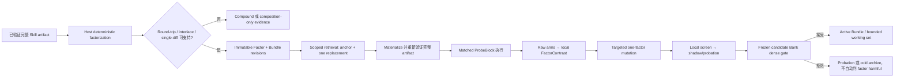

# FACTS-Bank 方法设计档案

> **FACTS — Factorized, Audited, Counterfactual-Tested SkillBank**
>
> **规范中文名：因子化、可审计、局部干预检验的 SkillBank**

| 项目 | 内容 |
|---|---|
| Method ID | `facts_direct_profile_v0` |
| 历史名称 | `FACTS-Bank` |
| 文档性质 | 详细研究方案与历史方法档案；不是实现代码或实验结论 |
| 方法状态 | **未实现、未验证、可证伪** |
| 来源对话 | `6a5642ad-13ec-83ea-abbb-1878f5506f89`（代码仓库审计与方法提出） |
| QueenBee 审核基线 | commit `8725c59c9f6cbc2bb3b17ea2b041b07bc3f7e61a` |
| 归档日期 | 2026-07-14 |
| 目标读者 | 实现 Agent、实验 Agent、代码审计 Agent、方法比较 Agent |
| 相关设计 | [PIF-Bank](./2026-07-14-pif-bank-method-design.md)、[TRIAD-SkillBank](./2026-07-14-triad-skillbank-method-design.md)、[TRACER-SkillBank](./2026-07-14-tracer-skillbank-method-design.md) |

本文把来源对话中的最终 `FACTS-Bank` 方法整理成一份**详细但不等同于代码实现**的设计档案。文档保留来源方案的算法意图，同时吸收固定 commit 复核与对抗审阅中发现的必要修正：不展开完整 Pydantic schema、函数签名或迁移脚本，而是固定对象身份、可干预边界、估计量、生命周期、工程不变量、比较合同和证伪实验。

> **关系声明**：来源 FACTS 与仓库中已经归档的 PIF-Bank 高度同构。本文不把 FACTS 包装成相对 PIF 的第四个独立 novelty claim，而把它规范化为 **PIF-compatible、single-anchor、carrier-native 的保守 direct-factor implementation profile**。如果未来实现没有满足本文定义的 deterministic factorization、round-trip、compound-factor 与 exact-one-factor contrast，它应直接退化为当前 whole-card QueenBee；如果实现需要一般化 composition，则应复用 PIF，而不是复制第二套账本。

---

## 1. 阅读约定与结论边界

### 1.1 证据标签

本文使用五类标签，防止把仓库事实、来源结论和新设计混为一谈：

- **`CURRENT_CODE_FACT`**：固定 commit 中可直接复核的行为；
- **`SOURCE_CONVERSATION_CLAIM`**：来源对话给出的论文、代码或 prior-art 审计结论；本文没有重新执行全部外部审计；
- **`AUDIT_INFERENCE`**：根据当前结构推导出的风险，需要实验验证；
- **`FACTS_PROPOSAL`**：本文建议新增的机制，当前仓库尚未实现；
- **`DESIGN_CONSTRAINT`**：违反后不再是本文定义的 FACTS，或会破坏科学诚实性。

规范性词语：

- **必须 / MUST**：方法身份、安全、泄漏或可识别性的必要条件；
- **应该 / SHOULD**：默认工程选择，可在预注册并说明理由后调整；
- **可以 / MAY**：不影响最小方法身份的可选增强。

### 1.2 一句话核心思想

> **FACTS-Bank 从一个已经通过现有 Graph、PhaseProgram 或 Python validator 的完整 executable anchor 出发，由宿主确定性抽取 immutable、carrier-specific factor revisions；运行时仍只执行重新 materialize 并重新验证的完整 artifact，单 factor 信用只能来自事前登记 comparator、固定其余 factor 的 matched replacement contrast，局部证据只产生 shadow candidate，最终部署仍由 frozen candidate Bank 的 held-out dense gate 决定。**

### 1.3 正确的研究状态表述

在正式实验通过预注册标准前，只能说：

> FACTS-Bank 是一个 PIF-compatible、carrier-native、可实施且可证伪的 direct-factor 研究剖面；它优先验证宿主能否稳定因子化已有 executable，以及 registered-baseline local contrasts 是否比 whole-card credit 更能预测可部署 Bank 改进。它尚未被证明有效，也不主张独立于 PIF 的算法新颖性。

不得写成：

- “FACTS 已经发现真实因果 Skill”；
- “FACTS 已经优于当前 QueenBee/PIF/TRIAD/TRACER”；
- “同 seed 配对已经消除了 LLM 随机性”；
- “factor 的平均分就是其全局固有价值”；
- “将字段拆开就完成了可干预因子化”；
- “首次提出 factorized Skill 或 counterfactual Skill credit”。

### 1.4 三种单位必须分开

| 层级 | 单位 | 职责 | 禁止的混淆 |
|---|---|---|---|
| 执行与部署 | 完整 `SkillBundleRevision` | 唯一实际运行的 artifact；包含完整 materialization manifest 与可验证 hash | 不能直接执行 factor fragment，也不能因一个 factor 分数高就部署任意组合 |
| 学习与信用 | `FactorContrast(from, to, anchor, context)` | 保存 baseline-relative、background-conditional 的局部 replacement contrast | 不能把完整 Bundle outcome 平均分给所有 factor，也不能只按 `factor_id` 记绝对分 |
| 最终准入 | frozen candidate Bank snapshot | 以完整 selector + Bank 状态通过 held-out dense gate | 不能让 local factor gate、UCB 或 archive ranking 绕过 whole-Bank gate |

这三种单位是 FACTS 的最小语义。若实现仍以整个 `SkillCard` 给全部子字段共同记账，它只是 schema 重命名；若 factor scalar 直接驱动部署，它违反本文方法定义。

### 1.5 FACTS 不是什么

FACTS 不是：

- 第六种 `planner_mode`；
- Graph、PhaseProgram 与 Python source 的自由拼接器；
- 任意多因子 crossover；
- 完整 Shapley value；
- retrieved-unused opportunity 或两阶段 adoption 方法；后两者属于 TRIAD/TRACER 的扩展焦点；
- 用一个综合 reward 取代 `V/K/U/P/S/stage_score/C/D`；
- 将 FailureCluster 自动解释成 factor 根因；
- 把 `reasoning_policy` 文本字段直接当成可执行 factor；
- 替换现有 compiler、AST、sandbox、worker contract 或 `strict_dense_v2`；
- 允许 answer、ground truth、expected output、private prompt 或 TEST feedback 进入长期 Bank。

### 1.6 Agent 快速阅读路径

全文较长。按任务选择最短路径：

| Agent 任务 | 建议先读 |
|---|---|
| 判断方法是不是FACTS | [第3节：最小身份](#3-facts-的最小方法身份与-pif-关系) → [第23节：最小定义](#23-最小不可删减定义) |
| 设计factorizer/materializer | [第4节：对象身份](#4-概念对象身份与状态) → [第5节：可分离性](#5-安全因子化与可分离性合同) → [第6节：carrier合同](#6-carrier-specific-factor-contracts) |
| 实现credit/probe | [第8节：局部contrast](#8-registered-baseline-局部干预信用) → [第9节：统计合同](#9-随机性可识别性与统计合同) → [第10节：failure](#10-failure-与证据更新语义) |
| 实现search/gate | [第11节：retrieval/mutation](#11-retrievalanti-monopoly-与-mutation) → [第13节：split/gate](#13-local-screenwhole-bank-gate-与-split) → [第14节：预算](#14-六维-all-in-预算) |
| 做方法比较 | [第15节：统一比较](#15-与-currentpiftriadtracer-和-whole-program-search-比较) → [第19节：实验](#19-实验与消融设计) → [第20节：证伪](#20-可证伪预测失败解释与停止标准) |
| 开始工程实现 | [第17节：分阶段落地](#17-default-off-分阶段落地) → [第18节：文件地图](#18-文件级实现地图) → [第21节：检查表](#21-给实现与比较-agent-的检查表) |

---

## 2. 当前 QueenBee 基线：已有能力与精确缺口

### 2.1 Typed executable 与独立 reasoning 字段已经存在

**`CURRENT_CODE_FACT`**：`PlannerMode` 当前包含：

```text
topology_select
operator_compose
graph_generate
program_generate
python_generate
```

`SkillCard.mode_payload`是discriminated union，当前可承载mode-owned executable payload或replay identity：

| Payload | Mode-owned payload / replay identity |
|---|---|
| `NamedTopologySkillPayload` | named topology 与 schema-validated `protocol_spec` |
| `PaperTransportSkillPayload` | 原生executor的`p2p / broadcast / sfs` selector identity与`structure_code`；不是自包含静态schedule/source |
| `GraphSkillPayload` | 实际 `protocol_spec` 与可选 topology program |
| `PhaseProgramSkillPayload` | 原始 DSL、compiled spec、compiler version 与 SHA-256 |
| `PythonSkillPayload` | 完整 source、SHA-256、AST/execution/worker contract 与 mutation provenance |

`PaperTransportSkillPayload.planner_mode == "paper_protocol"` 是 payload/runtime marker，**不在**当前 `PlannerMode` literal 中。实现 Agent 不得未经 schema 与路由修改就把它当成普通 planner mode。

**`CURRENT_CODE_FACT`**：`SkillCard` 已经分别保存 `mode_payload`、`organization_policy` 和 `reasoning_policy`，并保留 evidence、failure、counterexample、insight、confidence、provenance 与 `information_goal`。因此 FACTS 的增量不是“增加 reasoning 字段”，而是把宿主可执行的天然边界提升为独立 revision identity、contrast、mutation 和 lifecycle。

### 2.2 当前检索有请求过滤，但不是绝对 hard silo

**`CURRENT_CODE_FACT`**：正常 `SkillBank.retrieve()` 会过滤：

```text
selectable
task_family
objective
information_goal
provenance（请求提供 allowlist 时）
generated planner mode
Python worker contract
allowed topology
agent range
array size
```

随后按特异性和悲观损失排序，并做 topology-equivalence 去重。

必须保留三个限定：

1. mode matcher 对非 generated modes 较宽松；GraphGen 兼容路径可在特定条件下接受 named/source-less anchors；
2. `retrieve_generation_context()`有意忽略部分mode/provenance compatibility并返回完整context cards；具体consumer选择有限字段，但当前没有统一通用sanitizer，Graph context可含完整`organization_policy`，Phase context可含`phase_program`；
3. `TopologySelectPlanner` 在正常检索为空时会退回 Bank 中全部 selectable Skill，绕过原请求的部分过滤。

**`DESIGN_CONSTRAINT`**：FACTS在形成candidate slate、绑定factor和materialize Bundle时必须再次验证完整namespace。空结果只能使用同namespace的显式baseline或失败；不得继承全Bank selectable fallback。Generation context必须经过FACTS自己的对象级字段allowlist；context-only reference不可直接执行，也不可获得跨namespace direct credit。

### 2.3 当前 equivalence 对 reasoning variant 的风险

**`CURRENT_CODE_FACT`**：能推导 topology hash 时，当前 `_skill_equivalence_key` 主要是：

```text
information_goal :: topology : topology_hash
```

否则退回：

```text
information_goal :: skill : skill_id
```

Topology fingerprint编码结构传输，不包含`reasoning_policy`。Equivalent-topology compaction会选择代表卡，并合并evidence、risk、failure等metadata；Graph candidate dedupe和普通merge有instruction/reasoning-preserving mitigation，但同一结构下的多个reasoning-policy variants没有各自独立的长期identity、credit和lifecycle。

还有两个独立压缩面：

- `_skill_condition_bucket`只含task/objective/agent/array bucket，不含goal、mode、worker contract或provenance；即使equivalence key修复，不同namespace仍可能争夺同一top-N quota；
- evolution后续的`transfer.merge_structural_duplicates()`仍按structure hash/name归组并删除其他cards，可能再次合并同结构、不同policy variants。

因此FACTS必须同时修复candidate dedupe、equivalence identity、capacity bucket和transfer merge；只改`_skill_equivalence_key`不够。

**`AUDIT_INFERENCE`**：这可能导致：

- 同 topology、不同 merge/send/submit semantics 被压成一个代表；
- 实际由 reasoning/instruction 产生的收益被归给 topology；
- 一个 Bundle 失败时，仍有价值的 structure 或 block 随 whole card 一起失去检索机会；
- 不同 runtime/partner 下符号相反的局部 effect 被聚合成误导性的全局均值。

这些是待验证风险，不是已观察到的性能结论。

### 2.4 当前已有局部结构，但没有统一 factor ledger

**`CURRENT_CODE_FACT`**：当前已具备：

- 分开的 `reasoning_policy`；
- topology structural identity；
- Graph/Phase instructions 与 recipes；
- Python `EVOLVE-BLOCK` 和单 patch 一次只替换一个 block 的验证；
- 名为`_paired_skill_ablation`的whole-candidate paired observational comparison；它消费已有rows，不是新执行的single-change intervention；
- 明确标为 `paired_association_not_causal` 的 insight attribution；
- `reuse`、Python-specific bounded `mutate`、fresh/innovation 分支；
- Bank-level patch、compaction、deprecate，以及gate拒绝后的deployed snapshot withholding/rollback；候选研究artifact仍可保留。

因此不能说“QueenBee 完全没有 factorization 或局部 mutation”。当前真正缺少的是统一的：

```text
immutable content-addressed factor catalog
+ deterministic carrier-specific extraction/materialization
+ registered comparator/baseline
+ exact-one-factor matched raw ledger
+ comparator/background-aware FactorContrast
+ optional sparse complete 2×2 interaction
+ factor-local probation/archive semantics
```

### 2.5 Python 的 one-block 边界不是自动成立

**`CURRENT_CODE_FACT`**：单次 `python_mutation_patch_v1` 会：

- 指定唯一 `block_id`；
- 校验 parent SHA；
- 禁止修改 marker set；
- 校验所有非目标 block 内容不变。

但 Python repair loop 可以继续应用新的 one-block patch，后续 repair 可能选择不同 block。因此最终 child 相对最初 parent 可能改变多个 block。

**`DESIGN_CONSTRAINT`**：FACTS 的 Python 单因子 contrast 必须满足以下之一：

1. probe/mutation 禁止 repair；
2. 全部 repair 强制绑定同一原始 target block；
3. 最终 host diff 证明 original parent → final child 恰好只有一个注册 block 的内容改变。

否则该候选必须标为 `compound` 或 `unsupported_nonseparable`，不能给单一 `PythonBlockFactorRevision` 记信用。

### 2.6 Failure、gate 与 split 的现状边界

**`CURRENT_CODE_FACT`**：当前 failure taxonomy 区分 success、algorithm、infrastructure 与 harness failure。`FailureRecord` 是 frozen、`extra="forbid"` 且 schema 中没有答案/ground truth；cluster key 包含 mode、goal、contract、stage、error 与 structural signature。这里准确的说法是“`FailureRecord` 持久化 schema answer-free”，不能扩大为它引用的所有外部 artifact 都已经证明 answer-free。

**`CURRENT_CODE_FACT`**：`strict_dense_v2` 要求 incumbent/candidate 拥有相同 `(case_id, seed)` key set，并检查 algorithm failure、mean `V`、min `K`、mean `U`、容忍后的 `P`、paired stage bootstrap，再接受质量改善或完全同质量下的 `C/D` 改善。

当前 gate 还有两个实现级限制：

- 用 dict 构造 paired index，重复 `(case_id, seed)` 会被覆盖，未显式报错；
- bootstrap 单位是 `(case, seed)` row，不是 case cluster；同 case 多 seed 时可能低估相关性。

**`CURRENT_CODE_FACT`**：显式 TRAIN/VAL manifests 可以拒绝重叠，但小样本 fallback 可能复用实例；正式 verifier 可以冻结 Bank 后运行 TEST，但当前 schema/API 尚未在类型层强制所有 TEST 写入失败，也没有覆盖全部持久状态的前后 hash facade。

FACTS 必须补上这些研究合同，而不能把它们写成当前已完成事实。

### 2.7 差距矩阵

| 问题 | 当前最接近机制 | FACTS 需要新增 |
|---|---|---|
| Factor identity | reasoning 字段、topology hash、EVOLVE block | immutable revision、stable locator、namespace 与 interface signature |
| Bundle identity | 完整 `SkillCard` | ordered binding manifest、materialized payload hash、reverse trace |
| 单 factor credit | whole-candidate ablation、insight association | registered `from→to` exact-one-factor matched contrast |
| 交互 | 无正式 factor interaction | 可选的完整四臂 2×2；MVP 默认关闭 |
| 不可分离变化 | whole candidate | explicit compound factor / unsupported state，不补零 |
| Mutation target | branch/insight/failure summary | factor-specific evidence，只改一个 final diff |
| Retrieval monopoly | LCB 与确定性排序 | TRAIN-only under-exposure quota/cooldown；不创造 efficacy |
| 淘汰粒度 | whole card/equivalence representative | factor probation/archive + complete cold artifact reference |
| 部署 | whole-Bank dense gate | 保留；新增 local screen 但不能绕过 final gate |
| TEST immutability | verifier control flow | all-state frozen facade 与写 API 拒绝 |

---

## 3. FACTS 的最小方法身份与 PIF 关系

### 3.1 历史定义与规范化 profile

为忠实保存来源又避免术语冲突，本文区分：

| 名称 | 含义 |
|---|---|
| `historical_facts_v0` | 来源对话中的完整构想：factorization、paired swaps、sparse interaction、anti-monopoly、factor gate/archive |
| `facts_direct_profile_v0` | 本文可比较的操作定义：单一已验证 anchor、carrier-native deterministic factorization、registered-baseline direct replacement 为核心；interaction与anti-monopoly/capacity archive是可选扩展 |

来源中的 interaction、anti-monopoly 和 archive 仍被记录，但它们不是 FACTS 相对 PIF 的增量。当前最值得单独验证的是：

```text
自然 factor boundary 能否被宿主稳定重建？
registered-baseline single-factor contrast
是否比 whole-card outcome 更能预测可部署改进？
```

### 3.2 最小不可约约束

只有同时满足以下约束，才应称为 `facts_direct_profile_v0`：

1. 起点是一个通过当前 carrier validator 的 immutable full artifact anchor；
2. factor boundary 由 host 确定，不由 LLM 自报；
3. factor revision immutable、content-addressed，并带稳定 locator/interface；
4. factor manifest 可以 round-trip 重建相同完整 artifact hash；
5. runtime 始终执行完整 materialized artifact；
6. 单 factor contrast 的两个 arm 只有一个 binding revision 不同；
7. baseline/comparator 在 outcome 前登记，且 same-slot、interface-compatible；
8. contrast identity 包含 `from/to + anchor + partners + effect context`；
9. unsupported/nonseparable 不补零，也不伪装成失败 factor；
10. raw execution observation immutable，effect view 从 raw arms 确定性派生；
11. local evidence 只能产生 shadow/probation candidate；
12. 完整 candidate Bank 仍通过独立 held-out dense gate；
13. TRAIN、local screen、Bank gate、FINAL_VAL、TEST 的适应权限明确分开；
14. namespace、compiler/scaffold、worker/runtime contract 不被放松；
15. TEST、answer、ground truth、expected output 与 private prompt 不进入任何持久状态。

若缺少第 2–8 项，它只是 whole-card ablation；若缺少第 11–12 项，它是不安全的 factor optimizer；若引入多 Atom portfolio、retrieved-unused opportunity 或两阶段 adoption，则已经进入 TRIAD/TRACER 范围。

### 3.3 与 PIF 的关系

FACTS 与 PIF 的对象可映射为：

| FACTS | PIF | 关系 |
|---|---|---|
| `SkillFactorRevision` | typed Factor revision | 基本同构；FACTS 更强调 carrier-native extractor 与 natural locator |
| `SkillBundleRevision` | `SkillComposition` | 基本同构；FACTS 默认是一个 anchor 的单 slot replacement 邻域 |
| `FactorContrast` | `FactorContrast` | 同一 registered `from→to` 局部 estimand |
| `InteractionEffectView` | 完整 2×2 interaction | 同构；不是 FACTS 独立增量 |
| factor probation/archive | factor registry lifecycle | 同构；FACTS 保留来源命名但应共用实现 |

**`DESIGN_CONSTRAINT`**：若 PIF substrate 已实现，FACTS 必须复用其 immutable identity、raw ledger、materializer interface 与 gate adapter；不能新建第二套“事实来源”。FACTS 只应作为更窄的 carrier profile、默认配置和实验 arm。

### 3.4 何时选择 FACTS，何时退化

| 条件 | 应选择 |
|---|---|
| 只想验证已有 Graph/Phase/Python 天然边界能否稳定归因 | FACTS-direct |
| 需要一般化多 factor composition 和完整 factor registry | PIF |
| 已有 bounded Atom portfolio，并研究 removal/pair/opportunity | TRIAD |
| 核心瓶颈是 retrieval→selection→activation→following | TRACER |
| 大多数变化不可分离、round-trip 不稳定或 contrast 不可预测 | 当前 whole-card QueenBee |
| equal-all-in 下局部 attribution 吞掉搜索预算且无 uplift | 当前 QueenBee 或更简单 direct ablation |

---

## 4. 概念对象、身份与状态

本文只给 agent 必须理解的对象关系，不给完整代码 schema。

### 4.1 Identity、eligibility 与 effect context 分层

FACTS不能把所有条件都塞进一个namespace。至少分三层：

| 层 | 最少包含 | 是否进入factor revision identity |
|---|---|---|
| `ArtifactNamespace` | information goal、carrier/planner mode、input/output schema、worker/execution contract、security profile、compiler/scaffold/materializer/hook version | **是** |
| `EligibilityContext` | task family、objective、provenance allowlist、allowed topology、agent/task-feature compatibility、selector policy version | 否；版本化地决定候选资格 |
| `EffectContext` | task/model/runtime bucket、agent bucket、budget class、provider/scorer version、split | 否；决定local sample/CI如何分账 |

Hard artifact namespace 至少包含：

```text
information_goal: sink | all_agents
planner_mode / carrier
worker_contract（Python）
execution_contract
compiler / scaffold / materializer version
input/output schema and security profile
```

不同`ArtifactNamespace`的factor：

- 不得直接组装；
- 不可通过 fallback 进入同一 candidate set；
- 不共享executable validity。

不同`EffectContext`的observations不共享direct local sample count或CI；最多共享一个显式、低权重、不能缩窄本地CI的portable prior。改变provenance allowlist、objective、agent bucket或task bucket不创建新的executable revision，而是产生新的eligibility/effect view。

`case_id` 不属于 retrieval feature，只用于 matching 和审计。

### 4.2 `SkillFactorRevision`

每个 factor revision 至少包含：

| 字段组 | 含义 |
|---|---|
| Identity | `factor_revision_id`、factor type、content hash、schema version |
| Namespace | 完整 immutable `ArtifactNamespace` |
| Locator | 在 carrier artifact 中的稳定位置，如 phase ID、hook slot、EVOLVE block ID |
| Interface | `requires`、`provides`、typed hook、compatibility signature |
| Artifact ref | 规范化 factor 内容或不可变外部 artifact 引用 |
| Creation audit | 唯一creation-event ID、创建时parent relation ref、materializer version、content digest |

任何内容、hard namespace、interface或locator semantic变化都产生新revision，旧revision不原地覆写。多来源lineage、baseline applicability、provenance/evidence refs、validation snapshots和active/archive状态不放进revision本体。

### 4.3 `FactorRegistryEntry`、`BaselineRelation` 与 `EvidenceIndex`

可增长关系必须与immutable executable identity分开：

| 对象 | 作用 | 可变性 |
|---|---|---|
| `FactorRegistryEntry` | 多origin/lineage refs、eligibility、search/storage/deployment状态 | append/revisioned；不改变factor identity |
| `BundleRegistryEntry` | Bundle的多origin/anchor lineage、validation/evidence refs与active/deployment状态 | append/revisioned；不改变Bundle identity |
| `BaselineRelationRevision` | `from→to`、same-slot/interface、适用anchor/context与登记理由 | immutable revision；ProbeBlock outcome前冻结引用 |
| `EvidenceIndex` | raw ProbeBlock/observation IDs、derived view refs、validation snapshots | append-only index；raw evidence不可改 |

相同factor revision从新Skill再次被发现时，只向registry/evidence index追加origin ref；不能原地改`SkillFactorRevision`，也不能仅因多了一个comparator创建新的executable identity。

### 4.4 `SkillBundleRevision`

Bundle 是完整、可重新物化的执行身份，至少包含：

```text
bundle_revision_id
execution namespace
ordered slot -> factor revision bindings
materializer version
materialized full-payload hash
reverse-trace manifest
immutable creation_event_ref
```

Bundle ID由namespace、ordered bindings、materializer/compiler version派生。`creation_event_ref`只指向首次创建时的immutable event，不可追加；多origin/anchor lineage、后续validation/evidence与registry/deployment状态放在`BundleRegistryEntry/EvidenceIndex`。相同topology、不同reasoning factor必须形成不同Bundle revision；共享structure identity不等于共享structure的无条件credit。

### 4.5 `FactorizationManifest`

Manifest 是 full artifact 与 factors 之间的宿主证明：

```text
source full-artifact hash
carrier/version
ordered factor locators
factor revision IDs
extraction digest
materialization digest
round-trip result
non-factor residue hash
```

`non-factor residue` 覆盖不可变 scaffold、host API、compiler metadata 与未拆分内容。它防止“只有列出的 factor 没变，但未列出的自由文本偷偷变了”。

### 4.6 `ProbeBlock` 与 raw observations

每个 matched experiment 先创建 immutable `ProbeBlock`：

```text
block_id
contrast type
all arm bundle revision IDs
registered from/to revisions
frozen BaselineRelationRevision
anchor-without-target signature
partner signature
case/seed manifest
model/runtime/budget snapshot
arm order RNG seed
reserved BudgetVector
split and write policy
```

执行后追加 immutable arm observations：

```text
V/K/U/P/S/stage/C/D
algorithm/infrastructure/harness state
per-agent submission/partial/coverage aggregates
tokens/calls/repairs/cost/wall time
artifact and trace summary hashes
```

先保存 raw arms，再确定性派生 direct、interaction、failure-transition 和 cost views。不得先写 summary、丢弃 raw comparator，再把同一个 run复制成多条独立证据。

### 4.7 `FactorContrast` 不是绝对分数

Contrast identity 至少包括：

```text
from_revision
to_revision
target_slot
anchor_without_target_signature
partner_signature
task/model/runtime bucket
mode/goal/worker/execution contract
budget class
split
estimator version
```

方向必须全仓库唯一：

```text
from_revision = registered baseline b
to_revision   = candidate f
delta         = Z(to) - Z(from)
```

任何报表、mutation target、LCB或archive decision都沿用这个方向。Interaction写成`(b → f) × (c → g)`，不得在局部模块中反转符号。

因此：

```text
Factor f 在 Bundle A 中优于 baseline b
```

不能自动推导为：

```text
Factor f 在 Bundle C、另一 model 或另一 task 中也优于 b
```

Factor 主页可以展示多个 effect views，但不得把它们压成一个不带 comparator/context 的“全局信用”。

### 4.8 状态必须分轴

不要用一个混合 enum 表示全部状态。至少分为：

| 状态轴 | 候选值示例 | 含义 |
|---|---|---|
| Artifact validity | `unvalidated / valid / invalid` | 完整 artifact 是否通过 carrier validator |
| Evidence | `unprobed / observed / conflicted / unsupported` | 是否有合法 local contrast |
| Search registry | `probation / active / archive / quarantine` | 是否可参与 TRAIN/deployment retrieval |
| Deployment | `not_deployable / deployable` | 是否随 frozen Bank snapshot 通过 final gate |
| Storage | `hot / cold / tombstone-index` | payload 位于工作集、冷档案或只保留索引 |

关键规则：

- hard-valid factor 随 candidate Bank 被拒，不自动变 harmful；
- invalid、leaky、contract mismatch 才进入 quarantine；
- unprobed/underexposed 是 unknown，不是 0 或负信用；
- active in one effect context 不等于跨 task/model 全局 active；
- tombstone 必须保留冷 artifact 引用，不能由负分自动物理删除科学证据。

---

## 5. 安全因子化与可分离性合同

### 5.1 四个必要不变量

一个对象只有同时满足以下条件，才是 FACTS 的独立 factor：

1. **Stable locator**：宿主能在完整 artifact 中唯一定位；
2. **Typed interface**：宿主能验证它要求和提供的 slot/contract；
3. **Round-trip**：extract → materialize 能重建同一完整 artifact hash；
4. **Single-diff**：replacement 后除目标 binding 外，所有 factor revision、residue、compiler/runtime identity 不变。

自然语言“这段看起来像模块”不满足任一条件。

### 5.2 Round-trip oracle

对任何可因子化 artifact `A`：

```text
M = extract(A)
A' = materialize(M)
validate(A')
assert canonical_hash(A') == canonical_hash(A)
assert reverse_trace(A') == M.bindings
```

若 artifact 存在非语义性格式归一化，必须分别保存 raw source hash 与 canonical executable hash，并预先规定哪个用于行为 identity。不能在实验结果出现后更换 canonicalization。

### 5.3 合法 replacement

从 baseline factor `b` 替换为 candidate factor `f` 的必要条件：

```text
same namespace
same target slot type
f.requires ⊆ anchor.provides
all anchor requirements remain satisfied
no conflict/tombstone guard
materializer accepts both
both full artifacts pass the same validators
all non-target bindings and residue hashes equal
```

Root 或 structure factor 不能“直接 drop”。它只能与事前注册、same-slot 的 baseline/root revision 比较。

### 5.4 不可分离与 `compound_factor`

以下情况不能记单 factor credit：

- Graph structure 改动同时新增/删除 instruction slots；
- Phase control 改动导致 phase IDs、instruction 或 submit semantics 连带变化；
- Python final child 改变多个 EVOLVE blocks 或 scaffold；
- reasoning policy 只有自由文本说明，没有 deterministic hook；
- materializer 为兼容 candidate 自动改写了其他 factor；
- repair 改变了未登记 residue；
- baseline 无法生成合法完整 artifact。

此时有三种诚实结果：

```text
compound factor revision
composition-level observation only
unsupported_nonseparable
```

`unsupported_nonseparable` 不补零、不算 algorithm failure，也不应把 candidate 记为 harmful；它是 factorization-contract evidence。

### 5.5 粗到细的自适应边界

FACTS 初始只使用宿主已有天然边界。若结构和 policy 强耦合，则先保存 compound factor。只有满足以下条件才进一步拆分：

1. 出现可版本化的 typed interface；
2. 至少两个独立 anchor 可使用该 interface；
3. round-trip 与 single-diff tests 全通过；
4. held-out evidence 显示子 factor effect 不是纯 rerun noise；
5. 拆分后组合数仍满足容量和预算上限。

反向合并同样允许：若多数 replacement 非法、effect 高度依赖 partner 或 interaction 主导，就把子 factors 合回 compound，而不是继续制造虚假的独立信用。

### 5.6 Factorization 自身也是可证伪对象

正式报告必须给出：

```text
eligible artifacts
round-trip pass rate
stable locator rate
single-diff pass rate
unsupported/nonseparable rate
compound factor share
materialization failure rate
cross-anchor reuse rate
```

如果大多数 artifact 只能作为 compound/whole factor，FACTS 的核心前提失败；不能只报告少数成功示例。

---

## 6. Carrier-specific factor contracts

### 6.1 共通原则

每个 carrier 都必须拥有自己的 extractor、materializer、validator adapter 与 reverse trace。可以共享 identity、raw ledger、gate interface、budget 和 archive，但不能共享一个“万能 factorizer”。

任何 factor replacement 最终都要回到完整 carrier artifact：

```text
factor revisions
    → carrier-specific materializer
    → complete artifact
    → existing validator/compiler/sandbox
    → existing runtime
```

### 6.2 Graph

建议第一版最多拆为：

| Factor type | 内容 | 稳定 locator | 主要风险 |
|---|---|---|---|
| `GraphStructureFactorRevision` | canonical temporal edges、rounds、selected primary、fan-in/state shape | canonical graph slot | 改结构可能改变 instruction hooks |
| `GraphInstructionSetFactorRevision` | `(round, receiver, semantic_role) → instruction` | typed instruction slots | slot 随结构消失 |
| `GraphReasoningFactorRevision` | merge、dedupe、provenance、send semantics | 仅限已有 deterministic binder 字段 | 自由文本无法机械验证 |
| `GraphSubmitFactorRevision` | submitter、coverage barrier、all-agents sync semantics | submit hook | 与 goal 强耦合 |

Graph structure replacement 后必须重新验证 DAG、coverage、fan-in、message budget、goal semantics 和 instruction-slot completeness。

若结构改变 slot set，则 `structure + affected instructions (+ submit)` 是 compound change。不能只因 topology hash 变化就把全部 outcome 归给 structure。

### 6.3 PhaseProgram

建议使用稳定、由宿主生成的 phase IDs，而不是仅依赖 list index：

| Factor type | 内容 | 必须验证 |
|---|---|---|
| `PhaseControlFactorRevision` | phase kind/order/participants/pattern/send mode/stop condition | compiler round-trip、phase IDs、coverage |
| `PhaseInstructionFactorRevision` | 某个 stable phase hook 的 instruction | phase/interface 存在，其他 phase 不变 |
| `PhaseSubmitFactorRevision` | final holder、coverage-complete、all-agent barrier | goal/submit contract |

每次 replacement 都必须重新编译完整 PhaseProgram，并比较 source manifest 和 compiled protocol。Graph locator 不能用于 Phase，compiled Graph hash 也不能替代 DSL source identity。

### 6.4 Python

Python 初始只使用当前已有的自然边界：

```text
PythonScaffoldFactorRevision（默认不可变）
PythonBlockFactorRevision[registered block_id]
```

`PythonScaffoldFactorRevision` 包含 scaffold version、AST policy、execution contract、worker contract、host API signature 与 immutable non-block residue hash。

`PythonBlockFactorRevision` 必须来自合法 `EVOLVE-BLOCK`，并保留 block ID、parent full-source hash、content hash、indent/marker contract 和 allowed insight IDs。

一个合法的 Python factor child 必须：

1. parent hash 正确；
2. marker set 不变；
3. 非目标 blocks 内容不变；
4. scaffold/non-block residue 不变；
5. final parent→child diff 恰好一个注册 block；
6. 完整 source 重新通过 AST、taint、dry-run、sandbox、stdout 与 usage ledger；
7. worker contract、execution contract 和 runtime snapshot 相同。

若 repair 触及第二个 block，整个 candidate 转为 compound。不能用“最初只请求改一个 block”代替最终 diff 证明。

### 6.5 Reasoning policy

当前 `reasoning_policy` 字段提供重要语义，但字段存在不等于可执行 factor。只有下列情况可独立归因：

- policy 对应 Graph/Phase 的 typed hook；
- Python 完整 source 已显式实现该 policy，且 replacement 生成一个新的完整、可验证 block/source revision；
- host 能根据 artifact 和 trace 验证 policy 被 materialize；
- comparator 使用相同 hook/interface。

“更认真思考”“进行深入反思”这类不可机械绑定/验证的文本只能作为 proposal context 或 bundle-level hypothesis，不能拥有独立 direct credit。

### 6.6 Named topology 与 paper transport

Named topology 第一版可以作为只读 whole structure factor；若有 typed policy binder，可形成不同完整 Bundle，但不能改变 named builder 后仍冒充同一 topology revision。

`p2p/broadcast/sfs`必须由原生paper transport executor执行，不能伪编译成静态Graph factor。它们只能在经过FACTS对象级allowlist后提供prior/context，并且：

- 不与 Graph executable factor互换；
- 不因结构描述相似而共享 direct contrast；
- 不把 `paper_protocol` 当成现有普通 `PlannerMode`；
- 跨 carrier比较只能在完整 baseline arm 层进行。

---

## 7. 完整生命周期



### 7.1 Create

只从以下来源创建 factor revision：

- 已通过现有 validator 的 current/replayed Skill；
- 已验证的 fresh artifact；
- 已验证的 one-factor child；
- 显式迁移的 legacy whole factor；
- compound factor。

LLM 只能提出 candidate 内容，不能自行授予 factor identity、compatibility 或 credit。

### 7.2 Factorize / Register

宿主执行：

```text
canonicalize complete artifact
extract stable locators
content-address revisions
construct residue hash
materialize round-trip
run existing validator
register allowed baselines
create BundleRevision
```

相同hard namespace、type、content和interface hash的factor不重复创建revision，只向`FactorRegistryEntry`和`EvidenceIndex`追加origin/evidence reference。

### 7.3 Retrieve / Assemble

第一版只允许：

```text
one validated anchor Bundle
+ zero or one same-slot compatible factor replacement
```

保留当前完整 Bundle 作为 exploitation candidate，避免 factor assembly 丢掉 incumbent。任意多 factor crossover 不属于 FACTS-direct。

### 7.4 Materialize / Execute

Bundle 先 materialize 成完整 existing artifact，再经过相同 validator 和 runtime。Factor fragment 不直接进入 runtime。执行 manifest 必须记录所有 bindings、payload hash、model/runtime/budget 和 split。

### 7.5 Attribute

只对预先创建并完整预留预算的 ProbeBlock执行。Direct contrast 需要 treatment 与 comparator 两个合法完整 arms；interaction 需要完整四臂。未执行的 factor只记录 eligibility/exposure，不得到 efficacy。

### 7.6 Mutate

Mutation target 来自 context-specific evidence：负 direct LCB、高 uncertainty、failure-linked、cost burden 或 underexposure。一次 direct child 的 final artifact 只能改变一个 target factor；否则转 compound。

### 7.7 Local screen

Local screen 比较 parent Bundle 与 one-factor child，只决定 child 是否可进入 shadow/probation 和 candidate Bank。它不产生全局 deployability，也不能与 confirmatory credit 使用同一自适应样本。

### 7.8 Whole-Bank gate

候选 factor/bundle进入一个冻结的 candidate Bank snapshot，包含 selector、caps、fallback、archive 和 candidate set。只有完整 snapshot 在独立 held-out units 上通过 dense gate，相关 Bundle 才可 deployable。

### 7.9 Archive / Tombstone

- invalid/leaky/contract mismatch → quarantine；
- hard-valid、局部有证据但 Bank gate未接受 → probation/cold archive；
- sufficiently dominated/stale → archive；
- active working set只保留压缩 tombstone index，但冷存储保留 immutable artifact ref、hash 与版本。

Bank-level rejection不能自动归因给某一个 factor；否则又回到 whole-Bank outcome错误分摊。

---

## 8. Registered-baseline 局部干预信用

### 8.1 Outcome vector

每个 arm 保存数值 outcome 向量：

\[
Z(B,u)=\left(V,K,U,P,S,G,-\widetilde C,-\widetilde D,-A_{fail}\right),
\]

其中：

- \(G\) 为 `stage_score`；
- \(C,D\) 按预注册 runtime/budget规则归一化；
- \(A_{fail}\in\{0,1\}\) 是 algorithm-failure indicator；向量中使用 \(-A_{fail}\)，因此所有坐标仍保持“越大越好”；
- 质量坐标保持向量，不用单一 LLM judge覆盖；
- per-agent submission/partial/coverage 作为辅助向量保存。

Categorical `failure_class`、`failure_stage` 与 error signature **不进入向量减法**，而作为单独的 `FailureTransitionView(candidate_class, baseline_class)` 保存。Infrastructure 或 harness failure 使整个 block 不可用于 efficacy arithmetic；合法 algorithm failure 使用当前 canonical zero-quality 语义并保留成本，同时由 \(A_{fail}\) 和 transition view 显式报告。

### 8.2 Direct replacement estimand

给定：

- candidate revision \(f\)；
- outcome 前登记的 baseline revision \(b\)；
- 除目标 slot 外固定的 anchor \(A\)；
- effect context \(x,r\)；
- matched evaluation unit \(u=(case,seed)\)。

定义 candidate-over-baseline 的局部 contrast：

\[
\tau_{f\leftarrow b\mid A,x,r}
=
\mathbb{E}_{u\sim D_x,\epsilon}
\left[
Z_u(A\oplus f;r)-Z_u(A\oplus b;r)
\right].
\]

\(\epsilon\) 包含 provider stochasticity 和执行顺序。正方向统一为 candidate \(f\) 优于 baseline \(b\)。

准确表述是：

> 在给定 anchor、comparator、task/model/runtime/budget 条件下的 registered-baseline matched local intervention contrast。

不是：

> factor \(f\) 的全局因果价值。

### 8.3 Baseline registry

Comparator 优先级可以是：

1. direct parent revision；
2. preregistered canonical scaffold/default revision；
3. same-slot、same-interface 的 incumbent revision；
4. 明确的 neutral factor，仅在能 materialize 完整合法 artifact 时使用。

Baseline必须在 outcome 前固定。禁止同一个 candidate 跑多个 comparator 后，只选择最有利结果。不同 baseline产生不同 estimand，不能直接合并成同一个 factor score。

### 8.4 完整 2×2 interaction

若要估计 factors \(f,g\) 相对 baselines \(b,c\) 的 outcome-scale interaction，需要四个完整 arms：

```text
A + f + g
A + b + g
A + f + c
A + b + c
```

定义：

\[
\eta_{(f,b),(g,c)\mid A}
=
\mathbb{E}\left[
Z(A,f,g)-Z(A,b,g)-Z(A,f,c)+Z(A,b,c)
\right].
\]

必须保存四个 revision identity、同一 block manifest 和全部 arm outcomes。一个 pair-drop、两个来自不同 blocks 的 singleton contrasts、共现均值或 LLM解释都不能称为 interaction。

完整四臂相对已执行的 `A+f+g` main arm还需要 3 次增量 execution。MVP 默认关闭 interaction；只有 direct contrasts 在 held-out 有预测力、且 interaction 会改变选择时才开启。

### 8.5 Effect aggregation

Effect view 按以下层级聚合：

```text
exact anchor + exact runtime
→ compatible anchor family（低权重层级 prior）
→ task family portable prior（仅 shadow）
```

任何向上聚合必须保留：

- from/to revisions；
- anchor/partner distribution；
- local sample count 与 distinct cases；
- prior contribution 与本地 support；
- sign heterogeneity；
- runtime/model version。

Family prior 不得增加目标 context 的 local `n`、缩窄本地 CI 或让 factor直接 active。

### 8.6 旧 observational evidence

现有 whole-card outcomes、insight association、failure co-occurrence 和 branch win/loss 都可作为：

```text
proposal prior
probe priority
failure hypothesis
```

但不能转换成 direct `FactorContrast`。历史卡没有 exact-one-factor manifest，缺 comparator identity，无法事后“恢复”出局部信用。

---

## 9. 随机性、可识别性与统计合同

### 9.1 Same case/seed 的作用和局限

相同 case/seed 可以控制任务实例、宿主随机选择和部分模型采样，但不能保证远程 LLM/provider 完全确定。模型服务版本、并发、缓存、时间漂移和隐式采样仍可能影响结果。

因此同 seed 是 matched design 的必要条件之一，不是充分的因果识别保证。

### 9.2 Matched block 的共同不变量

一个 direct ProbeBlock 的两个 arms必须共同固定：

```text
case and seed
task/goal/mode/worker/execution contracts
model name/version/profile
temperature and decoding config
prompt/scaffold/compiler/materializer versions
all non-target factor revisions
budget vector and hard limits
scorer/judge version
provider time window as far as practical
```

Interaction block的四个 arms同样固定，且必须在 block开始前一次性声明。

### 9.3 Arm order

为减小时间漂移，direct block 应在 case/seed 或 block层随机化 `AB/BA` 顺序；四臂 block随机化完整 permutation。Arm order、RNG seed、启动时间和并发组写入 manifest。

关键 contrast 可以交错重复，但重复规则必须预注册；不能看到第一个不利结果后才追加运行。

### 9.4 统计独立单位

正式分析以 case 为主要 cluster：

1. 先在同 case 内聚合多个 seeds/blocks；
2. 再在 case 之间做 paired cluster bootstrap 或预注册 mixed model；
3. 报告 distinct cases、distinct seeds、complete blocks；
4. 同一 case 的不同 seeds 不跨 split；
5. duplicate `(case_id, seed, arm_id)` 必须在 gate 前直接报错。

当前 `strict_dense_v2` 的 row bootstrap可继续作为兼容 gate，但正式 FACTS attribution report必须另做 case-clustered inference，不能把 row CI当作独立 case CI。

### 9.5 Sign/rank 验证

FACTS 的 credit价值不能只看训练拟合。应在 case-disjoint `ATTRIB_VAL` 上冻结：

```text
factor/baseline/anchor set
effect predictor
context bins
thresholds
probe manifest
```

然后报告：

- held-out sign accuracy；
- predicted effect 与 observed delta 的 Spearman；
- 对held-out realized block delta的predictive-interval coverage；
- rerun-noise-adjusted effect size；
- anchor heterogeneity；
- unsupported/nonseparable rate；
- complete-block rate。

若 sign accuracy不优于 permutation、whole-card或当前 association baseline，局部 credit主张失败。Classical confidence-interval coverage只能在已知effect的synthetic simulation或足够多的独立重复blocks中另行评估，不能与predictive coverage混称。

### 9.6 不需要为了 FACTS 强行做 OPE

Under-exposure quota或随机 selector只决定谁得到试验机会。FACTS-direct 的 primary estimand来自真实 matched arms，不需要 propensity/OPE 才成立。

若实现没有 outcome前随机 support和 positivity，就只报告 conditional matched contrasts；不得把 exposure log包装成 population-level off-policy effect。若研究 retrieved-unused opportunity或两阶段 selection propensity，应切换到 TRIAD/TRACER定义并复用其合同。

---

## 10. Failure 与证据更新语义

### 10.1 六种 block 结果

| Candidate arm | Baseline arm | 是否更新 direct efficacy | 解释 |
|---|---|---|---|
| success | success | 是 | 正常更新完整向量 contrast |
| algorithm failure | success | 是 | candidate在当前 anchor/runtime的强负 viability evidence；零质量并保留成本 |
| success | algorithm failure | 是，但分层解释 | candidate对当前 anchor的 viability/necessity evidence；不自动等于答案质量提升 |
| algorithm failure | algorithm failure | 通常否 | 两者均失败，难以识别 target efficacy；记录 failure transition/context |
| 任一 infrastructure failure | 任意 | 否 | 整个 matched block incomplete，对称排除；不只保留成功 arm |
| 任一 harness failure | 任意 | 否 | 整个 replicate作废并调查，不进入科学 ledger |

### 10.2 Proposal、unsupported 与 runtime failure 分开

| 状态 | 含义 | 处理 |
|---|---|---|
| `proposal_invalid` | 候选尚未形成合法 artifact | 计 proposer/repair成本，不进入 efficacy |
| `unsupported_nonseparable` | 无法证明只改变一个 factor | 记录 factorization evidence，不补零 |
| `static_algorithm_failure` | 完整 artifact通过静态 contract但在任务前/早期确定性失败 | 真实算法 outcome，保留成本 |
| `runtime_algorithm_failure` | 执行期结构/提交/coverage失败 | 真实算法 outcome，保留成本 |
| `infrastructure_failure` | provider、network、quota等 | block incomplete，不更新 factor credit |
| `harness_failure` | host、schema、assertion、未知异常 | replicate无效 |

### 10.3 FailureCluster 只提供 hypothesis

当前 answer-free `FailureRecord/Cluster` 可以决定：

- 哪个 factor值得 probe；
- 哪个 slot可能需要 mutation；
- 哪个 context需要 negative guard。

但 cluster包含某 factor并不证明该 factor是根因。只有合法 replacement block才能更新 direct effect。若一次 failure涉及多个变化，只能记 Bundle/compound evidence。

### 10.4 Quarantine 与 negative tombstone

Quarantine仅用于：

```text
invalid artifact
leakage/canary failure
sandbox/security violation
hard namespace/contract mismatch
corrupt identity or hash
```

普通低分、Bank gate rejection、underexposure或conflicted effect不进入 quarantine。Negative tombstone必须是 answer-free、context-scoped，并保留冷 artifact reference；它用于避免重复生成和提示风险，不是无条件 ban。

---

## 11. Retrieval、anti-monopoly 与 mutation

### 11.1 Candidate generation 的保守邻域

FACTS-direct 每次从已验证 anchor `A` 出发，候选池最多包含：

1. 当前完整 anchor Bundle；
2. 同 namespace的其他已验证完整 Bundles；
3. `A` 的合法 single-factor replacements；
4. 少量 fresh完整 artifacts，验证后再factorize；
5. 不可分离 candidate的compound/whole form。

第一版禁止把来自多个 anchors的多个因子同时拼进一个从未整体测试的 Bundle。

### 11.2 排序不是全局 factor 相加

对anchor的单replacement candidate，先做安全eligibility，再做标量排序。

Hard/lexicographic eligibility至少要求：

```text
no credible increase in algorithm failure
V/K/U satisfy the preregistered non-regression policy
P satisfies its explicit tolerance
candidate and comparator are both legal complete artifacts
```

通过后，主排序坐标明确为`delta_stage`：

\[
Score(A[b\to f])=
LCB\left(\Delta G_{f\leftarrow b\mid A,x,r}\right)
+E_{train}(f,A,x)
-Risk(A,f).
\]

其中：

- `LCB`只读取同comparator/anchor/context或明确shrinkage后的`stage_score` contrast；
- `E_train` 是under-exposure bonus，仅决定试验机会；
- `Risk`包括algorithm failure、negative tombstone与nonseparability；
- `S`作为预注册secondary quality coordinate；`C/D`只在质量安全/相等时做次级或tie-break；
- `C/D`不进入上述加性主分数，避免成本抵消stage quality。

不得对包含`V/K/U/P/S/G/C/D/A_fail`的整个向量调用一个未定义的`LCB`，也不得让实现Agent自行发明加权和。

完整排序采用lexicographic/Pareto合同：

```text
hard safety eligibility
→ TRAIN-only [LCB(delta_stage) + exploration - non-hard uncertainty risk]
→ delta_S secondary
→ only when quality-equivalent: C/D Pareto tie-break
→ deterministic revision-ID tie-break
```

若要研究cost-constrained search，应作为单独预注册arm，不得静默把cost weight塞回主分数。

当 context没有local support时，candidate保持probation/shadow；不能用别的anchor均值伪装本地LCB。

### 11.3 Anti-monopoly 只在 TRAIN 生效

来源方案的候选训练配额：

```text
70% validated exploitation
15% under-exposed active/probation factors
15% fresh innovation
```

预算较小时可候选为 `80/10/10`。这些数字是待消融的pilot defaults，不是方法恒定真理。

还可使用：

- per-factor、per-bundle、per-lineage round exposure cap；
- cooldown；
- structure/policy/lineage分层候选槽；
- `HHI`、top-1 share、effective used factors与retrieval entropy监控。

Under-exposure只提高probe probability。未被执行的factor仍是unknown；quota不会创造正/负 efficacy。

Deployment、FINAL_VAL和TEST关闭探索bonus、cooldown扰动与fresh slots，使用冻结的deterministic selector和tie-break。

### 11.4 Mutation target

可定义context-specific优先级：

\[
Priority_i=
a(-LCB_i)
+b\,Uncertainty_i
+c\,FailureHypothesis_i
+d\,CostBurden_i
+e\,UnderExposure_i.
\]

但各项作用不同：

- credible negative local LCB：改进当前factor；
- high uncertainty/underexposure：安排probe，不等于判坏；
- failure hypothesis：定位候选，不产生credit；
- cost burden：只在V/K/U/P/S安全边界内优化。

一次direct mutation必须选择一个target slot，生成一个replacement revision，并由host验证final single-diff。

### 11.5 Mode-specific mutation

Graph允许的初始局部操作示例：

```text
rewrite one registered instruction hook
replace one merge/send/submit policy field
replace one whole structure factor with a same-interface structure revision
```

结构增删edge导致hooks变化时必须compound。

Phase允许：

```text
replace one stable phase instruction
replace one phase-control revision when stable IDs/interfaces remain
replace submit revision under the same information goal
```

Python继续使用当前bounded patch，但以final diff为准。模型只看到target block、有限正/负context、failure summary、parent SHA与hard contract，不读取整个Bank或原始答案轨迹。

### 11.6 `reuse / mutate / fresh`

- `reuse`：执行一个已验证完整 Bundle，不重组；
- `mutate`：从anchor中选择一个target factor，产生一个replacement revision；
- `fresh`：按当前carrier生成完整新artifact，验证后再factorize；
- `compound`：当fresh/mutation无法满足single-diff时作为完整候选处理。

**`CURRENT_CODE_FACT`**：最严格的`fresh | mutate | mutate_and_fresh`配置和one-block mutation当前是Python hot-start特有机制；Graph/Phase不能被写成已经拥有完全同构的三分支实现。FACTS提案可以统一上层语义，但底层generator/mutator仍carrier-specific。

---

## 12. Capacity、archive 与 transfer

### 12.1 Working set 与冷审计档案分开

必须区分：

```text
active prompt/retrieval-visible working set
cold immutable scientific archive
compressed tombstone/risk index
```

Working set受条数、bytes和prompt tokens三重上限。冷审计档案可以更大，但不直接进入planner context。

### 12.2 候选容量

来源候选defaults：

```text
per namespace × condition × factor type active factors <= 32
per namespace × condition active bundles <= 16
per namespace active interactions <= 64
per namespace negative tombstone clusters <= 64
```

还必须补充全局caps，例如：

```text
global active factor revisions
global active bundle revisions
global effect-context views
global sparse interaction edges
active payload bytes
cold metadata bytes
retrieval-visible context tokens
```

具体数字必须在power/cost study后预注册。不能靠创建更多condition keys或hash-based niches绕过global cap。

### 12.3 Eviction 顺序

建议顺序：

1. invalid/quarantine；
2. exact duplicate revision；
3. obsolete compiler/scaffold/contract；
4. sufficient-support下同slot/context Pareto-dominated；
5. credible negative local effect且无稀有positive context；
6. stale、无独特interface/lineage/positive interaction；
7. 超cap时最低safe LCB的probation item。

“连续M窗口UCB<0”若使用，必须预注册window、minimum complete blocks、distinct cases、repeated-look correction/Bayesian rule与revival cooldown。

### 12.4 Bundle拒绝不等于factor淘汰

若candidate Bank被拒：

- Bundle不可deploy；
- hard-valid factor可以保留probation/cold archive；
- 保存rejected snapshot reference；
- 不向单factor写negative direct credit；
- 只有独立local contrast才能影响factor effect view。

这条规则是FACTS相对whole-card lifecycle最关键的诚实边界。

### 12.5 Cross-task transfer

Factor content可以被新task bucket发现，但credit不直接继承为部署证据。

```text
same exact context local view
→ same task-family prior
→ cross-task portable prior
```

目标context没有自己的paired support时只能`transfer_probation`。`sink`与`all_agents`、不同worker contract、不同runtime/model的local views完全分开。层级prior不能重复计算同一observation，也不能缩窄本地CI到仿佛已经执行过。

---

## 13. Local screen、whole-Bank gate 与 split

### 13.1 两层 gate 回答不同问题

| Gate | 比较对象 | 回答的问题 | 不能做什么 |
|---|---|---|---|
| Factor-local screen | parent Bundle vs exactly-one-factor child | 该replacement是否值得进入probation/candidate Bank | 不能授予全局deployability，不能更新confirmatory claim |
| Whole-Bank gate | frozen incumbent Bank vs frozen candidate Bank | 新selector+catalog+fallback整体是否更好 | 不能把拒绝归因给某个factor |

两层均必须保留现有V/K/U/P/S/stage/C/D和failure语义。Local screen不能用一个scalar覆盖hard regression；whole-Bank gate继续是最终ratchet。

### 13.2 正式 split 角色

严谨实验建议使用case-disjoint manifests：

| Split | 用途 | 允许写回 |
|---|---|---|
| `TRAIN_UPDATE` | factorization、retrieval、matched probes、posterior、mutation、archive | 可以 |
| `ATTRIB_DEV` | 选择estimator、context bins、thresholds、noise policy | 只冻结方法配置，不写Bank efficacy |
| `LOCAL_GATE` | one-factor child的重复local screen | 可决定进入candidate Bank；不写confirmatory credit |
| `GATE_DEV` | 重复选择完整candidate Bank snapshot | 不写factor credit；允许开发期snapshot选择 |
| `FINAL_VAL` | one-shot frozen Bank admission | 完全不回写；失败后部署incumbent |
| `ATTRIB_VAL` | 冻结后的case-disjoint contrast sign/rank验证 | 完全不回写；只接受/否证研究主张，结果与TEST一起延迟解封 |
| `TEST` | 最终end-to-end比较 | 完全只读 |

同case的不同seeds不得跨split。`ATTRIB_VAL`的manifest、predictor、bins和thresholds必须在观察outcome前冻结。Final snapshot冻结后，由自动runner连续完成`ATTRIB_VAL`与`TEST`；两者都完成前，研究者不得看到任一结果。解封后结果只能接受/否证主张，不能重新排序Bank、停止另一项评估或修改candidate。

如果数据不足以支持七个物理split，MVP可以在`TRAIN_UPDATE`内部做nested cross-fitting，再保留独立`FINAL_VAL/TEST`；但此时attribution结果只能标为exploratory，不能声称held-out predictor已验证。

### 13.3 FINAL_VAL 失败语义

FINAL_VAL是one-shot：

- candidate失败时部署incumbent；
- 该replicate仍留在方法成功率分母；
- 不读取FINAL_VAL结果后修改candidate并重跑同一manifest；
- factor可保留probation/cold audit evidence，但不因此active/harmful；
- TEST仍评估该replicate实际部署的incumbent，避免只挑成功runs。

### 13.4 TEST frozen facade

TEST前后至少核验：

```text
skill_bank_hash
factor_catalog_hash
bundle_registry_hash
raw_credit_ledger_hash
derived_view_hash
selector/exposure/cooldown state hash
archive/tombstone state hash
failure/insight state hash
RNG/scheduler state hash
persistent prompt/cache hash
```

TEST不得更新retrieval counts、HHI counters、failure clusters、credit、archive debt或任何会影响后续选择的cache。写API必须显式接收partition并对`TEST`抛错，不能依靠调用者自律。

### 13.5 泄漏 allowlist

持久raw/derived对象可以保存：

```text
case hash and seed for matching
task/model/runtime buckets
artifact/factor/bundle hashes
V/K/U/P/S/stage/C/D
submission/coverage presence
answer-free failure signature
budget and execution metadata
```

禁止保存：

```text
answer/final answer/worker raw answer
ground truth/reference solution/expected output
private/local/raw task prompt
input shard or reversible oracle encoding
TEST score feedback or full TEST trace
judge rationale containing answer
```

对象级schema allowlist优先于全局字符串黑名单；外部`artifact_reference`也必须经过单独审计。

---

## 14. 六维 all-in 预算

### 14.1 `BudgetVector`

所有arm和方法统一记录：

```text
execution_units
model_calls
tokens
repair_calls
provider_cost_usd
wall_time_seconds
```

设计调用、validation、失败arm、repair、ATTRIB_DEV/VAL和gate evaluations都计入all-in成本。不能只报告成功main runs。

### 14.2 Direct 与 interaction 的真实乘数

设：

- `q_direct` 为**direct-only blocks**中执行一个额外comparator的unit比例；
- `q_pair` 为与direct-only集合互斥、执行完整2×2且一个main arm已存在的unit比例。

近似execution multiplier：

\[
M\approx1+q_{direct}+3q_{pair}.
\]

一个满足25% execution增量的候选调度是：

```text
q_direct = 0.10
q_pair   = 0.05
M        = 1 + 0.10 + 3×0.05 = 1.25
```

但这只是execution-unit近似，不保证tokens/calls/cost/wall time也正好25%。正式scheduler必须在block开始前原子预留六维最坏上界；任何一维不足就不启动，不能留下half pair block evidence。

若direct-only与pair blocks不互斥，或pair block中的singleton cells又计入`q_direct`，上述scalar会重复计费。逐block manifest和六维reservation始终是事实来源，公式只用于arm成本近似同质时的规划。

MVP建议：

```text
q_direct <= 0.20
q_pair = 0
```

先验证direct signal；interaction只有在其预期信息价值会改变selection时开启。

### 14.3 三种公平比较

1. **Primary：equal all-in**。Current/PIF/TRIAD/TRACER/FACTS全部使用相同六维pre-TEST总预算；FACTS必须用一部分normal search换probes。任一方法突破共同cap，该replicate是预算违约而非有效结果。
2. **Diagnostic：equal normal work**。允许FACTS额外probe，但六维每项增量上限25%，仅验证attribution feasibility。
3. **Sensitivity：10% / 20% / 25% cap**。检查结论是否只在高probe成本下成立。

若FACTS只在额外大量execution下胜出，不能声称其在有限GPT-4o-mini预算下更有效。

---

## 15. 与 Current、PIF、TRIAD、TRACER 和 whole-program search 比较

### 15.1 统一术语映射

| 方法 | 可执行身份 | 学习/信用单位 | 部署单位 |
|---|---|---|---|
| Current QueenBee | `SkillCard`/完整candidate | whole-card outcome、topology ablation、insight association | frozen Bank |
| FACTS-direct | carrier-native factor revision inside one anchor | registered `from→to` single-slot contrast | complete `SkillBundleRevision` + frozen Bank |
| PIF | general typed factor revision | comparator-aware factor contrast、完整2×2 | `SkillComposition` + frozen Bank |
| TRIAD | Base + typed Atom revision | removal、pair factorial、unused opportunity | bounded Portfolio + frozen Bank |
| TRACER | Family/Variant + root/adjunct | two-stage exposure、used/opportunity、adoption | Bundle selector + frozen Bank |

FACTS factor不自动等于TRIAD Atom：Atom更接近对Base的typed operation。FACTS Bundle也不自动等于TRACER root+adjunct bundle：FACTS是一个carrier-specific full materialization manifest，默认只探索单anchor的单slot邻域。

### 15.2 主比较矩阵

| 维度 | Current | FACTS | PIF | TRIAD | TRACER |
|---|---|---|---|---|---|
| 核心问题 | 哪张完整Skill更好 | 一个已有Skill内哪个自然factor可稳定归因 | 通用factor/composition credit | bounded Atom portfolio的成员、交互与机会 | retrieval/composer/adoption哪里错失Skill |
| Factor boundary | card字段/自然结构，无统一revision | carrier-native extractor、stable locator、round-trip | typed binder contract | typed Atom operation | complete Variant + hook slot |
| 搜索邻域 | whole candidate | single-anchor、single replacement | 一般化factor compositions | Base上的bounded portfolio | root+adjunct candidate bundles |
| Direct effect | whole artifact/topology | registered baseline replacement | registered `from→to` | matched removal | drop/root replacement |
| Pair effect | 无 | 可选完整四臂 | 完整四臂 | sparse factorial | 可选完整四臂 |
| Retrieved-unused | 无 | 非核心，只记unknown | 非核心 | opportunity swap | 核心opportunity regret |
| Exposure/adoption | 少量branch日志 | 仅调度诊断 | 可选 | frozen selection event | 两阶段+activated/followed核心 |
| Randomization/diversity | 非核心 | TRAIN quota/cooldown与capacity archive可选 | factor niches | 核心portfolio diversity | QD+probe debt+revival |
| Gate | whole-Bank | local screen + whole-Bank | 同 | 同 | 同 |
| 预算 | 低 | direct中；pair高 | 中 | 中高 | 高 |
| 最佳场景 | factor不可分或预算极紧 | 已有自然carrier边界，先验证局部credit | 需要一般化factor系统 | 已有真实多Atom组合 | 已证明两阶段selection/adoption瓶颈 |

### 15.3 FACTS 相对 PIF 的可辩护边界

FACTS不声称比PIF更一般。它的可辩护价值是更窄的工程/实验profile：

1. **single validated anchor first**：不先构造一般化composition空间；
2. **carrier-native natural boundaries**：Graph hook、Phase、EVOLVE block等由host抽取；
3. **round-trip与residue hash作为一等研究endpoint**；
4. **coarse-to-fine compound fallback**：不可分时主动合并，不强迫独立credit；
5. **factor-aware mutation/retention pilot**：先问局部credit能否改善target选择和保留，而不是同时解决portfolio/opportunity/adoption。

如果这些边界没有产生可测量的实现简化、validity提升或credit预测力，FACTS没有独立实现价值，应直接作为PIF配置文件。

### 15.4 与 AFlow、ADAS、AlphaEvolve/DGM

**`SOURCE_CONVERSATION_CLAIM`**：

| 方法 | 主要单位 | 与 FACTS 的区别 |
|---|---|---|
| AFlow | 完整workflow node + parent experience | FACTS在一个现有anchor内给carrier-native factor做registered replacement，不搜索整棵workflow tree |
| ADAS | 完整Agent `forward()` archive | FACTS不把whole-agent fitness共享给内部factor，也不把全archive直接放进prompt |
| AlphaEvolve | whole program/program DB与diff | FACTS只把host-verified natural boundary提升为持久factor credit；官方完整runner未公开，不能声称其内部没有类似机制 |
| DGM | 整个coding agent lineage | FACTS是运行时SkillBank内的局部factor profile，active working set有界 |

来源对话还比较了CTA/C3/SkillC/SkillAdaptor/Graph-GRPO等paired或细粒度credit近邻。本文没有重新执行完整外部检索，因此新颖性措辞必须保持窄：FACTS的重点是这些思想在QueenBee现有typed carriers、hard contracts、answer-free memory和whole-Bank gate下的carrier-native实现profile，而不是任何单组件的首次提出。

### 15.5 退化决策

FACTS应主动退化：

- round-trip失败 → whole artifact；
- stable locator缺失 → compound/whole artifact；
- direct effect高度依赖partner → PIF conditional composition或whole Bundle；
- 多Atom opportunity成为核心 → TRIAD；
- retrieval/adoption成为核心 → TRACER；
- equal-all-in不优于Current → Current；
- factorization-only已经解决全部问题 → 只修identity/equivalence，不保留probe层；
- interaction不改变选择 → 关闭interaction。

---

## 16. 高层算法

以下为方法顺序，不是可复制代码：

```text
load current Bank and freeze legacy SkillCard revisions
mark legacy whole outcomes as observational_only

for each TRAIN_UPDATE round:
    retrieve complete validated anchors under the request namespace
    reject any all-Bank fallback or context-only executable use

    for each eligible anchor:
        host-extract a carrier-specific FactorizationManifest
        round-trip materialize and validate the original artifact
        if stable factor boundary is unsupported:
            keep a compound/whole candidate only
        else:
            register immutable factor and Bundle revisions

    build a bounded candidate set:
        validated whole anchors
        legal single-factor neighbors
        under-exposed probation factors
        a small fresh-artifact slot

    freeze selector inputs, RNG and six-dimensional budget
    select one complete materialized Bundle

    before executing any arm:
        decide normal/direct/interaction treatment
        build and seal the full ProbeBlock manifest
        pre-sample AB/BA or four-arm execution order
        atomically reserve the complete six-dimensional block budget

    execute every declared arm in the sealed order
    if the full block cannot be reserved, execute only a separately declared normal run
    never append a comparator after seeing the main outcome

    seal raw arm observations
    classify algorithm/infrastructure/harness outcomes
    derive context-scoped FactorContrast and optional InteractionEffectView
    update TRAIN-only probe priorities, local views and answer-free failure hypotheses

    choose one target factor
    generate one carrier-specific replacement revision
    validate final parent-to-child exact-one-factor diff
    otherwise downgrade to compound

    run candidate on case-disjoint LOCAL_GATE
    if local screen passes:
        add as probation to a capacity-bounded candidate Bank snapshot

    compare frozen incumbent and candidate snapshots on GATE_DEV
    select one final snapshot without writing factor credit

run one-shot FINAL_VAL
if rejected, deploy incumbent and keep the replicate in the denominator

freeze deployed Bank, catalogs, ledgers, selector, archive, cache and RNG state
automatically run ATTRIB_VAL and frozen TEST while both result streams remain sealed
after both complete, unseal them together for confirmatory reporting; never adapt
assert every persistent-state hash is unchanged
```

三条禁止捷径：

1. 给Bundle所有factor共享同一次outcome；
2. 将pair-drop或两个不完整singleton称为interaction；
3. 用local factor LCB直接替代whole-Bank held-out gate。

---

## 17. Default-off 分阶段落地

### 17.1 Phase 0：Audit-only factorization

只新增：

```text
carrier-specific extractor
immutable factor/bundle identity
residue hash
round-trip materializer
reverse trace
namespace revalidation
```

不改变retrieval、planner输出、Bank排序或gate。

完成条件：

- feature off时legacy行为与serialization保持兼容；
- 每个声明supported的artifact能重建相同canonical executable hash；
- 相同topology、不同reasoning manifest形成不同Bundle identity；
- unsupported/nonseparable显式报告；
- fake-LLM路径不伪造成功。

### 17.2 Phase 1：Shadow direct ledger

推荐从已有自然locator的Python EVOLVE block开始，同时用一个deterministic Phase instruction作为control：

- TRAIN中预登记一个parent/canonical comparator；
- 只做direct two-arm blocks；
- 不改变正式retrieval和deployment；
- final Python diff必须exact-one-block；
- 建立raw arm ledger、failure语义和case-clustered report。

完成条件：complete-block rate、rerun noise、effect方向、all-in成本和leakage可审计。

### 17.3 Phase 2：Factor-local screen

- credit指导一个target factor mutation；
- 在独立`LOCAL_GATE`做one-change screen；
- 通过者只进入probation；
- whole-Bank选择仍为legacy；
- Bank-level rejection不写factor negative credit。

完成条件：local screen相对random-target更能预测candidate validity/held-out delta，且没有跨namespace或多factor误标。

### 17.4 Phase 3：Factor-aware TRAIN retrieval

- 开启single-anchor single-replacement candidate set；
- 开启under-exposure quota、cooldown和global caps；
- deployment保持deterministic；
- 加factor-level probation/archive，但cold artifact仍可复现。

完成条件：equal-all-in下gate-accepted snapshot数或held-out performance优于factorization-only/current，而不是只降低HHI。

### 17.5 Phase 4：第二 carrier 与 coarse-to-fine

- 在PhaseProgram/Graph中实现stable hook与compound fallback；
- 检验同一抽象policy是否在不同carrier仅提供prior而非共享local credit；
- 只有当natural factor boundary复现时才扩展子factor。

完成条件：round-trip、single-diff、unsupported率和cross-anchor reuse达到预注册阈值。

### 17.6 Phase 5：可选 sparse interaction

只有满足以下条件才启用：

- direct effect在`ATTRIB_VAL`有预测力；
- 某pair的interaction uncertainty会改变selection；
- 四臂六维预算可完整预留；
- equal-cost消融显示interaction可能有净价值。

不满足时保持`q_pair=0`。Interaction是PIF-compatible扩展，不是FACTS-direct核心。

### 17.7 建议 feature flags

全部默认关闭：

```text
facts_factorization_audit_v0 = false
facts_roundtrip_enforce_v0 = false
facts_shadow_direct_v0 = false
facts_local_gate_v0 = false
facts_train_retrieval_v0 = false
facts_factor_archive_v0 = false
facts_sparse_interaction_v0 = false
facts_frozen_test_state_v0 = false
```

打开高阶段flag必须显式依赖低阶段不变量，不能跳过audit-only直接启用retrieval。

---

## 18. 文件级实现地图

下表的“当前入口”来自固定commit；“新增”均为提案，不表示函数已经存在。

**`DESIGN_CONSTRAINT`**：`facts_direct_profile_v0`默认采用外置sidecar registry/ledger/checkpoint，以`skill_id + authoritative payload digest`连接legacy card。V0不向`SkillCard`添加会出现在默认`model_dump(mode="json")`中的FACTS字段，因此feature off时旧JSON/YAML serialization保持不变。若未来选择内嵌refs，必须同时修改全部serializer并冻结`exclude_none/exclude_defaults`合同，不能只给schema加optional字段。

| 文件 | 当前入口/职责 | FACTS 提议 |
|---|---|---|
| `exp-graph/src/exp_graph/mas/schemas.py` | planner modes、typed payloads、`SkillCard` | 增加独立FACTS model definitions，但V0不改legacy `SkillCard`默认serialization；不把所有carrier locator塞进通用dict |
| `exp-graph/src/exp_graph/mas/skill_payloads.py` | authoritative payload读取、legacy fallback、digest、revision、merge guards | 定义Bundle digest与现有payload digest关系；payload merge后重建/失效factor refs；legacy inference不产生direct credit |
| `exp-graph/src/exp_graph/mas/skill_bank.py` | retrieve、patch、dedupe、compaction、serialization | FACTS flag下sidecar join、namespace-aware equivalence与capacity bucket、probation/archive/global caps；保留legacy默认serialization |
| `exp-graph/src/exp_graph/mas/topology_equivalence.py` | topology structural fingerprint | 继续只负责structure；不要把policy硬塞进topology hash；Bundle identity组合structure+policy revisions |
| `exp-graph/src/exp_graph/mas/planner.py` | topology fallback与single-card operator compose | FACTS请求fail-closed strict retrieval；空结果仅同namespace baseline或显式失败；operator compose不得恢复global fallback |
| **新增** `exp-graph/src/exp_graph/mas/skill_factors.py` | 无 | immutable revisions、namespace、extractor/materializer protocol、round-trip、residue、legacy migration |
| **新增** `exp-graph/src/exp_graph/mas/factor_attribution.py` | 无 | ProbeBlock、baseline registry、raw observations、direct/interaction views、partition write guards |
| `graph_generation.py` | Graph candidate生成、验证、structure dedupe | FACTS flag下dedupe使用完整Bundle identity，保留不同instruction/reasoning manifests；topology hash只共享structure revision；结构影响hook时标compound |
| `phase_program_generation.py` 与 `phase_program.py` | DSL生成与deterministic compile | stable phase IDs、Phase extractor/materializer、source+compiled round-trip |
| `python_code_generation.py` | source generation、repair、validation、execution | 输出final-diff audit；repair绑定target或compound降级；保留完整安全链 |
| `python_mutation.py` | EVOLVE block parse与单patch验证 | 暴露host-selected target、factor revision/ref；不放宽parent SHA和non-target checks |
| `python_worker_bootstrap.py` | trusted wrapper、barrier、usage ledger | 仅传播Bundle/Probe audit IDs；generated source不可读写ledger |
| `ingest.py` | aggregate rows → evidence | 透传bundle/factor/block/partition hashes；字段allowlist拒绝answer类语义 |
| `evolution.py` | minister分析与Skill patch | LLM可提factor hypothesis；host ledger才可写direct contrast |
| `masbench/src/masbench/evolve.py` | search branches、ablation、insight、Bank gate | TRAIN-only scheduler、factorization audit、local screen、candidate snapshot；最终仍调用现有dense gate |
| `masbench/src/masbench/transfer.py` | transfer ledger与structural duplicate merge | FACTS flag下以Bundle revision+完整namespace判重；同structure不同policy不删除；legacy structure ledger仅作observational prior |
| `masbench/src/masbench/gates.py` | `strict_dense_v2` | 新增proposal `evaluate_factor_local_gate`或adapter；先检查duplicate keys；正式report用case-clustered CI |
| `masbench/src/masbench/failures.py` | failure taxonomy、record、cluster | 可选加入factor/bundle/probe IDs；不把infra当factor负面；保持answer-free schema |
| `masbench/src/masbench/engine.py` | 各carrier执行路由 | 传播immutable execution manifest；TEST facade拒绝持久writeback |
| `masbench/src/masbench/core/config.py` | experiment/config defaults | 注册default-off flags、split manifests、caps与six-dimensional budgets |
| `masbench/src/masbench/cli.py` | CLI wiring | 显式选择FACTS phase/registry/checkpoint；默认命令行为不变 |
| `masbench/src/masbench/curve.py` | rounds curve只携带现有Bank/motif状态 | 跨轮携带并checkpoint catalog、raw ledger、registry、selector/archive/RNG state；load/resume校验联合hash |
| `verify_beats_baselines.py` | frozen baseline/candidate评估 | 加FACTS arms、all-state hash、budget accounting、leak canary和failed-replicate denominator |
| `masbench/docs/` | 实验/Python/self-evolution prereg docs | 只新增FACTS事实与实验合同；不重写既有结论 |

### 18.1 Legacy migration

迁移分四类：

| Legacy artifact | 处理 |
|---|---|
| 可确定性拆分且round-trip | 创建factor/bundle revisions；旧card保留source of record引用 |
| 有完整payload，但policy无typed hook | executable可拆；policy保留compound/whole metadata，不给direct credit |
| Python有blocks但final lineage不可证明 | 创建whole Python factor或probation blocks，不迁移旧outcome为local credit |
| 缺payload/provenance/contract | immutable `legacy_whole_skill`；不能进入clean factor search |

历史evidence只标`observational_only`。迁移不能事后推断baseline、anchor或single-diff。

Sidecar checkpoint必须是一个原子state bundle：

```text
legacy Bank hash
factor and Bundle catalogs
factor/Bundle registry entries
baseline relations
raw ProbeBlocks and EvidenceIndex
selector/exposure/archive state
split/budget manifests
RNG state
```

Round resume缺少任一成员、hash不一致或只恢复Bank时必须fail closed；不能把空ledger当成合法新round。

### 18.2 必须新增的 tests

#### Identity 与 round-trip

- old `SkillCard` round-trip与feature-off parity；
- factor/content/bundle hash稳定；
- same topology + different reasoning形成不同Bundle；
- same topology + different reasoning不被Graph dedupe、compaction bucket或transfer merge删除；
- extract→materialize重建canonical hash；
- residue变化触发Bundle identity变化；
- exact duplicate revision只合并reference。
- feature-off legacy JSON/YAML serialization逐字节兼容；
- sidecar checkpoint/load-resume联合hash一致，缺状态fail closed。

#### Namespace 与 fallback

- `sink/all_agents`不可组装或串credit；
- Graph/Phase/Python/paper transport不可串binder；
- Python worker/execution contract不可串；
- provenance/context-only reference不可执行；
- normal retrieval空结果不能退回全Bank selectable。
- 不同goal/mode/contract使用独立capacity bucket，不互相挤出。

#### Carrier-specific

- Graph structure replacement保持DAG/coverage/fan-in与hook completeness；
- structure改变slots时强制compound；
- Phase replacement重新编译并保留stable IDs；
- Python original-parent→final-child只有一个block；
- second-block repair自动compound；
- named/paper transport保持原生executor边界。

#### Probe 与统计

- comparator在outcome前冻结；
- treatment/comparator同case/seed/runtime/budget；
- AB/BA顺序可复现；
- duplicate evaluation key直接失败；
- raw arms只派生一次；
-完整四臂interaction数值测试；
- half-block不可写interaction；
- case-clusteredbootstrap以case为cluster。

#### Failure、gate 与 archive

- algorithm failure作为真实outcome并保留成本；
- infra使完整block incomplete；
- harness作废replicate；
- unsupported不补零；
- local screen通过只进入probation；
- Bank gate拒绝不写factor negative credit；
- quarantine只用于invalid/leak/contract；
- cold archive/tombstone仍可定位artifact。

#### Split 与 leakage

- `partition=TEST`写任何ledger/counter/cache都抛错；
- factor/raw/derived JSON不得含answer、expected、ground truth、private prompt或shard；
- TEST前后全部persistent hashes相同；
- same case的seeds不跨split；
- FINAL_VAL失败不能重用同manifest继续适应。

#### Offline integration

- 两package focused unit/integration suites；
- `--llm fake` deterministic，不伪造uplift；
- Level II/III、sink/all_agents smoke；
- Graph/Phase/Python各自validator未被绕过；
- original `strict_dense_v2`仍是final ratchet。

---

## 19. 实验与消融设计

### 19.1 研究问题

正式实验回答五问：

1. **F1 Factorizability**：宿主能否在真实QueenBee artifacts上稳定发现可round-trip、可替换的natural factors？
2. **F2 Attribution**：registered direct contrasts能否在case-disjoint数据上预测same-slot replacement的方向与大小？
3. **F3 Search utility**：credit-guided one-factor mutation/retrieval是否比whole-card、random-target和factorization-only更容易产生gate-accepted Bank？
4. **F4 End-to-end**：equal all-in下，FACTS是否改善frozen FINAL_VAL/TEST，而不回退V/K/U/P/S或failure？
5. **F5 Complexity value**：carrier-native FACTS是否相对一般PIF/current提供足够validity、成本或诊断优势，值得单独保留profile？

### 19.2 必须分开的主 cells

至少分别报告：

```text
Level II × sink
Level II × all_agents
Level III × sink
Level III × all_agents
```

不能汇总后掩盖某个goal/level退化。还应按carrier报告GraphGen、PhaseProgram、PythonGen；样本不足时不做跨carrier显著性主张。

### 19.3 固定与当前基线

必须包含合法的现有基线：

- `P2P / Broadcast / SFS`：只在原生、合法的`all_agents` executor；
- `one_peer_exponential_dag / static_exponential`：按当前合法goal/runtime；
- sink合法fixed gathering portfolio；
- cold GraphGen；
- cold PhaseProgram；
- cold PythonGen；
- current evolved QueenBee；
- current named whole-candidate paired observational comparison / association report。

不适用的goal/carrier写`N/A-by-contract`，不能为了填表伪编译或记作algorithm failure。

### 19.4 核心方法 arms

| Arm | 作用 |
|---|---|
| `A Current` | 固定commit当前机制 |
| `B Identity-only` | factor/bundle identity + reasoning-aware equivalence，不做probe/retrieval改变 |
| `C Factorization-only` | carrier-native factorization和single-factor mutation，但credit仍whole-card/random |
| `D Shadow-direct` | matched direct ledger，不影响selection/deployment |
| `E FACTS-direct` | direct credit驱动target/retrieval + local screen + bounded archive |
| `F PIF-general` | 若可用，同substrate的一般PIF composition；检验FACTS窄profile是否有优势 |
| `G FACTS+interaction` | 可选完整四臂；只在预算与先验条件满足时 |

若实现AFlow/ADAS-style control，只能称“style control”：使用相同QueenBee安全runtime、同budget、同splits，且不得把expected output带入prompt。它们用于whole-program/archive search比较，不是假装精确复现原论文。

### 19.5 MVP

MVP目的不是证明最终有效，而是验证factorization与direct credit管线。

建议：

```text
carriers: Python block + one deterministic Phase instruction control
levels: II and III
goals: sink and all_agents（contract合法时）
independent evolution replicates: >= 3
rounds: 2
generated candidates per cell/round: <= 3
q_direct: <= 0.20
q_pair: 0
```

MVP必须报告：

- supported/unsupported/compound比例；
- round-trip与single-diff通过率；
- complete direct blocks与rerun controls；
- effect sign稳定性；
- candidate validity；
-六维all-in成本；
- leakage/frozen-state结果。

MVP结果只支持“继续/停止正式实验”，不能升级为有效方法。

### 19.6 正式实验

正式规模候选：

```text
每个 Level × goal cell >= 20 cases 或全部可用case
每case >= 5 seeds（按power study调整）
independent Bank-evolution replicates >= 3
evolution rounds = 3–4
candidate budget对所有生成式arms相同
q_direct和q_pair事前锁定
FINAL_VAL one-shot
TEST一次冻结评估
```

实际case/seed数必须由pilot方差和成本power study决定；不能在看到方向后无上限补样本。

### 19.7 主分析合同

#### End-to-end primary

Primary effect为FACTS-direct vs current evolved在四个预注册cells上的case-clustered paired `stage_score` delta，cell等权，不按易任务样本数加权。

同时硬报告：

```text
algorithm failure
mean V
min K
mean U
mean P
strict exact S
C/D
per-agent submissions
```

若任一核心cell发生预注册hard regression，不能靠其他cell均值抵消。

#### Attribution primary

在`ATTRIB_VAL`：

- held-out sign accuracy；
- Spearman rank correlation；
- predictive-interval coverage of held-out realized block deltas；
- effect相对same-composition rerun noise；
- anchor-conditioned sign heterogeneity。

Predictor、bins、thresholds和manifest必须预冻结。

#### Equal-all-in primary

所有search、probe、repair、gate与failed arms计入同一六维预算。`equal normal work`只能是诊断，不是主胜负结论。

### 19.8 预注册候选升级标准

FACTS从“研究假设”升级为“在本设置下有效”至少需要：

1. 声明supported的factorization round-trip与single-diff correctness为100%；unsupported必须显式退出，不能近似通过；
2. 大多数目标candidates不是compound；建议nonseparable share `<50%`，阈值由pilot预注册；
3. `ATTRIB_VAL` sign accuracy显著高于50%，候选最低目标`>=65%`，且优于whole-card/permutation baseline；
4. effect rank Spearman候选目标`>=0.30`；
5. FACTS-direct相对current evolved的**四个预注册cells等权pooled primary** mean stage delta候选目标`>=0.03`，paired case-clustered 95% CI下界`>0`；
6. 等权pooled strict exact `S`候选目标至少`+0.03 absolute`，或在各cell均通过预注册quality非劣后C/D显著改善；
7. 每个cell分别通过algorithm failure、V、U、P的预注册noninferiority margin与CI规则，且min K通过exact hard check；任何cell的hard regression不得由pooled mean抵消；
8. equal-all-in六维预算不超cap，diagnostic incremental各维不超过25%；
9. 至少2/3独立evolution replicates方向一致，失败FINAL_VAL仍计入分母；
10. FACTS-direct优于identity-only、factorization-only、random-target中的至少两个关键消融；
11. TEST leakage和persistent state变化为零；
12. 一次独立复现方向一致。

这些数值是预注册候选，不是已达成事实。Power study可在看正式outcome前调整并冻结。

若对某个单独cell声称superiority，必须预先指定family并进行multiplicity correction；否则per-cell结果只用于noninferiority与heterogeneity报告。Noninferiority margins、point/CI判定和`P` tolerance都必须在正式outcome前锁定，不能沿用模糊的“无回归”。

### 19.9 必要消融

| 消融 | 回答的问题 |
|---|---|
| Identity-only | reasoning-aware identity本身是否已解决主要问题 |
| Factorization-only | 拆factor而不做credit是否足够 |
| Whole outcome平均给factor | 是否确实需要matched contrast |
| Random target mutation | credit-guided target是否优于随机 |
| No local screen | local screen是否提高Bank gate效率 |
| No whole-Bank gate | 仅作为安全反例，不部署；展示local-good/global-bad频率 |
| No under-exposure | anti-monopoly是否有净收益 |
| Unlimited Bank | caps是否必要，还是导致遗忘 |
| No compound fallback | 强行独立factor会产生多少错归因/invalid artifacts |
| Same topology different policy | policy是否具有可分离signal |
| Rerun-only control | observed effect是否超出provider噪声 |
| Direct-only vs interaction | 四臂成本是否改善选择 |
| FACTS vs PIF-general | 窄carrier profile是否有工程/统计优势 |
| reuse/mutate/fresh | 各branch净贡献与all-in成本 |

### 19.10 Bank 与使用指标

必须报告：

```text
active/probation/archive/quarantine factor counts
active/cold Bundle counts
bytes and retrieval-context tokens
round-trip/unsupported/compound rates
retrieval/execution share per factor and Bundle
top-1/top-5 share
HHI and effective used count
factor reuse across anchors
eviction/revival/tombstone rates
credit-context count and sparsity
interaction edges
```

HHI下降但quality下降不算成功；Bank文件数变多也不等于实际多样性增加。

---

## 20. 可证伪预测、失败解释与停止标准

### 20.1 六个核心预测

1. **Natural boundary**：至少一个目标carrier的大多数eligible artifacts可稳定round-trip并产生合法single-factor neighbors；
2. **Credit predictiveness**：direct effect在`ATTRIB_VAL`能预测same-slot held-out replacement方向，优于whole-card/permutation；
3. **Policy separability**：同topology不同reasoning policy的effect高于same-composition rerun noise；
4. **Mutation efficiency**：相同architect budget下，one-factor mutation的validity与gate yield高于whole-program fresh/random-target；
5. **Search utility**：credit-guidedFACTS产生更多gate-accepted snapshots或更高frozen performance；
6. **Cost viability**：equal-all-in下净收益仍存在，而不是只在额外25%以上execution时出现。

### 20.2 `FACTS-direct` 核心被否证

满足足够support后，以下任一项否定direct-factor核心主张：

1. extractor/materializer不能稳定round-trip同一完整artifact/hash；
2. 大多数目标候选只能表示为compound/whole factor，natural single-factor surface不存在；
3. held-out sign accuracy`<=55%`且不优于whole-card/permutation；
4. direct contrast在不同anchors/partners频繁变号，高阶interaction主导，context分层仍无法预测；
5. policy swap effect不高于same-composition rerun noise；
6. credit-guided target不优于random target/whole-card ablation；
7. equal-all-in下full FACTS不优于current evolved或更简单direct ablation。

第6项否定**search-utility claim**；第7项否定**end-to-end system claim**。完整方法要升级为“有效”必须同时满足两者，但探索性报告应分别给gate yield与frozen TEST，不能用一个“或”掩盖另一项失败。

### 20.3 可选扩展被否证

以下结果不自动否定direct-factor核心，只关闭对应模块：

- sparse interaction在equal-cost下不改善held-out selection → 关闭interaction；
- HHI/top-1下降但frozen quality超过非劣界退化 → 关闭quota/cooldown或capacity policy；
- transfer prior产生negative transfer → 只保留context-local views；
- archive revival无净收益 → 关闭revival，不删除cold audit archive。

### 20.4 独立 profile 价值不存在

若FACTS与PIF-general在结果上等价，且carrier-native profile没有带来更高round-trip/single-diff validity、更低实现/运行成本或更清楚诊断，则FACTS不值得维护独立runtime路径；它应只保留为PIF配置与历史设计档案。这不否定PIF-compatible direct contrast本身。

### 20.5 完整机制失败诊断与模型能力地板

支持“机制本身失败、而非样本太少”的候选联合判据：

```text
candidate validity >= 70%
每个主要contrast >= 12 complete pairs
覆盖多个distinct cases
infrastructure failure < 5%
harness failure = 0
held-out sign accuracy <= 55%
且无gate-accepted uplift / TEST improvement
```

具体support必须通过power study锁定。

若known-valid controls validity `>=95%`，但经过24个proposals和两个rounds后新factor proposal validity仍`<30%`，更支持GPT-4o-mini proposer能力、prompt或mutation surface失败。此时停止扩大搜索，先修proposal interface；不能把低validity样本用于否定credit estimator，也不能无限追加repair预算。

预算结论也分开：

- equal-all-in primary中任一方法突破共同cap → replicate预算违约并作废；
- equal-all-in在cap内无正向结果 → end-to-end净收益失败；
- equal-normal-work diagnostic中FACTS任一维增量超过25%且无uplift → engineering viability失败。

### 20.6 立即作废 replicate

以下不是负结果，而是实验无效：

```text
TEST前后任一persistent state hash变化
TEST exposure/failure/cache/credit/archive写回
answer/ground truth/expected output/private prompt泄漏
sink/all_agents、mode、runtime、worker contract串账
duplicate evaluation-unit key
harness failure
outcome后选择comparator或修改budget/manifest
只保留成功probe arm
不完整四臂interaction被写入credit
final artifact实际修改多个factor却记成single-factor
candidate绕过compiler/AST/sandbox/contract validator
```

### 20.7 三个主停止条件

1. **Factor surface失败**：连续两个round中，supported single-factor neighbor比例低于预注册下限，round-trip control正常但nonseparable主导；停止factor级search。
2. **Credit无预测力**：达到最低complete blocks后，`ATTRIB_VAL` sign/rank不优于baseline；停止credit-driven retrieval，保留identity修复。
3. **成本无净收益**：达到equal-all-in cap，FINAL_VAL/TEST无正向CI；不进入更大规模，不通过增加pair/probe掩盖失败。

---

## 21. 给实现与比较 Agent 的检查表

### 21.1 开工前

- [ ] 阅读根`AGENTS.md`、package README和相关测试；
- [ ] 确认HEAD是否仍为本文固定commit；若不同，重新审计symbols与行为；
- [ ] 明确本次只实现哪个Phase和carrier；
- [ ] 冻结namespace、factor locator、baseline、split、budget与success criteria；
- [ ] 决定canonical/raw hash和round-trip oracle；
- [ ] 确认是否已有PIF substrate；有则复用，不建平行ledger；
- [ ] 写feature-off parity、fake-LLM honesty和leakage tests。

### 21.2 实现中

- [ ] factor revision immutable、content-addressed；
- [ ] 完整artifact是唯一runtime对象；
- [ ] 每次materialization重新验证hard namespace；
- [ ] 不使用TopologySelect的全Bank fallback；
- [ ] context-only reference不执行、不记direct credit；
- [ ] round-trip、residue和reverse trace均可审计；
- [ ] final diff而不是proposal意图决定single/compound；
- [ ] comparator在outcome前登记；
- [ ] raw arms先于derived views；
- [ ] complete block六维预算原子预留；
- [ ] infra block对称排除，harness abort；
- [ ] local scalar不绕过dense Bank gate；
- [ ] Bank gate拒绝不自动惩罚单factor；
- [ ] TEST全部持久状态只读；
- [ ] answer/GT/expected/private prompt使用对象级allowlist；
- [ ] 不修改`archive/`历史，不改写既有prereg结论。

### 21.3 比较时必须对齐

- [ ] 相同Level、goal、carrier、case/seed manifest；
- [ ] 相同model、temperature、worker/runtime contract；
- [ ] 相同six-dimensional all-in budget；
- [ ] 相同candidate/repair limits；
- [ ] 相同failure语义；
- [ ] 相同FINAL_VAL失败分母；
- [ ] 区分direct conditional effect与global utility；
- [ ] 区分FACTS factor、PIF factor、TRIAD Atom、TRACER Variant；
- [ ] 报告unsupported/compound，不只报告成功factor；
- [ ] 不把降低HHI单独称为性能成功。

### 21.4 Phase 完成条件

- [ ] focused tests green；
- [ ] 两package完整offline suites green；
- [ ] `--llm fake` deterministic且不伪造uplift；
- [ ] feature-off legacy parity green；
- [ ] migration/round-trip/leakage/snapshot hashes可审计；
- [ ] 文档更新已实现事实与仍未实现部分；
- [ ] 负结果按预注册保存，没有追加预算直到显著。

---

## 22. 固定 commit 代码依据

### 22.1 仓库入口

- [固定 commit `8725c59...`](https://github.com/RobinTian-7/Mutiagent/commit/8725c59c9f6cbc2bb3b17ea2b041b07bc3f7e61a)
- [根 `AGENTS.md`](../../../AGENTS.md)
- [根 `README.md`](../../../README.md)
- [`schemas.py`](../../../exp-graph/src/exp_graph/mas/schemas.py)
- [`skill_payloads.py`](../../../exp-graph/src/exp_graph/mas/skill_payloads.py)
- [`skill_bank.py`](../../../exp-graph/src/exp_graph/mas/skill_bank.py)
- [`topology_equivalence.py`](../../../exp-graph/src/exp_graph/mas/topology_equivalence.py)
- [`planner.py`](../../../exp-graph/src/exp_graph/mas/planner.py)
- [`graph_generation.py`](../../../exp-graph/src/exp_graph/mas/graph_generation.py)
- [`phase_program.py`](../../../exp-graph/src/exp_graph/mas/phase_program.py)
- [`phase_program_generation.py`](../../../exp-graph/src/exp_graph/mas/phase_program_generation.py)
- [`python_code_generation.py`](../../../exp-graph/src/exp_graph/mas/python_code_generation.py)
- [`python_mutation.py`](../../../exp-graph/src/exp_graph/mas/python_mutation.py)
- [`python_worker_bootstrap.py`](../../../exp-graph/src/exp_graph/mas/python_worker_bootstrap.py)
- [`ingest.py`](../../../exp-graph/src/exp_graph/mas/ingest.py)
- [`evolve.py`](../../../masbench/src/masbench/evolve.py)
- [`transfer.py`](../../../masbench/src/masbench/transfer.py)
- [`engine.py`](../../../masbench/src/masbench/engine.py)
- [`core/config.py`](../../../masbench/src/masbench/core/config.py)
- [`cli.py`](../../../masbench/src/masbench/cli.py)
- [`curve.py`](../../../masbench/src/masbench/curve.py)
- [`gates.py`](../../../masbench/src/masbench/gates.py)
- [`failures.py`](../../../masbench/src/masbench/failures.py)
- [`final_submissions.py`](../../../masbench/src/masbench/final_submissions.py)
- [`verify_beats_baselines.py`](../../../masbench/scripts/verify_beats_baselines.py)

### 22.2 Claim-to-code permalinks

| Claim | Fixed-commit permalink |
|---|---|
| planner modes、goals、worker contracts | [`schemas.py#L21-L71`](https://github.com/RobinTian-7/Mutiagent/blob/8725c59c9f6cbc2bb3b17ea2b041b07bc3f7e61a/exp-graph/src/exp_graph/mas/schemas.py#L21-L71) |
| five typed payloads与`SkillCard` | [`schemas.py#L409-L590`](https://github.com/RobinTian-7/Mutiagent/blob/8725c59c9f6cbc2bb3b17ea2b041b07bc3f7e61a/exp-graph/src/exp_graph/mas/schemas.py#L409-L590) |
| authoritative payload digest、legacy fallback与merge guards | [`skill_payloads.py#L25-L220`](https://github.com/RobinTian-7/Mutiagent/blob/8725c59c9f6cbc2bb3b17ea2b041b07bc3f7e61a/exp-graph/src/exp_graph/mas/skill_payloads.py#L25-L220) |
| normal retrieval与reference context | [`skill_bank.py#L84-L214`](https://github.com/RobinTian-7/Mutiagent/blob/8725c59c9f6cbc2bb3b17ea2b041b07bc3f7e61a/exp-graph/src/exp_graph/mas/skill_bank.py#L84-L214) |
| provenance/mode/contract matcher边界 | [`skill_bank.py#L309-L438`](https://github.com/RobinTian-7/Mutiagent/blob/8725c59c9f6cbc2bb3b17ea2b041b07bc3f7e61a/exp-graph/src/exp_graph/mas/skill_bank.py#L309-L438) |
| compaction与equivalence merge | [`skill_bank.py#L456-L690`](https://github.com/RobinTian-7/Mutiagent/blob/8725c59c9f6cbc2bb3b17ea2b041b07bc3f7e61a/exp-graph/src/exp_graph/mas/skill_bank.py#L456-L690) |
| condition bucket缺goal/mode/contract | [`skill_bank.py#L877-L890`](https://github.com/RobinTian-7/Mutiagent/blob/8725c59c9f6cbc2bb3b17ea2b041b07bc3f7e61a/exp-graph/src/exp_graph/mas/skill_bank.py#L877-L890) |
| legacy serialization使用full model dump | [`skill_bank.py#L1129-L1137`](https://github.com/RobinTian-7/Mutiagent/blob/8725c59c9f6cbc2bb3b17ea2b041b07bc3f7e61a/exp-graph/src/exp_graph/mas/skill_bank.py#L1129-L1137) |
| topology fingerprint不含reasoning | [`topology_equivalence.py#L34-L83`](https://github.com/RobinTian-7/Mutiagent/blob/8725c59c9f6cbc2bb3b17ea2b041b07bc3f7e61a/exp-graph/src/exp_graph/mas/topology_equivalence.py#L34-L83) |
| empty retrieval全Bank fallback | [`planner.py#L62-L87`](https://github.com/RobinTian-7/Mutiagent/blob/8725c59c9f6cbc2bb3b17ea2b041b07bc3f7e61a/exp-graph/src/exp_graph/mas/planner.py#L62-L87) |
| current single-card `operator_compose` | [`planner.py#L172-L207`](https://github.com/RobinTian-7/Mutiagent/blob/8725c59c9f6cbc2bb3b17ea2b041b07bc3f7e61a/exp-graph/src/exp_graph/mas/planner.py#L172-L207) |
| Graph structure dedupe先于FACTS factorization的风险 | [`graph_generation.py#L1618-L1685`](https://github.com/RobinTian-7/Mutiagent/blob/8725c59c9f6cbc2bb3b17ea2b041b07bc3f7e61a/exp-graph/src/exp_graph/mas/graph_generation.py#L1618-L1685) |
| Python EVOLVE block与single-patch validation | [`python_mutation.py#L67-L205`](https://github.com/RobinTian-7/Mutiagent/blob/8725c59c9f6cbc2bb3b17ea2b041b07bc3f7e61a/exp-graph/src/exp_graph/mas/python_mutation.py#L67-L205) |
| Python repair loop与后续mutation repair apply | [`python_code_generation.py#L1123-L1192`](https://github.com/RobinTian-7/Mutiagent/blob/8725c59c9f6cbc2bb3b17ea2b041b07bc3f7e61a/exp-graph/src/exp_graph/mas/python_code_generation.py#L1123-L1192)、[`#L1249-L1318`](https://github.com/RobinTian-7/Mutiagent/blob/8725c59c9f6cbc2bb3b17ea2b041b07bc3f7e61a/exp-graph/src/exp_graph/mas/python_code_generation.py#L1249-L1318) |
| Python reuse parent、fresh/mutate完整路径 | [`evolve.py#L2208-L2598`](https://github.com/RobinTian-7/Mutiagent/blob/8725c59c9f6cbc2bb3b17ea2b041b07bc3f7e61a/masbench/src/masbench/evolve.py#L2208-L2598) |
| named paired ablation实际是已有rows的observational comparison | [`evolve.py#L3477-L3557`](https://github.com/RobinTian-7/Mutiagent/blob/8725c59c9f6cbc2bb3b17ea2b041b07bc3f7e61a/masbench/src/masbench/evolve.py#L3477-L3557) |
| insight attribution明确非因果 | [`evolve.py#L3790-L3926`](https://github.com/RobinTian-7/Mutiagent/blob/8725c59c9f6cbc2bb3b17ea2b041b07bc3f7e61a/masbench/src/masbench/evolve.py#L3790-L3926) |
| failure taxonomy、answer-free record与cluster key | [`failures.py#L34-L252`](https://github.com/RobinTian-7/Mutiagent/blob/8725c59c9f6cbc2bb3b17ea2b041b07bc3f7e61a/masbench/src/masbench/failures.py#L34-L252)、[`#L296-L351`](https://github.com/RobinTian-7/Mutiagent/blob/8725c59c9f6cbc2bb3b17ea2b041b07bc3f7e61a/masbench/src/masbench/failures.py#L296-L351) |
| `strict_dense_v2`与paired keys | [`gates.py#L78-L199`](https://github.com/RobinTian-7/Mutiagent/blob/8725c59c9f6cbc2bb3b17ea2b041b07bc3f7e61a/masbench/src/masbench/gates.py#L78-L199) |
| 小样本TRAIN/VAL复用与显式disjoint检查 | [`evolve.py#L3573-L3621`](https://github.com/RobinTian-7/Mutiagent/blob/8725c59c9f6cbc2bb3b17ea2b041b07bc3f7e61a/masbench/src/masbench/evolve.py#L3573-L3621)、[`#L4185-L4238`](https://github.com/RobinTian-7/Mutiagent/blob/8725c59c9f6cbc2bb3b17ea2b041b07bc3f7e61a/masbench/src/masbench/evolve.py#L4185-L4238) |
| evolution后structural duplicate merge调用与实现 | [`evolve.py#L4597-L4600`](https://github.com/RobinTian-7/Mutiagent/blob/8725c59c9f6cbc2bb3b17ea2b041b07bc3f7e61a/masbench/src/masbench/evolve.py#L4597-L4600)、[`transfer.py#L100-L137`](https://github.com/RobinTian-7/Mutiagent/blob/8725c59c9f6cbc2bb3b17ea2b041b07bc3f7e61a/masbench/src/masbench/transfer.py#L100-L137)、[`#L321-L437`](https://github.com/RobinTian-7/Mutiagent/blob/8725c59c9f6cbc2bb3b17ea2b041b07bc3f7e61a/masbench/src/masbench/transfer.py#L321-L437) |
| curve跨轮只携带现有Bank/motif状态 | [`curve.py#L159-L161`](https://github.com/RobinTian-7/Mutiagent/blob/8725c59c9f6cbc2bb3b17ea2b041b07bc3f7e61a/masbench/src/masbench/curve.py#L159-L161)、[`#L290-L304`](https://github.com/RobinTian-7/Mutiagent/blob/8725c59c9f6cbc2bb3b17ea2b041b07bc3f7e61a/masbench/src/masbench/curve.py#L290-L304) |
| formal verifier split、三分割检查与frozen TEST arms | [`verify_beats_baselines.py#L137-L164`](https://github.com/RobinTian-7/Mutiagent/blob/8725c59c9f6cbc2bb3b17ea2b041b07bc3f7e61a/masbench/scripts/verify_beats_baselines.py#L137-L164)、[`#L650-L667`](https://github.com/RobinTian-7/Mutiagent/blob/8725c59c9f6cbc2bb3b17ea2b041b07bc3f7e61a/masbench/scripts/verify_beats_baselines.py#L650-L667)、[`#L1133-L1218`](https://github.com/RobinTian-7/Mutiagent/blob/8725c59c9f6cbc2bb3b17ea2b041b07bc3f7e61a/masbench/scripts/verify_beats_baselines.py#L1133-L1218) |

### 22.3 来源与外部边界

本文的外部方法背景来自来源对话，不代表本次归档重新完成全部paper/code审计：

- [AFlow paper](https://arxiv.org/abs/2410.10762) / [official repository](https://github.com/FoundationAgents/AFlow)
- [ADAS paper](https://arxiv.org/abs/2408.08435) / [official repository](https://github.com/ShengranHu/ADAS)
- [AlphaEvolve paper](https://arxiv.org/abs/2506.13131) / [official results repository](https://github.com/google-deepmind/alphaevolve_results)；结果仓库不是完整runner
- [DGM paper](https://arxiv.org/abs/2505.22954) / [official repository](https://github.com/jennyzzt/dgm)

新论文版本、官方仓库状态或“最近工作”主张在引用前必须重新联网核验。

---

## 23. 最小不可删减定义

如果只保留一段，应保留：

> **FACTS-Bank 是PIF-compatible的保守direct-factor profile：它从已通过现有validator的完整Graph、PhaseProgram或Python anchor出发，由宿主确定性抽取immutable carrier-specific factor revisions，并以round-trip、residue hash和final single-diff证明边界真实可替换。运行时只执行完整materialized artifact；单factor信用只能来自事前登记same-slot comparator、固定其他bindings与runtime的matched `from→to` contrast，无法证明可分离时只记录compound/composition evidence。Local credit只能产生probation candidate，最终部署单位仍是完整Bundle、准入单位仍是frozen Bank snapshot并经过独立held-out dense gate。TEST、答案、ground truth、expected output和private prompt不得写回任何catalog、ledger、selector、failure或archive状态。**

删掉registered comparator、anchor/context identity、round-trip/single-diff、compound fallback、完整artifact执行、两层gate或TEST只读中的任何一项，剩下的都不再是本文定义的FACTS。

---

## 24. Changelog

- **2026-07-14**：从来源对话归档`historical_facts_v0`；根据固定commit代码复核和方法对抗审阅，规范化为`facts_direct_profile_v0`，明确其与PIF的同构关系，补充carrier-native round-trip、compound-factor、comparator/anchor identity、case-clustered inference、六维预算、split、TEST immutability与强证伪条件。
