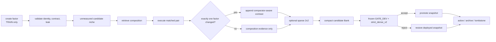

# PIF-Bank：Paired Interventional Factor Bank（成对干预因子库）

- **日期**：2026-07-14
- **Method ID**：`pif_bank_v0`
- **状态**：研究设计提案；尚未实现，尚未获得实验验证
- **审核基线**：`8725c59c9f6cbc2bb3b17ea2b041b07bc3f7e61a`
- **当前分支**：`codex/queenbee-clean-structure`
- **适用范围**：`exp-graph` SkillBank、`masbench` self-evolution 与冻结评测流程
- **来源**：对话“代码审计与方法建议”（conversation id
  `6a56415e-3620-83ea-9368-673372aa7cf9`）中最终方法的工程化整理
- **文档角色**：跨包方法档案、实现契约草案、实验预注册输入；不是实现说明或结果报告
- **默认行为**：本文不修改代码；未来实现必须 default-off、feature-off compatible

> **重要边界**：本文中的 schema、算法、默认阈值和文件修改均是提案。
> 除非明确标记为“当前代码事实”，不得把本文描述当成仓库已经实现的行为，
> 也不得把预期收益写成实验结论。

## 0. Agent 阅读约定

本文面向后续执行代码审计、实现、实验设计或方法比较的 agent。为避免把审计事实、
推断和设计混在一起，全文使用三种标签：

- **【当前代码事实】**：能在审核基线的代码或测试中直接定位；
- **【审计推断】**：由当前数据结构或控制流推导出的风险，尚未被实验确认；
- **【提案】**：PIF-Bank 新增的对象、约束、算法或阈值。

规范性词语的含义：

- **MUST / 必须**：违反后不再是本文定义的 PIF-Bank，或会破坏评测诚实性；
- **SHOULD / 应该**：默认工程选择，可以在记录理由后调整；
- **MAY / 可以**：可选增强项，不影响最小方法身份。

如果时间有限，按以下顺序阅读：

1. 第 1 节的三种基本单位；
2. 第 4 节的成对干预定义；
3. 第 7 节的信用分配规则；
4. 第 12 节的最小实现路径；
5. 第 13–15 节的实验、证伪与停止标准。

长文导航：

- [当前 QueenBee 基线](#2-当前-queenbee-基线已经有什么真正缺什么)
- [成对干预协议](#4-合法的成对干预协议)
- [Schema 与对象](#5-bank-中的新对象)
- [信用分配](#7-信用分配从-whole-card-score-到-comparator-aware-contrast)
- [Mode-specific binder](#9-mode-specific-factorization-contract)
- [Split 与泄漏](#10-train--gate_dev--final_val--test-与泄漏合同)
- [实现地图](#12-分阶段实现设计)
- [训练循环](#13-训练循环伪代码)
- [实验与消融](#14-实验与消融设计)
- [停止标准](#15-可证伪预测失败解释与停止标准)
- [Open decisions](#163-编码前必须锁定的-open-decisions)

---

## 1. 方法决策摘要

### 1.1 一句话核心思想

**【提案】** 把可部署的完整 `SkillCard` 拆成独立版本化的
`ExecutableFactor`、`ReasoningPolicyFactor` 和 scoped `ConstraintFactor`，只在相同
`(case_id, seed)`、其他条件完全不变且恰好替换一个 factor 时给该 factor
直接信用；对少数高价值 executable-policy pair 使用完整 2×2 matched design
估计交互，再从 contract-scoped、容量有界且受 exposure 控制的 niches 中检索
已经验证过的 `SkillComposition`。

### 1.2 三种基本单位

PIF-Bank 必须把“运行什么”“给谁记账”“接受哪份状态”分开：

| 层级 | 单位 | 职责 | 禁止的混淆 |
|---|---|---|---|
| 部署单位 | `SkillComposition` + frozen selector treatment | composition 组合 executable、reasoning policy 与 runtime guards；selector 绑定 selection constraints，形成一次可运行决策 | 不能因单个 factor 分数高就未经验证直接部署任意组合，也不能把 selection rule 假装成 runtime factor |
| 信用单位 | 明确 `from -> to` 的 `FactorContrast`，或完整 2×2 的 `InteractionContrast` | 保存有 comparator 的局部直接效应或交互效应 | 不能把整个 composition 的收益平均分给所有成员，也不能把 factor 当成脱离 comparator 的绝对分数 |
| 准入单位 | frozen candidate Bank snapshot | 用 GATE_DEV 筛选、再用 one-shot FINAL_VAL `strict_dense_v2` 决定是否替换正式 deployed Bank | 不能用检索 scalar 或局部 contrast 绕过 dense gate |

这三个单位是方法的最小定义。若实现仍以整张卡给所有组件共同记账，或让 factor
effect estimate 直接绕过 Bank gate，它只是字段重构，不是 PIF-Bank。

### 1.3 要解决的根本问题

**【当前代码事实】** `SkillCard` 已经分别保存 `mode_payload`、
`organization_policy` 和 `reasoning_policy`，但主要检索、合并、证据、消融和压缩
仍围绕整张 card、topology identity 或完整 Python source identity 运作。

**【审计推断】** 当一次候选同时改变 executable、reasoning policy、instructions、
failure constraints 或 exposed insights 时，当前 outcome 无法回答：

```text
收益来自 executable，还是 reasoning policy？
失败来自程序结构，还是提交/合并策略？
同一 policy 是否只能与某个 topology 配合？
相同 topology 的 policy variants 是否被等价去重过早合并？
高证据老 Skill 是否因反复曝光形成自强化检索垄断？
```

PIF-Bank 的核心假设是：这些问题足以造成错误信用、过早收敛和 niche 遗忘，且可以
通过低阶受控干预在有限预算内被测量。第 14–15 节给出会推翻这一假设的条件。

### 1.4 本方法不是什么

PIF-Bank：

- 不是新的 GraphGen、PhaseProgram 或 PythonGen；
- 不是“向量检索 + 反思 + 多跑几轮”；
- 不是把 AFlow、ADAS、AlphaEvolve 的完整工作流搜索机械拼接；
- 不是对所有任务都成立的通用因果模型；
- 不是把 `FailureCluster` 自动解释成根因；
- 不是把所有 factor 做全笛卡尔积；
- 不是用一个综合 reward 取代 `V/K/U/P/S/stage_score/C/D`；
- 不是对当前实验报告或 preregistration 的结论性改写。

---

## 2. 当前 QueenBee 基线：已经有什么，真正缺什么

### 2.1 已有的 typed executable 与 hard silos

**【当前代码事实】**
[`schemas.py`](../../../exp-graph/src/exp_graph/mas/schemas.py) 中的
`ModeSkillPayload` 已经区分：

| 当前 payload | 可执行真源 |
|---|---|
| `NamedTopologySkillPayload` | 具名 topology 与 schema-validated、可执行的 `protocol_spec` |
| `PaperTransportSkillPayload` | `p2p`、`broadcast`、`sfs` transport identity |
| `GraphSkillPayload` | free GraphGen 的 graph、schedule 与可选 topology program |
| `PhaseProgramSkillPayload` | `phase_program_v1`、compiled spec、program hash |
| `PythonSkillPayload` | 完整 `source_code`、source hash、AST/执行 contract、mutation provenance |

`PlannerMode` 当前为 `topology_select | operator_compose | graph_generate |
program_generate | python_generate`。一个容易误写的细节是：
`PaperTransportSkillPayload.planner_mode == "paper_protocol"` 是 payload/runtime
专属标记，**不在** `PlannerMode` literal 中。后续实现不能在未修改 schema 和路由前，
假装 `paper_protocol` 已是普通 planner mode。

**【当前代码事实】**
[`SkillBank.retrieve`](../../../exp-graph/src/exp_graph/mas/skill_bank.py) 已按
`task_family`、objective、`information_goal`、provenance、generated planner mode、Python
`worker_contract`、agent 范围、array size 和 topology allowlist 进行硬过滤，之后才按
特异性和悲观损失排序。Graph、PhaseProgram、Python 的 selectable payload 与 provenance
也有独立检查。

这里不是完全对称的 universal mode silo：当前 mode matcher 对非
`graph_generate/program_generate/python_generate` 请求较宽松，GraphGen 在没有 provenance
allowlist 的兼容路径也可接收 named/source-less anchor；
`retrieve_generation_context()` 还会有意忽略 mode/provenance 兼容性来提供 context-only
reference。PIF 必须把“可执行 retrieval”与“仅作灵感的 sanitized context”分开：后者可以跨
部分 mode 提示模型，但绝不能直接执行或获得跨 namespace direct credit。

因此 PIF-Bank **必须继承并补强 executable hard silos，不能用 embedding 相似度软化这些
contract**。

### 2.2 当前 `SkillCard` 已经保存的知识

**【当前代码事实】** `SkillCard` 已包含：

```text
mode_payload
organization_policy
reasoning_policy
expected_tradeoff / expected_dynamics
design_insights / risk_notes / failure_modes
evidence / evidence_refs
counterexamples / hypotheses
confidence / revision_history / validation_plan
provenance / information_goal / tags
```

所以“新增 `reasoning_policy` 字段”“新增 failure memory”或“记录 evidence”都不是
PIF-Bank 的创新。真正新增的是这些部分拥有独立 identity、版本、evidence、contrast、
mutation 和生命周期。

### 2.3 当前 lifecycle 与压缩

**【当前代码事实】** 当前 Bank 能够：

- 由 aggregate rows 和 minister patch 创建或更新 `SkillCard`；
- 执行 `add | merge | discard | deprecate`；
- 检索 positive、avoid 与 opt-in reference context；
- 对等价 topology 合并 evidence、risks、failures 和 counterexamples；
- 提供独立 `compact_skill_bank`/CLI 能力，可按 condition bucket 保留有限数量的可选卡，
  默认 `max_per_condition=3`；正常 `run_evolution` 并不会自动调用该 compaction；
- 把 non-selectable、duplicate 或 bucket 外的卡标记为 archived。

[`_skill_equivalence_key`](../../../exp-graph/src/exp_graph/mas/skill_bank.py)
以 `information_goal + topology hash` 为主。它能阻止 `sink` 和 `all_agents` 合并，
但没有把独立 `reasoning_policy` identity 纳入 composition identity；当前 topology
equivalence fingerprint 主要编码时序边与 sink，不编码 instructions、operators 或 reasoning
policy。

另一个边界是当前 compaction condition bucket 主要由 task family、objective、agent bucket
和 array bucket 构成，并不完整包含 goal/mode/worker contract；另一路
`merge_structural_duplicates` 也主要按结构 identity 分组。典型 evolution run 通常用单 goal
输入降低了实际串库概率，但 helper 自身并未提供 PIF 所需的完整 execution namespace。

**【审计推断】** 相同 topology、不同 reasoning policy 的 variants 可能在检索去重或
compaction 中被视作一个结构代表，从而失去 policy-level competition。本文把这视为
待证伪风险，不宣称当前实验已经证明退化。

### 2.4 当前探索、失败与 gate

**【当前代码事实】** 当前代码已有：

- hot-start `reuse`、Python `mutate` 与 fresh/`innovation` 分支；
- Python `EVOLVE-BLOCK` 的 parent-aware 局部 mutation；初始 patch 改一个 block，但后续 repair
  可能继续应用单-block patch，因此 direct-credit 判定必须比较最终 materialized revisions，
  不能只信 branch label；
- answer-free `FailureRecord` 和按 mode/goal/contract/stage/type/structure 聚合的
  `FailureCluster`；
- whole executable/topology identity paired ablation（Python 用完整 source SHA，否则用 topology
  identity），不是内部 factor intervention；
- 明确标记为 `paired_association_not_causal` 的 insight association；
- 完全相同 `(case_id, seed)` key 上运行的 `strict_dense_v2`；
- algorithm / infrastructure / harness failure 的不同处理语义。

这些 v2 行为并非全部默认开启：当前默认仍是 `legacy_non_regression` 与 `legacy_drop`；
`strict_dense_v2` 和 honest failure policy 需要显式启用。PIF 的实验合同要求显式启用并记录
这些策略，不能把“代码中存在”写成“所有默认运行都在使用”。

注意当前 row 中 branch 名可能是 `innovation`，报告时才映射为 `fresh`。实现 PIF 时应在
持久化 schema 中统一 canonical label，同时为旧 row 保留兼容映射。

### 2.5 当前 dense outcome

**【当前代码事实】** 当前进化信号按以下顺序构造：

```text
V < 1  -> stage_score = 0
K < 1  -> stage_score = 0.2 * K
U < 1  -> stage_score = 0.2 + 0.2 * U
P < 1  -> stage_score = 0.4 + 0.5 * P
else   -> stage_score = 0.9 + 0.1 * S
```

其中 `all_agents` 的 `K` 使用最差 Agent 的 coverage，`U/P/S` 保留每 Agent 的提交、
partial 与 exact 信息；`sink` 使用 sink Agent 的对应信号。`C/D` 保持为成本维度和 gate
tie-break，不被 stage scalar 吞掉。

[`evaluate_strict_dense_gate`](../../../masbench/src/masbench/gates.py) 当前检查：

```text
algorithm failure rate 不上升
mean V 不下降
minimum K 不下降
mean U 不下降
mean P 在显式容差内不下降
paired stage_score bootstrap CI 下界不为负
```

只有质量改善，或质量完全相同且 `C/D` 不更差并至少一项更低，candidate 才被接受。

### 2.6 缺口矩阵

| 能力 | 当前 QueenBee | PIF-Bank 新增 |
|---|---|---|
| Typed executable payload | 已有 | 复用，不改成通用 dict |
| Goal/mode/contract/provenance silo | generated-mode 路径较强，但 matcher、reference context 与部分 compaction helper 并非完全对称 | 提升为 executable retrieval 的完整 execution namespace；context-only inspiration 另行标记 |
| `reasoning_policy` 字段 | 已有 | 独立 ID、版本、检索、mutation、contrast、淘汰 |
| Whole-skill paired ablation | 已有 | comparator-aware exact-one-factor matched intervention |
| Insight association | 已有，明确非因果 | 只对实际采用并被单独替换的 factor 记 direct credit |
| Failure clustering | 已有 | cluster 可产生 constraint candidate，但仍不自动宣称根因 |
| Bounded compaction | 有独立 compaction 工具；正常 evolution path 不自动保证 Bank 有界 | factor/composition/niche 局部与全局容量、自动 lifecycle 与 tombstone |
| Dense paired gate | 已有 | 继续作为 Bank snapshot admission oracle |
| Executable × policy interaction | 无 | 稀疏完整 2×2 `InteractionContrast` |
| Exposure audit/control | 未见通用机制 | rolling share、HHI/Gini、safe exploration quota |
| TEST Bank immutable hash | 控制流冻结，但未见强 hash contract | pre/post canonical hash 与只读 facade |

---

## 3. 方法形式化

### 3.1 Composition 与上下文

**【提案】** 一个部署方案表示为：

\[
c=(e,r,G)
\]

其中：

- \(e\) 是 `ExecutableFactor`；
- \(r\) 是 `ReasoningPolicyFactor`；
- \(G\) 是零个或多个会随 composition materialize 的 runtime-guard
  `ConstraintFactor`；selection constraints 属于 selector treatment，不属于 \(c\)；
- \(x\) 是不含答案的 context bucket；
- \(s\) 是执行 seed。

执行输出为完整向量：

\[
Y(c,x,s)=(V,K,U,P,S,stage,C,D,F)
\]

其中 \(F\) 是 failure class/stage/signature，而不是可被 scalar 隐藏的惩罚项。

### 3.2 Context bucket 的最小组成

**【提案】** effect estimate 和检索至少按以下硬 namespace 分开：

```text
task_family
information_goal
planner_mode 或 payload runtime family
python worker_contract（若适用）
objective
agent-count bucket
array-size bucket（若适用）
task-feature bucket
budget bucket
runtime/model/compiler/binder config hash
```

`sink` 与 `all_agents` 不共享 direct contrast、interaction 或 constraint。不同 Python
worker contract 不共享。跨 task family 只能使用显式 transfer prior，不能直接 active。这里
`budget` 是 PIF context 的新增设计维度，不是当前 `SkillBank.retrieve` 已有的硬过滤项。

### 3.3 可识别的三种局部 contrast

**直接 executable contrast：**

\[
\Delta_e=Y(e_1,r_0,G,x,s)-Y(e_0,r_0,G,x,s)
\]

**直接 reasoning-policy contrast：**

\[
\Delta_r=Y(e_0,r_1,G,x,s)-Y(e_0,r_0,G,x,s)
\]

**executable-policy interaction contrast：**

\[
I_{e,r}=
[Y(e_1,r_1)-Y(e_0,r_1)]-[Y(e_1,r_0)-Y(e_0,r_0)]
\]

每个差值必须来自同一 case、seed、model config、runtime config 和其他 factors。

### 3.4 因果主张边界

PIF 的“interventional”只表示：在预注册实验单元中，由 host 保持可观察配置不变并替换
一个 factor。它估计的是特定 task bucket、模型、runtime 和 candidate neighborhood 内的
局部 matched effect，不是以下主张：

- factor 对任意任务具有普遍因果效果；
- LLM provider 完全确定；
- 未观察混杂已经全部消失；
- 两两 interaction 足以解释所有 composition；
- `FailureCluster` 已识别根因。

若 provider 不保证 seed-level determinism，必须随机化 AB/BA 顺序并测量重复 base 的时间
噪声；不能因为 key 相同就宣称一次差值是无噪声反事实。

---

## 4. 合法的成对干预协议

### 4.1 Direct-credit 必要条件

**【提案，MUST】** 一条 evidence 只有同时满足以下不变量，才能追加单 factor contrast：

```text
相同 case_id
相同 seed
相同 task split
相同 model/provider/temperature 配置
相同 execution budget、timeout、retry policy
相同 information_goal、planner/runtime family、worker contract
相同非目标 factors
base 与 candidate 恰好一个 factor identity 不同
两侧均经过同一 validator/compiler/sandbox
```

任何同时改变两个或更多 factor 的候选都标记为 `changed_factor_type="multiple"`，只更新
composition-level evidence。即使它获胜，也不能给内部每个新 factor 各记一次 win。

Pair builder 还必须拒绝重复 evaluation-unit key。当前 `strict_dense_v2` 将 rows 收进
`(case_id, seed)` dict，重复 key 会覆盖；PIF validator 应在进入 gate 前显式断言每个 arm
对每个 unit 恰好一条记录，而不是依赖覆盖后的集合相等。

### 4.2 执行顺序与 base cache

**【提案】** 每个 pair 随机执行 `AB` 或 `BA`，顺序写入 evidence。

只有满足下列条件时，base result 才可在同一 pairing batch 内缓存复用：

```text
temperature == 0
provider 明确支持 deterministic seed
model_config_sha256 完全一致
runtime_config_sha256 完全一致
输入和 materialized composition hash 完全一致
```

否则每个 candidate 都运行自己的 matched base，并对建议 20% 的 pairs 重复 base，以估计
temporal/provider noise。缓存命中必须记录，不能把复用结果伪装成独立样本。

### 4.3 三类失败

**【提案，继承当前语义】**

| 失败发生位置 | 持久化对象 | 是否更新 runtime direct contrast |
|---|---|---|
| LLM 输出尚未形成 typed revision：parse/schema failure | `ProposalAttemptEvidence`，保留 proposal/repair cost 与错误类型 | 否；还没有可识别 factor revision |
| 已有 typed revision，但 bind/compile/AST/contract validation 失败 | `CandidateValidationEvidence`，作为 compatibility/validity 负证据 | 否；没有 materialized runtime outcome |
| materialized artifact 在 runtime 发生 algorithm failure | `DenseOutcome(V=K=U=P=S=stage=0)`，保留已消耗 `C/D/tokens` | 是；若 pair 其他条件完整，可形成真实负面 contrast |
| infrastructure failure | arm/pair 标 incomplete，可按对称规则重试或移除 | 否 |
| harness/unknown host failure | 中止 replicate，保留外部审计 | 禁止转成训练 evidence |

base runtime algorithm failure 而 candidate 成功同样是有效差值；两侧都因同一基础设施故障
失败则不是算法证据。proposal/binding failure 仍会影响 proposal-validity 与成本报告，但不能
伪造一个不存在的 composition/artifact hash。

### 4.4 Constraint 干预的特殊处理

`ConstraintFactor` 通常改变“从固定候选集合中选谁”，而不是改变同一个 executable 的
运行语义。若把它和 executable swap 混在一起，会重新引入 selection confounding。

**【提案，MUST】** constraint direct test 必须使用固定 candidate slate、固定排序前统计和
相同 request，比较“应用 constraint 前后选择结果”的 paired downstream outcome；或者把
constraint 实现为明确的 runtime guard，并证明它是唯一变化。未满足这一条件时，只能把
constraint 记为 observational safety rule，不能进入 direct contrast。

---

## 5. Bank 中的新对象

以下为 Pydantic-like 设计草案。字段名可以在实现审查时调整，但 identity、hard namespace、
typed payload 和 evidence-strength 边界不得消失。

### 5.0 基础类型与 factor-payload 边界

```python
class ExecutionNamespace(BaseModel):
    task_family: str
    information_goal: InformationGoal
    execution_mode: str  # includes runtime-only families such as paper_protocol
    worker_contract: PythonWorkerContract | None


class EvaluationContext(BaseModel):
    execution_namespace: ExecutionNamespace
    objective: ObjectiveName
    budget_bucket: str
    agent_count_bucket: str
    array_size_bucket: str | None
    task_feature_bucket: str
    model_config_sha256: str
    runtime_config_sha256: str
    compiler_binder_sha256: str


class DenseOutcome(BaseModel):
    V: float
    K: float
    U: float
    P: float
    S: float
    stage_score: float
    C: float
    D: float
    algorithm_failure: bool
    failure_stage: str | None
    failure_signature: str | None


class DenseOutcomeDelta(BaseModel):
    delta_V: float
    delta_K: float
    delta_U: float
    delta_P: float
    delta_S: float
    delta_stage_score: float
    delta_C: float
    delta_D: float
    algorithm_failure_delta: float


class ExtractedFactors(BaseModel):
    executable: ExecutableFactor
    policy: ReasoningPolicyFactor | None
    runtime_guards: list[ConstraintFactor]
    extraction_audit_sha256: str


class LockedAtomicComposition(BaseModel):
    legacy_skill_sha256: str
    materialized_payload: ModeSkillPayload
    why_locked: str


class MaterializedArtifact(BaseModel):
    payload: ModeSkillPayload
    binder_version: str
    artifact_sha256: str
    execution_namespace: ExecutionNamespace


class BindingAudit(BaseModel):
    round_trip_ok: bool
    schema_valid: bool
    semantic_probe_equal: bool
    original_sha256: str
    materialized_sha256: str
    reasons: list[str]


class BankSnapshot(BaseModel):
    role: Literal["candidate", "deployed"]
    factor_revision_ids: list[str]
    composition_revision_ids: list[str]
    selector_treatment_revision_id: str
    binder_versions: dict[str, str]
    niche_ontology_version: str
    canonical_snapshot_sha256: str


class SelectorTreatment(BaseModel):
    treatment_revision_id: str
    selection_constraint_revision_ids: list[str]
    deterministic_tie_break: str
    selector_config: dict[str, object]
    selector_config_sha256: str
```

candidate 与 deployed snapshot 的差别由 `role` 和明确 composition allowlist 表达；snapshot
hash 必须覆盖 selector treatment、binder versions、niche ontology 和 registry membership。
selection constraint 的变化创建新 `SelectorTreatment` revision，不能藏在可变 runtime state。

当前 `ModeSkillPayload` 是**完整可执行 artifact**，其中 Graph/Phase payload 仍可能同时包含
结构与 instructions/policy。因此它不能直接充当已拆分的 structure-only factor payload。
PIF 必须新增另一组 mode-specific、discriminated factor payload：

```python
class NamedTopologyFactorPayload(BaseModel): ...       # usually locked
class PaperTransportFactorPayload(BaseModel): ...      # dynamic transport, locked first
class GraphStructureFactorPayload(BaseModel): ...      # structure/skeleton only
class PhaseStructureFactorPayload(BaseModel): ...      # phases/participants/flow slots only
class PythonSourceFactorPayload(BaseModel): ...         # atomic source or explicit policy slots

ExecutableFactorPayload = Annotated[
    NamedTopologyFactorPayload
    | PaperTransportFactorPayload
    | GraphStructureFactorPayload
    | PhaseStructureFactorPayload
    | PythonSourceFactorPayload,
    Field(discriminator="format"),
]
```

这些 payload 仍是**各 mode 独立类型**，不是共享自由 dict。binder 的输出才是当前
`ModeSkillPayload`。对于尚无真实 factor surface 的旧卡，使用 `LockedAtomicComposition`，
不得把完整 `ModeSkillPayload` 伪装成 structure-only factor。

共同不变量：Graph/Phase structure payload 可以声明 typed policy slots，但不能保存已绑定的
instruction/submit/merge policy 值；Python atomic-source payload 必须显式声明
`policy_slots=[]`，只有 template + slot schema 经过 AST round-trip 后才允许非空 slots。各类型的
精确字段属于 Phase 0 决策，不能用一个 `dict[str, Any]` 先绕过该审计。

### 5.1 `ExecutableFactor`

```python
class ExecutableFactor(BaseModel):
    factor_id: str
    factor_revision_id: str
    factor_version: int
    kind: Literal[
        "named_topology",
        "paper_transport",
        "graph_spec",
        "phase_program",
        "python_source",
    ]

    task_family: str
    information_goal: InformationGoal
    planner_mode: PlannerMode | None
    runtime_family: str
    worker_contract: PythonWorkerContract | None

    payload: ExecutableFactorPayload
    payload_sha256: str
    compatibility_sha256: str

    provenance: str
    parent_factor_revision_ids: list[str]
    created_from: Literal["TRAIN", "MIGRATED"]
    leak_audit_sha256: str
```

设计约束：

- factor `payload` 必须使用新的 mode-specific discriminated union；binder output 继续使用当前
  `ModeSkillPayload`；
- Graph、PhaseProgram、Python 不得退化为共享无类型 dict；
- `paper_transport` 使用显式 `runtime_family="paper_protocol"`，避免伪造 PlannerMode；
- Python 的 identity 包含 `worker_contract`、AST policy 和 execution contract compatibility；
- exact payload hash 相同可去重，行为相似但 payload 不同不能只凭 LLM 判断合并。

### 5.2 `ReasoningPolicyFactor`

```python
class ReasoningPolicyFactor(BaseModel):
    policy_id: str
    policy_revision_id: str
    policy_version: int

    task_family: str
    information_goal: InformationGoal
    compatible_modes: list[PlannerMode]
    compatible_runtime_families: list[str]
    compatible_executable_kinds: list[str]
    compatible_worker_contracts: list[PythonWorkerContract]

    policy_family: str
    policy: dict[str, object]
    policy_sha256: str
    materializer_version: str

    parent_policy_revision_ids: list[str]
    portability: Literal[
        "local_only",
        "same_family",
        "cross_family_context_only",
    ]
    created_from: Literal["TRAIN", "MIGRATED"]
    leak_audit_sha256: str
```

它可以描述 role allocation、message instruction、merge、dedup、conflict handling、state
retention、coverage completion、submit 与 stop policy；不能保存完整 Python source、case
答案、ground truth、expected output、private prompt 或完整 benchmark instance。

最重要的工程前提是存在**确定性的 policy materializer**：给定 executable 与 policy，host
能生成唯一、可 hash、可验证的 runtime configuration。若某模式中 policy 只存在于一段
不可分的 source 或模型自由文本里，就不能声称已经完成 factorization；该模式先标记
`locked_atomic`。

### 5.3 `ConstraintFactor`

```python
class ConstraintFactor(BaseModel):
    constraint_id: str
    constraint_revision_id: str
    constraint_version: int

    task_family: str
    information_goal: InformationGoal
    planner_mode: PlannerMode | None
    runtime_family: str
    worker_contract: PythonWorkerContract | None

    predicate: dict[str, object]
    structural_signature: str
    scope: Literal["runtime_guard", "selection"]
    action: Literal["advisory", "avoid", "block"]
    applies_to_factor_revision_ids: list[str]
    failure_cluster_id: str | None

    created_from: Literal["TRAIN", "MIGRATED"]
```

`FailureCluster` 可以生成 constraint candidate，但初始强度只能是 `observational`。
只有第 4.4 节的固定 slate 或 runtime-guard 实验才能提升为 paired evidence。

### 5.4 `SkillComposition`

```python
class SkillComposition(BaseModel):
    composition_id: str
    composition_revision_id: str
    executable_factor_revision_id: str
    reasoning_policy_factor_revision_id: str | None
    runtime_constraint_factor_revision_ids: list[str]

    task_family: str
    information_goal: InformationGoal
    planner_mode: PlannerMode | None
    runtime_family: str
    worker_contract: PythonWorkerContract | None

    binder_id: str
    binder_version: str
    materialized_artifact_sha256: str
    parent_composition_revision_ids: list[str]
    branch: Literal["reuse", "mutate", "fresh", "fixed", "migrated"]
```

所有被 evidence 引用的 factor revision 都是 immutable、content-addressed 对象。mutation
必须创建新 revision，禁止原地修改 payload。applicability、evidence、niche 和 lifecycle
全部属于 registry metadata，不进入 revision 内容 hash；状态变化不能改变 evidence 指向的
历史对象。

Identity 约定：`factor_id/policy_id/constraint_id/composition_id` 是稳定 lineage ID；
`*_revision_id` 是 canonical JSON（schema version、hard namespace、kind、content payload、
compatibility/binder fields）的 SHA-256；整数 `version` 只供人类排序，不参与等价判断。parent
revision IDs 记录 lineage，但是否进入 content hash 必须统一预注册，不能在不同 writer 中变化。

`composition_revision_id` 必须由 hard namespace、factor revision IDs、排序后的 runtime-guard
constraint revision IDs
与 `binder_id/binder_version` 规范化计算。因此：

```text
相同 topology + 不同 reasoning policy = 不同 composition
相同 composition 字段 + 不同 worker contract = 不同 composition
只改 runtime guard = 新 composition；只改 selection constraint = 新 selector treatment
```

### 5.5 Evidence、contrast 与 estimate

`observational_only` 是 PIF 新增的 evidence-strength 语义；当前 `EvidenceStatus` 只有
`observed | placeholder | deprecated`，不能把两者混用或在迁移时假装现有枚举已经表达
component-level identification。

```python
class ProposalAttemptEvidence(BaseModel):
    attempt_id: str
    split: Literal["TRAIN"]
    base_composition_revision_id: str
    target_factor_kind: str
    response_sha256: str
    failure_stage: Literal["parse", "schema"]
    error_signature: str
    proposal_tokens: int
    repair_attempts: int


class CandidateValidationEvidence(BaseModel):
    validation_id: str
    split: Literal["TRAIN"]
    base_composition_revision_id: str
    candidate_factor_revision_id: str
    failure_stage: Literal["bind", "compile", "ast", "contract"]
    error_signature: str
    incurred_tokens: int
    binder_version: str


class CompositionObservation(BaseModel):
    observation_id: str
    split: Literal["TRAIN"]
    composition_revision_id: str
    case_id_hash: str
    seed: int
    execution_status: Literal[
        "completed",
        "algorithm_failure",
        "infrastructure_failure",
    ]
    outcome: DenseOutcome | None
    cache_group_id: str | None
    model_config_sha256: str
    runtime_config_sha256: str


class InterventionEvidence(BaseModel):
    evidence_id: str
    evidence_strength: Literal[
        "observational_only",
        "paired_direct",
    ]
    split: Literal["TRAIN"]

    pair_id: str
    case_id_hash: str
    seed: int
    order: Literal["AB", "BA"]

    base_composition_revision_id: str
    candidate_composition_revision_id: str
    changed_factor_type: Literal[
        "executable",
        "reasoning_policy",
        "runtime_constraint",
        "multiple",
    ]
    changed_from_revision_id: str | None
    changed_to_revision_id: str | None

    base_observation_id: str
    candidate_observation_id: str
    base_status: Literal[
        "completed", "algorithm_failure", "infrastructure_failure"
    ]
    candidate_status: Literal[
        "completed", "algorithm_failure", "infrastructure_failure"
    ]
    before: DenseOutcome | None
    after: DenseOutcome | None
    delta: DenseOutcomeDelta | None
    complete_pair: bool

    infrastructure_failure: bool
    harness_failure: bool
    base_cache_hit: bool
    cache_group_id: str | None
    model_config_sha256: str
    runtime_config_sha256: str
```

```python
class InteractionBlockEvidence(BaseModel):
    block_id: str
    split: Literal["TRAIN"]
    case_id_hash: str
    seed: int

    executable_0_revision_id: str
    executable_1_revision_id: str
    policy_0_revision_id: str
    policy_1_revision_id: str
    fixed_runtime_guard_revision_ids: list[str]

    composition_00_revision_id: str
    composition_10_revision_id: str
    composition_01_revision_id: str
    composition_11_revision_id: str
    cell_00: DenseOutcome
    cell_10: DenseOutcome
    cell_01: DenseOutcome
    cell_11: DenseOutcome
    randomized_cell_order: tuple[str, str, str, str]

    model_config_sha256: str
    runtime_config_sha256: str
    binder_version: str
    complete: Literal[True]


class SnapshotGateEvidence(BaseModel):
    split: Literal["GATE_DEV", "FINAL_VAL"]
    incumbent_snapshot_sha256: str
    candidate_snapshot_sha256: str
    manifest_sha256: str
    paired_dense_rows_sha256: str
    gate_result: dict[str, object]


class SelectorInterventionEvidence(BaseModel):
    evidence_id: str
    split: Literal["TRAIN"]
    query_manifest_sha256: str
    fixed_candidate_slate_sha256: str
    selector_treatment_0_revision_id: str
    selector_treatment_1_revision_id: str
    selected_compositions_0_sha256: str
    selected_compositions_1_sha256: str
    downstream_outcomes_0_sha256: str
    downstream_outcomes_1_sha256: str
```

```python
class FactorContrast(BaseModel):
    from_factor_revision_id: str
    to_factor_revision_id: str
    fixed_factor_revision_ids: list[str]
    fixed_composition_context_sha256: str
    binder_version: str
    context_bucket: str
    evaluation_context_sha256: str
    n_distinct_cases: int
    n_pairs: int
    mean_delta: DenseOutcomeDelta
    count_unit: Literal["distinct_case"]
    tie_epsilon: float
    wins: int
    losses: int
    ties: int
    algorithm_failure_delta: float
    metric_case_clustered_ci_95: dict[str, tuple[float, float]]
    n_cache_groups: int
    last_updated_round: int


class CompositionEstimate(BaseModel):
    composition_revision_id: str
    context_bucket: str
    evaluation_context_sha256: str
    n_observations: int
    n_distinct_cases: int
    metric_means: dict[str, float]
    algorithm_failure_rate: float
    metric_case_clustered_ci_95: dict[str, tuple[float, float]]


class InteractionContrast(BaseModel):
    executable_0_revision_id: str
    executable_1_revision_id: str
    policy_0_revision_id: str
    policy_1_revision_id: str
    fixed_runtime_guard_revision_ids: list[str]
    binder_version: str
    context_bucket: str
    evaluation_context_sha256: str
    n_complete_2x2_blocks: int
    n_distinct_cases: int
    metric_diff_in_diff: dict[str, float]
    metric_case_clustered_ci_95: dict[str, tuple[float, float]]
```

这里刻意不把直接信用命名为“某 factor 的 posterior”。`e0 -> e1` 与 `e2 -> e1`
是不同局部 contrast，不能无条件汇总成 `e1` 的绝对价值。只有未来显式定义 comparison
graph、先验、似然与可加性假设后，才可以从 contrast ledger 拟合全局 utility/posterior；
最小 PIF 实现不需要这一步。

GATE_DEV/FINAL_VAL 只进入独立 `SnapshotGateEvidence` audit ledger，**MUST NOT** 回写 TRAIN
effect estimate。TEST evidence 连 Bank schema 都不接受。四格 interaction 不能塞进两臂
`InterventionEvidence`；必须使用完整 `InteractionBlockEvidence`。

`CompositionObservation` 是 reuse 的默认单臂记录。只有显式 noise-calibration 才把同一
composition 运行两次；这种重复不产生 factor contrast。infrastructure-incomplete arm 的 outcome
可以为 `None`，只有 `complete_pair=True` 且两侧均有 algorithm-level outcome 时才构造 delta。
共享 cached base 的 pairs 通过 `cache_group_id` 聚类，bootstrap 不能把它们当独立对照。

### 5.6 Registry state：证据、候选资格与部署资格分离

immutable revision 不能同时承载会变化的 applicability、niche、evidence 和 state。PIF 使用
context-keyed registry entries：

```python
FactorEvidenceState = Literal[
    "unmeasured",
    "measured",
    "unsafe",
]

DeploymentState = Literal[
    "inactive",
    "active",
    "suppressed",
    "archived",
    "tombstoned",
]


class FactorRegistryEntry(BaseModel):
    factor_revision_id: str
    execution_namespace: ExecutionNamespace
    context_bucket: str
    min_agents: int | None
    max_agents: int | None
    task_feature_buckets: list[str]
    niche_key: str

    evidence_state: FactorEvidenceState
    candidate_eligible: bool
    deployed_state: DeploymentState
    transfer_probation: bool
    evidence_refs: list[str]


class CompositionRegistryEntry(BaseModel):
    composition_revision_id: str
    execution_namespace: ExecutionNamespace
    context_bucket: str
    niche_key: str

    candidate_eligible: bool
    deployed_state: DeploymentState
    observation_refs: list[str]
```

三种资格不能循环定义：

1. TRAIN validation 与最小 evidence 使一个 revision/composition `candidate_eligible=True`；
2. **candidate snapshot selector 可以显式选择 candidate-eligible、尚未 active 的
   compositions**，以便在 GATE_DEV/FINAL_VAL 上被评估；
3. 只有整个 candidate snapshot 通过 gate 后，其中实际准入的 composition 才进入 deployed
   snapshot 并标 `active`；
4. normal deployment/TEST selector 只选择 deployed snapshot 中的 active compositions。

一个 policy 在 Level III order-sensitive bucket 被 suppress，不代表它在所有 task buckets 都
应全局删除。`active` 也只表示“指定 context 的某个通过 gate composition 可使用”，不表示
factor 有脱离 comparator 的普遍正效应。

作为 MVP 候选，`candidate_eligible` 可要求至少 6 个 direct pairs、覆盖多个 cases、没有 hard
regression；正式实验可提高到 12 pairs。Bank gate 准入的是 snapshot，不单独证明其中每个
factor 的因果价值。数值在运行前预注册。

---

## 6. 生命周期与 branch 语义



### 6.1 `reuse`

`reuse` 直接运行已经存在的 composition。它用于 exploitation、稳定性复测、提供 matched
base 和维护 composition estimate。默认只产生一条 `CompositionObservation`，不把相同
composition 无意义地当 base/candidate 跑两次；只有显式 noise-calibration 才重复运行。因为
没有 factor 被替换，不更新 direct contrast。

### 6.2 `mutate`

`mutate` 必须先选定一个 target kind：

```text
executable mutation: (e0, r0, G0) -> (e1, r0, G0)
policy mutation:     (e0, r0, G0) -> (e0, r1, G0)
runtime guard:       (e0, r0, G0) -> (e0, r0, G1)
selection constraint: fixed candidate slate 上 selector T0 -> T1
```

Python executable mutation复用当前 `EVOLVE-BLOCK` host verification；PIF 新增的限制是同一
mutation 不得同时改变独立 policy factor。Graph 或 PhaseProgram 若一次修改多个结构 block，
它仍是一个 executable factor 的新版本，只要 policy 和 constraints 不变；但应该额外记录
内部 edit scope，便于未来更细粒度研究。

### 6.3 `fresh`

`fresh` 必须明确是 `fresh_executable` 或 `fresh_reasoning_policy`。模型若一次返回全新
executable 和全新 policy，host 可以保留该 composition，但证据强度只能是
`observational_only/multiple`，随后必须安排单 factor follow-up 才能拆信用。

### 6.4 Gate 与 rollback

每轮结束后，先对 factor/composition/niche 做 candidate compaction，再分别冻结 incumbent
与 candidate Bank，在同一 GATE_DEV `(case_id, seed)` grid 上执行，调用当前
`strict_dense_v2`。GATE_DEV 可以影响下一轮，因此不是最终 held-out evidence。全部 rounds 完成后，
pre-registered incumbent 与 final candidate 再接受一次 one-shot FINAL_VAL gate。拒绝时正式
deployed Bank 必须字节/规范化语义等价于 before snapshot；被拒绝 candidate 可以留在独立 audit
archive，但不能悄悄参与默认 retrieval。

---

## 7. 信用分配：从 whole-card score 到 comparator-aware contrast

### 7.1 Direct contrast 账本

**【提案】** 对每个合法 direct pair，保存完整 metric delta：

```text
ΔV, ΔK, ΔU, ΔP, ΔS, Δstage_score, ΔC, ΔD
algorithm_failure_before / after
failure_stage_before / after
failure_signature_before / after
```

方向必须固定：`V/K/U/P/S/stage` 使用 `candidate - base`，正值更好；`C/D` 也保存原始
`candidate - base`，但负值才表示成本改善。schema 另存 metric direction metadata，禁止在
同一个未标方向的均值中混用质量与成本。

一条记录的 identity 至少包括：

```text
from_factor_revision_id
to_factor_revision_id
fixed_other_factor_revision_ids
context_bucket
case_id_hash
seed
model/runtime/compiler/binder hashes
```

同一个 `to` revision 相对不同 `from` revision 的效果不得直接相加。最小实现的检索和 mutation
scheduler 应优先使用与当前 incumbent 相连的 contrast；如果不存在，就把该 candidate 视为
高不确定 exploration，而不是虚构“全局 factor 分数”。

### 7.2 统计独立单位

多个 seed 嵌套在同一个 case 内，不应全部当成独立任务。每个 contrast 必报：

```text
n_pairs
n_distinct_cases
per-case mean delta
metric-wise case-clustered bootstrap CI
primary win / loss / tie by distinct case
pair-level win / loss / tie（diagnostic only）
shared-base cache group count
```

win/loss/tie 的主判断先在每个 case 内聚合，使用预注册 `tie_epsilon`；pair-level counts 只作
诊断。若多个 candidates 共用 cached base，bootstrap 还必须把同一 `cache_group_id` 视作共享
对照 block，不能把这些差值当独立样本。

`strict_dense_v2` 仍可作为 Bank-level admission oracle，但它当前不是 factor-level hierarchical
inference。PIF 实现不应把二者混称为同一个统计量。

### 7.3 Hard regression 优先于平均增益

factor 的 `Δstage_score > 0` 不能遮蔽结构性退化。建议 `safe_positive` 至少要求：

```text
algorithm failure rate 不上升
mean V 不下降
minimum K 不下降
mean U 不下降
mean P 在预注册容差内不下降
case-clustered Δstage CI 下界不低于负容差
```

`C/D` 在不同 mode 下的物理含义和尺度不完全相同：当前 dense sample 会优先使用
`paper_C/paper_D`，否则回退 token/message cost。因此它们只能在同一 hard namespace 内归一化、
做 Pareto 比较或用于明确的 tie-break，不能跨 mode 直接相加成统一 utility。

### 7.4 Composition estimate

PIF 不假设任意 composition 的质量等于 factor effects 之和。对每个真实执行过的 composition，
仍保存自己的 outcome estimate。部署优先使用已经观察并通过 gate 的 composition；factor
contrast 主要服务于：

- 选择下一次局部 mutation；
- 判断 policy 是否有独立价值；
- 受控 one-hop recombination；
- 对新 task bucket 提供带不确定性的 prior；
- 决定是否值得安排 2×2 interaction test。

未执行过的新组合保持 inactive、candidate-only，不能仅凭两个 factor 各自表现好就成为默认
deployment。

### 7.5 完整 2×2 interaction

对 executable revisions `e0/e1` 和 policy revisions `r0/r1`，同一 case/seed 执行：

```text
Y00 = Y(e0, r0)
Y10 = Y(e1, r0)
Y01 = Y(e0, r1)
Y11 = Y(e1, r1)
```

然后计算：

\[
I=(Y_{11}-Y_{01})-(Y_{10}-Y_{00})
\]

`InteractionContrast` identity 必须包含 `e0,e1,r0,r1` 四个 revision。只记录
`SynergyEdge(e1,r1)` 是不充分的，因为换一个基线 `e0/r0` 可能得到不同 interaction。

只在以下条件之一满足时调度 2×2，避免组合爆炸：

- 两个 factor 都已通过基本 validity；
- direct contrast 在不同 context 中方向冲突；
- 某 observed composition 明显偏离局部 additive prediction；
- 该 pair 高频进入 retrieval；
- interaction uncertainty 可能改变当前部署决策。

每个 factor 的 active interaction 数应该有局部上限，同时有全局上限。未完成四格的 partial
block 只能作为 audit，不得写成 interaction evidence。

### 7.6 Failure 与 insight 如何记账

`FailureRecord`/`FailureCluster` 继续负责 answer-free 失败分组。PIF 的增量是：

- 若 base 正常、candidate 失败且唯一变化为 factor `f0 -> f1`，该 contrast 获得强负证据；
- 若多 factor 同变，只更新 composition failure；
- cluster summary 可以产生 `ConstraintFactor` 候选，但默认仍是 observational；
- infrastructure failure 不改变任何 factor effect；
- harness failure 使 replicate 无效。

当前 insight association 可保留为辅助诊断，但不能初始化 direct contrast。尤其 fresh branch
中“被暴露”不等于“被采用”。只有 materialized artifact 明确引用、且 policy/executable
revision 被单独替换时，才有资格获得 paired credit。

### 7.7 Cross-task transfer

**【提案】** 使用 global prior 与 task-bucket local evidence 的分层表示，但第一版不必实现
复杂 Bayesian model。可以用预注册 shrinkage：

\[
\hat\mu_b=\frac{n_b}{n_b+\lambda}\mu_b+
\frac{\lambda}{n_b+\lambda}\mu_{global}
\]

这里 `n_b` 是 distinct-case/effective sample size，不是 seed 数或未聚类 pair 数。任何 pooling
都不得跨 `information_goal`、execution mode/runtime family 或 worker contract；所谓 global
prior 也只在这些 hard-silo 固定后对允许迁移的 task buckets 聚合。

边界如下：

- executable 默认 `task_family` scoped；
- reasoning policy 若声明 `same_family`，可设 `transfer_probation=True`；
- 跨 family policy 只能作为 sanitized context inspiration；
- constraint 默认不迁移，除非是与任务语义无关且同 mode/goal/contract 的结构规则；
- 任何 transfer 都必须在目标 bucket 的 TRAIN pairs 上建立 local contrast，并经
  GATE_DEV 与最终 snapshot gate 后才能 active。

### 7.8 Worked example（仅演示算法，不是实验结果）

假设 Level III、`all_agents`、5 Agents、order-sensitive task 的四格结果为：

| Cell | Executable | Policy | `stage_score` |
|---|---|---|---:|
| `Y00` | `E0=static_exponential` | `R0=raw concat + fixed-round submit` | 0.69 |
| `Y01` | `E0` | `R1=source-aware dedup + coverage submit` | 0.78 |
| `Y10` | `E1=one_peer_exponential_dag` | `R0` | 0.70 |
| `Y11` | `E1` | `R1` | 0.86 |

PIF 记录三个不同对象：

```text
Policy contrast under fixed E0:
  R0 -> R1 = 0.78 - 0.69 = +0.09

Executable contrast under fixed R0:
  E0 -> E1 = 0.70 - 0.69 = +0.01

Four-revision interaction:
  (0.86 - 0.78) - (0.70 - 0.69) = +0.07
```

它不会只给 `E1` 或 `R1` 一个脱离 comparator 的“+1 win”，也不会因 `C11` 最好就把
`E1/R1` 的所有后代都视为正向。若换成另一个 baseline policy，必须建立新的 contrast 或
新的四格 identity。

---

## 8. Retrieval、exploration 与容量控制

### 8.1 必须分开 TRAIN scheduler 与 frozen deployment selector

原始提案中的 rolling exposure cap 如果在 GATE_DEV/FINAL_VAL/TEST 推理过程中更新，会让 case 执行顺序改变
后续选择，并破坏冻结评测的无状态性。PIF 因此定义两个组件：

| 组件 | 使用阶段 | 是否有状态 | 目的 |
|---|---|---|---|
| `TrainingExplorationScheduler` | TRAIN | 可以维护当前 round 的 exposure | 分配探索预算，避免老 winner 吞掉所有训练机会 |
| `FrozenCandidateSelector` | GATE_DEV/FINAL_VAL | 必须无状态、确定、candidate-snapshot-bound | 可选择 snapshot 明确列出的 candidate-eligible compositions |
| `FrozenDeployedSelector` | TEST/deployment | 必须无状态、确定、deployed-snapshot-bound | 只选 active compositions，不写回 exposure 或 Bank |

如果要评估在线 exploration 策略，必须使用外部、每个 arm 重置、预注册 seed 的 scheduler，
并与 Bank 持久化状态隔离。

### 8.2 五步 retrieval

#### Step 1：hard namespace filter

当前路径可复用的过滤项是 `task_family`、objective、goal、generated-mode compatibility、
Python worker contract、topology allowlist、agent range、array size 与 payload selectability；
provenance 只有 request 提供 allowlist 时才实际过滤，reference context 另有例外。

PIF 对**可执行 retrieval**新增并强制完整 `ExecutionNamespace`、binder compatibility、显式
provenance policy，以及作为 `EvaluationContext` 的 budget bucket。budget 是新设计维度，不应
倒写成当前 `SkillBank.retrieve` 已有行为。任一 executable contract 不匹配直接排除；
context-only inspiration 走单独 sanitized 路径。

#### Step 2：binding compatibility

只有 `ModeBindingAdapter.can_bind(executable, policy)` 为真、且 materialized artifact 通过
validator/compiler/sandbox 的组合才进入候选池。没有 binder 的 legacy composition 是
`locked_atomic`，可以复用但不能随意换 policy。

#### Step 3：constraint filter

- `block`：确定不兼容，直接排除；
- `avoid`：不能进入默认 exploitation，但可在专门安全实验中测试；
- `advisory`：保留并增加风险项。

selection constraints 必须作用在固定、可审计的 candidate slate 上。

#### Step 4：finite niche 与 safety screen

建议 niche ontology 由有限枚举组成，而不是任意字符串：

```text
task_feature_bucket
information_goal
execution_mode/runtime_family
worker_contract bucket
agent-count bucket
cost bucket
structure family
policy family
```

默认 exploitation candidate 还需满足有效 payload、没有 block、基本 `V/K/U` 下界、algorithm
failure 上界和最小 evidence。unmeasured revision 只进入 TRAIN exploration；达到
`candidate_eligible` 后可进入 candidate-snapshot gate，但仍不能进入 normal deployment。

#### Step 5：排序

对已观察 composition，可使用下式作为**同 namespace 内的检索排序**：

\[
\begin{aligned}
R(c)=&\ \mathrm{LCBStage}(c)
+\lambda_I\mathrm{LCBInteraction}(c)\\
&+\beta\,\mathrm{Uncertainty}(c)
+\gamma\,\mathrm{NicheRarity}(c)\\
&-\eta\,\mathrm{TrainExposureShare}(c)
-\rho\,\mathrm{ConstraintRisk}(c)\\
&-\kappa_C\widehat C(c)-\kappa_D\widehat D(c)
\end{aligned}
\]

限制：

- scalar 只用于排序，不是 admission score；
- `C/D` 先在同 namespace 归一化；
- 未观察组合的 interaction 默认是未知，不是 0；
- factor contrast 只在当前 comparator neighborhood 中使用；
- Bank snapshot 是否部署仍由完整 dense gate 决定。

### 8.3 Anti-monopoly 训练策略

作为**预注册默认候选**，不是方法事实：

```text
TRAIN exploit = 0.75
TRAIN structured exploration = 0.25
rolling window = 50 comparable retrievals
若至少有两个 safe alternatives：
  executable 或 policy revision exposure share <= 0.50
```

structured exploration 优先：least-exposed safe factor、rarest valid niche、最高不确定但未被
判负的 candidate。只有一个 safe candidate 时可以解除 cap，但记录
`cap_waived_reason="single_safe_candidate"`。

必须报告 top-1 share、HHI、Gini、factor 使用覆盖率和 cap waiver rate。集中度下降本身不是
成功；若质量下降，说明原 concentration 可能是合理 exploitation。

### 8.4 Bank 必须同时有局部和全局上限

仅有“每 niche 3/4/6”不能防止 niche 数或 tombstone 数无限增长。完整容量合同包括：

```text
finite niche ontology
per-niche executable/policy/composition limits
global active factor limit
global active composition limit
global interaction limit
tombstone exact-hash dedupe
large audit payload 外置且有 retention policy
referential-integrity-aware eviction
```

初始 per-niche 候选值可为：executable 3、policy 4、composition 6、每 factor interaction 4，
但必须通过预算消融确认。全局上限应由实际 benchmark grid 与磁盘/token 预算推导，不能在本文
先验写死。

### 8.5 淘汰顺序

建议顺序：

1. exact content-hash duplicate；
2. 明确 suppressed 且不是安全审计所需的 revision；
3. 证据充分且在同 niche 被 Pareto dominated；
4. 长期未检索、无独特 niche、无 active composition 引用；
5. 高成本低收益 composition；
6. 超过最短保护窗口、仍无有效 evidence 的 inactive candidate revision。

被 evidence、lineage 或 active composition 引用的 revision 不可物理删除。tombstone 必须保留
revision hash、父链、归档原因和失败摘要。

---

## 9. Mode-specific factorization contract

### 9.1 `ModeBindingAdapter`

字段分开不等于运行时可独立干预。PIF 的首个工程前置条件是为每个 mode 明确定义 binder：

```python
class ModeBindingAdapter(Protocol):
    execution_mode: str

    def extract(
        self,
        legacy_skill: SkillCard,
    ) -> ExtractedFactors | LockedAtomicComposition: ...

    def can_bind(
        self,
        executable: ExecutableFactor,
        policy: ReasoningPolicyFactor | None,
    ) -> bool: ...

    def bind(
        self,
        executable: ExecutableFactor,
        policy: ReasoningPolicyFactor | None,
    ) -> MaterializedArtifact: ...

    def validate_round_trip(
        self,
        original: SkillCard,
        materialized: MaterializedArtifact,
    ) -> BindingAudit: ...
```

`bind` 必须确定性地产出 artifact、binder version 和 hash；`extract -> bind` 必须在现有 tests
上保持语义等价。没有这个保证的 mode 不开放 policy swap。

### 9.2 各 mode 的真实起点与初始策略

| Mode / runtime | 当前可执行真源 | PIF 初始策略 | 解锁独立 policy 的条件 |
|---|---|---|---|
| `program_generate` | phase instructions、`submit_when` 等仍在 `PhaseProgram`，随后编译进 spec | 最适合作为首个 binder pilot | 定义 structure-only form、policy slots、extract-bind round trip |
| `graph_generate` | step instructions 与 topology 同在 graph artifact | 初始可作为 atomic executable；随后拆 structure/policy | canonical structure 与 deterministic instruction binding |
| `python_generate` | routing、Worker 行为、scaffold/source 强耦合 | 完整 source 先作为 atomic executable；只变 `EVOLVE-BLOCK` | 只有显式参数化 policy slots 且 AST/contract 验证通过才可 swap |
| named fixed topology | topology 可执行，但不一定存在独立 policy surface | locked baseline / anchor | runner 暴露确定 policy surface |
| P2P/Broadcast/SFS | `paper_protocol` 动态 transport 专用路径 | locked/reference baseline；普通 SkillBank retrieval 不能把它当静态 `ProtocolGraphSpec` replay，dedicated hot-start reuse 可执行 dynamic transport | 专用 binder 和 runtime 支持，不能伪装普通 PlannerMode |
| `operator_compose` | 需单独审计当前 materialization | Phase 0 中决定 atomic 或 binder | 通过同样 round-trip contract |

### 9.3 同 topology、不同 policy

在 binder 已支持的 mode 中，拓扑只存一个 executable revision：

```text
E1 = one_peer_exponential_dag structure
R1 = raw concatenation
R2 = source-aware deduplication
R3 = conflict-aware merge + coverage-complete submit

C11 = E1 + R1
C12 = E1 + R2
C13 = E1 + R3
```

executable exact hash 去重不复制 `E1`，但三个 composition revision 永不因 topology
equivalence 合并。当前 `skill_bank.py` 和 `transfer.py` 的 structure-level merge 都必须在
feature flag 开启时绕过或升级为 composition-aware merge。

### 9.4 Python 的额外边界

完整 Python source 合法存入 executable store；“不允许 source”只针对 model-visible parent
summary 与 intervention evidence。不能对整个 Bank 做字符串黑名单，否则变量名 `answer` 等
合法代码也会误报。

Python policy slot 的第一版必须：

- 位于显式标记、AST 可定位的安全区域；
- 不允许改变 worker contract；
- 不允许修改未选择的 block；
- 绑定后重新跑 AST validator、dry run、sandbox 和 real execution；
- 保存 parent/source/binder hashes；
- 保持 `--llm fake` 的离线诚实路径。

---

## 10. TRAIN / GATE_DEV / FINAL_VAL / TEST 与泄漏合同

### 10.1 Split 角色

**【提案，MUST】**

| Split | 允许创建 factor | 允许更新 TRAIN contrast | 允许选择 snapshot | 允许最终报告 |
|---|---:|---:|---:|---:|
| TRAIN | 是 | 是 | 否 | 仅训练诊断 |
| METHOD_DEV（正式运行前可选） | 可以反复调方法，但必须烧毁并登记 | 不进入正式估计 | 可调设计，不选最终 snapshot | 仅开发诊断 |
| GATE_DEV | 否 | 否 | 是；可逐 round 复用以筛 candidate snapshot，因此属于开发选择数据 | 仅 gate 诊断 |
| one-shot FINAL_VAL | 否 | 否 | 是；训练结束后只比较 pre-registered incumbent 与 final candidate | 最终 gate 结果 |
| TEST | 否 | 否 | 否；只评 frozen deployed snapshot | 是 |

如果根据某个 validation set 的结果反复调整方法或下一轮 Bank，它就是 `GATE_DEV`，不能继续
称 one-shot held-out FINAL_VAL。FINAL_VAL 只在所有 TRAIN rounds 和设计选择结束后使用一次。
当前代码中可能存在用 validation rows falsify insights 后写回 candidate Bank 的路径；PIF 实现前
必须明确保留、隔离或改名，不能让它和 one-shot Bank gate 共用同一独立性叙述。
在审核基线中，`use_llm_insights` 路径确实会用 TRAIN 生成 insights、用 VAL rows falsify，
随后把通过的 insight patches 应用到 candidate Bank；因此这里的“GATE_DEV/FINAL_VAL 只
gate/audit”是 PIF
有意提出的语义变更，而不是对当前行为的描述。当前 failure records 也会从 TRAIN 与真实
VAL rows 汇总，VAL-derived clusters 可并入 candidate Bank；严格的 PIF split contract 同样
会改变这部分 failure-memory 语义，必须做兼容开关和消融。

审核基线的 `_split_train_val` 会在某 task bucket 只有一个 case 时把同一 case 同时放入 TRAIN
和 VAL。正式 PIF manifest 禁止这种重叠：若某 cell 无法提供足够 distinct cases 给
TRAIN/GATE_DEV/FINAL_VAL/TEST，必须扩大 case pool、合并预先定义的可交换 strata，或把该 cell
标为 underpowered/非 confirmatory；不得静默复用 singleton。MVP 若采用退化 split，只能验证
代码路径，不能支持方法效果结论。

### 10.2 TEST 只读

TEST 前：

```python
before_hash = canonical_bank_snapshot_sha256(deployed_bank)
selector = FrozenDeployedSelector(deployed_bank)
```

TEST 后：

```python
after_hash = canonical_bank_snapshot_sha256(deployed_bank)
assert before_hash == after_hash
```

`FrozenDeployedSelector` 不暴露以下方法：

```text
append_evidence
update_contrast
update_exposure
create_constraint
promote / suppress / archive / compact
```

TEST rows、failures、insights、submissions、answers 均不得进入 Bank、failure cluster、selector
state 或下一轮 prompt。canonical hash 不变是必要条件，但**不是充分的无泄漏证明**：还要检查
Bank 外 artifacts、prompt trace、cache key 和日志路径。

### 10.3 对象级 allowlist，而非全局字符串黑名单

| 存储域 | 允许内容 | 禁止内容/可见性 |
|---|---|---|
| executable object store | 完整 Graph/Phase/Python executable、source、compiler metadata | 默认不直接暴露给 fresh architect；提案复用 Python 已有 sanitizer 模式，并为每个 mode 新增独立 allowlist |
| model-visible parent summary | 结构摘要、answer-free insights、failure signatures、hash IDs | source、private/local prompt、ground truth、final answer、raw instance |
| intervention evidence | IDs/hashes、context bucket、seed、metrics、failure class/signature、cost | answer、expected output、private prompt、raw task payload |
| external run/audit artifacts | 可按现有 harness 保存逐 Agent output 以供评分审计 | 必须位于 Bank 外；TEST 后不得反馈训练 |
| Bank snapshot | factors、compositions、selector config、contrasts、hashes | 不保存 case answer 或 expected output |

evidence schema 应采用字段 allowlist、`extra="forbid"` 和专门 validator。value scan 只应用于
应该 answer-free 的对象，不能扫完整 source store。

### 10.4 Identity 与复现元数据

每条 evidence 必须带：

```text
repository commit / code hash
factor and composition revision hashes
case manifest hash
model/provider/temperature hash
runtime/budget/retry/timeout hash
compiler/binder/AST policy versions
AB/BA order and cache provenance
```

没有这些信息的旧 evidence 迁移为 `observational_only`，不得升级为 direct evidence。

---

## 11. 方法比较与新颖性边界

### 11.1 统一比较矩阵

| 维度 | 当前 QueenBee | AFlow-style | ADAS-style | whole-program QD / AlphaEvolve-style | PIF-Bank |
|---|---|---|---|---|---|
| 搜索对象 | `SkillCard` / topology /完整 program | 完整 workflow code | 完整 Agent code | 完整 program population | immutable executable/policy revisions + observed compositions |
| mutation 单位 | 整卡/结构；Python 可单 block | workflow rewrite | whole-agent generation/reflection | whole-program edit | 一次只变一个可绑定 factor；否则 composition-only |
| 历史 | evidence/failure + structural duplicate merge；另有独立 compaction 工具 | parent workflow experience | growing archive | program database/islands | lifecycle-enforced bounded contrast/composition/niche ledgers |
| credit | whole executable/topology identity；insight association 非因果 | whole workflow score | whole agent fitness | whole program metrics | explicit `from -> to` local contrast + sparse full 2×2 |
| comparator | 同 pair 的 best alternative，未控制内部字段 | parent workflow | archive context，无内部 comparator | parent/program lineage | 明确 base revision，其他 factors 固定 |
| interaction | 无显式 2×2 | 隐含在整体 workflow | 隐含在整体 agent | 隐含在整体 program | 四 revision identity 的 matched diff-in-diff |
| hard contracts | goal/mode/contract/provenance 多层隔离，但部分路径非对称 | 通常弱 | 通常弱 | task-specific | 保留并提升为 execution namespace |
| failure | typed、answer-free、三类错误 | modification/log feedback | debug/reflection | evaluator feedback | typed failure + factor-sensitive contrast；cluster 仍非根因 |
| exploration | reuse/mutate/fresh | stochastic parent/MCTS-style | novelty prompt | evolutionary/QD | TRAIN-only exposure scheduler + finite niches |
| admission | opt-in `strict_dense_v2`；legacy gate 仍是默认 | validation score | fitness | evaluator/population policy | 强制使用 frozen dense Bank gate |
| TEST 边界 | 控制流冻结，未见强 snapshot hash contract | 实现依任务 | 实现依任务 | 官方 runner 不公开时不可核实 | immutable snapshot + hash + artifact/prompt audit |
| 强模型依赖 | 局部 scaffold 已较强 | optimizer 重写要求高 | outer meta-agent 要求高 | 强生成器+大量 evaluator | 假设小模型只需提议单 factor；必须实验验证 |
| 每条有效 credit 成本 | 已付 rows 上做 whole-executable 比较 | 多次 workflow validation | 多次 candidate evaluation | 大量 population evaluation | direct 至少 2 runs；interaction 4 cells，成本更高 |

这里的 `AFlow-style`、`ADAS-style` 和 `AlphaEvolve-style` 只是可实现对照的机制标签，
不是官方 runner reproduction。AlphaEvolve 的公开官方仓库是结果/验证工件，不应把第三方
实现冒充官方代码。

### 11.2 被淘汰的候选方向

| 候选 | 有价值之处 | 未选为主方法的原因 |
|---|---|---|
| Contractual MAP-Elites Bank | 保护多样性 niche | 不解决 whole-card component credit |
| Failure Constraint Graph | 强化负面经验与安全筛选 | 当前已有 failure clusters/negative context；只解决负面侧 |
| Contextual Bandit Retrieval | 可缓解 winner monopoly | reward 仍可能是整卡 reward，无法区分 structure/policy |
| Lineage Crossover Bank | 组合创新潜力大 | 高阶组合爆炸、无效候选和 mini-model 成本高 |
| PIF-Bank | 直接测 component contrast，并保留现有 gate | 主方案；仍需 binder 与成本实验证明可行 |

### 11.3 可支持的新颖性主张

不得声称 causal masking、same-instance intervention、QD archive、typed contracts、program
evolution 或 bounded editing 是首次提出。

源对话中的文献检索给出了一个较窄的 novelty hypothesis；**本档只整理该结论，没有重新执行
截至今日的完整相似工作检索**。因此下述内容是待复核的组合新颖性主张，不是“首次”证明：

```text
typed topology/transport/Graph/Phase/Python executables
mode-specific executable-policy binder
same-case/seed exact-one-factor contrast
four-revision 2x2 interaction
sink/all_agents and Worker-contract silos
V/K/U/P/S/C/D dense Bank gate
TRAIN-only exposure-aware bounded niches
TEST immutable snapshot and answer-free evidence
```

组合成同一 SkillBank lifecycle。新颖性在组合与 QueenBee-specific operationalization，
不是任一组件单独“首次”。正式论文主张前仍需更新相似工作检索。

---

## 12. 分阶段实现设计

### 12.1 为什么不能一次替换当前 Bank

当前 `reasoning_policy` 字段存在，但 Graph/Phase/Python 的行为仍可能嵌在 executable 真源中。
若直接允许自由组合，会制造无法执行或语义不一致的 artifacts。实现必须先证明 factor surface，
再改变 credit，最后才改变 retrieval。

### 12.2 推荐阶段

#### Phase 0 — Factor-surface audit

- 逐 mode 列出真正可独立改变的字段；
- 定义 `ModeBindingAdapter` 输入、输出、canonical hash；
- 建立 extract-bind round-trip tests；
- 将不能分离的 mode 标为 `locked_atomic`。

#### Phase 1 — Shadow / locked migration

- 旧 `SkillCard` 映射为 immutable revisions 与一个 composition；
- 实际部署仍走旧 `SkillBank`；
- 所有旧 evidence 标 `observational_only`；
- 验证 schema、identity、namespace、hash、no-leak；
- feature flag 关闭时输出和行为不变。

#### Phase 2 — Pair ledger

- 实现 exact-one-factor diff；
- 保存 `CompositionObservation`、`InterventionEvidence`、`FactorContrast` 与 case-clustered summaries；
- 多 factor 变化只写 composition evidence；
- 不改变 retrieval，用 shadow report 与当前 whole-executable ablation 对比。

#### Phase 3 — PhaseProgram pilot

- 先在受限 DSL 上实现首个 structure/policy binder；
- 验证固定 structure 的 policy swap 和固定 policy 的 structure swap；
- 测 effect 是否大于 same-composition rerun noise。

#### Phase 4 — TRAIN exploration

- 引入 finite niches、global capacity、exposure scheduler；
- GATE_DEV/FINAL_VAL/TEST selector 保持确定、无状态；
- 对 anti-monopoly 做随机化消融。

#### Phase 5 — Controlled recombination

- 只重组已 active、binder-compatible 的 one-hop neighbors；
- 新 composition 保持 inactive、candidate-only；
- 不做全笛卡尔积。

#### Phase 6 — Sparse interaction

- 按决策价值调度完整 2×2；
- 与 direct-only PIF 做预算匹配消融；
- 只有四格完成才生成 `InteractionContrast`。

#### Phase 7 — Python policy slots

- 只开放显式参数化、AST 可验证的 slots；
- legacy source 仍为 locked atomic；
- 保留现有 `EVOLVE-BLOCK` 与 worker contract safety。

#### Phase 8 — Fixed/paper review

- 只有出现真实 runtime policy surface 时才解除 locked；
- 否则继续作为 baseline/reference，不为“模式齐全”强行拆分。

### 12.3 文件级实现地图

| 文件 | 当前职责 | PIF 修改方向 |
|---|---|---|
| [`exp_graph/mas/schemas.py`](../../../exp-graph/src/exp_graph/mas/schemas.py) | `SkillCard`、typed payload、request/patch/evidence schema | 新增 immutable factor/composition/contrast/snapshot schema；旧 schema 保留 |
| **新增** `exp-graph/src/exp_graph/mas/factor_binding.py` | — | `ModeBindingAdapter` protocol、binding audit、canonical materialized hash |
| **新增** `exp-graph/src/exp_graph/mas/factor_bank.py` | — | factor registry、composition registry、finite niches、snapshot、migration facade |
| **新增** `exp-graph/src/exp_graph/mas/factor_credit.py` | — | final-artifact diff、pair validator、contrast ledger、case-clustered CI、2×2 |
| [`exp_graph/mas/skill_bank.py`](../../../exp-graph/src/exp_graph/mas/skill_bank.py) | legacy retrieval、context、patch、merge、compaction | feature-on adapter；区分 executable retrieval 与 context-only references；composition-aware dedupe |
| [`exp_graph/mas/ingest.py`](../../../exp-graph/src/exp_graph/mas/ingest.py) | aggregate rows → evidence | answer-free intervention ingest、duplicate-unit rejection、TEST rejection |
| [`exp_graph/mas/evolution.py`](../../../exp-graph/src/exp_graph/mas/evolution.py) | evidence → card patches | factor-targeted proposal contract；旧 minister output 只能 observational migration |
| [`graph_generation.py`](../../../exp-graph/src/exp_graph/mas/graph_generation.py) | graph generation/validation/repair | structure-only canonical form 与 Graph binder；未完成前 atomic |
| [`phase_program.py`](../../../exp-graph/src/exp_graph/mas/phase_program.py) | `PhaseProgram` schema 与 `compile_phase_program_spec` | 定义 structure/policy 可分 surface、canonical form 与 round-trip oracle |
| [`phase_program_generation.py`](../../../exp-graph/src/exp_graph/mas/phase_program_generation.py) | Phase DSL 生成、repair 与编译 orchestration | 首个 structure/policy binder pilot，继续调用并保留 compiler validator |
| [`python_code_generation.py`](../../../exp-graph/src/exp_graph/mas/python_code_generation.py) | Python architect、repair、artifact/provenance | final revision IDs、显式 policy slots、materialized diff；不得靠 branch 推断单变更 |
| [`python_mutation.py`](../../../exp-graph/src/exp_graph/mas/python_mutation.py) | 单 `EVOLVE-BLOCK` patch primitive | 继续作为 executable mutation primitive，禁止同 pair 改 policy |
| [`python_worker_bootstrap.py`](../../../exp-graph/src/exp_graph/mas/python_worker_bootstrap.py) | worker scaffolds/contracts | scaffold compatibility hash；不放宽 contract |
| [`masbench/evolve.py`](../../../masbench/src/masbench/evolve.py) | hot-start、branches、ablation、insights、Bank gate | pair scheduler、TRAIN exposure、split isolation、shadow/full PIF reports |
| [`masbench/transfer.py`](../../../masbench/src/masbench/transfer.py) | structural identity/merge/transfer | factor/composition-aware identity；feature-off 保留旧路径 |
| [`masbench/failures.py`](../../../masbench/src/masbench/failures.py) | failure classification/cluster | cluster → observational constraint candidate；不提升因果强度 |
| [`masbench/gates.py`](../../../masbench/src/masbench/gates.py) | `strict_dense_v2` | 保持 gate 语义；前置 duplicate-key/pair-structure validator |
| [`masbench/engine.py`](../../../masbench/src/masbench/engine.py) | mode execution、scoring、per-Agent metrics | 执行 materialized composition；保持 metric 语义不变 |
| [`final_submissions.py`](../../../masbench/src/masbench/final_submissions.py) | runtime submission barrier | 不加入 Bank 逻辑；测试 answer records 不进入 Bank |
| [`verify_beats_baselines.py`](../../../masbench/scripts/verify_beats_baselines.py) | TRAIN/VAL evolution 与 frozen TEST arms | snapshot pre/post hash、factor metrics、HHI、coverage、eviction、branch marginal |
| `masbench/docs/` | 模式说明、preregistration、evidence reports | 只新增 PIF 实现/实验文档；不回写既有 prereg 结论 |

### 12.4 Legacy migration

不能简单执行“`mode_payload -> executable`、`reasoning_policy -> policy`”后就允许 swap，
因为当前 `reasoning_policy` 可能只是 executable 的派生摘要。

迁移规则：

1. 每张旧 card 先形成一个 `locked_atomic` executable/composition revision；
2. 只有 mode binder 的 extract-bind round trip 通过后，才拆出独立 policy revision；
3. `failure_modes/risk_notes` 可生成 observational constraints；
4. 旧 evidence、whole-executable ablation、insight association 全部标
   `observational_only`，不能初始化 direct contrast；
5. 原 card 文件保留，可从 composition materialize 回 legacy view；
6. 无 provenance、contract 或 config hash 的 evidence 不补造缺失身份；
7. 迁移报告记录 locked/splittable/failed 三类及原因。

### 12.5 Feature flags

所有开关默认关闭：

```text
factor_bank_enabled = false
factor_binding_mode = locked | shadow | active
factor_credit_mode = observational | paired_contrast
factor_split_policy = legacy | train_gate_dev_final_val_test
factor_train_exploration_fraction
factor_max_train_exposure_share
factor_niche_ontology_version
factor_niche_exec_capacity
factor_niche_policy_capacity
factor_niche_composition_capacity
factor_global_active_capacity
factor_global_interaction_capacity
factor_min_distinct_cases
factor_min_direct_pairs
factor_interaction_enabled
factor_test_readonly_assert
factor_object_allowlist_validator
```

关闭时：旧 JSON/YAML 可读、`SkillBank.retrieve` 行为不变、旧 CLI 默认不变、fake-LLM
路径不制造差异、现有 tests 不因 PIF schema 被迫迁移。

### 12.6 必须新增的 tests

#### Schema / identity

1. factor、composition、contrast round-trip；
2. content-addressed revision 一经 evidence 引用不可原地修改；
3. composition hash 包含 namespace、binder version 和所有 factor revisions；
4. 相同 topology、不同 policy 均保留；
5. `paper_protocol` 不被误当 `PlannerMode`；
6. `operator_compose` 无 binder 时保持 locked。

#### Pair / credit

7. final artifacts 恰好一 factor 不同才写 direct contrast；
8. branch 标 mutate 但 final diff 多 factor 时只写 composition evidence；
9. duplicate `(case_id, seed, arm)` 被拒绝；
10. comparator `e0->e1` 与 `e2->e1` 分账；
11. 2×2 identity 含四 revisions，缺一格不更新；
12. case-clustered bootstrap 不把 seeds 当独立 cases；
13. parse/schema、bind/compile/AST、runtime algorithm、infrastructure、harness 分层 evidence；
14. reuse 不产生 direct credit。

#### Binding / modes

15. Phase extract-bind semantic round trip；
16. Graph structure/policy swap 只在 binder active 时开放；
17. Python legacy source locked；显式 policy slot 经 AST/contract 验证；
18. fixed/paper baseline 未解锁时不能组合 arbitrary policy；
19. sink/all_agents、runtime family、worker contract 不串 contrast。

#### Retrieval / capacity

20. TRAIN exposure cap 与 single-safe exception；
21. candidate selector 可测 candidate-eligible composition；deployed selector 只选 active；
22. frozen selector 相同 request 返回相同结果且不更新 exposure；
23. per-niche + global capacity；
24. referential-integrity-aware archive/tombstone；
25. context-only reference 不能变 executable candidate 或获得 direct credit；
26. fixed-slate selector intervention 与 runtime-guard contrast 使用不同 schema。

#### Split / leakage

27. `split=TEST` intervention ingest rejection；
28. TRAIN/GATE_DEV/FINAL_VAL/TEST manifests 不重叠，singleton 不静默复用；
29. object-level evidence allowlist 拒绝 answer/private prompt；
30. Python executable store 允许合法 source，但 model-visible summary 不含 source；
31. TEST 前后 canonical snapshot hash 完全相同；
32. TEST 不更新 exposure、failure cluster、cache-derived Bank state；
33. per-Agent submissions 留在 run artifact，不进入 Bank。

#### Compatibility / integration

34. feature-off legacy output parity；
35. old Bank locked migration round trip；
36. Level II/III、sink/all_agents 的 paired integration；
37. current `strict_dense_v2` 可 gate materialized candidate snapshot；
38. `--llm fake` 离线 deterministic smoke 不伪造方法 uplift。

---

## 13. 训练循环伪代码

```python
def train_pif_bank(
    train_cases,
    gate_dev_cases,
    final_val_cases,
    legacy_bank,
    config,
):
    assert config.evolution_gate_policy == "strict_dense_v2"
    assert config.failure_policy == "honest_v2"
    registry = migrate_as_locked_revisions(
        legacy_bank,
        legacy_evidence_strength="observational_only",
    )
    preregistered_incumbent = freeze_deployed_snapshot(registry)
    dev_incumbent = preregistered_incumbent

    for round_id in range(config.rounds):
        manifest = stratified_manifest(
            train_cases,
            levels=("II", "III"),
            goals=("sink", "all_agents"),
            seeds=config.train_seeds,
        )

        scheduler = TrainingExplorationScheduler(
            snapshot=dev_incumbent,
            exploration_fraction=config.exploration_fraction,
            max_exposure_share=config.max_exposure_share,
        )

        for unit in manifest:
            request = build_answer_free_request(unit)
            base = scheduler.select_base(request)
            branch = scheduler.select_branch(("reuse", "mutate", "fresh"))

            if branch == "reuse":
                observation = execute_composition_once(base, unit)
                registry.append_composition_observation(observation)
                maybe_schedule_noise_calibration(registry, base, unit)
                continue

            proposal_result = propose_factor_revision(
                registry=registry,
                base=base,
                branch=branch,
                target_one_factor=True,
            )
            if proposal_result.is_parse_or_schema_failure:
                registry.audit_ledger.append(
                    ProposalAttemptEvidence.from_result(proposal_result)
                )
                continue

            bind_result = materialize_and_validate(proposal_result.revision)
            if bind_result.is_candidate_validation_failure:
                registry.audit_ledger.append(
                    CandidateValidationEvidence.from_result(bind_result)
                )
                registry.update_compatibility_failure(bind_result)
                continue
            candidate = bind_result.composition_revision

            # Branch label is not proof. Compare final immutable revisions.
            diff = factor_revision_diff(base, candidate)
            validate_execution_namespace(base, candidate)
            validate_object_allowlists(candidate)

            base_obs, candidate_obs, order = execute_pair_random_order(
                base=base,
                candidate=candidate,
                case=unit.case,
                seed=unit.seed,
            )
            evidence = build_intervention_evidence(
                split="TRAIN",
                base=base,
                candidate=candidate,
                diff=diff,
                base_observation=base_obs,
                candidate_observation=candidate_obs,
                order=order,
            )
            validate_unique_unit_key(evidence)
            registry.audit_ledger.append(evidence)

            if evidence.harness_failure:
                raise HarnessError(evidence.evidence_id)
            if not evidence.complete_pair:
                continue

            registry.append_composition_observation(candidate_obs)
            if len(diff) == 1:
                registry.append_factor_contrast(
                    from_revision=diff[0].before,
                    to_revision=diff[0].after,
                    fixed_context=diff.fixed_context_signature,
                    evidence=evidence,
                )

            registry.update_answer_free_failure_memory(evidence)
            maybe_queue_sparse_2x2(registry, request, evidence)

        run_queued_complete_2x2_blocks(registry, train_cases, config)
        candidate_registry = compact_with_local_and_global_bounds(registry)
        candidate_snapshot = freeze_candidate_snapshot(
            candidate_registry,
            include_candidate_eligible=True,
        )

        # Reused per round: this is GATE_DEV, not one-shot FINAL_VAL.
        incumbent_dev = evaluate_frozen_snapshot(
            dev_incumbent, gate_dev_cases, config.gate_dev_seeds
        )
        candidate_dev = evaluate_frozen_snapshot(
            candidate_snapshot, gate_dev_cases, config.gate_dev_seeds
        )
        assert_unique_paired_grid(incumbent_dev, candidate_dev)

        dev_gate = evaluate_strict_dense_gate(incumbent_dev, candidate_dev)
        write_external_gate_audit(split="GATE_DEV", result=dev_gate)
        if dev_gate["accepted"]:
            dev_incumbent = candidate_snapshot
            registry = candidate_registry
        else:
            registry.archive_rejected_candidate_state(candidate_registry, dev_gate)
            registry.restore_candidate_state_from(dev_incumbent)

    # Used once, after all design/training choices are frozen.
    incumbent_final_val = evaluate_frozen_snapshot(
        preregistered_incumbent,
        final_val_cases,
        config.final_val_seeds,
    )
    candidate_final_val = evaluate_frozen_snapshot(
        dev_incumbent,
        final_val_cases,
        config.final_val_seeds,
    )
    assert_unique_paired_grid(incumbent_final_val, candidate_final_val)
    final_gate = evaluate_strict_dense_gate(
        incumbent_final_val,
        candidate_final_val,
    )
    write_external_gate_audit(split="FINAL_VAL", result=final_gate)

    if final_gate["accepted"]:
        return promote_candidate_snapshot_to_deployed(dev_incumbent)

    return preregistered_incumbent
```

### 13.1 TEST 伪代码

```python
def evaluate_test(deployed, test_manifest):
    before = canonical_bank_snapshot_sha256(deployed)
    selector = FrozenDeployedSelector(deployed)
    rows = evaluate_without_writeback(selector, test_manifest)
    after = canonical_bank_snapshot_sha256(deployed)
    assert before == after
    assert_no_test_data_in_bank_or_training_caches(test_manifest, deployed)
    return rows
```

---

## 14. 实验与消融设计

### 14.1 研究问题

正式实验不只问“最终分数是否更高”，而问五个可分离问题：

1. factor surface 是否真的可独立 materialize？
2. comparator-aware contrast 是否更准确预测 held-out local effects？
3. anti-monopoly scheduler 是否提高探索覆盖而不损害 frozen quality？
4. sparse interaction 是否带来超过额外执行成本的决策价值？
5. 整个 PIF Bank 是否在相同预算下产生更好的 gate-accepted snapshot 和 TEST 结果？

### 14.2 主实验 cell

必须分别报告，不得只 pooled：

```text
Level II × sink
Level II × all_agents
Level III × sink
Level III × all_agents
```

所有方法使用相同 case manifest、seed、model、timeout、retry、token、proposal 与 execution
预算。case-level TRAIN/GATE_DEV/FINAL_VAL/TEST 不重叠；同一 case 的不同 seeds 不跨 split。
某 cell distinct cases 不足时必须降级为非 confirmatory smoke 或扩充数据，不使用 singleton
重叠来填满正式 cell。

### 14.3 必含基线

#### 内部基线

1. fixed `P2P`、`Broadcast`、`SFS`（all_agents）；
2. `one_peer_exponential_dag`、`static_exponential`；
3. cold `graph_generate`；
4. cold `program_generate`；
5. cold `python_generate`；
6. 当前 commit 的 evolved QueenBee；
7. 当前 whole-executable paired ablation；
8. shadow factorization（不改 credit/retrieval）；
9. comparator-aware direct contrast only；
10. direct contrast + TRAIN exposure scheduler；
11. direct contrast + sparse interaction；
12. full PIF。

#### 外部风格对照

- **AFlow-style**：whole-workflow candidate、top-k parents、uniform + score-softmax parent
  sampling、parent-indexed success/failure experience；保留 QueenBee typed runner；
- **ADAS-style**：append-only whole-candidate archive、full archive prompt、两次 reflection；
- **whole-program QD-style**：多样性 archive 与 whole-program evaluator；
- 不称作官方 AFlow/ADAS/AlphaEvolve reproduction，因为 benchmark、operators、runner 与
  release 可用性不同。

若 ADAS-style archive 超出 GPT-4o-mini context，记录 `context_capacity_failure`；另做 capped
archive 时必须改名，不能暗中截断后仍声称相同 baseline。

### 14.4 预算候选

以下是预注册起点，不是已经批准的固定预算：

| 项目 | MVP | 正式实验候选 |
|---|---:|---:|
| search replicates | 1 | 3 |
| evolution rounds | 2 | 4 |
| proposals / method / cell | 最多 12 | 最多 48 / replicate |
| TRAIN seeds | 3 | 5 |
| GATE_DEV seeds | 3 | 5 |
| FINAL_VAL seeds | 3 | 5 |
| TEST seeds | 6 | 10–12 |
| architect calls / cell | 最多 24 | 最多 96 / replicate |
| case-seed execution units / cell | 最多 250 | 最多 1,000 / replicate |
| architect tokens / cell | 0.5M | 1.5M / replicate |
| worker tokens / cell | 3M | 12M / replicate |
| model | GPT-4o-mini | GPT-4o-mini |

base/candidate 两侧和 2×2 四格都计入 execution units；不能只算成功 candidate。各 baseline
按 proposal calls、model calls、tokens 和 execution units 四重预算匹配。

### 14.5 必报指标

#### Quality / cost / failure

```text
V
K mean and minimum
U
P
S
stage_score
C
D
algorithm failure rate
infrastructure failure rate
harness failure count
tokens / model calls / execution units
```

#### 每 Agent

```text
submission present
exact correctness
partial quality
submitted_round
coverage
submission failure reason
```

#### Bank / retrieval

```text
active executable/policy/composition/constraint counts
per namespace and niche size
global capacity utilization
top-1 exposure share / HHI / Gini
factor and composition usage coverage
candidate_eligible -> active rate
archive / tombstone / eviction rates
cap waiver rate
n direct pairs / n distinct cases
n complete 2x2 blocks
locked vs binder-enabled mode coverage
```

#### Credit quality

```text
held-out contrast sign accuracy
Spearman(predicted Δstage, observed Δstage)
calibration by CI bucket
same-composition rerun noise
policy-swap signal-to-noise
interaction incremental prediction value
```

#### Branch marginal

对 `reuse/mutate/fresh` 报告 usage、validity、algorithm failure、paired deltas、tokens/calls、
进入 active Bank 比例。边际贡献必须基于可比 pair，不能用不同 case 的均值代替。

### 14.6 消融

1. current whole executable/card path；
2. immutable factorization only；
3. observational score only；
4. comparator-aware direct contrast；
5. direct + TRAIN exposure；
6. 去 exposure cap；
7. 去 niche rarity；
8. 去 global capacity；
9. 去 constraints；
10. 去 interaction；
11. executable-only factorization；
12. executable + policy binder；
13. reuse-only；
14. mutate-only；
15. fresh-only；
16. reuse + mutate + fresh；
17. cached deterministic base vs uncached matched base；
18. legacy VAL writeback vs PIF GATE_DEV/FINAL_VAL audit-only；
19. PhaseProgram pilot vs locked atomic；
20. full PIF vs equal-cost direct-only PIF。

### 14.7 预注册接受标准候选

统计聚合必须在运行前锁定。建议：四个主 cell 是 primary units；每个 search replicate 内先按
distinct case 聚合 seeds，再跨 replicates 汇总。hierarchical bootstrap 依次重采样 replicate、
cell 内 case、case 内未共享 base/cache 的 execution block。pooled 指标对四个 cell 等权
`1/4`，不按某 cell 的 row 数加权。四个 per-cell superiority claim 使用 Holm correction；
pooled 结果是预注册 secondary summary，不能覆盖任一 hard safety regression。

要进入实验分支，而非宣称方法普遍有效，建议同时满足：

1. factor binder round-trip tests 全通过；
2. 至少 3/4 主 cell 的 candidate snapshot 通过 one-shot FINAL_VAL `strict_dense_v2`；
3. 其余 cell 的 TEST `Δstage_score` paired 95% CI 下界不低于 `-0.01`；
4. pooled TEST `Δstage_score` CI 下界 `> 0`；
5. Level III pooled CI 下界 `>= 0`；
6. algorithm failure 不比当前 evolved QueenBee 高超过 2 个百分点；
7. `mean V`、`mean U` 非劣界 `-0.01`，`minimum K` 不下降；
8. `C/D` 均不恶化超过 10%，除非 `S` 有预注册显著提升；
9. TRAIN retrieval HHI 至少下降 20%，使用覆盖率至少提高 25%，且 frozen quality 不退化；
10. held-out contrast sign accuracy 至少 60%，并比 whole-executable、当前 insight
    association 或 permutation baseline 高至少 10 个百分点；
11. active Bank 在预注册 global capacity 内；
12. TEST snapshot hash 完全相同、无 TEST cache/writeback、harness failure 为 0。

这些数值都是**待预注册的默认候选**。正式运行前可以基于 power analysis 调整；看到
confirmatory 结果后不得移动门槛。

---

## 15. 可证伪预测、失败解释与停止标准

### 15.1 预测一：局部信用更可预测

在未用于估计的 paired blocks 上，`FactorContrast` 对 effect direction 和 `Δstage` 排序应优于：

```text
whole-executable mean score
当前 paired insight association
permutation/random baseline
```

若证据充分后 sign accuracy `<= 55%`，则“factor credit 更准确”的主张失败。

### 15.2 预测二：policy 具有可分离信号

固定 executable 后，policy swap 的跨 case paired effect 应显著大于相同 composition rerun
noise，并在 held-out cases 上方向可复现。若差值接近噪声或大幅翻转，则 reasoning policy
不值得成为独立 active factor，至少在该 mode/binder 中不值得。

### 15.3 预测三：anti-monopoly 有净收益

TRAIN top-1 share/HHI 应下降、coverage 上升，同时 frozen FINAL_VAL/TEST quality 不退化。若多样性
增加但质量显著下降，说明当前 winner concentration 可能是合理 exploitation；应撤掉 cap，
不能只凭“更多样”判成功。

### 15.4 预测四：interaction 值得成本

加入 sparse 2×2 后，composition outcome prediction 或最终选择必须在 equal-cost 对照中改善。
若额外四格运行没有提高 held-out selection，interaction 模块应停用，保留 direct contrast。

### 15.5 预测五：Bank-level uplift

在相同 proposal、call、token 和 execution 预算下，PIF 应产生更多 gate-accepted snapshots，
或获得更好的最终 paired TEST outcome。若 factor estimates 更漂亮但 Bank-level outcome 无改善，
方法的系统价值仍未成立。

### 15.6 区分模型能力地板与机制失败

#### 模型/生成能力地板

同时运行 known-valid controls：validated executable replay、scaffold-only Python、fixed topology、
deterministic PhaseProgram。若 controls validity `>=95%`，而新 factor proposals validity `<30%`
且两个 round 无改善，主要支持 proposal/model capability floor。

#### PIF 机制失败

若满足：

```text
candidate validity >= 70%
每个主要 contrast >= 12 pairs 且覆盖多个 cases
infrastructure failure < 5%
harness failure = 0
held-out sign accuracy <= 55%
无 gate-accepted uplift 或 TEST 无改善
```

则更支持 factorization/credit/retrieval 机制本身失败，而不是模型不会生成合法候选。

### 15.7 三个主停止条件

1. **有效样本不足**：24 个 proposals 后，新 proposal validity `<30%`，known-valid control
   `>=95%`，两个 round 无改善；停止扩大 factor search。
2. **高阶 interaction 主导**：每主要 contrast 至少 12 pairs、至少 10 个完整 2×2，held-out
   sign accuracy `<=55%`，composition 可预测但 factor contrast 不可预测；停止 component-credit
   主张。
3. **成本超过收益**：达到预算上限，设计/执行成本高于 current evolved 超过 25%，而 TEST
   `S/P/stage` 无正向 CI；不进入正式规模。

### 15.8 立即作废 replicate

```text
TEST snapshot hash 变化
TEST evidence/exposure/failure 进入 Bank 或训练 cache
answer/ground-truth/private prompt 进入 answer-free object
sink/all_agents、mode/runtime family 或 worker contract 串 contrast
harness failure
duplicate evaluation-unit key
candidate 绕过现有 compiler/AST/sandbox/contract validator
预算或 manifest 在看过结果后被修改
```

---

## 16. 主要风险与实现前必须回答的问题

### 16.1 三个最大技术风险

1. **Factor surface 不真实**：字段可以拆，但运行时行为仍强耦合，binder 只是复制摘要；
2. **低阶模型不足**：真实表现由三阶以上 interaction 或任务特定 prompt 主导；
3. **评估成本过高**：matched base 和 2×2 吞掉探索预算，收益不及 whole-program search。

### 16.2 其他风险

- provider 时间漂移大于 factor effect；
- candidate pool 固定不严导致 constraint test 混杂；
- finite niche ontology 设计错误，保护的是无意义多样性；
- global capacity 太小导致 niche 遗忘，太大导致 context/storage 膨胀；
- contrast graph 稀疏且 disconnected，无法为当前 incumbent 找到 comparator；
- PIF 将 GATE_DEV/FINAL_VAL 设为 audit-only，会失去当前 VAL-derived failure/insight
  writeback，可能降低样本效率；
- `C/D` 归一化不当，跨 runtime 产生虚假成本优势；
- policy binder 改变 executable semantics，却被错误标成单 factor swap；
- TEST hash 只覆盖 Bank，遗漏外部 cache、prompt 或 artifact 污染。

### 16.3 编码前必须锁定的 open decisions

1. PhaseProgram 的 structure/policy 边界和 round-trip oracle；
2. `ExecutionNamespace.execution_mode` 的正式 enum/versioning，以及 `paper_protocol` 与
   `PlannerMode` 的映射；
3. comparison graph 只存局部 contrasts，还是拟合全局 utility；
4. case-clustered bootstrap 的确切实现与最小 distinct-case 数；
5. finite niche ontology 与 global capacity 的推导；
6. selection constraint 的固定 candidate slate 构造；
7. TRAIN/GATE_DEV/FINAL_VAL/TEST 对当前 insight/failure writeback 的兼容策略；
8. 不同 mode 内 `C/D` 的归一化或 Pareto 规则；
9. deployed snapshot 与 research/audit registry 的持久化边界；
10. Python policy slots 的安全语法与 binder versioning；
11. frozen selector 的 deterministic tie-break；
12. 外部 run artifacts、cache 和 Bank hash 的联合 leakage audit。

这些问题未回答前，agent 不应直接开始“full PIF”实现。可安全开始的只有 Phase 0、locked
migration 和 shadow pair ledger。

---

## 17. Agent 实施检查表

### 17.1 开工前

- [ ] 阅读根 `AGENTS.md`、`exp-graph/AGENTS.md` 与相关 package README；
- [ ] 确认 HEAD 和本文审核基线是否一致；若不同，重新审计 symbol 与行为；
- [ ] 阅读当前 `schemas.py`、`skill_bank.py`、`evolve.py`、`gates.py`、`failures.py`；
- [ ] 选择一个 phase，不跨阶段暗中扩大范围；
- [ ] 为该 phase 写出 feature-off parity 与 fake-LLM honesty tests；
- [ ] 明确哪些陈述是当前事实，哪些是新语义。

### 17.2 实现中

- [ ] 不移动 `exp-graph/`、`masbench/` 或 Silo submodule；
- [ ] 不修改 `archive/` 历史代码或实验 ledgers；
- [ ] 不把 Graph/Phase/Python payload 合成无类型 dict；
- [ ] 不原地修改已被 evidence 引用的 revision；
- [ ] 不从 branch label 推断 exact-one-factor diff；
- [ ] 不把 context-only reference 当 executable；
- [ ] 不让 GATE_DEV/FINAL_VAL/TEST selector 更新 exposure；
- [ ] 不让 factor scalar 绕过 dense Bank gate；
- [ ] 不把第三方实现称为官方 AlphaEvolve；
- [ ] 相关自进化行为变化同步更新 `masbench/docs/`，但不改写既有 prereg 结论。

### 17.3 Phase 完成条件

- [ ] focused unit/integration tests green；
- [ ] 两个 package 的完整 offline suites green；
- [ ] `--llm fake` 仍 deterministic 且不伪造 uplift；
- [ ] feature-off legacy parity green；
- [ ] migration、leakage、snapshot hashes 可审计；
- [ ] 文档记录新增事实、仍未实现部分和失败结果；
- [ ] 没有把 DEV 结果升级成 confirmatory claim。

---

## 18. 代码与研究来源

### 18.1 本仓库固定基线

- [固定 commit `8725c59...`](https://github.com/RobinTian-7/Mutiagent/commit/8725c59c9f6cbc2bb3b17ea2b041b07bc3f7e61a)
- [根 `AGENTS.md`](../../../AGENTS.md)
- [根 `README.md`](../../../README.md)
- [`schemas.py`](../../../exp-graph/src/exp_graph/mas/schemas.py)
- [`skill_bank.py`](../../../exp-graph/src/exp_graph/mas/skill_bank.py)
- [`topology_equivalence.py`](../../../exp-graph/src/exp_graph/mas/topology_equivalence.py)
- [`ingest.py`](../../../exp-graph/src/exp_graph/mas/ingest.py)
- [`evolution.py`](../../../exp-graph/src/exp_graph/mas/evolution.py)
- [`graph_generation.py`](../../../exp-graph/src/exp_graph/mas/graph_generation.py)
- [`phase_program.py`](../../../exp-graph/src/exp_graph/mas/phase_program.py)
- [`phase_program_generation.py`](../../../exp-graph/src/exp_graph/mas/phase_program_generation.py)
- [`python_code_generation.py`](../../../exp-graph/src/exp_graph/mas/python_code_generation.py)
- [`python_mutation.py`](../../../exp-graph/src/exp_graph/mas/python_mutation.py)
- [`masbench/evolve.py`](../../../masbench/src/masbench/evolve.py)
- [`masbench/transfer.py`](../../../masbench/src/masbench/transfer.py)
- [`masbench/gates.py`](../../../masbench/src/masbench/gates.py)
- [`masbench/failures.py`](../../../masbench/src/masbench/failures.py)
- [`masbench/engine.py`](../../../masbench/src/masbench/engine.py)
- [`verify_beats_baselines.py`](../../../masbench/scripts/verify_beats_baselines.py)

关键 claim 的固定 commit traceability：

| Claim | Permalink |
|---|---|
| `PlannerMode`、goal、worker contracts | [`schemas.py#L21-L71`](https://github.com/RobinTian-7/Mutiagent/blob/8725c59c9f6cbc2bb3b17ea2b041b07bc3f7e61a/exp-graph/src/exp_graph/mas/schemas.py#L21-L71) |
| typed payloads 与 `SkillCard` | [`schemas.py#L409-L590`](https://github.com/RobinTian-7/Mutiagent/blob/8725c59c9f6cbc2bb3b17ea2b041b07bc3f7e61a/exp-graph/src/exp_graph/mas/schemas.py#L409-L590) |
| normal retrieval 与 reference context | [`skill_bank.py#L81-L193`](https://github.com/RobinTian-7/Mutiagent/blob/8725c59c9f6cbc2bb3b17ea2b041b07bc3f7e61a/exp-graph/src/exp_graph/mas/skill_bank.py#L81-L193) |
| provenance/mode/contract matcher 的非对称边界 | [`skill_bank.py#L309-L438`](https://github.com/RobinTian-7/Mutiagent/blob/8725c59c9f6cbc2bb3b17ea2b041b07bc3f7e61a/exp-graph/src/exp_graph/mas/skill_bank.py#L309-L438) |
| compaction、equivalence merge 与 key | [`skill_bank.py#L456-L690`](https://github.com/RobinTian-7/Mutiagent/blob/8725c59c9f6cbc2bb3b17ea2b041b07bc3f7e61a/exp-graph/src/exp_graph/mas/skill_bank.py#L456-L690) |
| whole executable/topology ablation | [`evolve.py#L3477-L3570`](https://github.com/RobinTian-7/Mutiagent/blob/8725c59c9f6cbc2bb3b17ea2b041b07bc3f7e61a/masbench/src/masbench/evolve.py#L3477-L3570) |
| insight association 明确非因果 | [`evolve.py#L3790-L3926`](https://github.com/RobinTian-7/Mutiagent/blob/8725c59c9f6cbc2bb3b17ea2b041b07bc3f7e61a/masbench/src/masbench/evolve.py#L3790-L3926) |
| TRAIN insight + VAL falsification/writeback | [`evolve.py#L3382-L3412`](https://github.com/RobinTian-7/Mutiagent/blob/8725c59c9f6cbc2bb3b17ea2b041b07bc3f7e61a/masbench/src/masbench/evolve.py#L3382-L3412) |
| TRAIN/VAL failure clusters 与 candidate Bank | [`evolve.py#L4492-L4593`](https://github.com/RobinTian-7/Mutiagent/blob/8725c59c9f6cbc2bb3b17ea2b041b07bc3f7e61a/masbench/src/masbench/evolve.py#L4492-L4593) |
| legacy gate/failure defaults | [`config.py#L180-L205`](https://github.com/RobinTian-7/Mutiagent/blob/8725c59c9f6cbc2bb3b17ea2b041b07bc3f7e61a/masbench/src/masbench/core/config.py#L180-L205) |
| `strict_dense_v2` 与 `(case_id, seed)` pairing | [`gates.py#L78-L199`](https://github.com/RobinTian-7/Mutiagent/blob/8725c59c9f6cbc2bb3b17ea2b041b07bc3f7e61a/masbench/src/masbench/gates.py#L78-L199) |
| Python mutation repair 可继续应用 patch | [`python_code_generation.py#L1249-L1318`](https://github.com/RobinTian-7/Mutiagent/blob/8725c59c9f6cbc2bb3b17ea2b041b07bc3f7e61a/exp-graph/src/exp_graph/mas/python_code_generation.py#L1249-L1318) |
| frozen TEST arm 控制流 | [`verify_beats_baselines.py#L1133-L1213`](https://github.com/RobinTian-7/Mutiagent/blob/8725c59c9f6cbc2bb3b17ea2b041b07bc3f7e61a/masbench/scripts/verify_beats_baselines.py#L1133-L1213) |

### 18.2 当前行为说明

- [`self_evolution_changes.md`](../../../masbench/docs/self_evolution_changes.md)
- [`experiments.md`](../../../masbench/docs/experiments.md)
- [`leakage_and_eval_modes.md`](../../../masbench/docs/leakage_and_eval_modes.md)
- [`python_generate.md`](../../../masbench/docs/python_generate.md)
- [`phase_program_v1.md`](../../../masbench/docs/phase_program_v1.md)

### 18.3 外部方法背景

这些链接用于解释比较对象，不表示本文重新完成了一次官方仓库审计：

- [AFlow: Automating Agentic Workflow Generation](https://arxiv.org/abs/2410.10762)
- [AFlow 官方仓库固定版本](https://github.com/FoundationAgents/AFlow/tree/3f457218fc716093fe53f6df8a5d5e6379d66346)
- [Automated Design of Agentic Systems](https://arxiv.org/abs/2408.08435)
- [ADAS 官方仓库固定版本](https://github.com/ShengranHu/ADAS/tree/2702bee8fefda42255efc5be9f60e3bd3db96ae4)
- [AlphaEvolve technical report](https://arxiv.org/abs/2506.13131)
- [AlphaEvolve 官方结果仓库固定版本](https://github.com/google-deepmind/alphaevolve_results/tree/4226acbf237ff9ad10ba7673a2af127a2d8a5971)

正式 novelty claim 前，应重新检索并审计最近的 skill intervention、credit assignment、
quality-diversity、program evolution 与 open-ended agent evolution 工作。

---

## 19. 最小不可删减定义

如果后续实现或论文篇幅只能保留一段，必须保留以下定义：

> PIF-Bank 把已验证的可部署系统表示为 immutable factor revisions 构成的
> `SkillComposition`，但不把 composition outcome 平均分给其成员。单 factor 信用必须来自
> 同一 case、seed、runtime 和其他 factors 下明确 `from -> to` 的唯一替换；多 factor 同变
> 只记 composition evidence；executable-policy interaction 必须来自包含四个 revision 的完整
> 2×2 matched block。所有 executable retrieval 受 task/goal/mode/contract hard namespace
> 约束，只有 binder 能确定 materialize 的 mode 才允许 policy swap。TRAIN scheduler 可以用
> exposure-aware niches 探索，GATE_DEV/FINAL_VAL/TEST selector 必须冻结、无状态；最终部署由完整
> `strict_dense_v2` Bank snapshot gate 决定，TEST 不得更新 Bank 或任何训练状态。

这组约束同时成立，才是本文所称的 PIF-Bank。

---

## 20. Changelog

- **2026-07-14 / v0**：从指定对话归档最终方法；基于固定 commit 重新核对当前 schema、
  retrieval、compaction、branch、failure、gate 和 TEST 控制流；收紧了以下原始表述：
  - `paper_protocol` 不属于当前 `PlannerMode`；
  - 字段分离不等于运行时 factor 可分离，新增 `ModeBindingAdapter`；
  - direct credit 改为 comparator-aware `FactorContrast`；
  - interaction identity 改为四 revision `InteractionContrast`；
  - exposure cap 只用于 TRAIN，GATE_DEV/FINAL_VAL/TEST selector 无状态；
  - per-niche capacity 增加 global bound；
  - leakage 改为对象级 allowlist；
  - TEST hash 仅是必要条件；
  - 明确 PIF split contract 会改变当前 VAL insight/failure writeback 语义。
