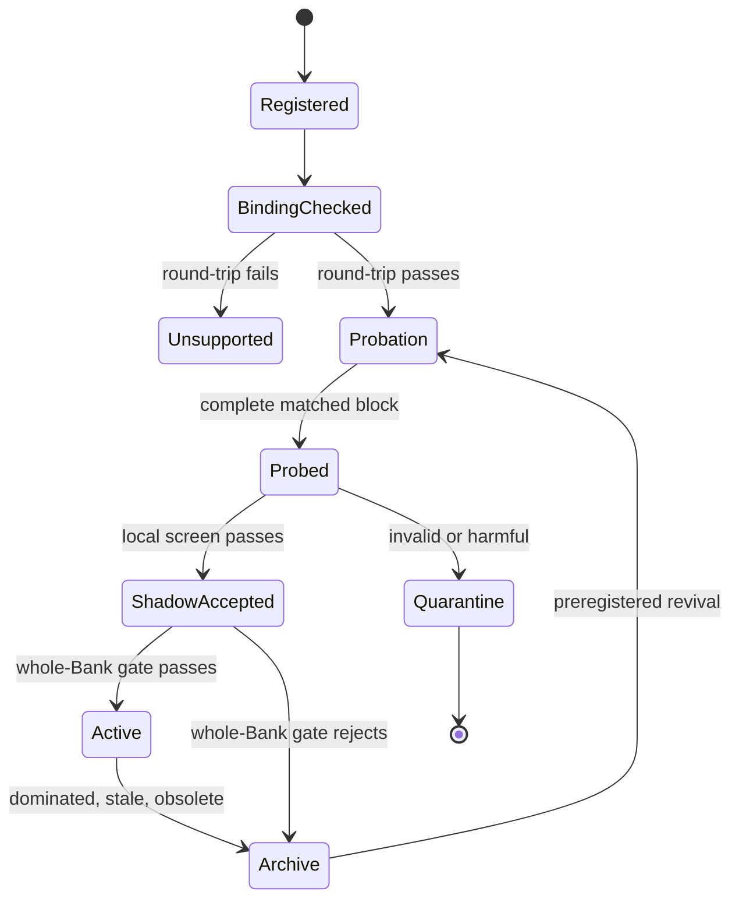

# TRACE-MAP SkillBank 方法设计档案

> **TRACE-MAP — Treatment-logged Retrieval and Ablation Credit Estimation for Multi-representation Archive Portfolios**

| 项目 | 内容 |
|---|---|
| Method ID | `trace_map_surface_audit_profile_v0` |
| 文档性质 | 研究设计档案与兼容 profile；不是实现代码、论文结论或实验结果 |
| 方法状态 | **未实现、未验证、可证伪** |
| 来源对话 | `6a564b43-6978-83ea-a45a-21bb15c2239a`（QueenBee 研究与扩展） |
| QueenBee 审核基线 | commit `8725c59c9f6cbc2bb3b17ea2b041b07bc3f7e61a` |
| 归档日期 | 2026-07-14 |
| 目标读者 | 实现 Agent、实验 Agent、方法比较 Agent、代码与统计审计 Agent |
| 相关设计 | [PIF-Bank](./2026-07-14-pif-bank-method-design.md)、[FACTS-Bank](./2026-07-14-facts-skillbank-method-design.md)、[TRIAD-SkillBank](./2026-07-14-triad-skillbank-method-design.md)、[TRACER-SkillBank](./2026-07-14-tracer-skillbank-method-design.md) |

本文把来源对话中的最终 `TRACE-MAP SkillBank` 整理为一份可由 Agent 直接比较、实现和证伪的技术档案。本文只给详细方案、合同、伪代码和实验标准，不展开完整 Pydantic schema、生产代码或迁移脚本。

最重要的规范化结论是：

> **TRACE-MAP 不是第五套独立 SkillBank 算法事实源。它是一个 PIF/FACTS、TRIAD 与 TRACER 兼容的 `surface-bound audit profile`：复用已有 immutable identity、materializer、raw probe ledger、two-stage event ledger 和 final gate，仅把“每个实际 treatment/comparator member 都能被 host 追溯到一个可 canonical round-trip 的 execution surface”提升为强制审计门。**

因此，本文保留 `TRACE-MAP` 作为历史方法名称和独立实验 profile，但不声称其组成机制本身具有独立 novelty。若这一额外 binding-integrity 约束没有提高 treatment delivery fidelity、held-out attribution 或 equal-all-in Bank 质量，TRACE-MAP 应退化为 TRIAD/TRACER 的 instrumentation 配置，而不是继续作为独立方法维护。

---

## 1. 阅读约定与快速结论

### 1.1 证据标签

- **`CURRENT_CODE_FACT`**：固定 commit 中可直接复核的代码行为。
- **`SOURCE_PROPOSAL`**：来源对话提出的 TRACE-MAP 机制或性能预测。
- **`NORMALIZED_PROPOSAL`**：本文在代码复核和方法审计后收敛出的规范版本。
- **`AUDIT_INFERENCE`**：根据代码和方法结构推导出的风险，尚需实验验证。
- **`OPEN_QUESTION`**：实现或预注册前必须冻结、不能由本文替用户决定的参数。

来源对话还包含论文、博客和近期工作的外部审计结论。本文没有重新执行完整外部 prior-art 审计，因此相关比较只标为 `SOURCE_PROPOSAL`，不得当作新的独立事实核验。

### 1.2 一句话核心思想

> **TRACE-MAP 在 outcome 前分别冻结 compatible Skill 的 retrieval slate、feasible coalition set、selected coalition 与 probe assignment，并要求每个真实执行的 coalition member 都具有 carrier-local、可 canonical round-trip 的 `SurfaceBindingRevision`；随后只用真实 matched complete blocks 估计 direct、retrieved-unused opportunity 和可选的 pair interaction，让这些局部证据驱动 TRAIN 检索、定向 mutation 与有界 archive，最终部署仍由独立 held-out whole-Bank gate 决定。**

### 1.3 当前唯一值得独立验证的增量

TRACE-MAP 不是在验证“反事实 Skill credit 是否有用”这一宽泛问题；PIF、FACTS、TRIAD 和 TRACER 已分别覆盖了其中大部分设计空间。它真正需要独立验证的是：

> 对每个 treatment/comparator coalition 强制执行可逆 surface trace，能否减少 **unsupported contamination、错误 member attribution 和无法复现的 patch**，更诚实地量化 `unsupported_nonseparable` coverage，并比不带该完整性门的 TRIAD/TRACER profile 更准确地预测 held-out local effects，最终改善 equal-all-in Bank 结果？

如果答案是否定的，则 TRACE-MAP 没有独立保留价值。

### 1.4 三种单位必须分开

| 单位 | 含义 | 不能替代什么 |
|---|---|---|
| 执行单位 | 完整 materialized `CoalitionRevision` 对应的完整 Graph、PhaseProgram、Python source、named topology 或 native paper transport | 不能直接执行一个 detached surface fragment |
| 局部信用单位 | 同一 sealed matched block 中的 candidate binding 相对预登记 comparator binding | 不能把整个 coalition outcome 平均分给成员 |
| 部署单位 | 一份冻结的完整 Bank snapshot | 局部正 effect 不能绕过 whole-Bank gate |

### 1.5 最小不可约身份

只有同时满足以下约束，才应标记为 `trace_map_surface_audit_profile_v0`：

1. 复用 PIF/FACTS 的 immutable artifact/factor identity 与 deterministic materializer；
2. 复用 TRIAD 的一份 raw matched ledger 和 direct/opportunity/pair derived views；
3. 复用 TRACER 的 retrieval→composition 两阶段 event ledger 与 selection/adoption 语义；
4. 每个真实执行的 treatment 或 comparator coalition member 都有 immutable `SurfaceBindingRevision`；
5. `SurfaceBindingRevision` 能通过 carrier-specific canonical round-trip oracle；
6. retrieved-unused candidate 在进入 opportunity feasible set 前也必须通过相同 round-trip；
7. hard-incompatible、unsupported 和未执行项目只有状态或支持边界，没有 efficacy credit；
8. direct、opportunity、pair 只来自 outcome 前冻结的真实 complete blocks；
9. 同一 raw block 可派生多个 view，但只计一份样本量与 ESS；
10. probabilities 分成 retrieval、coalition selection 和 probe assignment 三层；
11. logged propensity 本身不创造因果识别；
12. local evidence 只影响 TRAIN search；
13. final deployment 仍经过 independent held-out whole-Bank gate；
14. TEST 对 scientific state 只读；
15. answer、ground truth、expected output、private prompt 和 TEST feedback 永不进入 Bank 或 mutation context。

### 1.6 何时不要使用 TRACE-MAP

| 真实瓶颈 | 应优先采用 | 不应强行使用 TRACE-MAP 的原因 |
|---|---|---|
| 只有单 anchor、单 surface replacement | PIF 或 FACTS | 两阶段 coalition treatment log 增加复杂度但没有额外决策 |
| 固定 Base 上的少量 typed Atom portfolio | TRIAD | 已能回答 removal、opportunity 和 pair；无需额外 profile，除非 binding fidelity 本身有问题 |
| 主要问题是 retrieval→selection→adoption 漏斗 | TRACER | TRACER 已把 exposure、opportunity regret 和 weak-model use 作为核心 |
| 主要问题是 binding trace 不完整、member treatment 无法复现 | TRACE-MAP profile | 这是本文唯一特化点 |
| 大多数变化不可分离或无法 canonical round-trip | 当前 whole-artifact QueenBee、PIF whole contrast 或 whole-program search | 强拆会制造伪 member credit |
| coalition 基本总是 singleton | FACTS/PIF | coalition identity 与 pair audit没有实际作用 |
| 预算不足以形成 complete matched blocks | 当前 QueenBee + observational logging | 不应拿不完整 audit 冒充 effect |

### 1.7 Agent 快速阅读路径

- **实现 Agent**：读第 3–7、13、16 节。
- **实验 Agent**：读第 8–12、17 节。
- **方法比较 Agent**：读第 2、3、18 节。
- **安全审计 Agent**：读第 5、10、11、19 节。
- **只需决定是否采用**：读第 1.3、1.6、3.4、17.10–17.12 和第 21 节。

### 1.8 本方法不是什么

- 不是第六种 `PlannerMode`；当前请求侧只有五种 planner mode；
- 不是把 `paper_protocol` 当成新的请求 planner mode；它是 payload-local 值；
- 不是把当前 `operator_compose` 改名成多 Skill coalition；
- 不是跨 Graph、PhaseProgram 和 Python 自动转译 source；
- 不是完整 Shapley value；
- 不是把被检索但未使用视为负信用；
- 不是使用单次 pair-drop 冒充 interaction；
- 不是凭日志概率声称 off-policy 因果识别；
- 不是靠 LLM 自报“我遵循了 Skill”；
- 不是让 local credit 直接部署 candidate；
- 不是在线读取 TEST feedback 继续进化。

---

## 2. 当前 QueenBee 基线与精确缺口

### 2.1 当前 typed executable memory 已经很完整

**`CURRENT_CODE_FACT`**：固定 commit 的 `SkillCard` 已支持五类 discriminated `mode_payload`：

| Payload | payload-local `planner_mode` | 可执行真源 |
|---|---|---|
| `NamedTopologySkillPayload` | `topology_select` | named topology、`protocol_spec`、`structure_code` |
| `PaperTransportSkillPayload` | `paper_protocol` | `p2p / broadcast / sfs` native transport |
| `GraphSkillPayload` | `graph_generate` | `protocol_spec`、可选 `topology_program` |
| `PhaseProgramSkillPayload` | `program_generate` | 原始 DSL、compiled spec、compiler version、digest |
| `PythonSkillPayload` | `python_generate` | 完整 source、digest、AST/contract、worker contract、mutation provenance |

这里的 `paper_protocol` 是 `PaperTransportSkillPayload` 内部的 payload-local 值，不在请求侧 `PlannerMode` 的五个取值中。请求 planner mode 是：

```text
topology_select
operator_compose
graph_generate
program_generate
python_generate
```

`SkillCard` 还已单独保存 `reasoning_policy`、evidence、failure modes、counterexamples、confidence、provenance 和 `information_goal`。因此以下内容不能作为 TRACE-MAP 的新增贡献：

- 保存 executable topology；
- 保存完整 PhaseProgram 或 Python source；
- 把 reasoning policy 与 structure 分开成字段；
- 保存失败、反例或 confidence；
- `PythonSkillPayload` 已记录 parent 与 mutation provenance。

### 2.2 当前正常 retrieval 有过滤，但不是绝对 hard silo

**`CURRENT_CODE_FACT`**：`SkillBank.retrieve()` 正常路径会过滤：

- selectable/active；
- task family；
- objective，允许 `balanced` 兜底；
- `information_goal`；
- provenance；
- planner mode；
- Python worker contract；
- topology allowlist；
- agent range；
- array-size range。

但这并不等于所有调用路径都 fail-closed：

1. `TopologySelectPlanner` 在正常检索为空时，会回退到 Bank 中所有 selectable Skill；
2. `operator_compose` 委托 `TopologySelectPlanner`，继承这一 fallback；
3. planner-mode matcher 对 `topology_select/operator_compose` 不做 generated-mode 强隔离；
4. `retrieve_generation_context()` 有意忽略 planner mode 和 provenance，并返回完整 `SkillCard`；
5. generation consumer 可能把完整 `organization_policy` 和 `reasoning_policy` 暴露给 prompt。

**`NORMALIZED_PROPOSAL`**：TRACE-MAP 必须增加独立的 fail-closed eligibility facade：

```text
compatible set empty
    → use preregistered same-namespace baseline/no-skill coalition
    or return explicit no-compatible-treatment
    → never fall back to arbitrary Bank cards
```

`eligible / retrieved / excluded_reason` 必须在任何 fallback 之前冻结。

### 2.3 当前 `operator_compose` 不是多 Skill coalition

**`CURRENT_CODE_FACT`**：`OperatorComposePlanner` 的主路径是：

```text
TopologySelectPlanner selects at most one SkillCard
    → read that card's operators
    → or use objective-derived defaults
    → compile one complete ProtocolGraphSpec
```

它没有独立 typed payload，也没有：

- 多 Skill candidate set；
- member slot；
- per-member binding；
- coalition revision；
- member-level materialization trace；
- retrieved-unused opportunity estimand。

LLM planner 即使能看到多张 Skill context，也不能证明最终 operators 分别来自哪张卡。因此这属于不可审计的隐式综合，不是 TRACE-MAP 所需的 typed coalition。

### 2.4 当前等价与压缩可能在日志前抹掉 surface variant

**`CURRENT_CODE_FACT`**：正常 retrieval 和 compaction 的主要等价键是：

```text
information_goal + topology_hash
```

若没有 topology hash 才退回 skill ID。该 key 不包含：

- reasoning-policy hash；
- surface revision；
- planner mode；
- Python worker contract。

结构折叠还发生在：

- Graph 候选 probe 前去重；
- Graph Skill seed 的 topology-hash 去重；
- Graph equivalence group 只留代表；
- transfer 的 structural duplicate merge；
- evolution 对 transfer merge 的正式调用。

**`AUDIT_INFERENCE`**：同 topology、不同 receiver instruction、reasoning policy 或 runtime surface replacement 可能在进入 treatment ledger 之前就被合并。TRACE-MAP 不能只改 `_skill_equivalence_key`；它必须覆盖所有 collapse owner。

正确规则是：

```text
shared structure statistics: allowed
shared immutable variant identity: forbidden
shared treatment history: forbidden
```

### 2.5 当前 Python 局部 patch 不等于最终 singleton surface change

**`CURRENT_CODE_FACT`**：单次 Python mutation patch 只允许替换一个已有 `EVOLVE-BLOCK`，并验证未选 block 不变。但 Python repair loop 可以多次以当前已修改 source 为下一次 parent；不同 repair 可能选择不同 block。

所以：

```text
one patch changes one block
```

不自动推出：

```text
original parent → final accepted source changes one block
```

TRACE-MAP 必须比较 original parent 与 final source：

- 若所有 repair 始终只触及同一 registered surface，可保留 singleton binding；
- 若触及多个 surface，登记为 immutable compound coalition；
- compound 不能获得 singleton direct/opportunity/pair credit；
- initial mutation 和每次 repair 都计入 all-in 预算。

### 2.6 Failure、gate 与 TEST 的当前边界

**`CURRENT_CODE_FACT`**：

- `FailureRecord` 是 frozen、`extra="forbid"` 的 answer-free 记录；
- 它没有 coalition、surface、arm、probe probability 或 matched-block 字段；
- `FailureCluster` 按 mode、goal、contract、`failure_stage`、`error_type` 和 structural signature 聚类；
- `strict_dense_v2` 是 whole-Bank paired deployment ratchet；
- 它检查相同 `(case_id, seed)` key set、algorithm failure、mean V、min K、mean U、P tolerance、stage bootstrap，再判断 quality improvement 或 equal-quality lower-cost；
- 它不检查 SurfaceBinding round-trip、propensity、factorial completeness、HHI、leakage 或 audit overhead；
- 当前字典构造会静默覆盖重复 `(case_id, seed)`；
- 当前 bootstrap 以 row 为单位，不是 case-cluster bootstrap；
- 正式脚本会在 TEST 前保存部分快照，但没有所有 scientific state 的前后 hash equality 和写屏障；
- 极小数据下的默认 split 可能复用同一 case。

因此：

- final `strict_dense_v2` 必须保留；
- TRACE-MAP 另需 treatment-integrity gate；
- 完整 TEST freeze 是本文新增 proposal，不是当前事实；
- `extra="forbid"` 只能拒绝顶层未知字段，不能证明任意嵌套文本绝无泄漏。

### 2.7 当前 condition bucket 不是完整 namespace

**`CURRENT_CODE_FACT`**：当前 compaction condition bucket 主要包含：

```text
task_family
objective
agent_bucket
array_size_bucket
```

它缺少 `information_goal`、planner mode、worker contract、provenance 和 surface identity。虽然 equivalence key 对 goal 有部分保护，capacity bucket 本身仍可能让不同 namespace 竞争同一 cap。

TRACE-MAP 的 capacity/QD hard namespace 至少必须包含：

```text
task_family
information_goal
artifact carrier / planner mode
worker contract
provenance class
execution schema/compiler/scaffold version
```

### 2.8 精确差距矩阵

| 问题 | 当前最接近机制 | TRACE-MAP profile 需要新增什么 |
|---|---|---|
| Typed executable | 五种 mode payload | 不新增 carrier；新增 surface binding sidecar |
| 多 Skill composition | 单卡 operators 或 LLM 隐式综合 | immutable coalition、typed slot、完整 materialization |
| Exposure | selected Skill、局部 hot-start/insight 记录 | 两阶段 frozen slate/candidate-set/decision events |
| Treatment delivery | source hash、部分 mutation provenance | 可复用 binding revision + registration-scoped/application-scoped member proofs + coalition materialization proof |
| Direct credit | whole executable ablation、association | preregistered same-slot comparator 的 matched block |
| Retrieved-unused | 无通用 efficacy estimand | feasible unused candidate 的真实 same-slot SWAP |
| Pair interaction | 无 | 完整同 block 2×2 factorial，而不是单 pair-drop |
| Failure attribution | answer-free failure cluster | 引用 FailureRecord 的 treatment sidecar |
| Equivalence | goal + structure | namespace + structure + policy + binding revision |
| Diversity | top-N condition compaction | 有限 host-derived niche、global/per-niche/bytes cap |
| Deployment | `strict_dense_v2` | 保留 final gate，新增 treatment-integrity gate |
| TEST freeze | 部分快照 | 所有 scientific state 前后 hash 与写屏障 |

---

## 3. TRACE-MAP 与现有四份设计的关系

### 3.1 共享 substrate，不创建第五套真相

TRACE-MAP 的概念拆解是：

```text
PIF / FACTS
  immutable carrier revision
  deterministic binder/materializer
  registered comparator
  canonical round-trip / residue

TRIAD
  Base + typed member portfolio
  direct / opportunity / pair views
  one immutable raw matched ledger

TRACER
  retrieval slate → composition set
  selection/adoption event ladder
  logged probabilities and opportunity regret
  whole-Bank gate and QD lifecycle

TRACE-MAP profile
  requires every executed treatment/comparator member
  to pass runtime-surface binding-integrity gate
```

同一 execution、probe 或 failure 只能存在一份 authoritative raw record。TRACE-MAP 不得重新保存一份语义相同但 ID 不同的 execution ledger。

### 3.2 对象映射

| TRACE-MAP 名称 | 共享对象 | TRACE-MAP 增加的要求 |
|---|---|---|
| `SkillVariantRevision` | PIF/FACTS factor or artifact revision、TRACER variant | 必须引用可执行 carrier 和 immutable namespace |
| `SurfaceBindingRevision` | PIF/FACTS locator/binder、TRIAD Atom binding、TRACER hook | context-independent recipe 与 typed contract |
| `BaselineRelationRevision` | PIF/FACTS registered baseline relation | comparator 独立于 executable binding identity，按 slot/background/context 注册 |
| `BindingApplicationProof` | PIF/FACTS residue/round-trip evidence | 每个 member/slot 在固定 sibling background 的 pre/post/residue 与 hash-chain link |
| `CoalitionMaterializationProof` | TRIAD/TRACER complete bundle materialization | 完整 manifest 的 extract→rematerialize closure 为硬门 |
| `CoalitionRevision` | TRIAD Portfolio、TRACER Bundle | 每个 treatment/comparator member 都必须可 reverse trace |
| `RetrievalSlateSnapshot` | TRACER slate snapshot | 保存真实 conditional sampling law 与 exclusions |
| `CompositionSetSnapshot` | TRACER bundle candidate set | 只包含 round-trip-valid feasible candidates |
| `ProbeBlockPlan` / `CompletedProbeBlock` | PIF/TRIAD/TRACER raw block | outcome 前 assignment 与 outcome 后 completion 分离；authoritative raw evidence 不复制 |
| `Direct/Opportunity/InteractionView` | TRIAD/TRACER derived views | 增加 binding-integrity eligibility flag |
| `ArchiveEntry` | PIF/TRIAD/TRACER registry state | 增加 supported-binding/fidelity evidence |

### 3.3 TRACE-MAP 的独立 endpoint

TRACE-MAP 的独立 endpoint 不是“stage score 是否提高”这一项，而是一个有顺序的联合判断：

1. supported binding rate 是否足够高；
2. round-trip 是否能发现原本会被误记为 singleton 的 compound changes；
3. treatment-delivery fidelity 是否提高；
4. direct/opportunity sign 和 rank 在 `ATTRIB_VAL` 是否更稳定；
5. 更可靠的 attribution 是否转化为 equal-all-in final Bank 改善。

如果 1–4 没有改善，即使 final Bank 某次幸运提高，也不能把收益归因给 TRACE-MAP 的独特 profile。

### 3.4 退化与保留规则

| 观察 | 结论 |
|---|---|
| round-trip gate 几乎不拒绝任何候选，且 attribution 与无 gate 相同 | TRACE-MAP 退化为 TRIAD/TRACER instrumentation |
| round-trip gate 拒绝很多候选，但 final Bank 更差 | binding 过严或 surface boundary 错误；不保留 profile |
| opportunity 不能预测后续 same-slot swap | 移除 opportunity feedback，保留 exposure logging |
| two-stage log 对 selection 没有诊断增量 | 使用 TRIAD/FACTS |
| 绝大多数 candidate 是 compound/nonseparable | 回到 whole-artifact contrast |
| supported-binding、held-out attribution 和 equal-all-in Bank 均改善 | 才有理由保留 TRACE-MAP profile |

### 3.5 与 whole-program search 的关系

ADAS、AFlow、AlphaEvolve 和 DGM 的共同近邻是 whole agent/workflow/program 的生成、选择或 lineage。TRACE-MAP 不替代这些搜索器；它可以把它们产生的完整 candidate 作为：

- 一个 atomic root；
- 一个不可分离 whole artifact；
- 或在 host 能稳定提取 surface 时的 factorization 来源。

不能因为某 whole-program search 使用了 archive、MCTS、diff 或 QD，就声称其已有 TRACE-MAP；反过来也不能把 TRACE-MAP 说成新的 whole-program optimizer。

---

## 4. 概念对象、identity 与状态

本文只规定对象职责和最小字段语义，不提供完整代码 schema。

### 4.1 Identity、eligibility、effect context 必须分层

以下三类 key 不得合并成一个字符串：

```text
Immutable revision identity
  carrier-local artifact hash
  surface binding hash
  structure hash
  reasoning-policy hash
  binder/compiler/scaffold version
  parent/revision lineage

ArtifactNamespace / eligibility
  task_family
  information_goal
  request planner mode or artifact carrier
  worker contract
  provenance class
  execution schema version

EffectContext / statistical conditioning
  case-family bucket
  model/provider/runtime profile
  agent-count bucket
  budget bucket
  coalition background
  comparator relation
  split and protocol version
```

Revision identity 回答“它是什么”；namespace 回答“能否进入候选集”；effect context 回答“这个局部 contrast 在什么条件下成立”。

### 4.2 核心对象表

| 对象 | 是否 immutable | 最少保存 | 禁止行为 |
|---|---:|---|---|
| `SkillFamily` | 是 | semantic recipe、family hash、variant refs | 直接执行、跨 carrier 继承成功结论 |
| `SkillVariantRevision` | 是 | carrier、namespace、payload/artifact ref、structure/policy hash | 原地改写后沿用旧 evidence |
| `SurfaceBindingRevision` | 是 | context-independent carrier/locator/operation/payload、requires/provides、binder version | 把某次 base-specific pre/post/residue hash 或 comparator 写回可复用 recipe |
| `BaselineRelationRevision` | 是 | candidate binding、comparator binding/null、slot/background/context eligibility、direction | 直接执行，或跨 context 错用 comparator |
| `BindingApplicationProof` | 是 | `scope=canonical_fixture/request_coalition`、**单个 member/slot**、fixture 或 coalition preimage、sibling background、application order、pre/post/residue、hash-chain link | 用一个集合 proof 冒充每个 member 可分离 |
| `BindingSupportRecord` | 是 | binding revision、canonical fixture、registration `BindingApplicationProof` ref、verifier versions、support status | 用无 proof 的布尔值声称 registration supported |
| `CoalitionMaterializationProof` | 是 | 完整 manifest、ordered application proofs、extract/rematerialize closure、full artifact hashes | 替代 member-level proof |
| `CoalitionRevision` | 是 | root、ordered member bindings、application-proof refs、coalition-proof ref、namespace、materializer version、full artifact hash | 把 exposure status 写进 identity |
| `RetrievalSlateSnapshot` | 是 | eligible-set hash、ordered draws、conditional probabilities、exclusions、RNG | outcome 后补候选或改概率 |
| `CompositionSetSnapshot` | 是 | feasible coalitions、static failures、exclusions、selection law | 只保留 winner |
| `CompositionDecisionEvent` | 是 | selected coalition、probability、decision time、budget snapshot | 混入 outcome |
| `MechanismEvent` | 是 | `event_type`、parent event refs、request/member/coalition refs、decision-law ref、event time；类型统一为 `eligible/retrieved/proposed/registration_supported/instance_materialized/feasible/selected/executed/followed/probed` | 把 event 当 efficacy，或继续产生语义重叠的 `bound/materialized` 新事件 |
| `ProbeBlockPlan` | 是 | outcome 前 sealed arms、assignment law、order、case/seed、worst-case budget | outcome 后写入结果或换 comparator |
| `RawArmObservation` | 是 | coalition revision、outcome、failure、usage/cost、runtime refs | 为不同 view 复制为多条独立样本 |
| `CompletedProbeBlock` | 是 | plan ID、ordered arm-observation refs、completion/incomplete status、actual budget | 回写 plan，或隐藏失败 arm |
| `EffectView` | 派生 | raw block refs、estimand、direction、context、CI/ESS | 修改 raw arm |
| `TreatmentFailureEvent` | 是 | FailureRecord ref、coalition/surface/arm/probability/budget | 保存 answer 或让 cluster 直接产生 effect |
| `ArchiveEntry` | 可变状态 | state、niche、evidence refs、probe debt、use stats、reason | 改写 immutable revision |

### 4.3 Immutable revision 与 mutable registry 分开

一个 binding recipe 或 coalition 的内容发生任何变化，都创建新 revision；同一 binding recipe 在新 base/background 上应用时，不重铸 recipe，而是创建新的 immutable `BindingApplicationProof`：

```text
binding revision v1 ──evidence──► archive entry
        │
        ├──apply on base A──► application proof A
        ├──apply on base B──► application proof B
        └──mutation──► binding revision v2 ──new evidence──► archive entry
```

以下状态不进入 revision hash：

- candidate/probation/active/archive/quarantine；
- retrieval count；
- effect posterior；
- last used round；
- probe debt；
- niche champion status。

否则状态变化会改变 executable identity，或 artifact 变化后错误继承旧 credit。

### 4.4 `SkillFamily` 只提供 prior

`SkillFamily` 可以把同一机制的 Graph、PhaseProgram、Python 或 named-topology variant 关联起来，但：

- family 本身永不执行；
- family member 的 carrier-local evidence 分开；
- Graph 成功不能激活 Python member；
- 新 carrier 只能获得弱 prior 和 transfer hypothesis；
- 必须完成本 carrier 的 materialization、round-trip、matched validation 和 gate。

因此 family map 应按 artifact carrier 建模，而不是误用请求侧 `PlannerMode`。native paper transport 也只能引用其自身 executor member。

### 4.5 一份 authoritative raw ledger

所有 profile 共用：

```text
one ProbeBlockPlan ID
  ├── one or more RawArmObservation IDs
  ├── one CompletedProbeBlock ID
  ├── DirectEffectView
  ├── OpportunityEffectView
  ├── optional InteractionEffectView
  ├── FailureTransitionView
  └── CostView
```

`ProbeBlockPlan` 在任何 arm outcome 前创建后永不修改；执行完成或失败后新建 `RawArmObservation`，再由 `CompletedProbeBlock` 只读引用 plan 与 observation IDs。一个 completed raw block 即使合法派生出多个语义 view，也只能贡献一次 block count、case count 和 ESS。全仓库统一方向：

```text
treatment / candidate / proposed unused replacement
minus
comparator / incumbent / currently selected occupant
```

禁止同一 SWAP 同时给两个方向都记正 credit。

所有 derived rows 必须携带同一个：

```text
evidence_unit_id = completed_probe_block_id
```

下游 learner、bootstrap 和显著性检验按 `evidence_unit_id`/case cluster，保留同一 block 多输出之间的协方差。不同 estimand 可以各自报告其可用 ESS，但不得把 direct、opportunity、cost 和 failure views 的 ESS 相加成更大的独立样本量。

---

## 5. `SurfaceBindingRevision` 与 canonical round-trip

### 5.1 “可逆”不是语义逆

TRACE-MAP 所说的 reversible binding 不承诺：

- 从 compiled graph 恢复作者原始自然语言；
- 从 Python runtime behavior 恢复唯一 source；
- 证明两个程序语义等价；
- 证明某 instruction 被 LLM 心理上“理解”。

它只承诺一个 host 可验证的 **canonical artifact round-trip**。必须区分两种入口，避免拿预先填写的 expected hash 对新 candidate 自证：

```text
Existing-artifact ingestion:
  original complete artifact A0
      ↓ host extract
  base + bindings + residue manifest M0
      ↓ rematerialize
  complete artifact A1
      ↓ canonicalize
  canonical(A1) == canonical(A0)

New-manifest candidate:
  base + proposed bindings + residue manifest M0
      ↓ materialize
  complete artifact A1
      ↓ host extract
  extracted manifest M1
      ↓ rematerialize
  complete artifact A2
      ↓ canonicalize
  canonical(A2) == canonical(A1)
```

第二条路径中的 `full_artifact_hash` 是第一次 materialization 产生 A1 后记录的事实，不是模型或 candidate 事前声称的 expected hash。闭环还要求 M1 中的 canonical base/root hash、binding recipe hashes、slot assignments 和 non-target residue 与 M0 相同。只验证最终 artifact 相等不够：否则 extractor 可能把 target 内容偷偷吸收到 base，再生成同一 artifact，造成 surface boundary drift 却伪通过。

若 carrier compiler 非单射，以预注册的 canonical representation 为准，不要求恢复原始表面文本。

### 5.2 Binding 的最小合同

一个合法、可跨 background 复用的 `SurfaceBindingRevision` 至少回答：

1. 绑定到哪个 carrier？
2. stable locator schema 和 slot type 是什么？
3. operation recipe 是 preserve、insert、remove、replace、rewire 还是 parameterize？
4. 需要哪些 typed inputs 或 sibling slots？
5. 提供什么 typed output 或 runtime obligation？
6. recipe/payload 的 content hash 是什么？
7. 支持哪些 binder/materializer/compiler/scaffold version？
8. 如何从 final artifact 反向提取该 binding recipe？
9. base/namespace compatibility predicate 是什么？
10. 哪些 comparator slot types 在接口上可兼容？
11. 若移除/替换后非法，应返回什么静态拒绝原因？

而每次把该 revision 应用到具体 base/background 时，另建 immutable `BindingApplicationProof`，至少保存：

1. `scope=canonical_fixture` 或 `scope=request_coalition`；
2. **一个** binding revision ID 与 concrete slot/locator；
3. canonical fixture ID 或 coalition preimage hash、base/root revision ID 与 frozen sibling background IDs；
4. application order index；
5. input artifact hash，也就是上一 application 的 output hash；
6. 本次 pre-image、post-image 和 non-target residue hashes；
7. output artifact hash，形成 ordered hash chain；
8. 本次 compiler/materializer/verifier versions；
9. member boundary check 与失败原因。

Registration proof 不是一个不可追溯的布尔字段。它是
`BindingApplicationProof(scope="canonical_fixture")`，并由 immutable
`BindingSupportRecord` 引用；本次 request 的 member proof 则使用
`scope="request_coalition"`。Catalog 只能在存在有效 support record 时产生
`registration_supported` 事件。若 verifier、fixture 或 recipe 改版，必须创建新的
proof/support record，不能原地覆盖旧结论。

Comparator 不进入 binding identity。另用 immutable `BaselineRelationRevision` 记录 candidate→comparator、slot、background/context eligibility 和方向；`ProbeBlockPlan` 再引用当次冻结的 relation。这样换一个合法 baseline 不会迫使可执行 binding 重铸 revision，也不会把某 context 的 comparator 错用到另一个 context。

这样同一 routing recipe 可以在多个 compatible bases 上共享 revision-level prior，同时每次 application 的 hash 和效果仍严格分开。把 base-specific proof 或 comparator 写回 `SurfaceBindingRevision` 会导致两种错误：要么每个 background/baseline 都重铸一个 executable identity，使 credit 碎裂；要么新 proof 覆盖旧 proof，使历史不可复核。

仅有：

```text
"this Skill improves routing"
```

不构成 binding。

### 5.3 Binding 状态

| 状态 | 含义 | 可否 member-level attribution |
|---|---|---:|
| `roundtrip_supported` | registration-scoped proof 与当前 request-coalition-scoped `BindingApplicationProof` 都通过 | 是 |
| `compound_supported` | 多个 surface 作为一个不可再拆 compound 可稳定 round-trip | 只给 compound credit |
| `atomic_locked` | 完整 artifact 可执行，但没有合法局部 comparator | 只做 whole-artifact contrast |
| `unsupported_nonseparable` | 无法稳定定位、替换或恢复 residue | 否 |
| `invalid_binding` | locator/contract/hash 不一致 | 否，且不进入 feasible set |

`unsupported_nonseparable` 不是负 efficacy。它说明当前 instrumentation 无法回答 member-level 问题。

### 5.4 Round-trip 伪代码

```text
function materialize_and_reverse_trace(base, bindings, namespace):
    assert hard_namespace_compatible(base, bindings, namespace)
    assert every binding revision is immutable and versioned

    current = canonicalize(base)
    member_proofs = []

    for order_index, binding in ordered(bindings):
        input_hash = canonical_hash(current)
        pre_image, residue_before = locate_target_and_residue(current, binding)
        next_artifact = apply_one_binding(current, binding)
        validate_member_boundary(
            input=current,
            output=next_artifact,
            target=binding.locator,
            residue_before=residue_before,
        )
        member_proofs.append(BindingApplicationProof(
            scope="request_coalition",
            binding_revision_id=binding.id,
            coalition_preimage_hash,
            base_revision_id,
            frozen_sibling_background_ids,
            order_index,
            input_artifact_hash=input_hash,
            pre_image_hash=canonical_hash(pre_image),
            post_image_hash=canonical_hash(extract_target(next_artifact, binding)),
            residue_hash=canonical_hash(extract_non_target(next_artifact, binding)),
            output_artifact_hash=canonical_hash(next_artifact),
        ))
        current = next_artifact

    artifact_1 = current
    validate_complete_artifact(artifact_1)

    extracted = carrier_reverse_trace(artifact_1)
    artifact_2 = apply_in_order(extracted.base, ordered(extracted.bindings))
    validate_complete_artifact(artifact_2)

    require canonical_hash(extracted.base) == canonical_hash(base)
    require extracted.binding_ids == ordered(binding_ids)
    require extracted.binding_recipe_hashes == input_binding_recipe_hashes
    require extracted.slot_assignments == expected_slot_assignments
    require member_proof_hash_chain_is_contiguous(member_proofs)
    require canonical_hash(artifact_2) == canonical_hash(artifact_1)
    require no forbidden surface changed

    coalition_proof = CoalitionMaterializationProof(
        coalition_preimage_hash,
        ordered_member_proof_ids=ids(member_proofs),
        first_artifact_hash=canonical_hash(artifact_1),
        rematerialized_artifact_hash=canonical_hash(artifact_2),
        binder_version,
        verifier_version,
    )

    return member_proofs, coalition_proof
```

任何一步失败都不得由 LLM 解释覆盖。如果 host 只能证明整个集合闭合，却不能为每个 member 建立连续的 application hash chain，则将该集合重新登记为一个 `compound_supported` binding；它只能获得 compound credit，不能获得 singleton member credit。

### 5.5 Graph carrier

Graph 的 canonical target 可以是：

- canonical temporal edge set；
- round assignment；
- selected primary/sink；
- fan-in constraint；
- explicit receiver instruction slot；
- merge/send/submit policy hook。

Graph round-trip 以 canonical compiled `ProtocolGraphSpec`、稳定 slot ID 和 policy hash 为准。必须验证：

- DAG/temporal legality；
- coverage 与 goal semantics；
- message/fan-in budget；
- edge/round canonicalization；
- instruction slots 仍存在；
- non-target edges/policies 未变化。

结构变化若同时改变 instruction slots 或 submit semantics，则先登记为 compound，不得把全部收益归给 structure。

### 5.6 PhaseProgram carrier

PhaseProgram 必须同时保存：

- 原始 DSL revision hash；
- target phase/stage locator；
- compiler version；
- compiled protocol hash；
- non-target phase residue；
- reverse trace 中 DSL slot 与 compiled slot 的映射。

修改任何 phase 后都重新运行 deterministic compiler。由于 compiler 可能把不同 DSL 归一化为同一 graph，identity 不能只保存 compiled topology hash。

合法 binding 示例：

- replace one phase control field；
- replace one phase instruction；
- change one send mode；
- change one finalization/submit field。

若一次变化同时改 phase order、instruction 和 finalization，则使用 compound revision。

### 5.7 Python carrier

Python binding 首选当前已有的 `EVOLVE-BLOCK` 边界，但必须对 **original parent→final artifact** 检验，而不是只检查单次 patch：

```text
original parent source hash
target block ID
pre-block hash
final block hash
all non-target block hashes
non-block residue hash
final complete source hash
repair lineage
```

若 repair loop 最终触及多个 block：

- 不允许继续标为 singleton；
- 生成包含全部 touched surfaces 的 compound coalition；
- 或拒绝并从 original parent 重新做 same-block repair；
- 所有修复调用和失败执行均计入预算。

Python round-trip 还必须复用现有：

- parent SHA；
- marker whitelist；
- AST policy；
- taint/contract checks；
- dry run；
- sandbox/subprocess；
- stdout/usage ledger。

TRACE-MAP 不放宽其中任何一个边界。

### 5.8 Named topology 与 paper transport

Named topology 可以作为 atomic root，或在有稳定 reasoning hook 时形成：

```text
NamedTopologyRoot + ReasoningPolicyBinding
```

它默认不开放任意 edge mutation。

`p2p / broadcast / sfs` 是 native dynamic transports。它们不能伪装为静态 Graph binding：

- transport 本体通常是 atomic/native root；
- 只能由原生 executor 运行；
- reasoning reference 可以作为非执行 prior；
- 没有 host-verified native hook 时不能组合 surface member；
- reference-only evidence 不能变成 executable comparator。

### 5.9 Reasoning policy surface

Reasoning policy 只有满足以下条件才能成为独立 surface：

- 有 typed field 或稳定 host hook；
- materializer 能确定性写入；
- reverse trace 能从 final artifact 提取相同 policy revision；
- host 能验证 observable contract，或至少验证该 policy 被正确注入；
- 有合法 registered comparator。

“认真思考”“更深入反思”等不可验证自然语言只能获得 coalition-level outcome，不能得到 policy-followed 或 member-level direct credit。

---

## 6. `CoalitionRevision`：完整执行组合的稳定身份

### 6.1 一个 coalition 的组成

概念上，一个 coalition 包含：

```text
one executable root/base
+ zero or more ordered typed surface bindings
+ one hard namespace
+ one materializer version set
```

默认 pilot 可以限制为一个 root 加最多两个 delta，但这只是预算配置，不是方法身份。

### 6.2 Coalition identity

为避免 `BindingApplicationProof` 与 `CoalitionRevision` 相互引用形成 hash 环，先计算 coalition preimage：

```text
coalition_preimage_hash = hash(
    ArtifactNamespace,
    base/root revision ID,
    ordered SurfaceBindingRevision IDs,
    slot assignments,
    dependency/conflict graph version,
    binder/compiler/scaffold versions,
)
```

每个 application proof 引用该 preimage，而不是尚未生成的 final coalition ID。最终 `CoalitionRevision` 的 hash 至少包含：

```text
coalition_preimage_hash
ordered BindingApplicationProof IDs
structure hash
reasoning-policy hash
complete materialized artifact hash
```

不包含：

- 本轮是否被检索；
- 是否被选中；
- posterior；
- active/archive 状态；
- outcome；
- usage count。

### 6.3 同 topology、不同 policy

例如：

```text
structure H + reasoning R1 + submit S
structure H + reasoning R2 + submit S
```

两者共享 structure revision 和结构统计，但拥有不同 coalition identity、reasoning evidence 和 treatment history。任何 retrieval、Graph candidate dedupe、compaction 或 transfer merge 都不得把它们合成一条 revision。

### 6.4 Feasible 不等于有效

候选生成后、selection 之前分四层：

1. **hard incompatible**：namespace、contract、goal、slot、dependency 或 safety 不匹配；
2. **binding unsupported**：无法 canonical round-trip；
3. **static algorithm failure**：通过 proposal/audit eligibility，但 schema/compiler/coverage 等算法有效性失败；
4. **runtime safe**：可以完整执行。

前两类不进入 efficacy estimand；第三类进入 proposal-validity ledger，按预注册协议记诚实 static algorithm failure 与已发生成本，但不进入 runtime selector policy value；第四类组成 frozen feasible set，进入 selector 和 matched execution。

不能用一个模糊 `feasible=False` 把四类全部丢掉，否则会把 proposal validity 风险隐藏在 survivor-only 统计中。

### 6.5 Comparator coalition 也必须完整

每一个 treatment 和 comparator arm 都必须满足：

- 完整 `CoalitionRevision`；
- 所有 member 都有 registration-scoped proof、当前 request 的
  `BindingApplicationProof`，完整 coalition 还有
  `CoalitionMaterializationProof`；
- 同一 namespace、runtime、model 和 budget policy；
- comparator 在 outcome 前登记；
- 无事后选择更有利 baseline；
- artifact 完整执行，而不是只打分 patch 文本。

Retrieved-unused candidate 在 round-trip 成功前只能标为 `retrieved_unsupported`，不能进入 opportunity feasible set。

---

## 7. 两阶段 decision process 与 treatment delivery

### 7.1 事件时间线


每个 snapshot 都在 downstream outcome 发生前冻结。后续不能补候选、改概率、换 comparator 或删除失败 arm。

### 7.2 Event ladder

这里必须区分两个 round-trip 层级：

1. **Revision-registration proof**：`SurfaceBindingRevision` 注册时，以
   `BindingApplicationProof(scope="canonical_fixture")` 在 carrier 的 canonical
   base/fixture 上证明 locator、binder、extractor 和 residue 合同闭合；对应
   `BindingSupportRecord` 保存 proof ref，而不是只保存 `supported=True`；
2. **Run-instance coalition proof**：本次 request 的每个 member 使用
   `BindingApplicationProof(scope="request_coalition")` 形成连续 application hash
   chain，完整 proposal 再用 `CoalitionMaterializationProof` 验证
   materialize→extract→rematerialize 闭环并冻结最终 artifact hash。

第一层不能替代第二层。只有两层都通过，proposal 才进入本次 frozen feasible set。Selection 之后执行的正是已冻结的完整 artifact instance，而不是再次让 LLM 或 repair path 重建一个“相似”版本；如果 executor 必须重新装载，hash 不一致视为 harness/integrity error。

| Event | 精确定义 | 可以更新什么 | 不能更新什么 |
|---|---|---|---|
| `eligible` | 通过 hard namespace 和静态 eligibility | eligibility count | efficacy |
| `retrieved` | 被 outcome 前的 retrieval law 放入 frozen slate | exposure count | 正/负 effect |
| `proposed` | slate 产生一个 typed coalition identity | proposal/validity count | efficacy |
| `registration_supported` | member revision 有有效 `BindingSupportRecord`，且其 canonical-fixture application proof 可复核 | revision support coverage | 当前 coalition efficacy |
| `instance_materialized` | selection 前已生成本 request 的完整 artifact、完成 instance round-trip | support/materialization rate | task benefit |
| `feasible` | selection 前通过 round-trip、hard safety 和 runtime-static checks | feasible count、support rate | efficacy |
| `selected` | coalition decision law 从 frozen feasible set 选中该 member | selection count | benefit |
| `executed` | selected artifact 完成科学可用执行或诚实 algorithm failure | execution outcome | 其他未执行 member 的 credit |
| `followed` | host 能验证 observable runtime obligation | adoption diagnostic | as-treated causal effect |
| `probed` | 成为 sealed matched block 的真实 arm | raw ledger | 自动 deployment |

上述 `event_type` 是规范事件词表。来源草案里的 `bound` 和无 scope 的
`materialized` 只允许作为 legacy migration alias：迁移时分别映射到
`registration_supported`/`instance_materialized` 或标为 `ambiguous_legacy_event`；新
ledger 不得继续写这两个旧事件名。

### 7.3 Hard rejected 与 retrieved-unused 必须分开

建议状态至少区分：

```text
hard_excluded
eligible_not_retrieved
retrieved_binding_unsupported
retrieved_feasible_unselected
selected_executed
```

来源对话中的 `applied / shadowed / rejected` 太粗：

- hard-incompatible 不应进入 exposure regret denominator；
- feasible 但未选才是 opportunity candidate；
- materialization/round-trip 在 selection 前完成；未通过者不能进入 selector efficacy universe；
- selection 后若同一 artifact 不能复现 frozen hash，属于 harness/integrity error，而不是 treatment 的 task outcome；
- 未执行项目不获得 efficacy。

### 7.4 三层概率必须分别保存

至少冻结：

```text
p(slate | request, eligible set, retrieval policy)
p(coalition | frozen slate, feasible set, composition policy)
p(probe block and arm assignment |
  selected coalition, feasible unused alternatives, audit policy)
```

不能只保存每张 Skill 的 marginal retrieval probability。对于 without-replacement sampling、随机 slot、constrained beam 或 sequential construction，必须保存真实 joint law 或可验证的 conditional factorization。

只有当真实生成过程等于所记录分解时，才允许把 joint propensity 写成条件概率乘积。

### 7.5 Treatment fidelity

TRACE-MAP v0 把 revision-registration proof 和 run-instance deterministic materialization/round-trip 都定义为 **pre-treatment eligibility**，把 `selected` 定义为 treatment assignment 起点。这样 selector 只在已经完整物化、可复核的 feasible coalition 上随机化，避免先按 materialization survivor 条件化、又把 materialization failure 当 ITT 的语义冲突。

Assignment 后的 `selected → executed → host-verifiably followed` 才属于 delivery/adoption funnel。

Matched primary 默认估计 assignment-level effect，也就是：

- treatment 被分配后发生的 runtime algorithm failure、未激活或未遵循风险属于 ITT；
- 不能只保留 activated/followed 子集；
- 不能按 post-treatment mediator 条件化后声称因果效果；
- 若 `followed` 无 host verifier，只报告 bundle-level outcome 和 injection/materialization fidelity。

Preselection 的 proposal→materialized→feasible 转化率作为独立的 proposal-validity 和 instrumentation endpoint 报告；不能把 static-invalid proposals 从所有生成质量统计中消失，也不能把它们混入 selector policy value。

### 7.6 Fail-closed retrieval

TRACE-MAP 的 retrieval facade 不得继承当前全 Bank fallback：

```text
eligible = hard_filter_and_revalidate(request, bank)
freeze eligible IDs and exclusion reasons

if eligible is empty:
    choose preregistered same-namespace baseline/no-skill root
    or return explicit no-compatible-treatment
```

不得通过 exploration、fresh、reference context 或 fallback 绕过 goal/mode/contract/provenance。

---

## 8. Outcome 与三类局部 estimand

### 8.1 Outcome 向量

一次完整执行产生：

\[
Y=(V,K,U,P,S,G,C,D,A_{fail},F)
\]

其中：

- \(G=stage\_score\)；
- \(A_{fail}\in\{0,1\}\) 是 algorithm-failure indicator；
- \(F\) 是 categorical failure record，包括 class、stage 和 signature。

方向统一的数值向量为：

\[
Z(Y)=(V,K,U,P,S,G,-C,-D,-A_{fail})
\]

`failure_class / failure_stage / signature` 只进入 `FailureTransitionView`，绝不参与向量减法或 2×2 factorial 算术。

### 8.2 Direct binding effect

在固定 background coalition \(A\)、surface slot、case、seed、runtime 和预算下，candidate binding \(i\) 相对预登记 comparator \(b_i\)：

\[
\tau_i^{direct}(A,x)
=
Z\bigl(Y(A\oplus i,x)\bigr)
-
Z\bigl(Y(A\oplus b_i,x)\bigr)
\]

它回答：

> 在这个 background、slot 和 comparator 下，用 `i` 替代 `b_i` 的局部效果是什么？

它不回答：

- `i` 的全局绝对价值；
- `i` 在所有 topology 上的效果；
- family 中其他 carrier member 的效果；
- 未执行 Skill 的效果。

Comparator 优先级必须在 outcome 前冻结，例如：

1. direct parent binding；
2. canonical scaffold/default binding；
3. preregistered budget-equivalent neutral binding。

Root 不允许简单删除；只能与同 root slot 的合法 baseline replacement 比较。

### 8.3 Retrieved-unused opportunity effect

设 frozen slate 中的 \(j\) 已通过 round-trip、与当前 selected slot occupant \(i\) compatible，但未被选择。则：

\[
\omega_{j\leftarrow i}(B,x)
=
Z\bigl(Y(B_{-slot}\oplus j,x)\bigr)
-
Z\bigl(Y(B,x)\bigr)
\]

其中 `B` 是原 selected coalition。

它回答：

> 在当前 coalition 和 slot 中，composer 若用 `j` 替换 `i`，是否会更好？

硬规则：

- hard-incompatible 不进入该 estimand；
- slot 为空时只允许预登记、可执行、预算等价的 null binding；
- root 只能 same-slot replacement；
- 若加入 `j` 增加 coalition size、预算或改变其他 member，则不是同一 opportunity estimand；
- 未选择日志本身只增加 exposure，不产生 \(\omega\)；
- 正 opportunity 只能提高后续 exposure、普通执行或 direct audit 优先级，不能直接变成 deployment credit。

### 8.4 Pair interaction：完整 2×2 factorial

对两个 candidate bindings \(i,j\) 及其预登记 comparators \(b_i,b_j\)，只有同一 sealed block 的四个完整 arms 都合法并执行时，才估计：

\[
\eta_{ij}(A,x)
=
Z(Y(A,i,j,x))
- Z(Y(A,b_i,j,x))
- Z(Y(A,i,b_j,x))
+Z(Y(A,b_i,b_j,x))
\]

四臂为：

| Arm | slot i | slot j |
|---|---|---|
| `11` | candidate `i` | candidate `j` |
| `01` | comparator `b_i` | candidate `j` |
| `10` | candidate `i` | comparator `b_j` |
| `00` | comparator `b_i` | comparator `b_j` |

一次主运行加一次 pair-drop 不能识别 interaction。若没有全部四臂，只能报告 pair necessity 或 compound contrast，不得写 `interaction_effect`。

`stage_score` 是分段非线性 outcome，所以 `η_stage` 只代表 outcome-scale interaction。必须同时报告 V/K/U/P/S/C/D/A_fail 分量，不能用单一正 scalar 掩盖硬回退。

### 8.5 Coalition vs incumbent

完整 coalition 相对 incumbent Bank 的价值由 final whole-Bank paired gate 测量，不拆分给成员：

\[
\Gamma_B=Z(Y(B_{candidate}))-Z(Y(B_{incumbent}))
\]

局部 direct/opportunity/pair view 可以影响 TRAIN selector、mutation target 和 archive，但不能取代 \(\Gamma_B\) 的 independent held-out gate。

### 8.6 同一 raw block 的多视图

一个 selected-`i` vs unused-`j` SWAP block 可以派生：

- opportunity view：composer 是否错过 `j`；
- registered replacement view：`j` 相对 `i`；
- failure transition；
- cost view。

这些只是对同一 raw arms 的不同语义投影：

- raw observations 不复制；
- block/case/ESS 不重复增加；
- 所有 derived view 引用同一 block ID；
- 方向统一为 proposed `j` 减 currently selected `i`；
- 不能分别当成两条独立 evidence 做显著性。

### 8.7 Hard regression 与 scalar

推荐主分析保留完整向量和 lexicographic hard guards：

1. algorithm failure 不增加；
2. V 不退化；
3. min K 不退化；
4. U 不退化；
5. P 在冻结 tolerance 内；
6. paired stage 不退化；
7. 再看 S/stage 或 equal-quality cost。

来源对话给出的加权 dense scalar 只能作为预注册的探索性 selector signal。它不能：

- 覆盖 V/K/U/P regression；
- 代替 final gate；
- 事后调权；
- 作为唯一论文主 endpoint。

---

## 9. 可识别性、随机支持与统计合同

### 9.1 Conditional matched audit 不等于 OPE

真实 matched arms 可直接估计当前 background 下的条件性 contrast；它不需要 inverse propensity weighting 才“变成因果”。

```text
conditional matched audit
    estimates a local registered contrast

off-policy evaluation / policy regret
    estimates a selector policy value over a target distribution
```

只有第二类问题才需要完整 assignment probabilities、random support、positivity 和正确的 OPE estimator。

### 9.2 记录概率不创造识别

以下情况即使写了 `0.05` 也不能做 OPE：

- 实际路径是 deterministic top-k；
- 某 candidate 从未有非零 selection support；
- 记录的是 per-item marginal，但真实生成是 constrained slate；
- outcome 后才补写概率；
- probe target 根据 outcome 选择；
- comparator 是结果出现后挑的；
- hard-incompatible 被错误放进 positivity set。

### 9.3 Primary estimation

TRACE-MAP 的 primary attribution 使用：

- precommitted comparator；
- 同 case、same seed label；
- 相同 model/provider/runtime profile；
- 相同 budget policy；
- sealed complete block；
- block-level direction；
- case-cluster bootstrap；
- distinct-case minimum；
- 重复 `(case_id, seed, block role)` 直接拒绝。

同 seed 不能保证外部 provider 完全确定，所以关键 block 可使用预注册 AB/BA execution order 或少量重复，并把 order 当作 blocking factor。

### 9.4 OPE 是 secondary diagnostic

OPE 的 action 必须定义为 **完整 selected `CoalitionRevision`**，不是某个 member 的 marginal presence。最小合同是：

```text
context x:
  frozen request + eligible-set identity + runtime/budget profile

action a:
  complete selected coalition revision

logging law μ(a|x):
  the true joint retrieval-slate and composition-selection law

target policy π(a|x):
  frozen before evaluation

target distribution:
  preregistered request/case distribution
```

只在 \(\mu(a\mid x)>0\) 的 common support 上估计 \(V(\pi)\)，并报告 support coverage。若 `no-randomization` ablation 使 alternatives 没有 positivity，则 OPE/policy-regret 不可识别；该 arm仍可报告真实 matched conditional contrasts。

若要估计 selector policy value，必须保存：

- eligible set；
- ordered retrieval draws；
- slate conditional probabilities；
- feasible coalition set；
- coalition selection probability；
- probe block/target/arm assignment probability；
- positivity coverage；
- clipping rule；
- effective sample size。

可使用 clipped IPW 或 doubly robust estimator，但：

- 只能在真实随机 support 上；
- clipping threshold 在 outcome 前冻结；
- model-based component 不能读取 TEST；
- self-normalization、clipping、DR outcome model 和 target policy在 protocol hash 中冻结；
- 报告 clipped/unclipped sensitivity；
- CI 按 case cluster，而不是逐 decision row；
- 低 ESS 只能标 `unidentified`，不能自动淘汰 Skill。

### 9.5 Case 是主要统计独立单位

多个 seed 属于同一 case 的重复测量。推荐：

```text
arm observations
  → aggregate within case/block
  → bootstrap across cases
```

不能把同一 case 的 8 个 seed 当成 8 个独立 cases 扩大显著性。

### 9.6 最小 evidence 状态

候选默认阈值可设为：

```text
distinct cases >= 3
effective sample size >= 8
round-trip supported rate reported
no unexplained hard harm
```

但这是 pilot 参数，不是方法身份。正式阈值必须由预注册 power analysis 和可用 case 数决定。

建议状态：

```text
unseen
exposed_unexecuted
executed_unprobed
probed_insufficient
identified_beneficial
identified_harmful
conflicted
unsupported_nonseparable
```

### 9.7 Context-specific，不做全局神奇平均

Effect view 至少条件化：

- carrier/mode；
- goal；
- worker contract；
- model/runtime profile；
- task/agent/budget bucket；
- background coalition；
- comparator relation。

Family/global posterior只能作为 shrinkage prior；不能让一个 Graph binding 的成功自动证明 Python binding 有效。

---

## 10. Failure、Split、Gate 与 TEST 合同

### 10.1 Failure 更新矩阵

| 情况 | Raw ledger | Efficacy view | Selector/Archive 动作 |
|---|---|---|---|
| treatment 与 comparator 都成功 | 保存完整 block | 正常计算向量差 | 正常更新 |
| treatment algorithm failure、comparator 成功 | treatment 记 canonical zero quality，保留已发生成本 | 强负 hard evidence | 降低 selection，触发 surface mutation |
| treatment 成功、comparator algorithm failure | comparator 诚实零质量并保留成本 | 正 validity/robustness evidence，但不自动证明答案质量 | 可提升 probe/selection |
| 两臂都 algorithm failure | 保存两臂和 failure transition | 质量 contrast 通常信息弱；不删除失败 | 聚类定位 shared background 问题 |
| 任一 infrastructure failure | block 标 incomplete | 不计算 matched effect | 可重试整个预注册 block；不得只补有利 arm |
| 任一 harness error | 保存审计 artifact | 整个 replicate 作废 | 修复 harness 后从冻结协议重跑 |
| binding unsupported/nonseparable | 保存支持边界 | 不记正负 efficacy | 降级 compound/atomic |
| hard incompatible | 保存 exclusion reason | 不进入 estimand | 不奖不惩 |

Algorithm failure 是算法证据；infrastructure failure 不是。Harness error 不能静默转成 algorithm zero。

### 10.2 `TreatmentFailureEvent` sidecar

现有 `FailureRecord` 保持不变。TRACE-MAP 新 sidecar 只引用：

```text
FailureRecord.record_id
probe block ID
arm ID
coalition revision ID
surface binding revision IDs
assignment probabilities
budget snapshot
failure transition role
```

它不复制 answer、prompt 或 raw worker text。`FailureCluster` 可以生成 answer-free mutation context，但不能直接转成 treatment effect。

### 10.3 Split 权限矩阵

正式实验至少区分 case-disjoint splits：

| Split | 可执行 probe | 可更新 selector/posterior | 可 mutate | 可 gate | 可公开报告 |
|---|---:|---:|---:|---:|---:|
| `TRAIN_UPDATE` | 是 | 是 | 是 | 否 | 诊断性 |
| `ATTRIB_DEV` | 是 | 可用于模型/阈值开发；推荐 nested cross-fitting | 否 | 否 | 诊断性 |
| `GATE_DEV` | 仅预注册 local screen | 否 | 否 | local screen | 诊断性 |
| `BANK_DEV` | 否或仅冻结 normal executions | 否 | 否 | 每轮 provisional whole-Bank ratchet | 诊断性 |
| `FINAL_VAL` | 仅冻结 whole-Bank comparison | 否 | 否 | one-shot final selection | 是 |
| `ATTRIB_VAL` | 是，完全只读 | 否 | 否 | 否 | held-out attribution |
| `TEST` | 禁止适应性 probe；仅冻结 protocol 如有必要 | 否 | 否 | 否 | final frozen result |

同一个 `case_id` 的不同 seeds 不得跨 split。数据不足时可以物理上简化 split，但必须把 attribution 标为 exploratory，不能保留 confirmatory 口径。

`BANK_DEV` 可以在 development rounds 中决定 provisional incumbent，但不能作为最终性能证据。所有 rounds 结束后才在 `FINAL_VAL` **分别为每个预注册实验 arm** 从其冻结 candidates 中选择一个 arm-finalist；它不是在 A/F/G 之间先挑一个总 winner。A、F、G 等确认性 contrasts 所需的 arm-finalists 都必须进入 sealed TEST。看过 `FINAL_VAL` 后不得继续 mutation、调 selector、改阈值或新增 finalist。`ATTRIB_VAL` 也不能决定“再跑一轮”，否则它已变成 TRAIN。

为避免 `ATTRIB_VAL → TEST` 的操作性泄漏，所有 `FINAL_VAL` arm-finalists 和全部确认性协议冻结后，runner 必须自动进入一个 sealed confirmatory phase：

1. 冻结 analysis/report manifest、候选 contrasts、SESOI、分母、权重和停止规则；
2. 在 scientific-state write barrier 下无条件运行全部预派 `ATTRIB_VAL` blocks 与一次 frozen TEST；
3. 两类结果分别写入 blinded/sealed artifacts，执行期间不向研究者、selector 或 mutation loop 暴露结果；
4. 两者全部完成且 pre/post scientific-state hashes 均通过后，才共同 unseal；
5. 任何一侧失败只能按预注册的 whole-phase retry/invalid 规则处理，不能在看到另一侧结果后决定是否运行、补跑或改报告。

若基础设施无法实现真正 blinding，最低可接受替代是：在执行任一
`ATTRIB_VAL` arm 前提交不可变 analysis/report manifest，并由自动 runner 无条件连续执行
`ATTRIB_VAL + TEST`；仍然不得让人类或 Agent 在两者之间分支。

### 10.4 Treatment-integrity gate

在任何 local effect update 前，检查：

1. request namespace 与所有 variants 一致；
2. eligible/slate/feasible/selection/probe snapshots 在 outcome 前冻结；
3. treatment 与 comparator 都有完整 `CoalitionRevision`；
4. 所有 member 都有合法 `BindingApplicationProof`，coalition 有合法 `CoalitionMaterializationProof`；
5. comparator relation 预登记；
6. case、seed label、runtime、budget policy 匹配；
7. block arms 完整；
8. arm order符合协议；
9. outcome 和 failure 分类完整；
10. no forbidden fields；
11. 六维预算未超；
12. raw block ID、arm ID 和 `(case_id, seed, role)` 唯一；
13. direct/opportunity 两臂的 root、所有非目标 member/application、application order 和 budget policy hashes 完全相同，symmetric diff 恰为目标 slot 的 `BaselineRelationRevision`；
14. pair 四臂除两个预登记 slots 外完全相同，并构成精确的 2×2 design。

每个 arm 保存 `background_excluding_target_hash`；pair 另保存 `background_excluding_two_targets_hash`。相应 block 内这些 hashes 必须相等。两个 arms 即使各自 round-trip-valid，只要同时改了非目标 background，也不能进入局部 EffectView。

任一失败，block 不能进入 EffectView。

### 10.5 Local screen 与 final gate

Treatment-integrity gate 回答：

> 这个局部 contrast 是否科学可用？

Local candidate screen 回答：

> 这个 surface replacement 是否值得加入 shadow candidate Bank？

现有 `strict_dense_v2` 回答：

> 完整 candidate Bank 相对 incumbent Bank 是否可部署？

三者不得合并。Local screen 通过不代表 Bank gate 通过；有正 direct effect 不代表 retrieval policy 全局改善。

### 10.6 TEST 全状态冻结

**`NORMALIZED_PROPOSAL`**：TEST 前冻结并记录 hash：

- deployed SkillBank；
- immutable variant/binding catalog；
- coalition registry；
- raw probe ledger；
- derived effect views；
- selector policy、temperature、exploration floor 和 RNG state；
- exposure/selection/adoption counters；
- QD/archive/quarantine state；
- failure state；
- model/provider configuration；
- prompt/scaffold/compiler/contract versions；
- feature flags；
- persistent scientific caches。

TEST 后重新计算，scientific-state hash 必须完全相同。

TEST 可以写：

- 运行结果；
- 报告；
- 日志；
- 临时 execution artifacts。

它不能写回任何会影响未来 selection、credit、mutation、archive 或 deployment 的 scientific state。

### 10.7 Leakage allowlist

可持久化的最小内容：

```text
case hash / case ID for blocking
seed
task/context bucket
namespace
variant/binding/coalition/probe IDs and hashes
V/K/U/P/S/stage/C/D/A_fail
answer-free failure class/stage/signature
assignment probabilities
budget usage
per-agent aggregate coverage/submission/partial metrics
```

严禁进入 Bank、ledger、mutation prompt 或 Family evidence：

```text
answer / final_answer
ground_truth
expected_output / expected_answer
TEST result or score feedback
task/private/local prompt
agent private shard
raw worker answer
judge rationale containing answer
provider secret
```

Ground truth 可在 evaluator 内部转换成数值指标，但内容本身不得持久化到学习状态。

### 10.8 Generation context 必须独立 allowlist

不能直接把 `retrieve_generation_context()` 返回的完整 SkillCard 当 TRACE-MAP prompt context。应有独立 serializer，只允许：

- namespace；
- binding locator/contract 的安全摘要；
- 最多若干条 answer-free positive/negative evidence；
- failure cluster summary；
- cost/validity统计；
- target surface 和 output contract。

Graph/Phase/Python 各自使用 carrier-local serializer，不能共用“万能 payload dump”。

---

## 11. 完整 lifecycle、mutation 与 archive

### 11.1 生命周期总览



### 11.2 Create / Register

来源：

1. legacy Skill deterministic extraction；
2. accepted local mutation；
3. fresh Graph/Phase/Python generation 后 factorization；
4. whole-program candidate 作为 atomic root；
5. family transfer 产生的 shadow hypothesis。

Legacy historical outcomes 只能标 `observational_only`。不能事后伪造：

- retrieval probability；
- coalition candidate set；
- registered comparator；
- member-level effect；
- registration `BindingSupportRecord`、每次 member application proof 与 coalition materialization proof。

无法稳定拆分的旧 Skill 迁移为 `atomic_locked`，保留完整执行能力。

### 11.3 Retrieve

顺序：

1. fail-closed namespace eligibility；
2. carrier/slot/dependency compatibility；
3. hard safety；
4. round-trip support；
5. context-specific evidence、risk、cost、probe debt；
6. bounded randomized retrieval；
7. outcome 前冻结 slate 与 probabilities。

### 11.4 Compose

只允许 host-known typed operations。初版建议：

- 一个已验证 root；
- 最多两个 non-conflicting bindings；
- 一次 candidate 至多一个新 binding；
- 未验证 pair 受 uncertainty penalty；
- 任何变更后重新 materialize 和完整验证。

任意 LLM source splice、跨 carrier 编译或无 reverse trace 的组合不属于 TRACE-MAP。

### 11.5 Execute / Attribute

主执行保存完整 coalition outcome。Probe scheduler 只能在 outcome 前抽取 block 类型和 comparator；block 完成后写 immutable raw ledger，再派生 EffectViews。

局部 evidence 不直接改 immutable revision，只更新 registry sidecar。

### 11.6 Mutation

Mutation target 来源：

- direct harmful or uncertain；
- recurring algorithm-failure surface；
- positive opportunity 指出当前 occupant 可能被错选；
- negative pair interaction；
- high cost under quality non-regression；
- under-exposed but viable niche。

一次 mutation 默认只改一个 round-trip-supported surface。若 host 检测 final artifact 改了多个 surface：

- 降级 compound；
- 或拒绝并重试同一 target；
- 不能继续沿用 singleton hypothesis。

### 11.7 Local screen

Local screen 使用 `GATE_DEV` 上 preregistered candidate-vs-comparator complete blocks，至少要求：

- algorithm failure 不增加；
- V/K/U 不退化；
- P 在 tolerance 内；
- paired stage interval 不退化；
- 有质量改善，或 equal-quality cost 改善；
- binding fidelity 与完整性门通过；
- 六维预算未超。

通过后只进入 `shadow_accepted`，不是 active deployment。

### 11.8 Whole-Bank gate

构造：

```text
B_incumbent
B_candidate = incumbent + shadow revision + selector/archive changes
```

Development round 在 `BANK_DEV` 的相同 case/seed block 上运行完整 Bank，并调用同一 dense policy 作为 provisional ratchet；该结果只更新 development incumbent，不是 final claim。所有 rounds 完成后冻结 candidates，再在 `FINAL_VAL` 分别为每个预注册实验 arm 做一次 within-arm whole-Bank selection。两条路径都必须记录 exact snapshot；只有每个 arm 的 `FINAL_VAL` finalist 可进入 sealed confirmatory phase，且之后不得继续优化。跨 arm 的最终结论只能来自共同 unseal 的 frozen TEST，不得由 `FINAL_VAL` 先挑总 winner。

若相应 gate 拒绝：

- development 或 final selection 恢复 exact incumbent；
- candidate evidence 保留；
- revision 可进 archive 或 quarantine；
- 不能让被拒 source 偷偷成为下一轮 active parent。

### 11.9 Archive 与 revival

状态：

```text
probation
active
archive
quarantine
tombstone
```

- `archive` 可在预注册条件下 revival；
- `quarantine` 不参与 normal retrieval；
- `tombstone` 保留 hash、namespace、failure/effect summary 和原因；
- answer-free negative evidence 可保留；
- 不能把 quarantine 原文自动注入 prompt。

Revival 触发可包括：

- model/runtime/contract 变化；
- task distribution shift；
- 相邻 context 的正 opportunity；
- active niche 退化；
- archive item 的旧失败原因已由新 compiler 修复。

Revival 重新进入 probation，不继承为 active。

---

## 12. Retrieval、随机 selector 与 bounded QD

### 12.1 先 hard guard，再排序

任何 scalar score 之前，必须通过：

```text
namespace
contract
provenance
carrier/slot
dependency/conflict
round-trip support
sandbox/leak guard
budget feasibility
```

这些条件不能用 exploration 放宽。

### 12.2 TRAIN 排序信号

建议用 lexicographic/分层逻辑，而非一个可以掩盖 hard harm 的万能 scalar：

1. hard safety 与 failure upper bound；
2. context-specific direct LCB；
3. opportunity UCB，仅决定再探索，不直接当 deployment value；
4. coalition evidence；
5. probe debt / under-exposure；
6. QD niche deficit；
7. cost risk；
8. interaction uncertainty；
9. stable deterministic tie-break。

来源对话中的 `2 conservative + 4 exploration`、`k≤6`、`epsilon=0.05`、`temperature=0.2` 可作为 pilot 配置，但不是方法身份。

### 12.3 Randomization 只在 TRAIN

TRAIN selector 可采用带 nonzero exploration support 的 sequential sampling，并保存真实 conditional law。

Deployment、`FINAL_VAL` 与 TEST：

- exploration bonus 为 0；
- 只选择 active、完整验证的 coalition；
- selector 与 RNG frozen；
- 不做 adaptive opportunity probe。

### 12.4 Anti-monopoly

持续报告：

\[
HHI=\sum_i p_i^2,
\qquad
N_{eff}=\frac{1}{HHI}
\]

以及：

- top-1 / top-5 exposure share；
- top-1 / top-5 execution share；
- normalized entropy；
- exposure→feasible→selected→executed conversion；
- probe coverage；
- niche occupancy；
- never-executed rate。

Monopoly penalty 只能在 TRAIN 影响 exploration，不能强迫 deployment 牺牲质量。

### 12.5 有限、版本化、host-derived niche

合法 descriptor 示例：

```text
task_family
information_goal
artifact carrier
worker contract
model tier
agent-count bin
communication-depth bin
fan-in bin
coverage-shape class
reasoning-policy class
cost bin
robustness bin
```

要求：

- descriptor 集合有限；
- bin 边界预注册并版本化；
- 由 schema/compiled artifact/trace 确定；
- raw hash 只作 identity，不能直接创建无限 niche；
- 不用“LLM 觉得语义不同”作为 cell key。

### 12.6 Capacity 是多重上界

不能只设 active Skill 数。至少限制：

```text
global active revisions
per namespace
per niche
per family
per surface type
active coalitions
active pair records
negative tombstones
serialized bytes
prompt token footprint
revival probes per round
```

来源对话的 `active≤128`、`per niche≤3`、`prompt≤6` 是候选默认值，正式值由 pilot 与 bytes/token 预算冻结。

### 12.7 Niche elite

每 niche 可保留：

1. quality champion；
2. cost champion；
3. robustness champion；
4. optional probe candidate。

若 cap 只允许 3 个，则 quality/cost/robustness 中相同 revision 可合并身份，probe candidate 不能无限占位。

### 12.8 Eviction

优先归档：

- 被同 namespace/surface type 的 revision 严格支配；
- direct upper confidence bound 长期为负；
- 持续 algorithm failure；
- 过时 compiler/scaffold/contract；
- active bucket 超 cap 且长期不用；
- 只有单 case 幸运证据；
- round-trip verifier 已失效；
- 高度冗余且无独特 interaction/opportunity。

受保护：

- namespace 唯一 viable root；
- quality/cost/robustness champion；
- 有充分正 pair interaction；
- 低曝光但有合法 support 的 probe candidate；
- 稀有 contract/model tier 的唯一实现。

---

## 13. 六维 all-in 预算与公平比较

### 13.1 `BudgetVector`

每个 arm、block、round 和实验 arm 都累计：

\[
B=(E,M,T,R,\$,W)
\]

其中：

- \(E\)：完整 execution units；
- \(M\)：model calls；
- \(T\)：prompt + completion tokens；
- \(R\)：repair/retry calls；
- \(\$\)：provider cost；
- \(W\)：wall-clock time。

只报告 execution multiplier 会漏掉不同 carrier 的 call/tokens/repair 差异。

### 13.2 Complete block 成本

若 main coalition 已正常执行：

| Block | 额外完整执行 | 备注 |
|---|---:|---|
| Direct-only | 1 | comparator arm |
| Opportunity-only | 1 | same-slot unused replacement arm |
| Pair factorial | 3 | 其余三个 cell；四臂必须完整 |

静态 algorithm failure、repair、provider retry 和 invalid candidate 都记录真实消耗，不能只计算成功 arm。

### 13.3 25% execution-unit pilot 上界

来源对话希望期望 execution multiplier 不超过 `1.25×`。一个数学上不超过该上界的互斥 pilot 配置是：

\[
q_d=0.10,
\quad q_o=0.10,
\quad q_p\le\frac{1}{60}
\]

则额外 execution 期望为：

\[
q_d+q_o+3q_p
\le 0.10+0.10+0.05
=0.25
\]

三种 source units 必须互斥：

```text
direct-only block
opportunity-only block
pair-factorial block
```

Pair block 内的 singleton cells 可以派生 direct view，但不能再次计入 direct share 或 ESS。

### 13.4 Pair 的 power 问题

`1/60` 只是在固定 25% cap 下的算术上界，不保证统计 power。若只有 100 个主 units，平均不到 2 个 pair blocks，几乎无法稳定估计 interaction。

因此：

- MVP 默认 `q_pair=0`；
- 正式 pair 预算由最低完整 block 数和 power analysis 反推；
- 若 25% cap 不能同时支持 direct、opportunity 和 pair，优先关闭 pair；
- 不能用 1–2 个 block 宣称 interaction 已验证；
- 10%/10%/1⁄60 都是 pilot 参数，不是方法身份。

### 13.5 原子预留

开始任何 block 前，scheduler 必须原子预留整个六维 worst-case budget：

```text
if not reserve(all remaining arms + repair allowance):
    do not start block
```

不得主 arm 跑完后因预算不足省略不利 comparator。

### 13.6 Equal-all-in primary

六个资源维通常无法同时做到事后逐项 exact-match：不同 arm 的每次 call token/cost 不同，并发也会改变 wall time。Primary 因此采用 **相同 ex-ante 六维 cap + 相同 stopping/reallocation policy**，而不是给省资源 arm 补无意义调用。

比较 Current、TRIAD、TRACER 和 TRACE-MAP 时，至少冻结相同：

- complete execution-unit cap \(E\)；
- model-call cap \(M\)；
- token cap \(T\)；
- actual repair/retry-call cap \(R\)；
- provider-cost cap \(\$\)；
- wall-time cap \(W\)；
- candidate generation/repair allowance；
- TRAIN/VAL/TEST cases；
- worker/model/runtime；
- 任一维先触顶时的公平停止规则；
- 未用预算的事前 reallocation rule，且 outcome 后不得临时改用途。

每个 arm 报告实际消耗向量 \(B=(E,M,T,R,\$,W)\)。预注册一个 primary matching axis，例如 provider cost 或 execution units；其余维使用 cap/non-inferiority constraint。若一个 arm 质量不差且实际六维消耗逐项不高于对照，则报告 resource dominance，不要求把节省资源浪费掉。

TRACE-MAP 若把预算用于 audit，其他 arm 按同一事前规则把可用资源用于 candidates、重复评估或保留不用。否则“更好”可能只因为资源规则不同。

另报告 equal-normal-execution、resource-quality curve 和 Pareto frontier 作为诊断，但不能替代预注册的 equal-all-in primary。

### 13.7 降级顺序

预算不足时依次：

1. 关闭 pair factorial；
2. 降低 opportunity audit rate，但保留最小核心支持；
3. 降低 coalition size；
4. 减少 exploration slots；
5. 降低 direct audit rate；
6. 退化为 exposure/binding audit-only；
7. 若 complete block 仍无法保证，停止 efficacy claim。

不能通过增加 worker reasoning budget 或只删 comparator 来伪装满足预算。

### 13.8 Deployment overhead

若只部署 active frozen coalition，TRACE-MAP 的额外在线成本应主要是本地：

- namespace filter；
- revision lookup；
- coalition materialization/cache；
- hash/round-trip verification。

不应新增 mandatory LLM judge。来源对话的“部署额外开销 ≤5%”是待测预测，不是事实。

---

## 14. Carrier 能力与 profile 支持矩阵

| Carrier | Root | 可独立 surface | Canonical round-trip | 合法 comparator | 第一版建议 |
|---|---|---|---|---|---|
| Named topology | 完整 named spec | reasoning/submit hook，若宿主支持 | spec + policy hash | same root policy baseline | read-mostly |
| Native paper transport | p2p/broadcast/sfs executor | 仅原生显式 hook | native transport identity | same transport hook baseline | root-only/reference prior |
| Graph | compiled graph/spec | edge set、round、sink、instruction、policy | canonical spec + slot/residue | parent/canonical same-slot | fully supported |
| PhaseProgram | DSL + compiled spec | phase control、instruction、submit | DSL revision + compiled identity | parent/canonical phase slot | fully supported |
| Python | complete source | declared EVOLVE block | final source + target/non-target residue | parent/canonical block | first implementation candidate |
| Whole generated program | complete executable | 无稳定边界时无 | whole artifact hash only | whole parent/baseline | atomic locked |

### 14.1 为什么 Python 适合最先做

Python 已有：

- explicit `EVOLVE-BLOCK`；
- parent SHA；
- non-selected block checks；
- 完整 source hash；
- AST/taint/contract/dry-run/sandbox。

但必须先修复或审计 multi-repair cumulative diff。第一阶段可限制所有 repair 使用同一个 original target block，以得到最清晰的 singleton surface contract。

### 14.2 为什么 Graph 不是只加 edge ID

Graph-GRPO 类 edge credit 只解决 topology edge 的细粒度 reward。TRACE-MAP 还要区分：

- edge structure；
- round placement；
- receiver instruction；
- reasoning policy；
- submission semantics；
- 完整 coalition background。

同一 edge set 的不同 reasoning policy 必须有不同 revision identity。

### 14.3 为什么 PhaseProgram 不能复用 Graph locator

Phase DSL 的语义由 compiler 决定。Graph compiled edge slot 与 Phase source slot 不是同一 identity。两者可以共享 family prior，但必须有独立 binding、round-trip 和 evidence。

---

## 15. 高层算法

### 15.1 TRAIN round

以下是合同级伪代码，不对应当前已有函数名：

```text
INPUT:
    incumbent Bank snapshot
    immutable variant/binding catalog
    authoritative raw ledger
    TRAIN_UPDATE units
    six-dimensional round budget
    frozen randomization policy

FOR each TRAIN unit:
    1. Fail-closed eligibility
       eligible, exclusions = hard_filter_and_revalidate(request)
       freeze eligible-set hash and exclusion reasons

    2. Retrieval decision
       slate, retrieval_law = randomized_retrieve(eligible)
       freeze ordered slate and conditional probabilities

    3. Composition decision
       proposed = enumerate_bounded_mode_local_coalitions(slate)
       materialize each proposal with carrier-local binder
       classify hard-incompatible / unsupported / static-failed / runtime-safe
       freeze feasible-set snapshot and selection law
       selected = sample_or_select(runtime-safe)

    4. Seal the execution block before any arm outcome
       draw probe/no-probe assignment from the frozen audit policy
       if probe:
           construct every preregistered treatment/comparator coalition
           assert every member has valid registration/application proofs
           assert every arm has a valid coalition materialization proof
           freeze complete arm set and randomized AB/BA/factorial order
           atomically reserve worst-case six-dimensional block budget
       else:
           seal a one-arm normal-execution block for selected

    5. Execute treatment assignment
       execute every sealed arm in the frozen order
       append RawArmObservations and one immutable CompletedProbeBlock
       that references the pre-outcome ProbeBlockPlan
       mark infrastructure-incomplete or harness-invalid honestly

    6. Derived views
       if the block is a complete probe and treatment-integrity gate passes:
           derive direct / opportunity / optional factorial views
           reuse the same raw block and count ESS once
           update TRAIN-only selector, probe debt and mutation priorities

    7. Mutation
       choose at most one supported target surface
       generate bounded carrier-local replacement
       compare original parent → final artifact after all repairs
       if multiple surfaces changed: register compound or reject

AFTER TRAIN units:
    8. Local screen on GATE_DEV
    9. Build candidate Bank and bounded archive state
   10. Run provisional whole-Bank ratchet on BANK_DEV
   11. If BANK_DEV gate accepts, update development incumbent
       else restore exact incumbent deployment

AFTER all development rounds:
   12. Freeze every preregistered arm's candidates and shared protocol
   13. Run one-shot within-arm whole-Bank selection on FINAL_VAL
   14. Freeze one finalist per confirmatory arm; make no further changes
       and do not choose a cross-arm winner before TEST
```

### 15.2 Frozen attribution validation

```text
after FINAL_VAL:
freeze model, runtime, catalog, selector, comparators, protocol,
analysis/report manifest and all scientific-state hashes

FOR each case-disjoint ATTRIB_VAL block:
    use only outcome-before preassigned same-slot direct/SWAP blocks
    run preregistered complete matched arms under write barrier
    write blinded raw evaluation artifact only
    do not update selector, posterior, mutation, archive or deployment

compare TRAIN-derived sign/rank predictions
against held-out raw effects

do not unseal ATTRIB_VAL results yet
automatically continue to frozen TEST
```

Opportunity 的确认性验证必须在 `ATTRIB_VAL` 中使用 outcome 前预派的 same-slot
`j←i` SWAP blocks。TRAIN-derived opportunity prediction 在看到这些 case 的任何结果前冻结。
普通 evolution 中“后来被 selector 选中且表现好”的 conversion 只作诊断，因为旧
opportunity evidence 已改变 selection probability；除非使用独立 randomized holdout 或满足
第 9.4 节合同的 OPE，否则不得把它当 confirmatory evidence。MVP 所说的“预测下一次
SWAP”同样指 **下一次预派 block**，不是看过当前结果后挑选的下一次尝试。

### 15.3 Frozen TEST

```text
pre_hash = hash_all_scientific_state()

disable every scientific-state update API
disable exploration and adaptive probes
run every preregistered frozen arm-finalist on TEST once
under the shared equal-all-in stopping/accounting policy
write blinded result artifacts only

post_hash = hash_all_scientific_state()
assert post_hash == pre_hash

assert every sealed ATTRIB_VAL block and TEST run is complete
jointly unseal ATTRIB_VAL and TEST
render the preregistered report without adaptive branch
```

### 15.4 一个 opportunity 示例

背景 coalition：

```text
Graph root H
+ selected merge policy R1
+ submit barrier S
```

Frozen slate 中还有同 slot、round-trip-valid 的 `R2`，但 composer 选择了 `R1`。

主 arm：

```text
B = H + R1 + S
```

Opportunity comparator/treatment arm：

```text
B_swap = H + R2 + S
```

若 `B_swap` 在相同 block 中：

```text
V/K/U 不退化
stage +0.04
C -10%
```

则只记录：

```text
opportunity(R2 <- R1, H + S background) > 0
```

不能立即写：

```text
R2 is globally beneficial
```

下一步应提高 R2 的普通 selection 或 direct comparison 优先级。若后续 R2 相对 registered neutral/parent comparator 在多个 distinct cases 上稳定为正，才获得 direct evidence。

### 15.5 一个 compound Python 示例

原 parent source 有：

```text
routing_policy block
submission_policy block
```

初始 mutation 改 routing，第一次 repair 又改 submission。即使每个 patch 单独都合法，original-parent→final diff 涉及两个 surface。

正确记录：

```text
compound coalition = {routing_v2, submission_v2}
```

错误记录：

```text
all outcome credit → routing_v2
```

除非重新生成只改 routing 的 complete comparator，否则没有 singleton routing effect。

---

## 16. Default-off 落地、实现地图与测试

### 16.1 总体兼容策略

- 所有 TRACE-MAP feature flags 默认关闭；
- 旧 `SkillCard` 文件保持可读；
- feature-off 时序列化和 planner 行为保持当前语义；
- 新 identity/event/probe 数据优先放 sidecar，不把大账本塞入每张卡；
- 任何 carrier 先通过 offline fake-LLM 路径；
- 不移动 `exp-graph/`、`masbench/` 或 Silo submodule；
- 不修改 archive 中冻结历史。

### 16.2 建议 feature flags

```text
trace_map_identity_audit_v0 = false
trace_map_fail_closed_retrieval_v0 = false
trace_map_surface_binding_v0 = false
trace_map_event_ledger_v0 = false
trace_map_direct_probe_v0 = false
trace_map_opportunity_probe_v0 = false
trace_map_pair_factorial_v0 = false
trace_map_randomized_selector_v0 = false
trace_map_qd_archive_v0 = false
trace_map_test_write_barrier_v0 = false
```

不要用一个总开关一次打开全部机制；否则无法定位失败来自 identity、binding、probe、selector 还是 archive。

### 16.3 新 sidecar 模块

建议新增职责明确的模块，名称可在实现时调整：

| 新模块 | 职责 |
|---|---|
| `exp_graph.mas.surface_bindings` | carrier-local locator、binder、reverse trace、registration/application/coalition proof |
| `exp_graph.mas.coalition_registry` | immutable coalition revision、materialization、compatibility |
| `exp_graph.mas.trace_map_events` | retrieval/composition/mechanism event ledger |
| `exp_graph.mas.trace_map_attribution` | ProbeBlockPlan、raw arms、CompletedProbeBlock、derived views、integrity checks |
| `masbench.trace_map_scheduler` | split-aware probe scheduling、six-dimensional reservation |
| `masbench.trace_map_freeze` | scientific-state manifest、write barrier、pre/post hash |

这些 sidecar 应复用 PIF/TRIAD/TRACER substrate；若未来实现了共享通用模块，则上述名称只是视图层，不得复制 raw ledger。

### 16.4 文件级实现地图

| 文件 | 当前入口/风险 | TRACE-MAP 修改方向 |
|---|---|---|
| `exp-graph/src/exp_graph/mas/schemas.py` | typed payload、`SkillCard`、五个请求 planner mode | 新增 sidecar refs 或通用 revision types；不要把完整 ledger 塞进 SkillCard |
| `skill_payloads.py` | payload migration/compatibility helpers | 暴露 carrier identity 和 safe materialization adapter |
| `skill_bank.py` | retrieve、generation context、equivalence、condition bucket、compaction | fail-closed facade；reasoning/surface-aware identity；完整 namespace capacity；禁止 context full-card dump |
| `topology_equivalence.py` | structure fingerprint | 保留结构共享统计；新增 policy/surface variant key，不能替代 executable identity |
| `planner.py` | global fallback、single-card `operator_compose` | TRACE path 禁止全库 fallback；新增 typed coalition facade，不改 legacy default |
| `llm_planner.py` | 多 Skill prompt 可见但无 attribution | 只消费 allowlisted context；不能让 LLM 自报 binding |
| `graph_generation.py` | 多层 structure dedupe、candidate/seed/equivalence | 在每个 collapse owner 保留 surface/policy variant；输出 stable locator 与 reverse trace |
| `phase_program.py` | DSL compiler | 输出 DSL→compiled slot mapping 和 compiler identity |
| `phase_program_generation.py` | Phase generation/repair/context | 生成/变异后重新编译；safe context serializer；Phase binding manifest |
| `python_code_generation.py` | complete source、multi-repair loop | original-parent→final diff；same-target repair 或 compound classification；计 repair budget |
| `python_mutation.py` | one-patch one-block validation | 接受 host-registered target；继续 parent SHA/non-target checks |
| `python_worker_bootstrap.py` | trusted wrapper/usage ledger | 只传播 opaque coalition/binding audit IDs；generated code不可改 ledger |
| `ingest.py` | aggregate rows→evidence | 透传 IDs/split/budget；字段 allowlist；禁止 answer-like payload |
| `evolution.py` | analyst/patch generation | LLM 只能提 hypothesis；不得写 matched credit |
| `masbench/src/masbench/evolve.py` | TRAIN/VAL evolution、gate、transfer merge | probe scheduler、atomic budget、sidecar updates；final gate仍调用现有 policy |
| `transfer.py` | structure duplicate merge | variant-aware merge；只合并 structure stats，不删不同 binding/policy revision |
| `gates.py` | `strict_dense_v2` | 保持 final semantics；新增独立 integrity/local screen；拒绝 duplicate keys；case bootstrap |
| `failures.py` | answer-free FailureRecord/Cluster | 新 `TreatmentFailureEvent` 引用 record ID；不扩大 FailureRecord 原文 |
| `engine.py` | carrier execution入口 | 传播 opaque audit ID；TEST 下禁止 scientific-state callback |
| `masbench/src/masbench/adapters/silo_paper_protocols.py` | native `p2p/broadcast/sfs` executor | 保持 native transport identity；若无显式 hook，只作为 atomic root/reference prior |
| `core/config.py` / CLI | evolution flags/budgets | 添加 default-off flags、split manifest、six-dimensional caps |
| `curve.py` | 小数据 split 可复用 case | confirmatory TRACE run 强制显式互斥 cases |
| `final_submissions.py` | per-agent submission | 不改变答案语义；只附运行审计 ID |
| `verify_beats_baselines.py` | TEST 前部分快照 | 全 scientific-state manifest、write barrier、前后 hash、equal-all-in arms |
| `masbench/docs/*.md` | preregistered experiment docs | 新增 profile、预算、split、falsification；不重写旧结论 |

### 16.5 必须覆盖的四层 collapse owner

Surface-aware identity 不能只改 Bank equivalence：

1. retrieval/compaction；
2. Graph candidate pre-probe dedupe；
3. Graph seed/equivalence-group dedupe；
4. transfer structural merge。

测试必须构造：

```text
same topology
different reasoning/surface revision
```

并验证两者在四条路径中都保留独立 revision 和 treatment history。

### 16.6 Legacy migration

| 旧资产 | 迁移结果 |
|---|---|
| payload 完整、stable locator 可提取 | 生成 immutable revision，evidence 标 observational-only |
| payload 完整、reasoning 为整体自由文本 | structure 可共享；reasoning 作为 atomic policy binding |
| Python 有 blocks 但缺 final-diff history | 当前 source 可登记；历史 block-level outcome 不回填 |
| 无合法 locator/comparator | `atomic_locked` |
| provenance/contract 不明 | quarantine 或 legacy-only namespace |
| historical retrieval logs 无概率 | exposure-only observational event；不做 OPE |

不能迁移出“曾经不存在”的 counterfactual evidence。

### 16.7 分阶段 rollout

#### Phase 0：Identity audit-only

- 生成 namespace、structure/policy/binding hashes；
- 扫描四层 collapse；
- 不改 retrieval；
- 输出 same-structure/different-surface 冲突报告。

成功标准：feature-off parity；无 revision 丢失。

#### Phase 1：单 carrier round-trip

- 只做 Python 或 PhaseProgram；
- 验证 parent→final residue；
- 分类 supported/compound/atomic/unsupported；
- 不改变 Bank 排序。

#### Phase 2：Two-stage event logging

- 记录 eligible、retrieved、proposed、registration_supported、instance_materialized、feasible、selected、executed；
- 记录真实 decision law；
- 不更新 efficacy。

#### Phase 3：Matched direct

- 只对一个 surface、一个 preregistered comparator；
- MVP 无 pair；
- TRAIN-only shadow evidence；
- local screen 不改变 deployment。

#### Phase 4：Retrieved-unused opportunity

- 只做 same-slot、budget-equivalent、round-trip-valid SWAP；
- 这是 TRACE-MAP/TRACER 联合核心检验；
- 验证 opportunity 是否预测未来普通 selection。

#### Phase 5：Randomized selector

- 仅 TRAIN；
- 冻结 joint conditional probabilities；
- deployment 仍 deterministic/frozen。

#### Phase 6：Bounded QD 与可选 pair

- 先做 finite descriptors 和 caps；
- pair 只有 power/预算支持时开启；
- 最后才启用 eviction/revival 自动化。

### 16.8 单元测试

#### Identity 与 round-trip

- hash 稳定；
- revision immutable；
- 同 topology 不同 policy 不等价；
- Graph/Phase/Python round-trip；
- non-target residue；
- Python multi-repair compound detection；
- unsupported 不补零；
- paper transport 不伪装 Graph。

#### Eligibility 与 event log

- 空 compatible slate 不回退全 Bank；
- sink/all_agents 不串；
- carrier/mode 不串；
- worker contract 不串；
- provenance 不串；
- hard-excluded 不计 opportunity；
- probabilities 在 outcome 前冻结；
- without-replacement joint law 可复核。

#### Probe 与统计

- direct comparator 预登记；
- opportunity same-slot/size/budget；
- pair 必须四臂；
- direct/opportunity arms 的 `background_excluding_target_hash` 必须相同，且 symmetric diff 只能是预登记 relation；
- pair 四臂的 `background_excluding_two_targets_hash` 必须相同，并精确形成 2×2；
- 同 raw block多 view ESS只计一次；
- 方向唯一；
- duplicate `(case_id,seed,role)` 拒绝；
- case-cluster bootstrap；
- infra incomplete、harness invalid、algorithm zero。

#### Budget

- 互斥 block allocation；
- pair 原子预留 3 个额外 arms；
- repair/retry 计费；
- 任何维度超 cap 拒绝开始；
- equal-all-in accounting。

#### Leakage 与 TEST

- forbidden key 及嵌套文本 sanitizer；
- `data_scope=test` scientific update 抛错；
- TEST 前后 all-state hash 相同；
- 允许写普通报告但不改 scientific state；
- raw answer/private prompt 不进入 sidecar。

### 16.9 集成测试

- Level II/III × sink/all_agents；
- Graph/Phase/Python；
- fake LLM deterministic smoke；
- current feature-off parity；
- strict final gate remains final ratchet；
- same topology/different surface survives retrieval, Graph, compaction, transfer；
- infrastructure pair symmetric handling；
- rejected candidate不成为 active parent；
- per-agent submission audit不变。

---

## 17. 实验、消融与接受标准

### 17.1 研究问题

#### RQ1：Binding integrity

Round-trip gate 是否能识别原本会被误标为 singleton 的 compound/unsupported treatments？

#### RQ2：Attribution reliability

带 binding-integrity gate 的 direct/opportunity views 是否更准确预测 case-disjoint `ATTRIB_VAL` effects？

#### RQ3：Selection value

Opportunity evidence 是否减少 missed selections，并在相同 all-in 预算下改善 full Bank？

#### RQ4：Engineering value

这些收益是否足以抵消 instrumentation、rejection 和 audit 成本？

### 17.2 必须分开的实验 cell

至少分别报告：

```text
Level II × sink
Level II × all_agents
Level III × sink
Level III × all_agents
```

再按 carrier、worker contract 和 model/runtime profile 分层。不能用 pooled positive result 掩盖某 cell 的硬退化。

### 17.3 基线与合法范围

#### 固定/论文协议基线

- `p2p`；
- `broadcast`；
- `sfs`；
- `one_peer_exponential_dag`；
- `static_exponential`；
- sink 合法 fixed portfolio。

`p2p/broadcast/sfs` 只在 native executor 和合法 `all_agents` setting 中比较。跨 goal 不适用项标 `N/A-by-contract`，不记算法失败。

#### 当前系统基线

- cold GraphGen；
- cold PhaseProgram；
- cold PythonGen；
- current evolved QueenBee；
- reuse-only、mutation-only、fresh-only 和组合分支诊断。

#### 外部风格控制

可实现 AFlow-style、ADAS-style whole-candidate controls，但必须标为 style controls，不是原方法精确复现，并使用同一安全执行、split 和预算。

### 17.4 独立价值实验 arms

| Arm | Surface identity | Two-stage log | Matched views | Binding-integrity gate | 用途 |
|---|---:|---:|---:|---:|---|
| A Current QueenBee | 否 | 否 | whole-level | 否 | incumbent |
| B Logging-only | 否 | 是 | 否 | 否 | 测量事件成本 |
| C SurfaceBinding-only | 是 | 否 | 否 | 是 | 测量 instrumentation/fidelity |
| D TRIAD-style probes | typed Atom | 一阶段/固定 Base | direct/opportunity/pair | 非强制 TRACE gate | probe 对照 |
| E TRACER-style log | typed hook | 是 | direct/opportunity/pair | 无 TRACE binding-integrity gate | two-stage 对照 |
| F TRACE-MAP-minus-integrity | 与 full 相同 | 是 | 与 full 相同 | **仅移除 application/coalition round-trip gate**；保留现有 schema/safety | 独特增量主对照 |
| G Full TRACE-MAP | 是 | 是 | direct/opportunity/optional pair | 是 | profile |

Primary profile claim 比较 G 与 F。两者必须共享同一 candidate/probe corpus、retrieval/composition law、materializer、budget、archive policy、runtime 和 safety/schema gate，唯一差异是 TRACE application/coalition binding-integrity gate。D/E 只提供外部 style context；G 只赢 A、D 或 E，不能单独证明独特 binding gate 有价值。

为防止 G 通过拒绝最难 treatment 人为提高 sign accuracy，评估必须同时包含：

1. **common-supported intersection**：只在 F/G 都有合法预测的相同 candidates 上比较 sign/rank/calibration；
2. **selective risk / accuracy–coverage curve**：把 `unsupported_nonseparable` 视为 abstention，不当作错误或零；
3. **host-known fixtures**：在 synthetic/curated oracle fixtures 上测试 singleton、compound、residue drift 和 false-boundary detection；
4. **end-to-end equal-all-in Bank**：单独判断更高审计精度是否转化为系统收益。

Candidate corpus、common-support rule、fixture set 和 coverage denominator 都在 outcome 前冻结。

### 17.5 必要消融

1. `no-reversible-map`；
2. `no-two-stage-log`；
3. `no-opportunity`；
4. `no-randomization`；
5. `direct-only`；
6. `no-treatment-integrity-gate`；
7. `no-residue-check`；
8. `repair-final-diff-off`；
9. `no-QD`；
10. `no-monopoly-penalty`；
11. `no-family-prior`；
12. pair rate 0 / power-supported；
13. equal-all-in vs equal-normal-execution；
14. active capacity small/medium/unbounded；
15. Graph-only / Phase-only / Python-only。

### 17.6 指标

#### QueenBee 质量与成本

- V/K/U/P/S/stage_score/C/D；
- algorithm/infrastructure/harness failure；
- per-agent submission、partial、coverage；
- calls/tokens/repairs/provider cost/wall time。

#### TRACE-MAP 独特 instrumentation

- round-trip supported rate；
- run-instance coalition round-trip rate；
- compound detection rate；
- unsupported_nonseparable rate；
- selected→exact frozen artifact→executed→host-verified fidelity；
- false singleton rate；
- residue mismatch rate；
- comparator materialization rate。

这些指标必须冻结分母：

| 指标 | 分子 | 分母 | 解释边界 |
|---|---|---|---|
| Registration round-trip supported rate | 通过 canonical registration proof 的 member revisions | audit-eligible proposed member revisions | 衡量可审计覆盖，不等于 efficacy |
| Run-instance coalition round-trip rate | 在当前 request/base 上 materialize→extract→rematerialize 闭合的 proposals | members 已 registration-supported 且 hard-namespace-compatible 的 proposals | 衡量 composition 支持 |
| Compound detection rate | original-parent→final diff 被 host 判为多 surface 的 mutations | 所有进入 final-diff audit 的 mutations | 高值可能表示 generator 不守 singleton，不是收益 |
| False singleton rate | 原先标 singleton、但 final-diff audit 判 compound 的 mutations | 所有原先标 singleton 的 audited mutations | TRACE gate 应降低其进入 efficacy ledger 的比例 |
| `unsupported_nonseparable` rate | 被判不可局部分离的 audit-eligible proposals | 所有 audit-eligible proposals | 应诚实报告；不要求单调下降 |
| Treatment-delivery fidelity | execution 使用 exact frozen artifact hash，且所有 host-observable obligations 一致的 selected assignments | 所有 selected assignments | infra/harness 分层另报；不能只看 followed survivors |
| Comparator materialization rate | instance round-trip 完整的 proposed comparator coalitions | scheduler 在 assignment 前考虑的 comparator proposals | 决定可形成 complete blocks 的覆盖 |

“Gate 有价值”的关键不是让 raw unsupported rate 看起来更低，而是让 unsupported/compound 不再污染 singleton efficacy ledger，并提高 held-out attribution 的可复现性。

#### Attribution

- preregistered `ATTRIB_VAL` same-slot matched blocks 上的三类 effect
  calibration；
- held-out effect sign/neutral classification accuracy；
- Spearman rank correlation；
- calibration by predicted interval；
- distinct cases / ESS；
- opportunity positive predictive value；
- preassigned opportunity SWAP prediction accuracy；
- opportunity→ordinary later selected→benefit conversion，仅作有 selection-bias
  标记的诊断；若无 randomized holdout/OPE，不进入 confirmatory claim；
- direct/opportunity conflict rate；
- pair coverage 与 power。

Effect label 不允许通过“CI 是否跨 0”事后删样本。Primary label 的连续坐标固定为

\[
d_{stage}=stage\_score(treatment)-stage\_score(comparator)
\]

正式 protocol 先冻结 practical equivalence band/SESOI δ_attr，再把同一 case 内的
matched repetitions 聚合为：

```text
negative: effect < -δ_attr
neutral:  -δ_attr <= effect <= +δ_attr
positive: effect > +δ_attr
```

这里的 `effect` 就是 (d_{stage})，但 hard regression 优先于数值 band：若 treatment
相对 comparator 的 algorithm-failure delta、V、K、U 或 P 任一越过预注册 hard margin，
该 case 强制标为 `negative`；C/D 改善不能改变 primary label，只作 secondary cost view。

每个预派 complete block 都进入分母；先在 case 内聚合，再对 cases 等权。模型输出
`P(negative), P(neutral), P(positive)`，使 near-zero effect 有明确 neutral 类，而不是被
丢弃。三类 Brier score 是 proper-score primary；sign accuracy、rank、interval calibration
和 accuracy–coverage curve 为 secondary。δ_attr、hard margins、case weighting、
缺失/incomplete block 规则与 coverage floor 必须在看见 `ATTRIB_VAL` 前写入 protocol
hash。

概率预测也必须有 immutable identity：`predictor_revision_id`、
`calibrator_revision_id`、训练 split、feature contract、cross-fitting folds/seeds、fit code
version 和 calibration rule 全部在 confirmatory phase 前冻结。Predictor/calibrator 只能用
`TRAIN_UPDATE/ATTRIB_DEV`，不能因 `ATTRIB_VAL` outcome 重拟合或重校准。

#### Bank 与 selector

- active/archive/quarantine count；
- serialized bytes 和 prompt tokens；
- HHI、entropy、effective number；
- top-1/top-5 share；
- niche occupancy；
- never-executed rate；
- eviction/revival rate；
- same-structure policy variant survival。

### 17.7 MVP

建议范围：

- first carrier：Python；
- Level II/III、sink/all_agents 分开；
- 每 cell 至少 4 cases、3 seeds，仅作 feasibility；
- 至少 3 independent evolution replicates；
- direct block rate 10%；
- opportunity block rate 10%；
- pair off；
- coalition size≤2 bindings；
- feature flags逐阶段打开；
- 全程 equal-all-in ledger。

MVP 只回答：

- round-trip 能否稳定工作；
- 能否发现 multi-repair compound；
- opportunity 能否预测下一次 **outcome 前预派** 的真实 SWAP；
- 预算与 split 合同能否执行。

它不应声称方法有效。

### 17.8 正式实验

候选规模：

- 每个 confirmatory cell 至少 20–30 distinct cases，或全部可用 cases；
- 5–8 seeds，但按 case cluster；
- 至少 5 independent evolution runs；
- TRAIN_UPDATE / ATTRIB_DEV / GATE_DEV / BANK_DEV / FINAL_VAL / ATTRIB_VAL / TEST case-disjoint；
- pair 仅在 power analysis 支持的 cells 开启；
- 最终 TEST 一次；
- 至少一个 transfer setting；
- 跨 carrier 只用独立验证 member。

具体样本数必须由 pilot variance 和最小 effect power calculation 决定，不能机械采用上述候选数。

### 17.9 来源性能预测的规范化

来源对话给出以下候选预测：

1. mean stage score 提升至少 `0.03 absolute`，paired CI 下界 > 0；
2. S 非劣、V/K/U/P 不退化时，C 或 D 至少下降 12%；
3. HHI 至少下降 25%，或 effective skills 至少上升 30%，S 下降不超过 1pp；
4. held-out effect sign accuracy 至少 65%。

本文将它们保留为 **候选预注册阈值**，不把四项并列成四个 primary。正式
protocol 必须：

- 按 cell 报告；
- 明确 family-wise/multiple comparison 处理；
- 定义 S non-inferiority margin；
- 使用 case-cluster CI；
- 明确 equal-all-in；
- 不允许在看到 VAL 后改阈值。

其中 `65% sign accuracy` 必须按第 17.6 节的 SESOI 三分类合同重写，不能删除
CI 跨 0 或效果接近 0 的 blocks。若 pilot 促使阈值变化，新的 δ、coverage floor、
权重、分母和 decision rule 必须在任何 confirmatory case 运行前进入 protocol hash。

### 17.10 唯一确认性终点与 gatekeeping

#### Attribution primary

TRACE-MAP 独特 binding-integrity claim 的 primary comparison 是 **G Full
TRACE-MAP vs F TRACE-MAP-minus-integrity**，不是 G vs TRIAD/TRACER。使用第 17.4
节 outcome 前冻结的 candidate/probe corpus，在 case-disjoint `ATTRIB_VAL` 上运行
预派 direct 与 same-slot opportunity blocks。

唯一 attribution primary outcome 是：

```text
case-macro multiclass Brier score
for TRAIN-frozen P(negative, neutral, positive)
on the frozen G/F common-supported intersection
```

Observed class 按第 17.6 节的 Δstage_score + hard-regression override 生成；预测概率来自
protocol 中冻结的 predictor/calibrator revisions。Brier lower-is-better，定义：

\[
\Delta_{Brier}=Brier_G-Brier_F
\]

Primary superiority rule 是 case-cluster CI 的预注册上界满足
\(UCB(\Delta_{Brier})\le -\delta_{Brier}\)，其中 \(\delta_{Brier}>0\) 在
confirmatory data 前冻结。

先按 outcome 前冻结的 direct/opportunity stratum weights 在同一 case 内聚合
repetitions/blocks，再对 distinct cases 等权；每个预派 block都进入其预注册
missingness/incomplete rule，不能按 observed effect 或 CI 过滤。Primary
claim 要求 G 相对 F 达到 outcome 前冻结的 Brier-score improvement SESOI，并同时通过：

- G support coverage ≥ 预注册 `c_min`；
- treatment-delivery fidelity 不退化；
- hard algorithm-failure/V/K/U/P guards；
- six-dimensional equal-all-in cap。

上述 Brier contrast、coverage floor 和 hard guards 必须按第 17.2 节每个
confirmatory cell 计算。跨 cell 的 gatekeeping/meta-analysis 与 multiplicity rule 可以预注册，
但只报告 pooled 正结果、同时隐藏一个失败 cell，不能通过 primary。

Common-support rank/sign、accuracy–coverage、selective risk、interval calibration 和 D/E
style-arm 对比都是 secondary。Host-known positive/negative-control fixtures 的 boundary
sensitivity/specificity 是 integrity guard；真实数据中的 false-singleton rate 只诚实报告，
**不要求非零**，避免激励系统寻找或制造错误边界。

#### Final-Bank primary

最终 Bank 只有一个 primary outcome：**frozen TEST 上的 case-macro mean
`stage_score`**，在第 13.6 节 equal-all-in 合同下比较，并受 algorithm failure、V、min
K、U、P 和预注册 S non-inferiority margin 的 hard guards。确认性假设使用固定
gatekeeping 顺序：

1. `H_B1`：G 相对 F 达到预注册 stage-score SESOI，证明 binding-integrity gate 有独立系统价值；
2. 只有 `H_B1` 通过，才检验 `H_B2`：G 相对 A Current QueenBee 达到来源候选阈值 `+0.03 absolute` 或正式 protocol 在 pilot 后冻结的替代 SESOI。

两个 contrast 使用同一个 primary outcome、同一 TEST corpus 和预注册 multiplicity
规则。C/D、HHI、fidelity 和 transfer 都是 secondary；transfer **不能替代 TEST**。
若 `ATTRIB_VAL` primary 改善但 frozen TEST primary 未通过，TRACE-MAP 最多是一个
有效 audit profile，不能升级为“有效 SkillBank 方法”。

`FINAL_VAL` 只选择 frozen finalist，不是最终性能证据。Attribution primary 与
Final-Bank primary 均在第 10.3 节 sealed phase 中运行，`ATTRIB_VAL` 与 TEST 共同
unseal；任何一方都不能影响另一方是否执行或如何报告。

### 17.11 结论层级与 profile 保留门

结论必须按以下层级升级，不能跨级：

| 层级 | 必须满足 | 允许表述 |
|---|---|---|
| 有效 replicate | 无 harness/leakage/identity/budget violation；sealed phase 完整 | “本 replicate 可用于科学判断” |
| Binding-integrity component | positive/negative-control fixtures 达到预注册 sensitivity/specificity；真实 coverage/fidelity 达标；unsupported 不再污染 singleton ledger | “binding integrity instrumentation 有效” |
| 独立 TRACE-MAP audit profile | 上一层成立；G 相对 F 通过 `ATTRIB_VAL` attribution primary；六维预算和 hard guards 通过；第二独立 replicate set 复现 | “TRACE-MAP 作为独立 surface-audit profile 有效” |
| 有效 SkillBank profile | 上一层成立；G 在 frozen TEST 依次通过 `H_B1` 与 `H_B2`；无硬回退；至少一个预注册 secondary 可报告但不代替 primary | “TRACE-MAP 在预注册范围内作为 SkillBank profile 有效” |

D/E TRIAD/TRACER arms 只用于 secondary method context。若 G 不优于 F，则不能靠赢 D/E
保留独立 binding-integrity claim。若 instrumentation 能发现 boundary error，但 G 未通过
attribution primary 且 TEST 也无增益，应把它折叠为共享 validator/diagnostic，而不是维护
独立 profile。若只通过 `ATTRIB_VAL` 而 TEST 未通过，保留 audit-profile 结论，但不得称
SkillBank 有效。

### 17.12 证伪与失败分类

不能把所有负结果都写成“TRACE-MAP 失败”。必须使用以下 taxonomy：

| 类别 | 判定例 | 正确结论与动作 |
|---|---|---|
| **Replicate invalid** | harness error、泄漏、state hash 变化、identity collision、预算超限、sealed block 被破坏 | 本 replicate 无科学结论；按预注册规则整段重跑或停止 |
| **Binding-integrity core falsified** | positive/negative-control fixture sensitivity/specificity 未达标；known compound/residue drift 仍进入 singleton ledger；在 coverage 足够时 treatment fidelity 未改善 | 否定当前 locator/binder/reverse-trace core；不能用 Bank 结果掩盖 |
| **Optional module falsified** | 预派 opportunity SWAP 不可预测；direct+opportunity 不优于 direct-only；pair 无 power/不稳定；QD 降质 | 关闭对应 opportunity/pair/QD 模块；不自动否定已经独立成立的 binding component |
| **Independent profile maintenance value absent** | Binding instrumentation 能工作，但 G 未优于 F 的 attribution primary，且 equal-all-in TEST 也无独立增益 | 折叠为共享 validator/diagnostic；不保留 TRACE-MAP 独立 profile |
| **End-to-end SkillBank efficacy not proven or failed** | G 通过 attribution primary，但 frozen TEST `H_B1` 或 `H_B2` 未通过；或出现 V/K/U/P/S/A_fail hard regression | 可保留 audit-profile 结论；不得称有效 SkillBank，transfer 或 diversity gain 不能替代 |

另外，以下设计违规直接否定对应 claim：

- 同 topology 不同 policy 仍在任一 collapse 路径被合并；
- multi-repair 仍被误记为 singleton；
- 收益只存在于非 equal-all-in arm；
- opportunity “验证”来自被旧 evidence 改变过的普通 selection，且没有 randomized holdout/OPE；
- 任何 TEST/answer/private data 进入学习状态。

真实数据没有 false singleton 不构成失败；它可能只说明该 corpus 没有暴露 boundary
error。Binding core 的 sensitivity/specificity 必须由 outcome 前冻结的 positive/negative-control
fixtures 检验。

### 17.13 停止标准

立即停止并将本 replicate 标为 invalid：

- harness error；
- scientific-state TEST hash 变化；
- forbidden data 落盘；
- 六维预算任一维超限；
- block 无法完整预留；
- identity collision 或 immutable revision 被改写；
- 重复 `(case_id,seed,role)` 未能拒绝；
- sealed `ATTRIB_VAL + TEST` phase 被人工或 Agent 分支。

停止整个方法迭代：

- 连续三轮无 accepted patch；
- 连续三轮 attribution primary 不改善；
- probe ESS 持续不足；
- supported binding rate 低于预注册阈值；
- G 在两个独立 replicate 均未优于 F；
- binding core 在冻结 fixtures 上被证伪；
- 达到总预算。

不得追加轮数、换分母、换 comparator 或把 transfer 升为 primary 直到得到正结果。

### 17.14 区分模型能力地板与 profile 失败

| 观察 | 更可能解释 |
|---|---|
| 所有 arms V/K/U 高、P/S 都低，换强 Worker 后共同提升 | Worker capability floor |
| Current 成功，TRACE-MAP materialization/validity 低 | binding/materializer 失败 |
| Binding fidelity 提高但 final quality不变 | instrumentation 有效，SkillBank效益未证实 |
| Opportunity在强模型有效、mini不follow | adoption/model-tier问题；更接近 TRACER |
| Graph有效、Python无效且multi-repair高 | Python surface boundary/repair问题 |
| HHI下降但stage/S下降 | diversity不能证明方法有效 |
| infrastructure failures主导 | 科学样本不足；不能归因给方法 |
| only non-equal budget arm wins | 预算混杂 |

---

## 18. 与 Current、内部设计和外部近邻的比较

### 18.1 内部设计比较

| 维度 | Current QueenBee | PIF | FACTS | TRIAD | TRACER | TRACE-MAP profile |
|---|---|---|---|---|---|---|
| 主要对象 | whole SkillCard/artifact | registered factor contrast | carrier-native factor profile | Base + Atom portfolio | two-stage variant bundle | surface-audited coalition |
| Immutable local identity | 不统一 | 是 | 是 | 是 | variant/hook | 复用，并强制 round-trip trace |
| 多成员 coalition | 无 typed通用机制 | 非核心 | 通常单 anchor | 核心 | root+adjunct | 复用，所有 arms/member过 integrity gate |
| Retrieval exposure | 局部/确定性 | 非核心 | anti-monopoly可选 | randomized portfolio | 核心 | 复用 TRACER two-stage log |
| Direct effect | whole/association | registered direct | single-factor | removal/replacement | drop/root swap | same-slot registered binding contrast |
| Retrieved-unused | 无通用机制 | 非核心 | 可选 | opportunity | 核心 regret | same-slot round-trip-valid opportunity |
| Pair | 无 | 可扩展 | sparse | complete factorial | complete factorial | complete factorial，power/预算许可时 |
| Adoption/fidelity | outcome/局部trace | binder validity | activation/follow可选 | materialization | event ladder | delivery funnel + binding integrity endpoint |
| Raw ledger | 当前 evidence 分散 | intervention ledger | factor ledger | one raw ledger | event+probe ledger | **必须复用同一 raw ledger** |
| Final gate | `strict_dense_v2` | 保留 | 保留 | 保留 | 保留 | 保留，另加 integrity gate |
| 独特问题 | historical whole skill | registered factor value | carrier factor boundary | portfolio credit | missed selection/adoption | surface trace是否提高可复核 attribution |

### 18.2 选择规则

```text
Need only one registered local replacement?
    → PIF / FACTS

Need multi-Atom portfolio effects under a fixed Base?
    → TRIAD

Need retrieval→selection→adoption diagnosis and opportunity regret?
    → TRACER

Already need TRIAD/TRACER, but member treatment cannot be reliably
located, reversed or reproduced at runtime surface?
    → enable TRACE-MAP profile
```

### 18.3 与 ADAS

**`SOURCE_PROPOSAL`**：ADAS 的基本单位是完整 Agent code 和 ever-growing archive。TRACE-MAP 的单位是：

```text
retrieval exposure
→ typed surface binding
→ immutable coalition
→ matched local contrast
→ Bank feedback
```

两者可组合：ADAS-style generator 提供 atomic roots，TRACE-MAP 只在 host 能稳定定位 surface 时做 member attribution。

### 18.4 与 AFlow

**`SOURCE_PROPOSAL`**：AFlow 在 whole workflow tree 上选择、扩展、执行并回传 parent experience。TRACE-MAP 不新增 MCTS；它记录 retrieval slate、coalition candidate set 和 unused same-slot alternative，并要求 surface-level round-trip。

AFlow-style expected-output 或 task-specific log 不能进入 QueenBee Bank。

### 18.5 与 AlphaEvolve、ShinkaEvolve 与 DGM

**`SOURCE_PROPOSAL`**：这些方法强调 program database、diff mutation、island/QD 或 open-ended lineage。TRACE-MAP 不把 whole-program population 改名为 SkillBank；它可以消费这些搜索器产出的完整 candidate，但其局部 credit 必须满足自身 binding 和 matched-block 合同。

`EVOLVE-BLOCK` 的存在也不自动意味着已有 TRACE-MAP，因为还缺：

- 完整 two-stage decision log；
- coalition identity；
- retrieved-unused opportunity；
- raw ledger；
- round-trip treatment fidelity；
- whole-Bank feedback。

### 18.6 与 Graph-GRPO 和 edge credit

**`SOURCE_PROPOSAL`**：Graph-GRPO 给 topology edge 分配 group-relative credit，解决整图奖励均摊。TRACE-MAP 的 target 可以是 edge surface，但还覆盖：

- reasoning policy；
- Phase stage；
- Python block；
- coalition selection；
- unused opportunity；
- persistent archive lifecycle。

TRACE-MAP 不训练 edge policy network，也不能把 edge advantage 直接当跨 carrier Skill credit。

### 18.7 与 SkillC、CTA、C3、AgentSHAP、GraSP、SkillWeaver

**`SOURCE_PROPOSAL`**：来源对话把这些工作分别视为 paired skill/no-skill、trace auditing、cooperative credit、Shapley tool attribution或 skill composition 的近邻。

因此 TRACE-MAP 不应声称：

- 首次做反事实 Skill credit；
- 首次做 with/without-skill trace；
- 首次组合 Skill；
- 首次做 pair interaction；
- 首次维护 archive 或 QD。

它最多可以声称：

> 本 profile 把 carrier-local canonical surface trace 作为两阶段 coalition audit 的强制完整性门，并将该门的 attribution/Bank 增量本身设为可证伪 endpoint。

### 18.8 新颖性边界

本文没有重新完成来源对话中的外部新颖性搜索，不能把“没有找到完全同构方法”升级为事实。准确表述是：

> 在来源对话的审计语境中，TRACE-MAP 被提出为一个组合性研究假设；本档案进一步发现其主要组件与 PIF/FACTS、TRIAD、TRACER 高度重合，因此将其规范化为兼容 profile，而不是独立 novelty claim。

不得写：

- “TRACE-MAP 首次……”；
- “TRACE-MAP 已证明……”；
- “唯一正确的 SkillBank”；
- “具有因果信用”，而没有限定 matched context、comparator 和支持条件；
- “比 AFlow/ADAS/AlphaEvolve 更好”，而没有 equal-all-in 实验。

---

## 19. 给实现、实验和审计 Agent 的检查表

### 19.1 实现 Agent

- [ ] 是否复用共享 immutable identity、materializer 和 raw ledger？
- [ ] 是否避免创建 TRACE-MAP 专属平行事实源？
- [ ] `SkillVariantRevision` 与 mutable registry 是否分离？
- [ ] 每个 treatment/comparator member 是否有 `SurfaceBindingRevision`？
- [ ] registration 是否引用 `scope=canonical_fixture` proof，而不是裸 `supported` 布尔值？
- [ ] 每次 request 是否有逐 member `scope=request_coalition` proof 和完整 coalition proof？
- [ ] round-trip 是否 carrier-specific，而不是语义相似度？
- [ ] 是否保存 pre/post/residue/full-artifact hashes？
- [ ] Python 是否比较 original parent→final source？
- [ ] multi-repair 是否降级 compound？
- [ ] Graph/Phase/Python locator 是否分开实现？
- [ ] paper transport 是否保持 native executor？
- [ ] 空 compatible slate 是否 fail closed？
- [ ] 是否覆盖四层 collapse owner？
- [ ] same topology/different policy 是否保留独立 revision？
- [ ] probabilities 是否在 outcome 前冻结？
- [ ] raw block 是否只存一份？
- [ ] duplicate block/arm/case-role 是否拒绝？
- [ ] feature flags 是否 default-off？
- [ ] fake-LLM offline path 是否诚实可运行？
- [ ] feature-off 是否保持旧行为？

### 19.2 Probe / 统计 Agent

- [ ] direct comparator 是否预登记？
- [ ] root 是否用 same-slot replacement，而非非法 drop？
- [ ] opportunity candidate 是否 round-trip-valid、same-slot、same-size、budget-equivalent？
- [ ] hard-incompatible 是否排除出 estimand？
- [ ] pair 是否完整四臂？
- [ ] 四个 arms 是否同 sealed block？
- [ ] direct/opportunity 的 non-target background hash 是否完全相同？
- [ ] pair 四臂的 two-target-excluded background hash 是否完全相同？
- [ ] raw block 多 view 是否只计一次 ESS？
- [ ] contrast 方向是否统一？
- [ ] attribution label 是否固定为 Δstage_score，并由 A_fail/V/K/U/P hard margin 覆盖？
- [ ] predictor/calibrator revision、训练 split、cross-fitting 和版本是否在 ATTRIB_VAL 前冻结？
- [ ] 统计是否按 case cluster？
- [ ] same seed 是否没有被误当确定性保证？
- [ ] conditional matched 与 OPE 是否分开？
- [ ] OPE 是否有真实 random support 和 positivity？
- [ ] infra incomplete/harness invalid/algorithm zero 是否正确？
- [ ] C/D 和 hard quality 是否分别报告？

### 19.3 实验 Agent

- [ ] Level II/III 与 sink/all_agents 是否分开？
- [ ] carrier/contract/model profile 是否分层？
- [ ] splits 是否 case-disjoint？
- [ ] `ATTRIB_VAL` 是否完全只读？
- [ ] TEST 是否 one-shot frozen？
- [ ] `ATTRIB_VAL + TEST` 是否 sealed 自动运行并在 state-hash 通过后共同 unseal？
- [ ] opportunity primary 是否来自 case-disjoint、outcome 前预派的 same-slot SWAP？
- [ ] 是否有 Current、SurfaceBinding-only、TRIAD-style、TRACER-style、minus-integrity 和 full arms？
- [ ] 独特 profile primary 是否明确比较 G vs F，而非靠赢 D/E？
- [ ] attribution 与 final-Bank 是否各只有一个冻结 primary outcome？
- [ ] equal-all-in 是否 primary？
- [ ] 六维预算是否全计？
- [ ] repairs/invalid candidates/failed arms 是否计费？
- [ ] pair是否有足够 block/power？
- [ ] 是否预注册 profile retention 与退化标准？
- [ ] 失败时是否停止，而非追加轮数？

### 19.4 安全审计 Agent

- [ ] answer/ground truth/expected output/TEST/private prompt 是否禁止？
- [ ] nested context 是否经 allowlist serializer，而非只靠 `extra="forbid"`？
- [ ] generation context 是否没有 dump 完整 SkillCard？
- [ ] FailureRecord sidecar 是否 answer-free？
- [ ] TEST 是否只禁止 scientific-state write，而非误禁普通报告？
- [ ] TEST 前后 all-state hash 是否一致？
- [ ] selector RNG、archive、counters、cache 是否都冻结？
- [ ] rejected/quarantine artifact 是否不会进入 normal prompt？

### 19.5 方法比较 Agent

- [ ] 是否把 TRACE-MAP 写成 profile，而非第五套 novelty？
- [ ] 是否说明共享 PIF/FACTS/TRIAD/TRACER substrate？
- [ ] 比较是否使用相同预算、split、runtime 和 candidate allowance？
- [ ] 是否用 held-out attribution 与 final Bank 两层 endpoint？
- [ ] transfer 是否只作 secondary，绝不替代 frozen TEST？
- [ ] 是否说明只有 instrumentation 改善时不能称有效 SkillBank？
- [ ] 是否报告 supported/compound/unsupported coverage？
- [ ] 是否给出“何时不用”的结论？

---

## 20. 固定 commit 代码依据

以下链接只支持“当前 QueenBee 是什么”的代码事实，不支持 TRACE-MAP 已实现或有效。

### 20.1 Schema 与 payload

- [请求侧 `PlannerMode` 五个值](https://github.com/RobinTian-7/Mutiagent/blob/8725c59c9f6cbc2bb3b17ea2b041b07bc3f7e61a/exp-graph/src/exp_graph/mas/schemas.py#L21-L29)
- [五类 mode payload](https://github.com/RobinTian-7/Mutiagent/blob/8725c59c9f6cbc2bb3b17ea2b041b07bc3f7e61a/exp-graph/src/exp_graph/mas/schemas.py#L408-L536)
- [`SkillCard` 与独立 `reasoning_policy`](https://github.com/RobinTian-7/Mutiagent/blob/8725c59c9f6cbc2bb3b17ea2b041b07bc3f7e61a/exp-graph/src/exp_graph/mas/schemas.py#L539-L590)
- [Python source/hash/contract/provenance](https://github.com/RobinTian-7/Mutiagent/blob/8725c59c9f6cbc2bb3b17ea2b041b07bc3f7e61a/exp-graph/src/exp_graph/mas/schemas.py#L492-L526)
- [native paper protocol executor](https://github.com/RobinTian-7/Mutiagent/blob/8725c59c9f6cbc2bb3b17ea2b041b07bc3f7e61a/masbench/src/masbench/adapters/silo_paper_protocols.py#L211-L420)

### 20.2 Retrieval、fallback 与 compaction

- [`SkillBank.retrieve()` 正常过滤](https://github.com/RobinTian-7/Mutiagent/blob/8725c59c9f6cbc2bb3b17ea2b041b07bc3f7e61a/exp-graph/src/exp_graph/mas/skill_bank.py#L84-L125)
- [`retrieve_generation_context()` 有意忽略 mode/provenance](https://github.com/RobinTian-7/Mutiagent/blob/8725c59c9f6cbc2bb3b17ea2b041b07bc3f7e61a/exp-graph/src/exp_graph/mas/skill_bank.py#L157-L193)
- [空检索回退全 Bank selectable cards](https://github.com/RobinTian-7/Mutiagent/blob/8725c59c9f6cbc2bb3b17ea2b041b07bc3f7e61a/exp-graph/src/exp_graph/mas/planner.py#L68-L87)
- [`operator_compose` 委托单卡选择后编译 operators](https://github.com/RobinTian-7/Mutiagent/blob/8725c59c9f6cbc2bb3b17ea2b041b07bc3f7e61a/exp-graph/src/exp_graph/mas/planner.py#L172-L207)
- [Top-N condition compaction](https://github.com/RobinTian-7/Mutiagent/blob/8725c59c9f6cbc2bb3b17ea2b041b07bc3f7e61a/exp-graph/src/exp_graph/mas/skill_bank.py#L456-L516)
- [goal + topology hash equivalence key](https://github.com/RobinTian-7/Mutiagent/blob/8725c59c9f6cbc2bb3b17ea2b041b07bc3f7e61a/exp-graph/src/exp_graph/mas/skill_bank.py#L676-L686)
- [condition bucket 缺完整 namespace](https://github.com/RobinTian-7/Mutiagent/blob/8725c59c9f6cbc2bb3b17ea2b041b07bc3f7e61a/exp-graph/src/exp_graph/mas/skill_bank.py#L877-L890)

### 20.3 Graph 与 transfer collapse

- [Graph probe 前候选去重](https://github.com/RobinTian-7/Mutiagent/blob/8725c59c9f6cbc2bb3b17ea2b041b07bc3f7e61a/exp-graph/src/exp_graph/mas/graph_generation.py#L307-L335)
- [Graph Skill seed topology-hash 去重](https://github.com/RobinTian-7/Mutiagent/blob/8725c59c9f6cbc2bb3b17ea2b041b07bc3f7e61a/exp-graph/src/exp_graph/mas/graph_generation.py#L1277-L1310)
- [Graph equivalence group 选代表](https://github.com/RobinTian-7/Mutiagent/blob/8725c59c9f6cbc2bb3b17ea2b041b07bc3f7e61a/exp-graph/src/exp_graph/mas/graph_generation.py#L1618-L1660)
- [transfer structural duplicate merge](https://github.com/RobinTian-7/Mutiagent/blob/8725c59c9f6cbc2bb3b17ea2b041b07bc3f7e61a/masbench/src/masbench/transfer.py#L321-L437)
- [evolution 调用 structural merge](https://github.com/RobinTian-7/Mutiagent/blob/8725c59c9f6cbc2bb3b17ea2b041b07bc3f7e61a/masbench/src/masbench/evolve.py#L4594-L4610)

### 20.4 Python mutation 与 repair

- [one-patch one-block schema](https://github.com/RobinTian-7/Mutiagent/blob/8725c59c9f6cbc2bb3b17ea2b041b07bc3f7e61a/exp-graph/src/exp_graph/mas/python_mutation.py#L67-L76)
- [one-patch host enforcement](https://github.com/RobinTian-7/Mutiagent/blob/8725c59c9f6cbc2bb3b17ea2b041b07bc3f7e61a/exp-graph/src/exp_graph/mas/python_mutation.py#L150-L205)
- [one-patch prompt contract](https://github.com/RobinTian-7/Mutiagent/blob/8725c59c9f6cbc2bb3b17ea2b041b07bc3f7e61a/exp-graph/src/exp_graph/mas/python_mutation.py#L320-L352)
- [Python repair loop](https://github.com/RobinTian-7/Mutiagent/blob/8725c59c9f6cbc2bb3b17ea2b041b07bc3f7e61a/exp-graph/src/exp_graph/mas/python_code_generation.py#L1123-L1310)
- [repair prompt 接收当前 source](https://github.com/RobinTian-7/Mutiagent/blob/8725c59c9f6cbc2bb3b17ea2b041b07bc3f7e61a/exp-graph/src/exp_graph/mas/python_code_generation.py#L1249-L1282)
- [repair patch 应用到当前 source](https://github.com/RobinTian-7/Mutiagent/blob/8725c59c9f6cbc2bb3b17ea2b041b07bc3f7e61a/exp-graph/src/exp_graph/mas/python_code_generation.py#L1297-L1310)

### 20.5 Failure、gate 与 TEST

- [answer-free frozen `FailureRecord`](https://github.com/RobinTian-7/Mutiagent/blob/8725c59c9f6cbc2bb3b17ea2b041b07bc3f7e61a/masbench/src/masbench/failures.py#L192-L243)
- [`strict_dense_v2`](https://github.com/RobinTian-7/Mutiagent/blob/8725c59c9f6cbc2bb3b17ea2b041b07bc3f7e61a/masbench/src/masbench/gates.py#L78-L197)
- [strict gate infrastructure failure becomes an unusable arm](https://github.com/RobinTian-7/Mutiagent/blob/8725c59c9f6cbc2bb3b17ea2b041b07bc3f7e61a/masbench/src/masbench/evolve.py#L3160-L3165)
- [strict gate drops incomplete infrastructure pairs](https://github.com/RobinTian-7/Mutiagent/blob/8725c59c9f6cbc2bb3b17ea2b041b07bc3f7e61a/masbench/src/masbench/evolve.py#L3215-L3227)
- [small-data split fallback](https://github.com/RobinTian-7/Mutiagent/blob/8725c59c9f6cbc2bb3b17ea2b041b07bc3f7e61a/masbench/src/masbench/curve.py#L61-L90)
- [TEST 前保存快照](https://github.com/RobinTian-7/Mutiagent/blob/8725c59c9f6cbc2bb3b17ea2b041b07bc3f7e61a/masbench/scripts/verify_beats_baselines.py#L1039-L1075)
- [正式 TEST 开始](https://github.com/RobinTian-7/Mutiagent/blob/8725c59c9f6cbc2bb3b17ea2b041b07bc3f7e61a/masbench/scripts/verify_beats_baselines.py#L1133-L1165)

---

## 21. 最小不可删减定义与研究状态

### 21.1 最小定义

> **TRACE-MAP 是一个 PIF/TRIAD/TRACER-compatible 的 surface-bound audit profile：每个真实执行的 treatment 或 comparator coalition member 必须绑定到 immutable、carrier-scoped、可通过 canonical artifact round-trip 验证的 execution surface；retrieval slate、feasible coalition set、selected coalition 和 probe assignment 必须在 outcome 前分别冻结并记录真实条件概率。Direct、retrieved-unused opportunity 和 pair interaction只能从真实 matched complete blocks 派生，未执行、不兼容或 unsupported 项只有事件/支持状态。所有局部 view 共享一份 raw ledger并只影响 TRAIN 搜索；最终部署仍由独立 held-out full-Bank gate 决定。若 binding-integrity 约束没有提高 treatment fidelity、held-out attribution 或 equal-all-in Bank 质量，TRACE-MAP 退化为 TRIAD/TRACER 的 instrumentation 配置。**

### 21.2 在实验前的准确称谓

在正式实验完成前，只能称为：

> **一个从来源对话归档并经固定提交代码复核、方法对抗审查后规范化的、可实施且可证伪的 SkillBank surface-audit 研究 profile。**

不能称为“有效方法”。

### 21.3 何时允许升级为“有效”

只有第 17.11 节“有效 SkillBank profile”一行的条件全部满足，才能写：

> **TRACE-MAP 在预注册任务、模型、carrier、goal、worker contract 和预算范围内，作为 surface-bound audit profile 对 attribution 与最终 Bank 结果有效。**

该结论仍不能外推到未测试模型、任务或 carrier。

### 21.4 Changelog

- **2026-07-14 / v0**：从来源对话归档；把 historical TRACE-MAP 从独立算法表述规范化为 PIF/FACTS、TRIAD、TRACER 兼容 profile；补充 carrier-specific canonical round-trip、immutable coalition/event split、complete factorial、matched-vs-OPE 边界、互斥 25% pilot预算、六维 equal-all-in、四层 collapse owner、multi-repair compound detection、全状态 TEST freeze 与独立价值消融。
