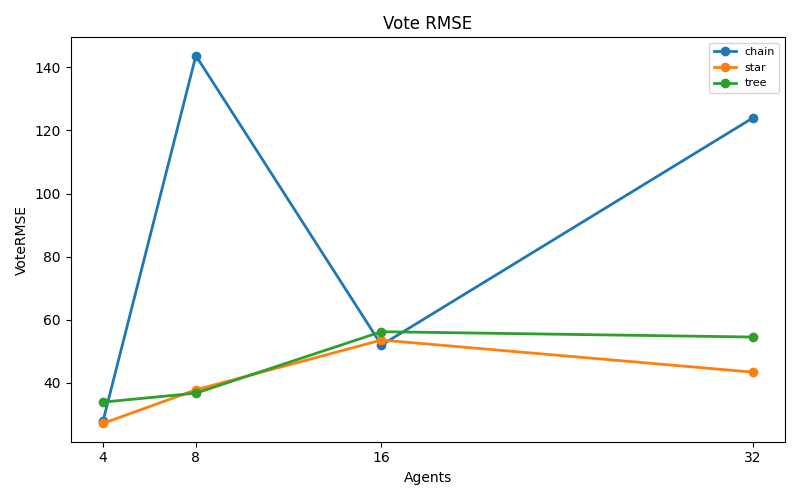
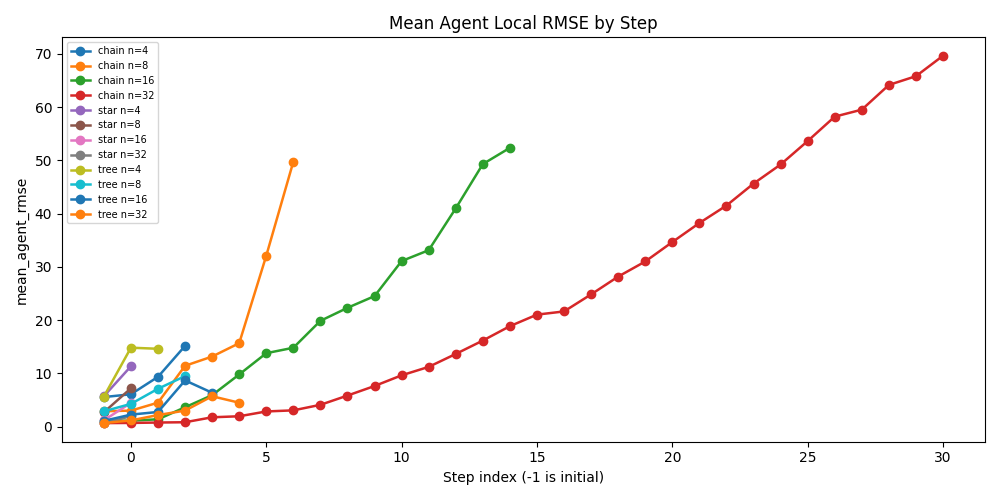
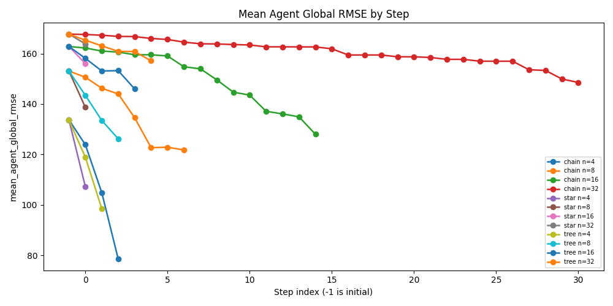
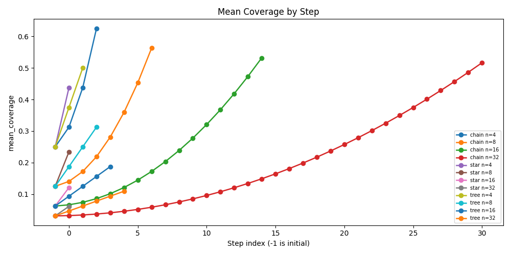

# CF Protocol Topology Experiment

## Configuration

- Array size: `5000`
- Value range: `[1, 1000]`
- Seeds: `[1]`
- Agent counts: `[4, 8, 16, 32]`
- Topologies: `['chain', 'star', 'tree']`
- Merge modes: `['llm_full_merge']`
- Init modes: `['llm_local_solve']`
- Provider: `openai`
- Model: `gpt-4o`

## Aggregate Results

| Topology | Agents | MergeMode | InitMode | Runs | MeanFinalRMSE | StdFinalRMSE | MeanAverageRMSE | ExactMatchRate | MeanVoteRMSE | MeanFinalNormalizedL1Error | MeanTotalSteps | MeanTotalMessages | MeanTotalModelCalls | MeanTotalPromptTokens | MeanTotalCompletionTokens | MeanDeterministicFallbacks | MeanVoteTopRatio | MeanVoteAverageDisagreementRMSE |
| --- | --- | --- | --- | --- | --- | --- | --- | --- | --- | --- | --- | --- | --- | --- | --- | --- | --- | --- |
| chain | 4 | llm_full_merge | llm_local_solve | 1 | 28.035692 | 0.000000 | 28.035692 | 0.000000 | 28.035692 | 0.089600 | 3.000000 | 3.000000 | 7.000000 | 57186.000000 | 45448.000000 | 0.000000 | 1.000000 | 0.000000 |
| chain | 8 | llm_full_merge | llm_local_solve | 1 | 143.701079 | 0.000000 | 143.701079 | 0.000000 | 143.701079 | 0.797200 | 7.000000 | 7.000000 | 15.000000 | 118778.000000 | 74528.000000 | 0.000000 | 1.000000 | 0.000000 |
| chain | 16 | llm_full_merge | llm_local_solve | 1 | 52.000000 | 0.000000 | 52.000000 | 0.000000 | 52.000000 | 0.247600 | 15.000000 | 15.000000 | 31.000000 | 246737.000000 | 118443.000000 | 0.000000 | 1.000000 | 0.000000 |
| chain | 32 | llm_full_merge | llm_local_solve | 1 | 123.923363 | 0.000000 | 123.923363 | 0.000000 | 123.923363 | 0.657800 | 31.000000 | 31.000000 | 64.000000 | 524922.000000 | 169992.000000 | 0.000000 | 1.000000 | 0.000000 |
| star | 4 | llm_full_merge | llm_local_solve | 1 | 27.184554 | 0.000000 | 27.184554 | 0.000000 | 27.184554 | 0.086200 | 1.000000 | 3.000000 | 5.000000 | 34352.000000 | 31736.000000 | 0.000000 | 1.000000 | 0.000000 |
| star | 8 | llm_full_merge | llm_local_solve | 1 | 37.815341 | 0.000000 | 37.815341 | 0.000000 | 37.815341 | 0.152400 | 1.000000 | 7.000000 | 9.000000 | 40736.000000 | 41311.000000 | 0.000000 | 1.000000 | 0.000000 |
| star | 16 | llm_full_merge | llm_local_solve | 1 | 53.581713 | 0.000000 | 53.581713 | 0.000000 | 53.581713 | 0.245000 | 1.000000 | 15.000000 | 17.000000 | 47384.000000 | 40420.000000 | 0.000000 | 1.000000 | 0.000000 |
| star | 32 | llm_full_merge | llm_local_solve | 1 | 43.428102 | 0.000000 | 43.428102 | 0.000000 | 43.428102 | 0.191200 | 1.000000 | 31.000000 | 33.000000 | 55866.000000 | 39148.000000 | 0.000000 | 1.000000 | 0.000000 |
| tree | 4 | llm_full_merge | llm_local_solve | 1 | 33.911650 | 0.000000 | 33.911650 | 0.000000 | 33.911650 | 0.116800 | 2.000000 | 3.000000 | 7.000000 | 52720.000000 | 45251.000000 | 0.000000 | 1.000000 | 0.000000 |
| tree | 8 | llm_full_merge | llm_local_solve | 1 | 36.755952 | 0.000000 | 36.755952 | 0.000000 | 36.755952 | 0.154200 | 3.000000 | 7.000000 | 15.000000 | 87887.000000 | 74723.000000 | 0.000000 | 1.000000 | 0.000000 |
| tree | 16 | llm_full_merge | llm_local_solve | 1 | 56.231664 | 0.000000 | 56.231664 | 0.000000 | 56.231664 | 0.272800 | 4.000000 | 15.000000 | 31.000000 | 131065.000000 | 96432.000000 | 0.000000 | 1.000000 | 0.000000 |
| tree | 32 | llm_full_merge | llm_local_solve | 1 | 54.543561 | 0.000000 | 54.543561 | 0.000000 | 54.543561 | 0.265000 | 5.000000 | 31.000000 | 64.000000 | 196935.000000 | 144192.000000 | 0.000000 | 1.000000 | 0.000000 |

## Run Results

| Topology | Agents | MergeMode | InitMode | Seed | TotalSteps | TotalMessages | TotalModelCalls | TotalRetryAttempts | TotalDeterministicFallbacks | FinalRMSE | VoteRMSE | AverageRMSE | FinalNormalizedL1Error | FinalExactMatch | VoteTopRatio | Task | ArraySize | ValueMin | ValueMax | Provider | Model | Temperature | TotalPromptTokens | TotalCompletionTokens | AggregationMethod | SelectedPrimary | VoteNormalizedL1Error | AverageNormalizedL1Error | AverageIncludedAgents | VoteAverageDisagreementRMSE |
| --- | --- | --- | --- | --- | --- | --- | --- | --- | --- | --- | --- | --- | --- | --- | --- | --- | --- | --- | --- | --- | --- | --- | --- | --- | --- | --- | --- | --- | --- | --- |
| chain | 4 | llm_full_merge | llm_local_solve | 1 | 3 | 3 | 7 | 0 | 0 | 28.035692 | 28.035692 | 28.035692 | 0.089600 | False | 1.000000 | count_frequency_protocol | 5000 | 1 | 1000 | openai | gpt-4o | 0.000000 | 57186 | 45448 | vote | vote | 0.089600 | 0.089600 | 1 | 0.000000 |
| chain | 8 | llm_full_merge | llm_local_solve | 1 | 7 | 7 | 15 | 0 | 0 | 143.701079 | 143.701079 | 143.701079 | 0.797200 | False | 1.000000 | count_frequency_protocol | 5000 | 1 | 1000 | openai | gpt-4o | 0.000000 | 118778 | 74528 | vote | vote | 0.797200 | 0.797200 | 1 | 0.000000 |
| chain | 16 | llm_full_merge | llm_local_solve | 1 | 15 | 15 | 31 | 0 | 0 | 52.000000 | 52.000000 | 52.000000 | 0.247600 | False | 1.000000 | count_frequency_protocol | 5000 | 1 | 1000 | openai | gpt-4o | 0.000000 | 246737 | 118443 | vote | vote | 0.247600 | 0.247600 | 1 | 0.000000 |
| chain | 32 | llm_full_merge | llm_local_solve | 1 | 31 | 31 | 64 | 1 | 0 | 123.923363 | 123.923363 | 123.923363 | 0.657800 | False | 1.000000 | count_frequency_protocol | 5000 | 1 | 1000 | openai | gpt-4o | 0.000000 | 524922 | 169992 | vote | vote | 0.657800 | 0.657800 | 1 | 0.000000 |
| star | 4 | llm_full_merge | llm_local_solve | 1 | 1 | 3 | 5 | 0 | 0 | 27.184554 | 27.184554 | 27.184554 | 0.086200 | False | 1.000000 | count_frequency_protocol | 5000 | 1 | 1000 | openai | gpt-4o | 0.000000 | 34352 | 31736 | vote | vote | 0.086200 | 0.086200 | 1 | 0.000000 |
| star | 8 | llm_full_merge | llm_local_solve | 1 | 1 | 7 | 9 | 0 | 0 | 37.815341 | 37.815341 | 37.815341 | 0.152400 | False | 1.000000 | count_frequency_protocol | 5000 | 1 | 1000 | openai | gpt-4o | 0.000000 | 40736 | 41311 | vote | vote | 0.152400 | 0.152400 | 1 | 0.000000 |
| star | 16 | llm_full_merge | llm_local_solve | 1 | 1 | 15 | 17 | 0 | 0 | 53.581713 | 53.581713 | 53.581713 | 0.245000 | False | 1.000000 | count_frequency_protocol | 5000 | 1 | 1000 | openai | gpt-4o | 0.000000 | 47384 | 40420 | vote | vote | 0.245000 | 0.245000 | 1 | 0.000000 |
| star | 32 | llm_full_merge | llm_local_solve | 1 | 1 | 31 | 33 | 0 | 0 | 43.428102 | 43.428102 | 43.428102 | 0.191200 | False | 1.000000 | count_frequency_protocol | 5000 | 1 | 1000 | openai | gpt-4o | 0.000000 | 55866 | 39148 | vote | vote | 0.191200 | 0.191200 | 1 | 0.000000 |
| tree | 4 | llm_full_merge | llm_local_solve | 1 | 2 | 3 | 7 | 0 | 0 | 33.911650 | 33.911650 | 33.911650 | 0.116800 | False | 1.000000 | count_frequency_protocol | 5000 | 1 | 1000 | openai | gpt-4o | 0.000000 | 52720 | 45251 | vote | vote | 0.116800 | 0.116800 | 1 | 0.000000 |
| tree | 8 | llm_full_merge | llm_local_solve | 1 | 3 | 7 | 15 | 0 | 0 | 36.755952 | 36.755952 | 36.755952 | 0.154200 | False | 1.000000 | count_frequency_protocol | 5000 | 1 | 1000 | openai | gpt-4o | 0.000000 | 87887 | 74723 | vote | vote | 0.154200 | 0.154200 | 1 | 0.000000 |
| tree | 16 | llm_full_merge | llm_local_solve | 1 | 4 | 15 | 31 | 0 | 0 | 56.231664 | 56.231664 | 56.231664 | 0.272800 | False | 1.000000 | count_frequency_protocol | 5000 | 1 | 1000 | openai | gpt-4o | 0.000000 | 131065 | 96432 | vote | vote | 0.272800 | 0.272800 | 1 | 0.000000 |
| tree | 32 | llm_full_merge | llm_local_solve | 1 | 5 | 31 | 64 | 1 | 0 | 54.543561 | 54.543561 | 54.543561 | 0.265000 | False | 1.000000 | count_frequency_protocol | 5000 | 1 | 1000 | openai | gpt-4o | 0.000000 | 196935 | 144192 | vote | vote | 0.265000 | 0.265000 | 1 | 0.000000 |

This experiment uses the existing AgentState, BeliefState, and OutboxMessage data path. The protocol runner changes only which agents send and receive on each communication step.

Agent-step RMSE is local by default: each agent answer is compared with the scoring-only truth for the source shards currently carried by that agent. `global_rmse` is recorded in parallel against the full global answer. RMSE is computed as root-sum-squared count error over the value domain, without dividing by domain size.

Per-agent, per-frame local error is written to `agent_local_error_table.md`.

## Visualizations

