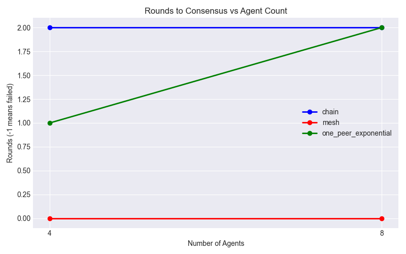
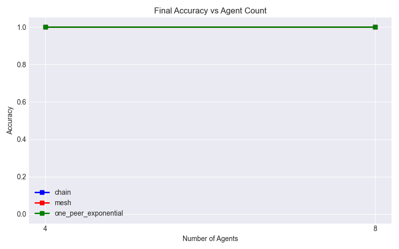
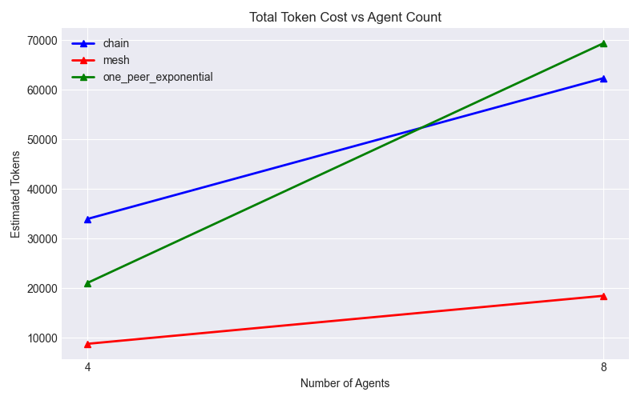

# LLM Multi-Agent Topology Experiment Report

**Model Used:** Moonshot Kimi-K2.5 via SiliconFlow

## Overview

This experiment verifies the performance characteristics of different communication topologies (`chain`, `mesh`, `one_peer_exponential`) in a distributed array search problem. As agent count scales, the ideal topology should reach consensus quickly with minimal token overhead and high accuracy.

## Raw Results Data

| Topology             |   Agents |   RoundsToConsensus | FinalAccuracy   |   ModelCalls |   TokenCost |
|:---------------------|---------:|--------------------:|:----------------|-------------:|------------:|
| chain                |        4 |                   2 | True            |           12 |       33978 |
| chain                |        8 |                   2 | True            |           24 |       62323 |
| mesh                 |        4 |                   0 | True            |            4 |        8814 |
| mesh                 |        8 |                   0 | True            |            8 |       18482 |
| one_peer_exponential |        4 |                   1 | True            |            8 |       21096 |
| one_peer_exponential |        8 |                   2 | True            |           24 |       69347 |

## Hypothesis & Findings

- **Chain Graphs**: Prone to slower propagation and fragmented consensus, particularly as agent counts scale.
- **Mesh Graphs**: Provides rapid global visibility but at an immense prompt token cost and contextual redundancy.
- **One-Peer Exponential Graphs**: Ideally maintains O(log N) propagation speed, mimicking mesh effectiveness without the geometric explosion in context cost.

## Visualizations

### 1. Rounds to Consensus
*(Lower is better. A value of `-1` indicates consensus was never reached within `MAX_ROUNDS`)*

### 2. Final Accuracy
*(Higher is better. Max is `1.0`)*

### 3. Total Token Cost
*(Lower is better)*

