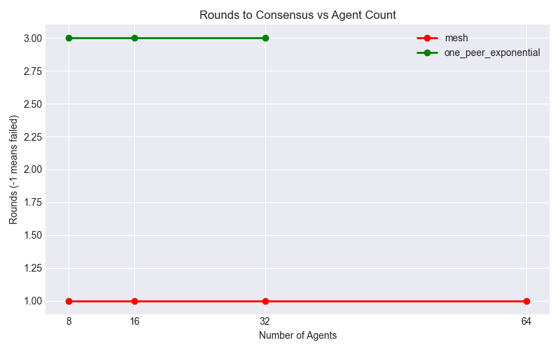
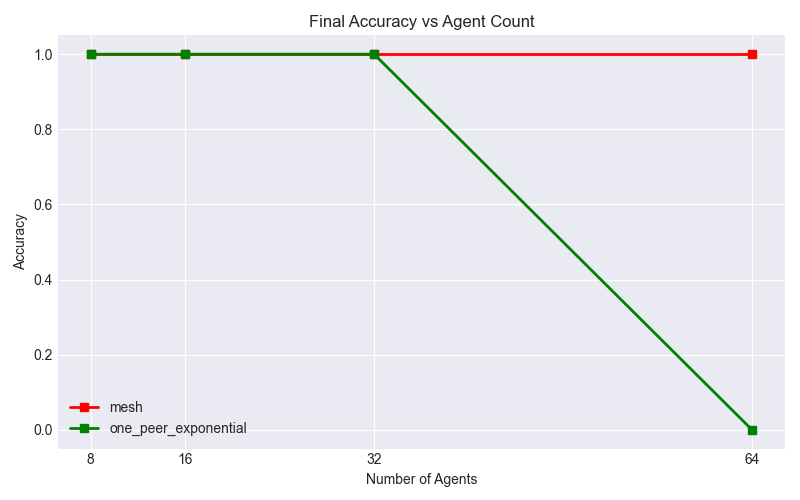
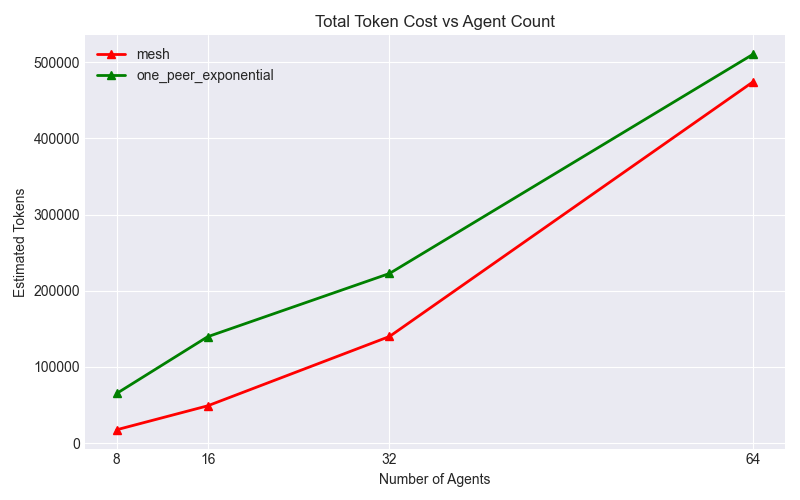

# LLM Multi-Agent Topology Experiment Report

**Model Used:** gemma4:e4b via local Ollama (Metal/MLX)

## Overview

This experiment compares `mesh`, `one_peer_exponential`, and `ring` topologies on a distributed array search problem, scaling from 8 to 64 agents. Inference runs locally on Apple Silicon with Ollama + Metal acceleration.

## Raw Results Data

| Topology             |   Agents |   RoundsToConsensus | FinalAccuracy   |   ModelCalls |   TokenCost |
|:---------------------|---------:|--------------------:|:----------------|-------------:|------------:|
| mesh                 |        8 |                   1 | True            |            8 |       17619 |
| mesh                 |       16 |                   1 | True            |           16 |       49022 |
| mesh                 |       32 |                   1 | True            |           32 |      140053 |
| mesh                 |       64 |                   1 | True            |           64 |      474439 |
| one_peer_exponential |        8 |                   3 | True            |           24 |       65310 |
| one_peer_exponential |       16 |                   3 | True            |           48 |      139742 |
| one_peer_exponential |       32 |                   3 | True            |           96 |      222757 |
| one_peer_exponential |       64 |                 nan | False           |          192 |      510620 |

## Hypothesis & Findings

- **Mesh**: Global visibility in one round but token cost grows O(n²).
- **One-Peer Exponential**: O(log n) propagation, minimising context explosion while approaching mesh quality.
- **Ring**: Linear propagation (O(n) rounds to reach all agents); serves as a baseline for sparse, local-only communication.

## Visualizations

### 1. Rounds to Consensus
*(Lower is better. `-1` means consensus was never reached within `MAX_ROUNDS`)*

### 2. Final Accuracy
*(Higher is better. Max is `1.0`)*

### 3. Total Token Cost
*(Lower is better)*

