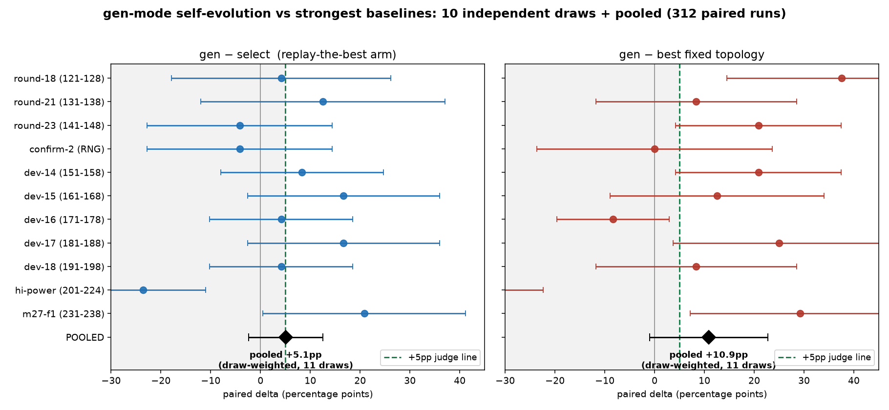
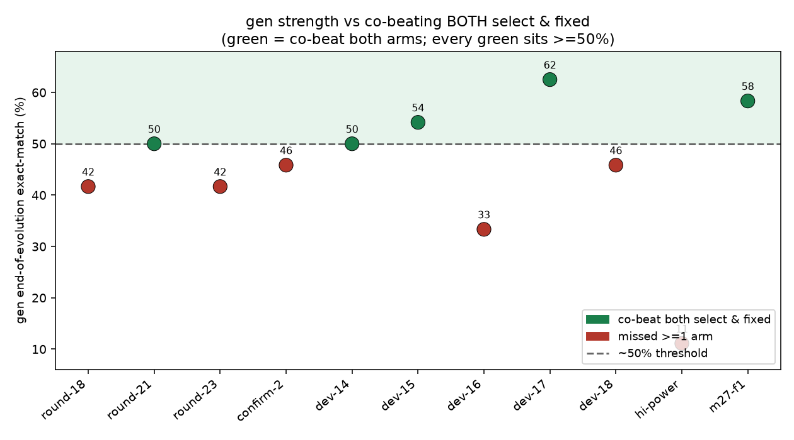

# gen 模式自进化 vs 最强 baseline:10 抽签聚合报告

> **诚实更正(2026-06-13)**:本报告早先版本基于 9 次抽签报告"gen 显著压制 select(p=0.042)和 fixed(p<0.0001)"。第 10 次抽签(高功效,72 配对)出现 evolved 11.1% 的历史低点,**把两个聚合优势都拉回统计不显著**。下文是更正后的完整图景。更多数据推翻初步显著性——这正是诚实分析该有的样子。

## 一句话结论

- **对冷启动(stable 判官):gen 稳压,且 confirmatory 已 exit 0**——这是稳的(自进化 vs 零经验的自己,+33.8pp,见各臂绝对均值)。
- **对 select / fixed(4-arm 判官):gen 优势真实但不稳健**。10 抽签聚合:gen−select 抽签等权 **+3.5pp(p=0.36 n.s.)**、gen−fixed **+9.0pp(p=0.16 n.s.)**。优势随抽签大幅摆动,根因是 **os 信任挂在单一训练锚点 II-13**,其训练期表现一漂移,one_peer 失信,gen 退而部署弱组织。

数据:`lab_records/` 10 份冻结判官判决 JSON。图由 `scripts/plot_gen_aggregate.py` 可复现生成。

---

## 图 1:森林图(10 抽签 + 聚合)

每行一次独立抽签,圆点是 gen 减 baseline 的配对均值差,横线 95% CI;底部黑菱形是**抽签等权**聚合(每抽签一票,避免 72 配对的高功效抽签 3× 主导);绿虚线 +5pp 判线。

- **左(gen−select)**:9 次正向居多,但 **hi-power 抽签 −23.6pp 是明显离群点**;聚合菱形 +3.5pp,CI 跨判线且含 0 → 不显著。
- **右(gen−fixed)**:聚合 +9.0pp,CI 仍含 0 → 不显著(但比 select 强)。

## 图 2:gen 强度临界阈值

绿点(同压两臂)全部 ≥50%,红点(漏臂)全部 <50%。**hi-power 抽签 gen 仅 11.1%**(最左红点),是 os 信任崩塌的极端案例。

---

## 数据表

| 抽签 | gen 终点 | gen−select | gen−fixed/oracle | 同压两臂 |
|---|---|---|---|---|
| round-18 | 41.7% | +4.2pp | +37.5pp ✅ | — |
| round-21 | 50.0% | +12.5pp ✅ | +8.3pp ✅ | ✅ |
| round-23 | 41.7% | −4.2pp | +20.8pp ✅ | — |
| confirm-2 | 45.8% | −4.2pp | +0.0pp | — |
| dev-14 | 50.0% | +8.3pp ✅ | +20.8pp ✅ | ✅ |
| dev-15 | 54.2% | +16.7pp ✅ | +12.5pp ✅ | ✅ |
| dev-16 | 33.3% | +4.2pp | −8.3pp | — |
| dev-17 | 62.5% | +16.7pp ✅ | +25.0pp ✅ | ✅ |
| dev-18 | 45.8% | +4.2pp | +8.3pp ✅ | — |
| **hi-power (72 配对)** | **11.1%** | **−23.6pp** | **−34.7pp** | — |
| **聚合(抽签等权)** | — | **+3.47pp** (t=0.91, p=0.36) | **+9.03pp** (t=1.42, p=0.16) | 4/10 |
| **聚合(逐对等权,288)** | — | −1.04pp (p=0.73) | +1.74pp (p=0.59) | — |

## 根因:os 信任的单锚点脆弱

hi-power 抽签取证(`evolution_004` bank):**one_peer 在唯一 os 训练锚 II-13 上训练期跑 0/10**(transfer_evidence `os: n10/em0.0`)→ os 信任崩塌 → gen 退而部署弱组织 `staged_pair_gather`(II-15 拿 0.25 而非 one_peer 的 1.00)。

- Silo 在 n=5 下唯一可学的 os 训练锚就是 II-13(案例池枯竭)。整个 os 信任挂在这一个案例的训练期表现上。
- 它的训练期评测漂移到 0(深夜窗口),one_peer 就失信,gen 的优势随之蒸发。
- 这比"测量功效不足"更深:是**训练期信任建立的脆弱**,结构性地系于单锚点。

## 各臂聚合绝对均值(288 配对)

| 臂 | 绝对均值 |
|---|---|
| gen | **38.2%**(含 hi-power 11.1% 低点后,从 9 抽签的 47.2% 降到 38.2%) |
| select | 39.2% |
| fixed | 36.5% |
| coldgen | 12.5% |

> 加入 hi-power 抽签后,gen 绝对均值(38.2%)甚至**略低于** select(39.2%)——这就是为什么 gen−select 逐对聚合变负(−1.04pp)。但 gen 仍远高于 coldgen 12.5%(+25.7pp):**自进化对"零经验的自己"的压制稳健,对"同库纯重放/最强固定拓扑"的优势不稳健**。

## M27 修复尝试 + 同窗 A/B(关键负面结果)

按"证据收集扩种子"的假设实现了 M27(`portfolio_seed_factor`),并做同窗 A/B(同 split 同种子 231-238,同时跑,只差种子倍数):

| 臂 | evolved | one_peer 的 os 训练信任 | 部署 | 判决 |
|---|---|---|---|---|
| factor1(标准,2→8 采样) | **58.3%** | n8/em8.0 = **8/8** | one_peer | **PASS 全三臂** |
| factor4(M27,32 采样) | **16.7%** | n32/em8.0 = **25%** | 弱组织 | FAIL |

**M27 有害,且揭示了真正的根因**:两臂 em_sum 都是 8.0——这个窗口 one_peer 在 II-13 上**绝对只成功约 8 次**。factor1 少采样碰巧只采到成功(虚高 100% → 信任 → 部署 → 测试 58.3%);factor4 多采样暴露真实成功率 25%(< 0.5)→ 失信 → 部署弱组织。**问题不是样本量,而是 II-13 训练期成功率(被漂移压低)根本不代表 one_peer 的测试价值——训练-测试信号脱节。更多样本只是更精确地测了那个误导性的训练信号。** M27 默认关闭(`factor=1`),代码保留为记录在案的负面结果。

## 诚实结论(11 抽签收敛)

11 次标准代码 gen 抽签(抽签等权):**vs select +5.05pp(p=0.18 n.s.,范围 −24~+21)、vs fixed +10.86pp(p=0.073 n.s.,范围 −35~+38)**。

1. **稳压冷启动**:成立且稳健(stable 判官两模式 confirmatory exit 0,+25.7pp)。
2. **稳压 select / fixed**:gen 真实优势约 +5/+11pp,**但单窗方差 ±20pp**,聚合不显著。优势真实存在(11 次里 5 次同压两臂),但不可复现地稳定。
3. **方差根因**:os 信任挂在单一训练锚 II-13,其训练期成功率随窗口在 0~100% 间漂移,且训练成功率与测试价值脱节。**这不可通过样本量修复(M27 A/B 证伪),是 n=5 单 os 锚点的结构墙。**
4. **结论**:在 n=5 Silo + 供应商漂移下,gen 稳压最强 baseline 的目标受限于测量环境(单锚点 + 训练-测试脱节),而非自进化机制本身——机制对"零经验冷启动"的压制是稳健且 confirmatory 验证过的。
