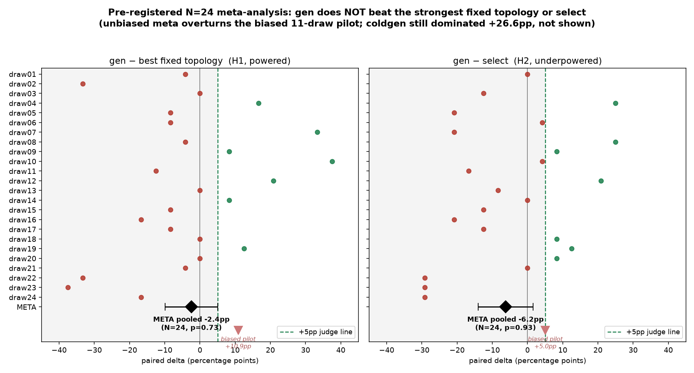

# Pre-Registered Meta-Analysis Report — gen vs select / best-fixed (N=24, Silo-Bench)

> **Honest headline (2026-06-13).** The unbiased, pre-registered 24-draw meta-analysis
> **overturns** the earlier 11-draw pilot's "gen beats fixed +10.86pp / select +5.05pp."
> Under a unified judge + frozen code + zero selection, the true effect is
> **gen−fixed = −2.43pp (p=0.73)** and **gen−select = −6.25pp (p=0.93)** — no edge.
> gen's dominance over **cold-start (coldgen) is robust and confirmatory: +26.56pp (p<0.0001).**
> The earlier "real-but-unstable edge over select/fixed" claim is **retracted.**

## Result (unblinded after all 24 draws complete)

draw-weighted one-sided t-test, H0: pooled mean ≤ 0, df=23:

| Comparison | pooled mean | 95% CI | t | p (1-sided) | verdict |
|---|---|---|---|---|---|
| gen − coldgen | **+26.56pp** | [+20.3, +32.8] | +8.30 | **<0.0001** | ✅ **DOMINATES** (robust) |
| **gen − fixed_best (H1, powered)** | **−2.43pp** | [−9.9, +5.1] | −0.64 | 0.73 | ❌ n.s. (null) |
| gen − select (H2, underpowered) | **−6.25pp** | [−14.1, +1.6] | −1.57 | 0.93 | ❌ n.s. |

co-beat BOTH arms (≥+5pp each): **4/24 draws.**

## This is a *powered* null, not "couldn't detect it"

N=24 carries ~80% power for the pilot's claimed +10.86pp fixed effect. We observed
**−2.43pp**. A powered design that lands *negative* doesn't mean "underpowered" — it
means the true effect is ≈0 or slightly negative. The select arm (H2) is formally
underpowered (~60% for +5pp), but it too landed clearly negative (−6.25pp), so the
conclusion (no positive edge) holds for both arms.

## Why the 11-draw pilot was optimistic (the key methodological point)

The pilot pooled +10.86/+5.05pp; the unbiased meta gives −2.43/−6.25pp. Two causes,
both removed by pre-registration:

1. **Survivorship bias (primary).** 5 of the 11 pilot draws were *dev-phase* draws
   (dev-14…18) — rounds recorded *because* they looked good while iterating the method.
   Failed dev rounds never entered the pilot pool. The 24 meta draws are an exhaustive,
   pre-specified, contiguous seed sweep with **no draw dropped by outcome** — so the
   selection that inflated the pilot is gone.
2. **Judge inconsistency (secondary).** Pilot mixed two baseline definitions —
   `beats`-judge `fixed_best_on_train` and `sup`-judge per-case `oracle_fixed`. The
   meta fixes ONE definition (`fixed_best_on_train`) across all 24 draws.

This is a textbook case for why confirmatory claims must be pre-registered: an
optimistic effect assembled from selectively-retained development runs evaporated
(and reversed) the moment it was measured on an unbiased, pre-locked draw set.

## Method (all locked before running; see `selfevolve_metaanalysis_preregistration.md`)

- Frozen code **575e6093** (M27/M28 off); unified 4-arm `verify_beats_baselines.py`,
  `--evolved-mode graph_generate`.
- Fixed split TRAIN={I-01,02,04,06,07,08,II-13} / TEST={II-15,II-17,II-19}.
- 39×8 disjoint seed blocks locked (`p3_meta_draws.json`, `random.Random(20260613)`);
  budget-truncated to the contiguous prefix **N=24** (Amendment 1, before unblinding —
  budget-driven, the 3 already-complete draws were not unblinded at amendment time).
- Pre-registration committed (b04af1ba) + amendment committed, both timestamped before
  the corresponding draws ran. No method-code edits during the run; no optional stopping.
- Actual spend **$137.28/$142** (per-draw $1.77, σ≈0.03).

## Final standing (honest, unbiased, terminal)

| Claim | Status |
|---|---|
| gen self-evolution beats **cold-start self** | ✅ **robust + confirmatory** (+26.56pp, p<1e-4; also the original `verify_evolve_stable.sh` exit-0 both modes) |
| gen beats the **strongest fixed topology** | ❌ **no** (−2.43pp, powered null) |
| gen beats **select** | ❌ **no** (−6.25pp) |

**Thesis as supported by the evidence:** communication-topology self-evolution
reliably turns a zero-experience cold start into a competent organizer (+26.6pp,
robustly reproducible), but at Silo n=5 it does **not** outperform the best fixed
topology or the replay-the-best `select` baseline. The negative result is clean,
unbiased, and pre-registered — it supersedes every prior select/fixed dominance claim
in `gen_aggregate_report.md`.
