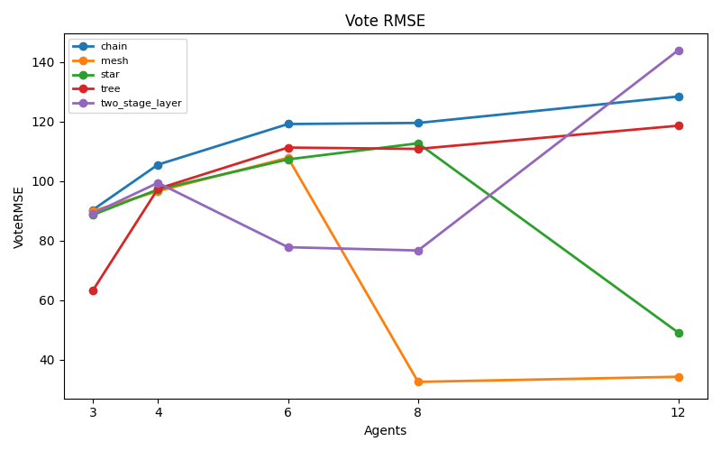
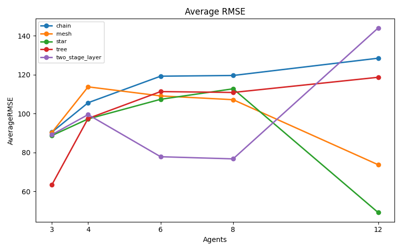
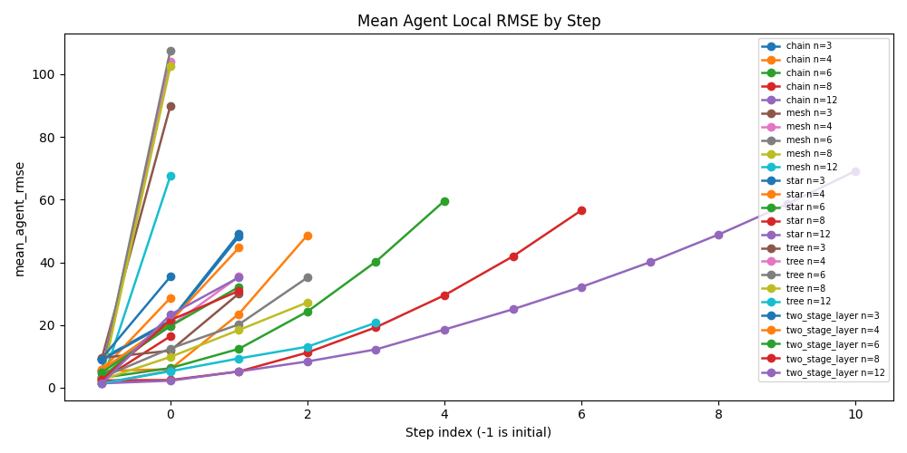
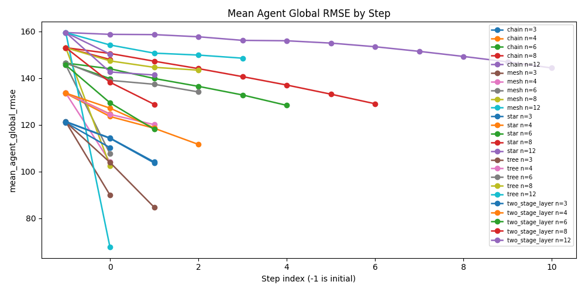
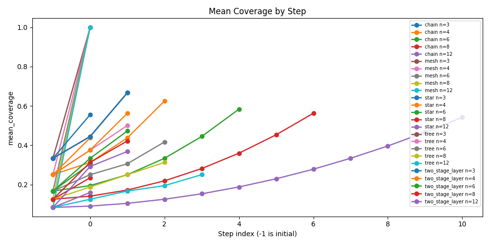

# CF Protocol Topology Experiment

## Configuration

- Array size: `5000`
- Value range: `[1, 1000]`
- Seeds: `[1]`
- Agent counts: `[3, 4, 6, 8, 12]`
- Topologies: `['chain', 'mesh', 'star', 'tree', 'two_stage_layer']`
- Merge modes: `['llm_full_merge']`
- Init modes: `['llm_local_solve']`
- Provider: `openai`
- Model: `gpt-4o`

## Aggregate Results

| Topology | Agents | MergeMode | InitMode | Runs | MeanFinalRMSE | StdFinalRMSE | MeanAverageRMSE | ExactMatchRate | MeanVoteRMSE | MeanFinalNormalizedL1Error | MeanTotalSteps | MeanTotalMessages | MeanTotalModelCalls | MeanTotalPromptTokens | MeanTotalCompletionTokens | MeanDeterministicFallbacks | MeanVoteTopRatio | MeanVoteAverageDisagreementRMSE |
| --- | --- | --- | --- | --- | --- | --- | --- | --- | --- | --- | --- | --- | --- | --- | --- | --- | --- | --- |
| chain | 3 | llm_full_merge | llm_local_solve | 1 | 90.388052 | 0.000000 | 90.388052 | 0.000000 | 90.388052 | 0.483600 | 2.000000 | 2.000000 | 5.000000 | 38415.000000 | 40964.000000 | 0.000000 | 1.000000 | 0.000000 |
| chain | 4 | llm_full_merge | llm_local_solve | 1 | 105.560409 | 0.000000 | 105.560409 | 0.000000 | 105.560409 | 0.553800 | 3.000000 | 3.000000 | 7.000000 | 47645.000000 | 41482.000000 | 0.000000 | 1.000000 | 0.000000 |
| chain | 6 | llm_full_merge | llm_local_solve | 1 | 119.209899 | 0.000000 | 119.209899 | 0.000000 | 119.209899 | 0.650600 | 5.000000 | 5.000000 | 11.000000 | 63542.000000 | 57824.000000 | 0.000000 | 1.000000 | 0.000000 |
| chain | 8 | llm_full_merge | llm_local_solve | 1 | 119.574245 | 0.000000 | 119.574245 | 0.000000 | 119.574245 | 0.655200 | 7.000000 | 7.000000 | 15.000000 | 77968.000000 | 76083.000000 | 0.000000 | 1.000000 | 0.000000 |
| chain | 12 | llm_full_merge | llm_local_solve | 1 | 128.460111 | 0.000000 | 128.460111 | 0.000000 | 128.460111 | 0.720800 | 11.000000 | 11.000000 | 23.000000 | 90604.000000 | 82327.000000 | 0.000000 | 1.000000 | 0.000000 |
| mesh | 3 | llm_full_merge | llm_local_solve | 1 | 89.966660 | 0.000000 | 90.238573 | 0.000000 | 89.966660 | 0.483200 | 1.000000 | 6.000000 | 6.000000 | 64078.000000 | 39117.000000 | 0.000000 | 0.333333 | 2.449490 |
| mesh | 4 | llm_full_merge | llm_local_solve | 1 | 96.654022 | 0.000000 | 113.732141 | 0.000000 | 96.654022 | 0.526000 | 1.000000 | 12.000000 | 8.000000 | 90204.000000 | 48942.000000 | 0.000000 | 0.250000 | 15.297059 |
| mesh | 6 | llm_full_merge | llm_local_solve | 1 | 107.865657 | 0.000000 | 109.068786 | 0.000000 | 107.865657 | 0.594600 | 1.000000 | 30.000000 | 12.000000 | 154936.000000 | 68161.000000 | 0.000000 | 0.166667 | 6.082763 |
| mesh | 8 | llm_full_merge | llm_local_solve | 1 | 32.526912 | 0.000000 | 107.126094 | 0.000000 | 32.526912 | 0.130000 | 1.000000 | 56.000000 | 16.000000 | 209110.000000 | 86909.000000 | 0.000000 | 0.125000 | 100.359354 |
| mesh | 12 | llm_full_merge | llm_local_solve | 1 | 34.234486 | 0.000000 | 73.681748 | 0.000000 | 34.234486 | 0.142800 | 1.000000 | 132.000000 | 24.000000 | 341476.000000 | 114562.000000 | 0.000000 | 0.083333 | 54.781384 |
| star | 3 | llm_full_merge | llm_local_solve | 1 | 88.662281 | 0.000000 | 88.662281 | 0.000000 | 88.662281 | 0.476200 | 1.000000 | 2.000000 | 4.000000 | 32066.000000 | 25035.000000 | 0.000000 | 1.000000 | 0.000000 |
| star | 4 | llm_full_merge | llm_local_solve | 1 | 97.231682 | 0.000000 | 97.231682 | 0.000000 | 97.231682 | 0.529600 | 1.000000 | 3.000000 | 5.000000 | 34764.000000 | 27736.000000 | 0.000000 | 1.000000 | 0.000000 |
| star | 6 | llm_full_merge | llm_local_solve | 1 | 107.321946 | 0.000000 | 107.321946 | 0.000000 | 107.321946 | 0.590800 | 1.000000 | 5.000000 | 7.000000 | 38889.000000 | 31570.000000 | 0.000000 | 1.000000 | 0.000000 |
| star | 8 | llm_full_merge | llm_local_solve | 1 | 112.729765 | 0.000000 | 112.729765 | 0.000000 | 112.729765 | 0.622400 | 1.000000 | 7.000000 | 9.000000 | 41506.000000 | 37335.000000 | 0.000000 | 1.000000 | 0.000000 |
| star | 12 | llm_full_merge | llm_local_solve | 1 | 49.101935 | 0.000000 | 49.101935 | 0.000000 | 49.101935 | 0.222600 | 1.000000 | 11.000000 | 13.000000 | 45770.000000 | 41304.000000 | 0.000000 | 1.000000 | 0.000000 |
| tree | 3 | llm_full_merge | llm_local_solve | 1 | 63.300869 | 0.000000 | 63.300869 | 0.000000 | 63.300869 | 0.313800 | 2.000000 | 2.000000 | 5.000000 | 38493.000000 | 35926.000000 | 0.000000 | 1.000000 | 0.000000 |
| tree | 4 | llm_full_merge | llm_local_solve | 1 | 97.462813 | 0.000000 | 97.462813 | 0.000000 | 97.462813 | 0.531000 | 2.000000 | 3.000000 | 7.000000 | 47059.000000 | 40816.000000 | 0.000000 | 1.000000 | 0.000000 |
| tree | 6 | llm_full_merge | llm_local_solve | 1 | 111.296900 | 0.000000 | 111.296900 | 0.000000 | 111.296900 | 0.612600 | 3.000000 | 5.000000 | 11.000000 | 61670.000000 | 55775.000000 | 0.000000 | 1.000000 | 0.000000 |
| tree | 8 | llm_full_merge | llm_local_solve | 1 | 110.842230 | 0.000000 | 110.842230 | 0.000000 | 110.842230 | 0.611200 | 3.000000 | 7.000000 | 15.000000 | 71225.000000 | 68199.000000 | 0.000000 | 1.000000 | 0.000000 |
| tree | 12 | llm_full_merge | llm_local_solve | 1 | 118.646534 | 0.000000 | 118.646534 | 0.000000 | 118.646534 | 0.655400 | 4.000000 | 11.000000 | 23.000000 | 92564.000000 | 85013.000000 | 0.000000 | 1.000000 | 0.000000 |
| two_stage_layer | 3 | llm_full_merge | llm_local_solve | 1 | 89.129120 | 0.000000 | 89.129120 | 0.000000 | 89.129120 | 0.478800 | 2.000000 | 2.000000 | 5.000000 | 38335.000000 | 31726.000000 | 0.000000 | 1.000000 | 0.000000 |
| two_stage_layer | 4 | llm_full_merge | llm_local_solve | 1 | 99.448479 | 0.000000 | 99.448479 | 0.000000 | 99.448479 | 0.542000 | 2.000000 | 3.000000 | 6.000000 | 41270.000000 | 34616.000000 | 0.000000 | 1.000000 | 0.000000 |
| two_stage_layer | 6 | llm_full_merge | llm_local_solve | 1 | 77.794601 | 0.000000 | 77.794601 | 0.000000 | 77.794601 | 0.389200 | 2.000000 | 8.000000 | 9.000000 | 65038.000000 | 46968.000000 | 0.000000 | 1.000000 | 0.000000 |
| two_stage_layer | 8 | llm_full_merge | llm_local_solve | 1 | 76.694198 | 0.000000 | 76.694198 | 0.000000 | 76.694198 | 0.390800 | 2.000000 | 15.000000 | 12.000000 | 84638.000000 | 58185.000000 | 0.000000 | 1.000000 | 0.000000 |
| two_stage_layer | 12 | llm_full_merge | llm_local_solve | 1 | 144.010416 | 0.000000 | 144.010416 | 0.000000 | 144.010416 | 0.799000 | 2.000000 | 35.000000 | 18.000000 | 130834.000000 | 71160.000000 | 0.000000 | 1.000000 | 0.000000 |

## Run Results

| Topology | Agents | MergeMode | InitMode | Seed | TotalSteps | TotalMessages | TotalModelCalls | TotalRetryAttempts | TotalDeterministicFallbacks | FinalRMSE | VoteRMSE | AverageRMSE | FinalNormalizedL1Error | FinalExactMatch | VoteTopRatio | Task | ArraySize | ValueMin | ValueMax | Provider | Model | Temperature | TotalPromptTokens | TotalCompletionTokens | AggregationMethod | SelectedPrimary | VoteNormalizedL1Error | AverageNormalizedL1Error | AverageIncludedAgents | VoteAverageDisagreementRMSE |
| --- | --- | --- | --- | --- | --- | --- | --- | --- | --- | --- | --- | --- | --- | --- | --- | --- | --- | --- | --- | --- | --- | --- | --- | --- | --- | --- | --- | --- | --- | --- |
| chain | 3 | llm_full_merge | llm_local_solve | 1 | 2 | 2 | 5 | 0 | 0 | 90.388052 | 90.388052 | 90.388052 | 0.483600 | False | 1.000000 | count_frequency_protocol | 5000 | 1 | 1000 | openai | gpt-4o | 0.000000 | 38415 | 40964 | vote | vote | 0.483600 | 0.483600 | 1 | 0.000000 |
| chain | 4 | llm_full_merge | llm_local_solve | 1 | 3 | 3 | 7 | 0 | 0 | 105.560409 | 105.560409 | 105.560409 | 0.553800 | False | 1.000000 | count_frequency_protocol | 5000 | 1 | 1000 | openai | gpt-4o | 0.000000 | 47645 | 41482 | vote | vote | 0.553800 | 0.553800 | 1 | 0.000000 |
| chain | 6 | llm_full_merge | llm_local_solve | 1 | 5 | 5 | 11 | 0 | 0 | 119.209899 | 119.209899 | 119.209899 | 0.650600 | False | 1.000000 | count_frequency_protocol | 5000 | 1 | 1000 | openai | gpt-4o | 0.000000 | 63542 | 57824 | vote | vote | 0.650600 | 0.650600 | 1 | 0.000000 |
| chain | 8 | llm_full_merge | llm_local_solve | 1 | 7 | 7 | 15 | 0 | 0 | 119.574245 | 119.574245 | 119.574245 | 0.655200 | False | 1.000000 | count_frequency_protocol | 5000 | 1 | 1000 | openai | gpt-4o | 0.000000 | 77968 | 76083 | vote | vote | 0.655200 | 0.655200 | 1 | 0.000000 |
| chain | 12 | llm_full_merge | llm_local_solve | 1 | 11 | 11 | 23 | 0 | 0 | 128.460111 | 128.460111 | 128.460111 | 0.720800 | False | 1.000000 | count_frequency_protocol | 5000 | 1 | 1000 | openai | gpt-4o | 0.000000 | 90604 | 82327 | vote | vote | 0.720800 | 0.720800 | 1 | 0.000000 |
| star | 3 | llm_full_merge | llm_local_solve | 1 | 1 | 2 | 4 | 0 | 0 | 88.662281 | 88.662281 | 88.662281 | 0.476200 | False | 1.000000 | count_frequency_protocol | 5000 | 1 | 1000 | openai | gpt-4o | 0.000000 | 32066 | 25035 | vote | vote | 0.476200 | 0.476200 | 1 | 0.000000 |
| star | 4 | llm_full_merge | llm_local_solve | 1 | 1 | 3 | 5 | 0 | 0 | 97.231682 | 97.231682 | 97.231682 | 0.529600 | False | 1.000000 | count_frequency_protocol | 5000 | 1 | 1000 | openai | gpt-4o | 0.000000 | 34764 | 27736 | vote | vote | 0.529600 | 0.529600 | 1 | 0.000000 |
| star | 6 | llm_full_merge | llm_local_solve | 1 | 1 | 5 | 7 | 0 | 0 | 107.321946 | 107.321946 | 107.321946 | 0.590800 | False | 1.000000 | count_frequency_protocol | 5000 | 1 | 1000 | openai | gpt-4o | 0.000000 | 38889 | 31570 | vote | vote | 0.590800 | 0.590800 | 1 | 0.000000 |
| star | 8 | llm_full_merge | llm_local_solve | 1 | 1 | 7 | 9 | 0 | 0 | 112.729765 | 112.729765 | 112.729765 | 0.622400 | False | 1.000000 | count_frequency_protocol | 5000 | 1 | 1000 | openai | gpt-4o | 0.000000 | 41506 | 37335 | vote | vote | 0.622400 | 0.622400 | 1 | 0.000000 |
| star | 12 | llm_full_merge | llm_local_solve | 1 | 1 | 11 | 13 | 0 | 0 | 49.101935 | 49.101935 | 49.101935 | 0.222600 | False | 1.000000 | count_frequency_protocol | 5000 | 1 | 1000 | openai | gpt-4o | 0.000000 | 45770 | 41304 | vote | vote | 0.222600 | 0.222600 | 1 | 0.000000 |
| tree | 3 | llm_full_merge | llm_local_solve | 1 | 2 | 2 | 5 | 0 | 0 | 63.300869 | 63.300869 | 63.300869 | 0.313800 | False | 1.000000 | count_frequency_protocol | 5000 | 1 | 1000 | openai | gpt-4o | 0.000000 | 38493 | 35926 | vote | vote | 0.313800 | 0.313800 | 1 | 0.000000 |
| tree | 4 | llm_full_merge | llm_local_solve | 1 | 2 | 3 | 7 | 0 | 0 | 97.462813 | 97.462813 | 97.462813 | 0.531000 | False | 1.000000 | count_frequency_protocol | 5000 | 1 | 1000 | openai | gpt-4o | 0.000000 | 47059 | 40816 | vote | vote | 0.531000 | 0.531000 | 1 | 0.000000 |
| tree | 6 | llm_full_merge | llm_local_solve | 1 | 3 | 5 | 11 | 0 | 0 | 111.296900 | 111.296900 | 111.296900 | 0.612600 | False | 1.000000 | count_frequency_protocol | 5000 | 1 | 1000 | openai | gpt-4o | 0.000000 | 61670 | 55775 | vote | vote | 0.612600 | 0.612600 | 1 | 0.000000 |
| tree | 8 | llm_full_merge | llm_local_solve | 1 | 3 | 7 | 15 | 0 | 0 | 110.842230 | 110.842230 | 110.842230 | 0.611200 | False | 1.000000 | count_frequency_protocol | 5000 | 1 | 1000 | openai | gpt-4o | 0.000000 | 71225 | 68199 | vote | vote | 0.611200 | 0.611200 | 1 | 0.000000 |
| tree | 12 | llm_full_merge | llm_local_solve | 1 | 4 | 11 | 23 | 0 | 0 | 118.646534 | 118.646534 | 118.646534 | 0.655400 | False | 1.000000 | count_frequency_protocol | 5000 | 1 | 1000 | openai | gpt-4o | 0.000000 | 92564 | 85013 | vote | vote | 0.655400 | 0.655400 | 1 | 0.000000 |
| mesh | 3 | llm_full_merge | llm_local_solve | 1 | 1 | 6 | 6 | 0 | 0 | 89.966660 | 89.966660 | 90.238573 | 0.483200 | False | 0.333333 | count_frequency_protocol | 5000 | 1 | 1000 | openai | gpt-4o | 0.000000 | 64078 | 39117 | vote | vote | 0.483200 | 0.485000 | 3 | 2.449490 |
| mesh | 4 | llm_full_merge | llm_local_solve | 1 | 1 | 12 | 8 | 0 | 0 | 96.654022 | 96.654022 | 113.732141 | 0.526000 | False | 0.250000 | count_frequency_protocol | 5000 | 1 | 1000 | openai | gpt-4o | 0.000000 | 90204 | 48942 | vote | vote | 0.526000 | 0.637000 | 4 | 15.297059 |
| mesh | 6 | llm_full_merge | llm_local_solve | 1 | 1 | 30 | 12 | 0 | 0 | 107.865657 | 107.865657 | 109.068786 | 0.594600 | False | 0.166667 | count_frequency_protocol | 5000 | 1 | 1000 | openai | gpt-4o | 0.000000 | 154936 | 68161 | vote | vote | 0.594600 | 0.601200 | 6 | 6.082763 |
| mesh | 8 | llm_full_merge | llm_local_solve | 1 | 1 | 56 | 16 | 0 | 0 | 32.526912 | 32.526912 | 107.126094 | 0.130000 | False | 0.125000 | count_frequency_protocol | 5000 | 1 | 1000 | openai | gpt-4o | 0.000000 | 209110 | 86909 | vote | vote | 0.130000 | 0.603600 | 8 | 100.359354 |
| mesh | 12 | llm_full_merge | llm_local_solve | 1 | 1 | 132 | 24 | 0 | 0 | 34.234486 | 34.234486 | 73.681748 | 0.142800 | False | 0.083333 | count_frequency_protocol | 5000 | 1 | 1000 | openai | gpt-4o | 0.000000 | 341476 | 114562 | vote | vote | 0.142800 | 0.398200 | 12 | 54.781384 |
| two_stage_layer | 3 | llm_full_merge | llm_local_solve | 1 | 2 | 2 | 5 | 0 | 0 | 89.129120 | 89.129120 | 89.129120 | 0.478800 | False | 1.000000 | count_frequency_protocol | 5000 | 1 | 1000 | openai | gpt-4o | 0.000000 | 38335 | 31726 | vote | vote | 0.478800 | 0.478800 | 1 | 0.000000 |
| two_stage_layer | 4 | llm_full_merge | llm_local_solve | 1 | 2 | 3 | 6 | 0 | 0 | 99.448479 | 99.448479 | 99.448479 | 0.542000 | False | 1.000000 | count_frequency_protocol | 5000 | 1 | 1000 | openai | gpt-4o | 0.000000 | 41270 | 34616 | vote | vote | 0.542000 | 0.542000 | 1 | 0.000000 |
| two_stage_layer | 6 | llm_full_merge | llm_local_solve | 1 | 2 | 8 | 9 | 0 | 0 | 77.794601 | 77.794601 | 77.794601 | 0.389200 | False | 1.000000 | count_frequency_protocol | 5000 | 1 | 1000 | openai | gpt-4o | 0.000000 | 65038 | 46968 | vote | vote | 0.389200 | 0.389200 | 1 | 0.000000 |
| two_stage_layer | 8 | llm_full_merge | llm_local_solve | 1 | 2 | 15 | 12 | 0 | 0 | 76.694198 | 76.694198 | 76.694198 | 0.390800 | False | 1.000000 | count_frequency_protocol | 5000 | 1 | 1000 | openai | gpt-4o | 0.000000 | 84638 | 58185 | vote | vote | 0.390800 | 0.390800 | 1 | 0.000000 |
| two_stage_layer | 12 | llm_full_merge | llm_local_solve | 1 | 2 | 35 | 18 | 0 | 0 | 144.010416 | 144.010416 | 144.010416 | 0.799000 | False | 1.000000 | count_frequency_protocol | 5000 | 1 | 1000 | openai | gpt-4o | 0.000000 | 130834 | 71160 | vote | vote | 0.799000 | 0.799000 | 1 | 0.000000 |

This experiment uses the existing AgentState, BeliefState, and OutboxMessage data path. The protocol runner changes only which agents send and receive on each communication step.

Agent-step RMSE is local by default: each agent answer is compared with the scoring-only truth for the source shards currently carried by that agent. `global_rmse` is recorded in parallel against the full global answer. RMSE is computed as root-sum-squared count error over the value domain, without dividing by domain size.

Per-agent, per-frame local error is written to `agent_local_error_table.md`.

## Visualizations

