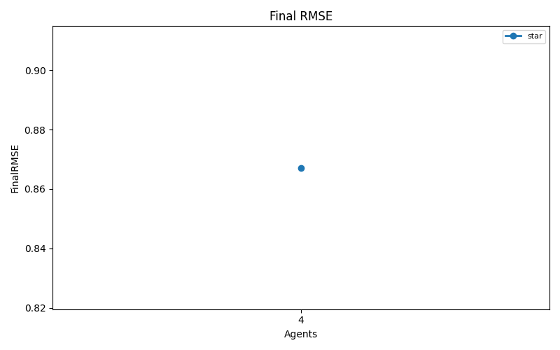
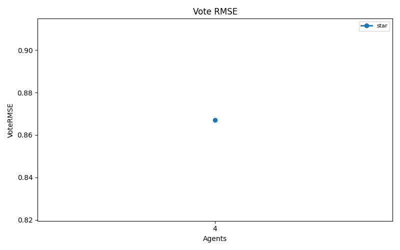
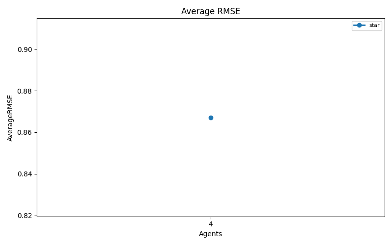
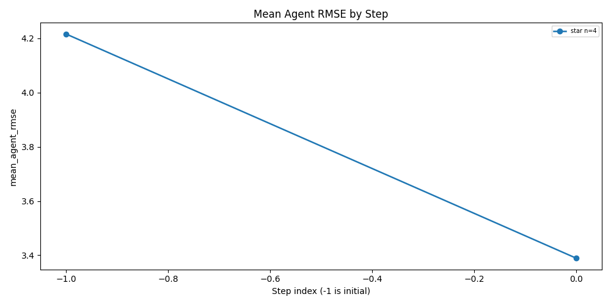
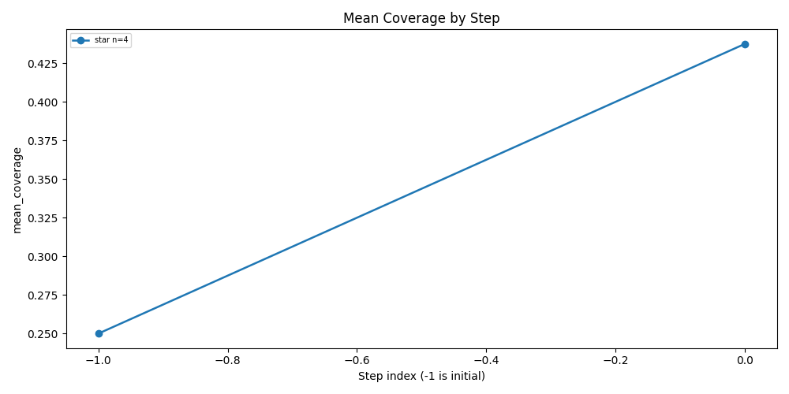

# CF Protocol Topology Experiment

## Configuration

- Array size: `5000`
- Value range: `[1, 1000]`
- Seeds: `[1]`
- Agent counts: `[4]`
- Topologies: `['star']`
- Merge modes: `['llm_full_merge']`
- Init modes: `['llm_local_solve']`
- Provider: `openai`
- Model: `gpt-4o`

## Aggregate Results

| Topology | Agents | MergeMode | InitMode | Runs | MeanFinalRMSE | StdFinalRMSE | MeanAverageRMSE | ExactMatchRate | MeanVoteRMSE | MeanFinalNormalizedL1Error | MeanTotalSteps | MeanTotalMessages | MeanTotalModelCalls | MeanTotalPromptTokens | MeanTotalCompletionTokens | MeanDeterministicFallbacks | MeanVoteTopRatio | MeanVoteAverageDisagreementRMSE |
| --- | --- | --- | --- | --- | --- | --- | --- | --- | --- | --- | --- | --- | --- | --- | --- | --- | --- | --- |
| star | 4 | llm_full_merge | llm_local_solve | 1 | 0.867179 | 0.000000 | 0.867179 | 0.000000 | 0.867179 | 0.092800 | 1.000000 | 3.000000 | 5.000000 | 34652.000000 | 32082.000000 | 0.000000 | 1.000000 | 0.000000 |

## Run Results

| Topology | Agents | MergeMode | InitMode | Seed | TotalSteps | TotalMessages | TotalModelCalls | TotalRetryAttempts | TotalDeterministicFallbacks | FinalRMSE | VoteRMSE | AverageRMSE | FinalNormalizedL1Error | FinalExactMatch | VoteTopRatio | Task | ArraySize | ValueMin | ValueMax | Provider | Model | Temperature | TotalPromptTokens | TotalCompletionTokens | AggregationMethod | SelectedPrimary | VoteNormalizedL1Error | AverageNormalizedL1Error | AverageIncludedAgents | VoteAverageDisagreementRMSE |
| --- | --- | --- | --- | --- | --- | --- | --- | --- | --- | --- | --- | --- | --- | --- | --- | --- | --- | --- | --- | --- | --- | --- | --- | --- | --- | --- | --- | --- | --- | --- |
| star | 4 | llm_full_merge | llm_local_solve | 1 | 1 | 3 | 5 | 0 | 0 | 0.867179 | 0.867179 | 0.867179 | 0.092800 | False | 1.000000 | count_frequency_protocol | 5000 | 1 | 1000 | openai | gpt-4o | 0.000000 | 34652 | 32082 | vote | vote | 0.092800 | 0.092800 | 1 | 0.000000 |

This experiment uses the existing AgentState, BeliefState, and OutboxMessage data path. The protocol runner changes only which agents send and receive on each communication step.

## Visualizations

